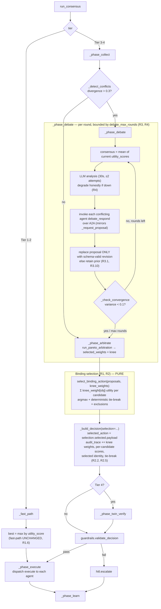
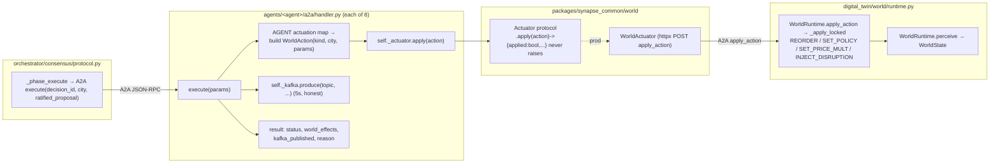

# Design Document: Agency Loop Completion

## Overview

This feature completes the autonomous perceive → decide → act → learn loop that ADR-052 landed for SYNAPSE, extending genuine agency to the whole system and making it non-regressable. It is grounded in the existing code paths and changes only what is necessary to close four gaps the audit found.

The work is organized into four pillars, all traceable to the approved requirements:

1. **Binding Pareto arbitration (R1, R2).** Today `ConsensusProtocol._build_decision` selects the ratified action with a raw `max(proposals, key=lambda p: p.utility_score)`. The full path already computes Pareto-knee `selected_weights` (a dict over the 8 `OBJECTIVES`) in `_phase_arbitrate` via `run_pareto_arbitration`, but those weights ride along only as `pareto_weights` metadata — they never drive selection. This pillar introduces a **pure selection function** that aggregates each candidate's per-objective utilities under the knee weights and returns the argmax-by-weighted-score, wired so the full path's ratified action *is* the knee selection. Determinism and auditability are first-class.

2. **Debate that revises proposals via concession (R3, R4).** Today `_phase_debate` loops `debate_max_rounds`, asks the LLM for analysis, appends it to the append-only context, and returns the proposals **unchanged**; every agent's `debate_respond` returns `{"status": "maintained"}`. This pillar makes debate actually revise proposals through **bounded rule-based concession** (no LLM required for the revision itself), validated against the agent's `proto/domain/` schema, degrading honestly when the LLM is unavailable.

3. **Universal real actuation, broaden-to-8 (R5, R6, R7).** Six agents (`routing_navigator`, `pricing_oracle`, `demand_prophet`, `disruption_shield`, `freshness_guardian`, `sustainability_agent`) still return the `{"kafka_published": True}` status-dict stub from `execute()`. This pillar converts each to actuate the standing world for real through the injected `Actuator`/`WorldActuator` (following the `inventory_sentinel` template), or to **honestly diverge** where no natural world lever exists.

4. **Non-regressable gate + independent verifiability (R8, R9).** `scripts/audit/agency_truth.py` enforces five structural loop invariants plus a stub ratchet (`DEFAULT_MAX_STUBS=6`). This pillar ratchets the ceiling to **0**, adds a new structured signal that distinguishes **binding arbitration** from raw `argmax`, confirms the independent **actuation-count** signal (0..8), and wires the verdict through `verify_claims` (C57) and `make verify-agency`, plus the two required e2e proofs.

Cross-cutting invariants (R10) are preserved throughout: I-3 (schema validation against `proto/domain/`), I-7 (honest degradation — never fabricate), I-14 (append-only audit/provenance), byte-stable determinism via `to_deterministic_json`, `ruff`, `mypy --strict`, and the repository coverage gate.

### Design Principles

- **Purity at the core.** The two pieces of decision logic that most need correctness guarantees — binding selection and the concession step — are extracted as **pure functions** so they are unit- and property-testable in isolation, independent of A2A transport, the LLM, or the world.
- **Honesty by construction.** Every degradation path returns a truthful status (`"diverged"`, `kafka_published=false`, empty `world_effects`) and never raises into the caller. The actuator already guarantees `apply()` never raises (it returns `{"applied": False, ...}`); handlers mirror that for Kafka.
- **Append-only audit.** New records (binding-selection trace, debate-round revisions, actuation effects) are *appended* to existing structures (`audit_trace`, the context message list, the execute result) — never mutated in place.
- **Mechanical non-regression.** Each capability is independently verifiable from source so neither can be faked by the other.

---

## Architecture

### Full-path decision flow (where binding selection + debate revision slot in)



### Actuation seam (component diagram)



### Key architectural decisions

| Decision | Choice | Rationale |
|---|---|---|
| Where the binding selector lives | Pure function `select_binding_action` in `orchestrator/consensus/pareto.py` | It needs `OBJECTIVES`, `_AGENT_TO_OBJECTIVE`, and the same neutral-baseline convention as `_build_utility_matrix`; co-locating keeps the arbitration math in one module and lets the gate detect the wiring across the `pareto`→`protocol` seam (R1.3). |
| Where the argmax stays | Only in `_fast_path` (Tier 1/2) | R1.6 keeps fast-path behavior; moving the argmax out of `_build_decision` lets the gate assert the full path no longer argmax-selects (R9.1). |
| Where the concession rule lives | **Shared helper** `packages/synapse_common/debate/concession.py` | All 8 agents must apply the *identical* bounded-concession math; a shared, pure helper avoids 8 copies drifting (a correctness + maintenance risk) and gives one property-tested function. Recommended over per-handler duplication. |
| `freshness_guardian` actuation | `SET_POLICY` `dispatch_speed` (closest existing lever per R6.3) | No direct spoilage-*reduction* lever exists (only an increase shock). Faster dispatch measurably lowers spoilage exposure and is a real live-world mutation. Lowest-risk honest option; tradeoff documented below. |
| `sustainability_agent` actuation | **Honest No-Op** (status `"diverged"`, empty effect) per R6.2 | No carbon lever exists in the sim. Fabricating one risks a misleading KPI; a new `CARBON` `WorldActionKind` requires sim CO₂ accounting that is out of scope. Honest no-op pending a future lever. |
| Concession needs the LLM? | No | Concession is rule-based arithmetic; it runs even while the LLM is degraded (R4.2). |

---

## Components and Interfaces

### 1. Binding selector (pure) — `orchestrator/consensus/pareto.py`

```python
@dataclass(frozen=True)
class BindingSelection:
    """Deterministic, auditable outcome of binding Pareto-knee selection."""
    selected_agent: str | None            # mapped agent of the winning proposal; None if no eligible candidate
    selected_index: int | None            # index into the *input* proposals list
    weighted_scores: dict[str, float]     # agent_name -> Σ knee_weight[obj]·utility (every EVALUATED candidate)
    excluded_agents: list[str]            # candidates with no Agent_Objective_Map entry (R1.5) — no fabricated score
    tie_break_applied: bool
    tie_break_reason: str                 # "" when no tie; else e.g. "objective_order:demand_accuracy" / "agent_name:demand_prophet"

def select_binding_action(
    proposals: list[AgentProposal],
    knee_weights: dict[str, float],
    *,
    neutral_baseline: float = 0.5,        # matches _build_utility_matrix cross-entries
    tolerance: float = 1e-9,
) -> BindingSelection: ...
```

Behavior (pure; no I/O, no globals mutated):

1. For each proposal, map `agent_name → objective` via `_AGENT_TO_OBJECTIVE`. If absent → add to `excluded_agents`, assign **no** score (R1.5, I-7).
2. For each eligible proposal build the per-objective utility vector: the agent's own objective gets `utility_score`; every other objective gets `neutral_baseline` (0.5), exactly as `_build_utility_matrix` does. The weighted score collapses to:
   `score = knee_weight[own_obj]·utility_score + neutral_baseline · Σ_{obj ≠ own_obj} knee_weight[obj]`.
3. `weighted_scores[agent_name] = score` for every evaluated candidate (recorded for audit, R2.2).
4. Select argmax by `score`. **Tie-break** (R1.4): candidates whose scores are equal within `tolerance` (1e-9) → prefer the one whose mapped objective appears **earliest in `OBJECTIVES`**; remaining ties → **ascending agent name**. `tie_break_applied`/`tie_break_reason` record the outcome (R2.5).
5. Iteration order is a stable sort over `(−score, OBJECTIVES.index(obj), agent_name)` so the result is identical across runs and processes (R2.1).

This function is the **only** thing that picks the full-path action; it does not read `utility_score` as an argmax key.

### 2. Protocol wiring — `orchestrator/consensus/protocol.py`

- `_fast_path` (UNCHANGED selection, R1.6): compute `best = max(proposals, key=lambda p: p.utility_score)` locally and pass it into `_build_decision`.
- `_full_path`: after `_phase_arbitrate` returns `selected_weights` (the knee vector), call:
  ```python
  selection = select_binding_action(proposals, weights)
  decision = self._build_decision(proposals=proposals, tier=tier, phase_reached=4,
                                   pareto_weights=weights, pareto_front=..., debate_rounds=...,
                                   selection=selection)
  ```
- `_build_decision(..., selection: BindingSelection | None = None, fast_best: AgentProposal | None = None)`:
  - If `selection` is provided (full path): `chosen = proposals[selection.selected_index]` (or `{}` if `selected_index is None`); `selected_action = chosen.payload`; `confidence = chosen.confidence`. Append to `audit_trace` (append-only, I-14, R2.2/R2.5):
    - `f"knee_weights={_json(selection_weights_rounded)}"`
    - `f"weighted_scores={_json(selection.weighted_scores)}"`
    - `f"binding_selected={selection.selected_agent}"`
    - `f"binding_excluded={_json(selection.excluded_agents)}"` (when non-empty)
    - `f"tie_break={selection.tie_break_reason}"` (when `tie_break_applied`)
  - If `selection is None` (fast path): keep `fast_best` argmax behavior; no binding-trace lines.
  - **The `max(...key=...utility_score)` expression is removed from `_build_decision`.** (Enables the R9.1 gate signal.)
- The binding-selection record is also appended to the append-only context as a `ContextMessage` (`type: "binding_selection"`), mirroring `_phase_arbitrate`'s pareto-result append (R2.4).

### 3. Concession helper (pure, shared) — `packages/synapse_common/debate/concession.py`

```python
def consensus_position(utility_scores: Sequence[float]) -> float:
    """Arithmetic mean of the current round's proposal utility_scores (R3.2)."""

def within_convergence_band(current: float, consensus: float, *, variance_threshold: float = 0.1) -> bool:
    """True when |current - consensus| <= sqrt(variance_threshold) — i.e. already converged enough
    that this agent should MAINTAIN rather than concede (R3.9)."""

def concede_toward(current: float, consensus: float, *, max_fraction: float = 0.5) -> float:
    """Move `current` toward `consensus` by at most `max_fraction` (50%) of the gap,
    never crossing past `consensus` (R3.3). Returns the revised utility_score.
    new = current + max_fraction * (consensus - current); monotone, bounded, idempotent-at-band."""
```

### 4. Agent `debate_respond` (all 8 handlers)

Each handler's `debate_respond` is upgraded from the `{"status": "maintained"}` constant to:

```python
def debate_respond(self, params: dict[str, Any]) -> dict[str, Any]:
    round_number = int(params.get("round_number", 1))
    scores = [float(s) for s in params.get("round_utilities", [])]   # current round's utility_scores
    current = float(params.get("current_utility_score", scores_self))
    consensus = consensus_position(scores) if scores else current
    if within_convergence_band(current, consensus):          # R3.9
        return {"status": "maintained", "round": round_number, "agent": NAME,
                "consensus_position": consensus}
    revised_score = concede_toward(current, consensus)        # R3.3, bounded
    revised_payload = self._build_revised_payload(params, revised_score)  # honest reflection (R3.7)
    try:
        validate_agent_payload(NAME, revised_payload)         # I-3, R3.6
    except SchemaValidationError:                             # R3.10
        return {"status": "maintained", "round": round_number, "agent": NAME,
                "consensus_position": consensus, "rationale": "revision_failed_schema"}
    return {"status": "revised", "round": round_number, "agent": NAME,
            "utility_score": revised_score, "payload": revised_payload,
            "consensus_position": consensus}
```

### 5. Debate coordinator — `_phase_debate` (`protocol.py`)

New responsibilities (bounded by `debate_max_rounds`, R3.5):

- Per round: compute `consensus = consensus_position([p.utility_score for p in proposals])`.
- LLM analysis stays best-effort with a **per-round 30s timeout** and **≤2 attempts** (R4.1, R4.4); on failure append a `debate_round` entry with `degraded=True` + `degraded_reason` and continue (R4.1, R4.3). Concession still runs (R4.2).
- Invoke each *conflicting* agent's `debate_respond` over A2A (mirroring `_request_proposal`), passing `round_number`, the round's `round_utilities`, and that agent's `current_utility_score`.
- Build the next round's proposals: for each agent, **replace** its proposal only with a returned `"revised"` response whose payload passed schema validation (revalidated orchestrator-side as defense-in-depth); otherwise **retain** the prior proposal (R3.1, R3.10).
- Append each round's revisions to the append-only context (I-14, R3.8).
- Re-evaluate `_check_convergence` each round; stop on convergence or at `debate_max_rounds` (R3.4, R3.5).
- Return the most-recent proposals (current round's revisions where present, else prior) for arbitration (R4.1).

### 6. Per-agent actuation mapping table (R5, R6)

Each handler is converted following the `inventory_sentinel` template: constructor injects `actuator: Actuator | None` (defaults to `WorldActuator()`) and `kafka_producer`; `execute()` reads `city` from params, validates the ratified payload (I-3), builds the agent's `WorldAction`(s), applies via `self._actuator.apply(...)`, and event-sources via `self._kafka.produce(...)`.

| Agent | Objective | WorldActionKind | Lever / params (from ratified payload) | Accepted range (WorldRuntime) | Honest status rule |
|---|---|---|---|---|---|
| `inventory_sentinel` *(template, done)* | inventory_fill_rate | `REORDER` | `quantity` per `reorder` action, `sku_id` | qty ≥ 0 (`add_stock`) | `executed` if ≥1 reorder applied; else `diverged` |
| `pricing_oracle` | pricing_revenue | `SET_PRICE_MULT` | `price_mult` from accepted update `multiplier` | `price_mult > 0`; lever clamps `demand_mult=clamp(1/price,0.1,3.0)` | `executed` if effect non-empty; else `diverged` |
| `demand_prophet` | demand_accuracy | `SET_POLICY` | `demand_mult` derived from ratified forecast vs baseline | `set_policy` clamps `demand_mult ≥ 0.01` | `executed` if policy effect non-empty; else `diverged` |
| `routing_navigator` | route_efficiency | `SET_POLICY` | `dispatch_speed` from ratified route decision | clamps `dispatch_speed ≥ 0.1` | `executed` if policy effect non-empty; else `diverged` |
| `disruption_shield` | disruption_readiness | `SET_POLICY` | `lead_time_mult` from ratified mitigation/alert | clamps `lead_time_mult ≥ 0.1` | `executed` if policy effect non-empty; else `diverged` |
| `freshness_guardian` | freshness_score | `SET_POLICY` (`dispatch_speed`) — closest lever, R6.3 | `dispatch_speed` raised to lower spoilage exposure | clamps `dispatch_speed ≥ 0.1` | `executed` if policy effect non-empty; else `diverged` |
| `sustainability_agent` | carbon_efficiency | **none** → Honest No-Op (R6.2) | — (no carbon lever) | — | always `diverged`, `world_effects=[]`, `reason="no_carbon_lever"`; never `executed` |

**Honest status rule (uniform, R5.6/R5.10/R6.4/R7.1):**
- `"executed"` ⟺ for ≥1 actionable item the actuator returned `applied=True` **and** a non-empty, non-error `effect`.
- `"diverged"` otherwise: actuator absent, `apply` raised/returned `applied=False`, effect empty/error, no actionable item in the proposal (R5.10), unknown/missing city (R5.9), or an Honest No-Op agent (R6.2/R6.5).
- `kafka_published` ⟺ a real `produce` succeeded within the 5s timeout (R5.7, R7.2); never a bare `True`.
- `world_effects` always present, listing the *actual* effect returned by the world (empty when none) so the outcome scorer reads a real signal (R7.4).

> **`freshness_guardian` tradeoff (R6.3):** `dispatch_speed` is a *proxy* — faster pick/pack lowers each unit's time-at-risk, reducing spoilage exposure — not a direct spoilage-rate setter. It is a genuine live-world mutation (the SimPy `_pick_pack_dispatch` reads `_dispatch_speed` each iteration), so the actuation is honest and observable in `perceive()` KPIs (`avg_delivery_min`, downstream `spoilage_rate`) over subsequent ticks. The alternative — a new `REDUCE_SPOILAGE`/`SET_SPOILAGE` `WorldActionKind` — is more direct but requires new sim plumbing and risks a fabricated-looking lever; deferred as higher-risk. If a stricter immediate-`perceive()`-delta interpretation is mandated, `freshness_guardian` falls back to the Honest No-Op path.

> **Converted-marker safety (agency_truth):** every converted handler's source contains `WorldAction`, `self._actuator`, and `self._kafka.produce`, and returns a dict whose `kafka_published` is a **variable** (not the literal `True`) — so it trips the converted markers and is **not** AST-detected as the stub return shape. `sustainability_agent`, though a no-op, still constructs no fabricated effect; it is marked converted by containing `self._kafka.produce` for its honest event-source and by *not* matching the stub shape (its `execute` does not return a `kafka_published: True` literal).

### 7. New `agency_truth` check — `scripts/audit/agency_truth.py`

```python
def _binding_arbitration_check() -> Check:
    """R9.1: distinguish binding arbitration from raw argmax (structured, deterministic).
    AST-parse orchestrator/consensus/protocol.py and assert:
      (a) select_binding_action is referenced (imported/called) in protocol.py;
      (b) the _full_path FunctionDef reaches binding selection (calls select_binding_action,
          or calls _build_decision with a `selection=` keyword);
      (c) the _build_decision FunctionDef contains NO `max(...)` call with a `key=` argument
          (raw argmax no longer drives full-path selection — it may remain only in _fast_path).
    ok = (a) and (b) and (c)."""
```

- Exposed as a `Check` in `evaluate()` so it contributes to `Probe.ok` and the `--json` output (`checks[]`).
- `DEFAULT_MAX_STUBS` ratcheted **6 → 0** (R8.2); the ceiling may only decrease (R8.5, enforced by review + the gate test).
- `--json` gains an explicit integer `converted_count` (0..8) = `len(converted)` (R9.2), computed by `_agent_actuation` independently of the binding check.
- `evaluate().ok` already feeds `verify_claims` C57 (R9.3); since the binding check and the `stubs ≤ max_stubs(0)` ratchet are both in `ok`, raw argmax **or** fewer than 8 converted → C57 FAIL (R9.4) and `make verify-agency --check` → exit 1 (R8.3, R9.5).

---

## Data Models

No persisted schema changes. All additions are append-only fields on existing in-memory/serialized structures.

### `ConsensusDecision.audit_trace` (existing `list[str]`, append-only — I-14)

Full-path decisions gain these entries (each a deterministic JSON string via the existing `_JSON_KWARGS`-style canonical dump), in addition to the current `tier=`, `phase=`, `audit_id=`, `confirmations=`:

| Entry | Source | Requirement |
|---|---|---|
| `knee_weights={...}` | knee weight vector over `OBJECTIVES` | R2.2 |
| `weighted_scores={agent: score, ...}` | every evaluated candidate's weighted score | R2.2 |
| `binding_selected=<agent_name>` | selected proposal identity | R2.2 |
| `binding_excluded=[...]` | candidates with no objective-map entry (when any) | R1.5 |
| `tie_break=<reason>` | tie occurrence + deterministic outcome (when a tie occurred) | R2.5 |

### Debate round context record (`ContextMessage.content`, append-only — I-14)

```jsonc
{
  "type": "debate_round",
  "round": 2,
  "consensus_position": 0.61,
  "llm_analysis": "…",            // "" when degraded
  "degraded": false,              // true if LLM unavailable this round (R4.3)
  "degraded_reason": null,        // e.g. "timeout_30s" / "connection_error" (R4.1)
  "revisions": [
    {"agent": "pricing_oracle", "prior_utility": 0.40, "revised_utility": 0.50,
     "status": "revised", "schema_valid": true},
    {"agent": "demand_prophet", "prior_utility": 0.95, "status": "maintained"}
  ]
}
```

### `debate_respond` response (A2A result)

```jsonc
// maintained
{"status": "maintained", "round": 2, "agent": "<name>", "consensus_position": 0.61,
 "rationale": "within_band" | "revision_failed_schema"}
// revised
{"status": "revised", "round": 2, "agent": "<name>", "consensus_position": 0.61,
 "utility_score": 0.50, "payload": { /* schema-valid revised payload (I-3) */ }}
```

### `execute()` result (per converted agent)

```jsonc
{
  "status": "executed" | "diverged",          // honest (R5.6, R6.4, R7.1)
  "decision_id": "…",
  "city": "bengaluru",
  "agent": "<name>",
  "world_effects": [ { /* actual effect from WorldRuntime; [] when none */ } ],  // R7.4
  "kafka_published": true | false,             // real produce only (R5.7, R7.2)
  "reason": "ok" | "no_actionable_item" | "unknown_city" | "actuator_unavailable"
            | "no_effect" | "no_carbon_lever"  // honest divergence reason (R6.5, R7.3)
}
```

### `WorldAction` (existing model, reused as-is)

No new fields for pillars 1–3. `sustainability_agent` and any future carbon lever would require a new `WorldActionKind` member (`CARBON_*`) plus a `_apply_locked` branch and `_POLICY_KEYS`/sim accounting — **explicitly deferred** (R6.2 Honest No-Op chosen).

---

## Correctness Properties

*A property is a characteristic or behavior that should hold true across all valid executions of a system — essentially, a formal statement about what the system should do. Properties serve as the bridge between human-readable specifications and machine-verifiable correctness guarantees.*

PBT applies strongly to this feature: the binding selector and the concession step are **pure functions** over large input spaces (proposal sets × weight vectors; current/consensus utility pairs), and the actuation handlers have clear honest-status contracts that vary with payload and dependency availability. The structural gate and the LLM-degradation paths are example/edge tested instead (they do not vary meaningfully with input), and `ruff`/`mypy`/coverage are tooling gates. The properties below are the de-duplicated set produced by the prework reflection.

### Property 1: Binding selection maximizes the knee-weighted score

*For any* set of agent proposals (each with an agent name and a `utility_score`) and *any* Pareto-knee weight vector over `OBJECTIVES`, the proposal selected by `select_binding_action` is the eligible proposal with the highest weighted score `Σ knee_weight[obj]·utility`, where each proposal's own objective contributes its `utility_score` and every other objective contributes the neutral baseline (0.5), matching `_build_utility_matrix`.

**Validates: Requirements 1.1, 1.3**

### Property 2: Binding tie-break is deterministic

*For any* set of proposals whose top weighted scores are equal within 1e-9, `select_binding_action` selects the proposal whose mapped objective appears earliest in the `OBJECTIVES` ordering, breaking any remaining tie by ascending agent name.

**Validates: Requirements 1.4, 2.5**

### Property 3: Unmapped proposals are excluded without a fabricated score

*For any* set of proposals, every proposal whose agent name has no entry in `_AGENT_TO_OBJECTIVE` appears in `excluded_agents`, never appears in `weighted_scores`, and is never selected.

**Validates: Requirements 1.5**

### Property 4: Binding selection is deterministic and byte-stable (round-trip determinism)

*For any* fixed set of proposals and fixed knee-weight vector, repeated evaluation of `select_binding_action` (including across separate process invocations) yields the identical selected proposal identity, and the selected payload serialized via `to_deterministic_json` is byte-identical across all evaluations.

**Validates: Requirements 2.1, 2.3, 10.6**

### Property 5: The binding decision's audit trace is complete

*For any* full-path decision produced through binding arbitration, the decision's `audit_trace` contains the knee-weight vector, a weighted score for every evaluated candidate proposal, and the identity of the selected proposal.

**Validates: Requirements 2.2**

### Property 6: Audit and provenance records are append-only

*For any* pre-existing append-only structure (the decision `audit_trace`, the context message list, or an agent's actuation/provenance record), recording a binding selection, a debate round's revisions, or a divergence/no-op outcome leaves every prior entry unchanged and only appends new entries.

**Validates: Requirements 2.4, 3.8, 6.6, 10.2**

### Property 7: Debate replaces a proposal only with a schema-valid revision

*For any* conflicting round and *any* `debate_respond` response, the coordinator uses the returned revision for the next round if and only if its status is `"revised"` and its payload passes `proto/domain/` schema validation; otherwise it retains the agent's prior proposal.

**Validates: Requirements 3.1, 3.10**

### Property 8: Concession is bounded, monotone toward consensus, and honest

*For any* current `utility_score` and consensus position, `concede_toward` returns a value that lies on the segment between the current value and the consensus position (never overshooting past consensus), moves no more than 50 percent of the gap, equals the value the handler reports as its revised `utility_score`, and — when the current value already lies within the convergence band of the consensus — yields a maintained position rather than a revision.

**Validates: Requirements 3.2, 3.3, 3.7, 3.9**

### Property 9: Debate terminates within the round bound

*For any* set of non-converging proposals and *any* configured `debate_max_rounds` ≥ 1, the number of debate rounds executed never exceeds `debate_max_rounds`.

**Validates: Requirements 3.5**

### Property 10: Every emitted or revised payload is schema-valid

*For any* payload an agent emits as a proposal or returns as a `"revised"` debate response, the payload passes `validate_agent_payload` against its `proto/domain/` schema before it is used downstream; payloads that fail validation are rejected and not propagated.

**Validates: Requirements 3.6, 10.1**

### Property 11: One WorldAction per actionable item

*For any* ratified proposal given to a converted agent's `execute()`, the agent applies exactly one `WorldAction` of its mapped `WorldActionKind` through the injected actuator per actionable item in the proposal (an actionable item being one that supplies a ratified value for the agent's mapped lever).

**Validates: Requirements 5.1**

### Property 12: Actuation levers stay within the world's accepted range

*For any* ratified value, the `WorldAction` a converted lever-agent (`pricing_oracle`, `demand_prophet`, `routing_navigator`, `disruption_shield`, `freshness_guardian`) builds carries a lever parameter within the World_Runtime's accepted range for that lever (e.g. `price_mult > 0` with the world clamping `demand_mult` to `[0.1, 3.0]`; `demand_mult ≥ 0.01`; `dispatch_speed ≥ 0.1`; `lead_time_mult ≥ 0.1`).

**Validates: Requirements 5.2, 5.3, 5.4, 5.5**

### Property 13: An applied effect yields an honest "executed" status

*For any* converted lever-agent and *any* ratified proposal with at least one actionable item, when the actuator reports `applied=True` with a non-empty, non-error effect, the agent returns status `"executed"` and reports the actual world effect.

**Validates: Requirements 5.6**

### Property 14: `kafka_published` reflects a real produce

*For any* converted agent and *any* producer state, the returned `kafka_published` is `True` if and only if a Kafka `produce` actually succeeded; it is never a bare constant `True` when no produce occurred.

**Validates: Requirements 5.7**

### Property 15: Actuation routes to the request's city

*For any* `city` supplied in the execute request, the `WorldAction`(s) the agent builds carry that same city.

**Validates: Requirements 5.8**

### Property 16: Honest No-Op leaves the world unchanged

*For any* execute request to a no-lever agent (`sustainability_agent`), the World_Runtime state observed via `perceive()` immediately after the call is identical to the state observed immediately before it, and the returned status is not `"executed"`.

**Validates: Requirements 6.1, 6.2**

### Property 17: Unavailable world and Kafka degrade honestly (degradation property)

*For any* converted agent's `execute()` invoked with an unavailable actuator (absent or raising) and an unavailable Kafka producer, the result has a status that is not `"executed"`, sets `kafka_published` to `False`, reports no world effect that did not occur (empty `world_effects`), and returns without propagating an exception.

**Validates: Requirements 5.9, 5.10, 6.4, 6.5, 7.1, 7.2, 7.4, 10.7**

### Property 18: The gate classifies actuating handlers as converted, not stubs

*For any* handler source whose `execute()` contains a real `apply`/`produce` call, the `agency_truth` classifier counts it as converted; *for any* handler whose `execute()` returns a `{"kafka_published": True}` literal with no `apply`/`produce`, it is counted as a Stub_Execute.

**Validates: Requirements 8.6**

---

## Error Handling

Every degradation path is honest by construction (I-7): it returns a truthful status and never raises into the caller. The table maps each failure mode to its behavior and requirement.

| # | Failure mode | Component | Behavior | Requirement |
|---|---|---|---|---|
| E1 | Proposal has no objective-map entry | `select_binding_action` | Excluded from selection; recorded in `excluded_agents`; no fabricated score | R1.5 |
| E2 | All candidate scores tie within 1e-9 | `select_binding_action` | Deterministic tie-break (objective order → agent name); recorded in `audit_trace` | R1.4, R2.5 |
| E3 | No eligible (mapped) proposal at all | `_build_decision` | `selected_action = {}`, `confidence = 0.0`; recorded honestly | R1.5 |
| E4 | LLM connection error / non-response / >30s timeout | `_phase_debate` | Treat as unavailable after ≤2 attempts; append degraded round (`degraded=true`, `degraded_reason`); proceed to arbitration with most-recent proposals | R4.1, R4.3, R4.4 |
| E5 | LLM down but conflict persists | `_phase_debate` | Rule-based concession still runs (no LLM needed) | R4.2 |
| E6 | `debate_respond` returns invalid revised payload | Agent handler / coordinator | Handler returns maintained (`rationale="revision_failed_schema"`); coordinator retains prior proposal | R3.6, R3.10 |
| E7 | Agent already within convergence band | Agent handler | Returns maintained, not a revision | R3.9 |
| E8 | Actuator absent | Agent `execute()` | No `apply`; status `"diverged"`, `world_effects=[]`, `reason="actuator_unavailable"`; logged with agent + reason | R7.1, R7.3 |
| E9 | `actuator.apply` returns `applied=False` / error (it never raises) | Agent `execute()` | Effect treated as not applied; status `"diverged"`; logged | R7.1, R7.3 |
| E10 | Applied but effect empty / perceive() relevant state unchanged | Agent `execute()` | Status `"diverged"` (not `"executed"`); `world_effects` reflects the empty effect | R6.4, R7.4 |
| E11 | Kafka producer absent / `produce` raises / >5s timeout | Agent `execute()` | `kafka_published=false`; no exception propagated; logged | R7.2, R7.3 |
| E12 | `city` missing or unknown | Agent `execute()` | Status not `"executed"`; no fabricated effect; `reason="unknown_city"` (or actuator returns `applied=False` for unknown city) | R5.9 |
| E13 | No actionable item in ratified proposal | Agent `execute()` | Status not `"executed"`; `world_effects=[]`; `reason="no_actionable_item"` | R5.10 |
| E14 | No natural world lever (carbon) | `sustainability_agent` | Honest No-Op: status `"diverged"`, `world_effects=[]`, `reason="no_carbon_lever"`; perceive() unchanged | R6.2, R6.5 |
| E15 | Stub count exceeds ratchet ceiling | `agency_truth --check` | Non-zero exit; each stub agent identified | R8.3 |
| E16 | A structural loop invariant or the binding check regresses | `agency_truth` / C57 / `make verify-agency` | `Probe.ok=false`; non-zero exit; C57 FAIL | R8.7, R9.1, R9.4, R9.5 |

All handler `execute()` bodies remain wrapped by the existing `handle_request` try/except, but the actuation/Kafka paths degrade internally (mirroring `inventory_sentinel`) so a degraded dependency produces an honest result rather than a JSON-RPC error.

---

## Testing Strategy

The feature uses the repository's existing **dual testing approach**: property-based tests for universal correctness over large input spaces, and example/unit/integration tests for specific scenarios, edge cases, and wiring. PBT applies because the binding selector and concession step are pure functions; the structural gate, LLM degradation, and CLI behaviors are example/edge tested.

### Property-based tests (Hypothesis, ≥100 iterations each)

Each property test is tagged `# Feature: agency-loop-completion, Property {n}: {property_text}` and uses the existing Hypothesis dependency (see `.hypothesis/`). Generators draw agent names from the 8 known agents, `utility_score`/weights as floats in bounded ranges, proposal payloads from per-agent schema-valid factories, and dependency stubs (actuator/producer present/absent/raising).

| Test | Property | Location |
|---|---|---|
| `test_binding_selection_maximizes_weighted_score` | P1 | `orchestrator/tests/consensus/test_binding_arbitration_pbt.py` |
| `test_binding_tie_break_deterministic` | P2 | same |
| `test_unmapped_proposals_excluded` | P3 | same |
| `test_binding_determinism_round_trip` | P4 | same |
| `test_binding_audit_trace_complete` | P5 | `orchestrator/tests/consensus/test_binding_arbitration_pbt.py` |
| `test_records_are_append_only` | P6 | `orchestrator/tests/consensus/test_append_only_pbt.py` |
| `test_debate_replaces_only_valid_revision` | P7 | `orchestrator/tests/consensus/test_debate_concession_pbt.py` |
| `test_concession_bounded_monotone_honest` | P8 | `packages/tests/debate/test_concession_pbt.py` |
| `test_debate_round_bound` | P9 | `orchestrator/tests/consensus/test_debate_concession_pbt.py` |
| `test_emitted_revised_payload_schema_valid` | P10 | `orchestrator/tests/consensus/test_debate_concession_pbt.py` |
| `test_one_world_action_per_actionable_item` | P11 | `agents/tests/test_actuation_pbt.py` (parametrized per agent) |
| `test_actuation_lever_within_range` | P12 | same |
| `test_applied_effect_yields_executed` | P13 | same |
| `test_kafka_published_reflects_real_produce` | P14 | same |
| `test_actuation_routes_to_city` | P15 | same |
| `test_honest_noop_leaves_world_unchanged` | P16 | `agents/tests/test_sustainability_noop_pbt.py` |
| `test_unavailable_world_and_kafka_degrade_honestly` | P17 | `agents/tests/test_actuation_pbt.py` (parametrized per converted agent — the degradation property of R10.7) |
| `test_gate_classifies_converted_vs_stub` | P18 | `packages/tests/test_agency_truth_gate.py` |

### Unit / example / edge tests

- Binding: fast-path argmax preserved (R1.6); divergence example where argmax ≠ knee (R1.2); `_AGENT_TO_OBJECTIVE` fidelity (R1.3); forced-tie audit record (R2.5).
- Debate: LLM raises/times out → degraded round recorded, arbitration proceeds (R4.1, R4.3); ≤2 attempts (R4.4); concession runs while LLM down (R4.2); convergence stops debate (R3.4).
- Actuation per agent: `pricing_oracle`→`SET_PRICE_MULT`, `demand_prophet`/`routing_navigator`/`disruption_shield`/`freshness_guardian`→`SET_POLICY` lever (R5.2–5.5, R6.3); `sustainability_agent` Honest No-Op (R6.2); missing/unknown city (R5.9); empty actions (R5.10); degradation logging captured (R7.3).
- Gate: `DEFAULT_MAX_STUBS == 0` (R8.2); `evaluate()` reports 0 stubs (R8.1) and `binding_arbitration` check present + ok (R9.1); `converted_count` int in `[0,8]` (R9.2); five structural invariants present (R8.7); `evaluate(max_stubs<stubs).ok is False` and stubs listed (R8.3); ratchet-bites regression test updated for the 0 ceiling.
- C57 / CLI: C57 reflects `probe.ok` (R9.3); simulated argmax or <8 converted → C57 FAIL (R9.4); `make verify-agency --check` exit 0 on clean repo (R9.5).

### End-to-end tests (following `orchestrator/tests/test_agentic_loop_e2e.py`)

- **`test_binding_arbitration_overrides_argmax_e2e`** (R9.6): construct proposals where the highest-`utility_score` proposal is *not* the knee selection under a crafted/observed knee-weight vector; run the full path; assert the ratified `selected_action` is the knee-selected proposal's payload and differs from the raw-argmax proposal. Proves binding selection drives the decision.
- **`test_real_actuation_changes_world_e2e`** (R9.7): with a live `WorldRuntime` and an in-process actuator (the existing `InProcessActuator` pattern), execute a converted lever-agent (e.g. `pricing_oracle` → `SET_PRICE_MULT`, observable as a `demand_rate`/`demand_mult` change in `perceive()`); assert the world state changed and the agent returned status `"executed"`.

### Tooling / coverage gates (R10)

- `ruff` and `mypy --strict` run in CI; the feature introduces zero new violations/errors against the pre-feature baseline (R10.3, R10.4). New code uses full type annotations and `FloatArray`-style typing already established in `pareto.py`.
- The repository coverage gate must be met or exceeded; the property + unit + e2e tests above are sized to cover binding arbitration, concession, and all eight agents' actuation (R10.5).
- `make verify-agency` and `verify_claims` C57 run in CI as the non-regression gate (R8, R9).

---

## Requirements Traceability

| Requirement | Design element(s) |
|---|---|
| **R1** Binding selection | `select_binding_action` (Components §1); `_full_path`/`_build_decision` wiring (§2); fast-path argmax retained (§2); Properties 1–3 |
| **R2** Deterministic & auditable | Stable-sort purity (§1); `audit_trace` additions + context append (§2, Data Models); Properties 4–6 |
| **R3** Debate concession | Concession helper (§3); upgraded `debate_respond` (§4); `_phase_debate` replace-iff-valid (§5); Properties 7, 8, 10; Data Models (debate round record) |
| **R4** Debate degrades honestly | `_phase_debate` LLM 30s/≤2-attempts/degraded-round (§5); Error Handling E4–E5; example tests |
| **R5** Universal real actuation | Per-agent actuation table (§6); honest status rule (§6); Properties 11–15; Error Handling E12–E13 |
| **R6** Honest divergence | `freshness_guardian` (dispatch_speed) + `sustainability_agent` (Honest No-Op) decisions (§6, Decisions table); Properties 16–17; Error Handling E10, E14 |
| **R7** Actuation degradation | Honest status rule + Kafka 5s honesty (§6); Property 17; Error Handling E8–E11 |
| **R8** Ratchet to zero | `DEFAULT_MAX_STUBS` 6→0 (§7); Property 18; Error Handling E15–E16; gate tests |
| **R9** Independent verifiability | `_binding_arbitration_check` (§7); independent `converted_count` (§7); C57 + `make verify-agency` wiring (§7); e2e tests R9.6/R9.7; Property 18 |
| **R10** Quality/determinism/coverage | Schema validation everywhere (§4, §6); append-only (Data Models); Properties 4, 6, 10, 17; Testing Strategy tooling/coverage gates |
