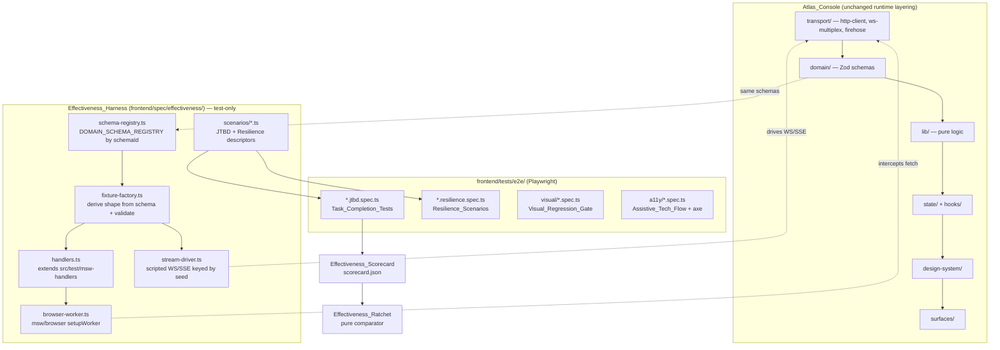
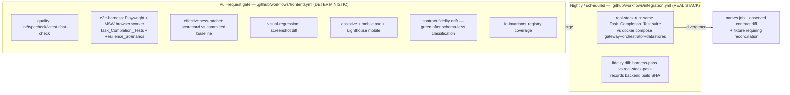

# Design Document — Atlas Console Effectiveness

## Overview

Atlas Console Elevation proved *display fidelity*: honesty-gated rendering, 53 registered `FE-INV-*` invariants, the OKLCH chromatic system, universal-state coverage, and mechanical contract-fidelity checking. **Atlas Console Effectiveness** proves the dimensions that spec left at zero: that the Console behaves correctly *against data*, makes the operator measurably faster and more accurate, holds under stress, and earns calibrated trust — all held to the same mechanical-gate standard SYNAPSE applies to backend code.

The keystone is the **Effectiveness_Harness**: Mock Service Worker (MSW) running as a *browser* service worker inside the Playwright-controlled browser, serving seeded, deterministic HTTP fixtures and scripted WebSocket/SSE streams. This converts E2E from today's reality — Playwright runs against `pnpm preview` with no backend, so every `/api` call is `ECONNREFUSED` (evidence E-S12-12) and the suite proves only that routes render and pass axe — into a suite that drives every Surface against contract-accurate data.

### Additive vs. modified

This is an **additive, invariant-governed** elevation within the existing layering `transport → domain → lib → state → hooks → design-system → surfaces`. Nothing re-architects the app.

| Nature | Areas |
| --- | --- |
| **Purely additive** (new files/tests, no behavior change) | `frontend/spec/effectiveness/` (harness home, parallel to `spec/contract-fidelity/`), new fixture factory + scenario drivers, `frontend/tests/e2e/` Task_Completion_Tests and Resilience_Scenarios, Effectiveness_Scorecard + ratchet, Visual_Regression_Gate, Assistive_Tech_Flow, `lib/expected-review-value.ts`, `lib/interruption-precision.ts`, `lib/trust-track-record.ts`, `surfaces/operations` uplift slot, new `FE-INV-054+` entries |
| **Modified** (behavior-preserving or behavior-superseding) | `surfaces/audit-vault/AuditVault.tsx` + `surfaces/decision-theater/DecisionTheater.tsx` (virtualization retrofit, remove row caps); `lib/oversight.ts` `defaultFocusAction` (superseded by Expected_Review_Value); `spec/contract-fidelity/*` (schema-less classification); `ConsensusChoreography.tsx` comment; removal/migration of `src/theme/*.js`; `.github/workflows/frontend.yml` + `integration.yml` (new gate wiring) |

### The honest ceiling (encoded, not hidden)

True effectiveness requires real users (RITE testing with 3–5 operators). This harness is a **Scripted_Proxy**: it proves an operator path *exists* and is *efficient* (steps, latency, dead-ends), and it computes a heuristic Interruption_Precision — but it does **not** prove human comprehension. Every effectiveness artifact (scorecard rows, Interruption_Precision, Assistive_Tech_Flow, Operations uplift slot) MUST render this ceiling statement wherever a result is presented (Req 3.6, 13.5, 15.6, 20.5). The design treats over-claiming as a defect equal to a false-healthy render.

### Inherited non-negotiables (hard requirements)

- **$0-cost / OSS-only.** No paid dependency, no GPL-3.0/AGPL-3.0, zero paid-SaaS calls. Every tool named below (MSW, Playwright, `@axe-core/playwright`, `@tanstack/react-virtual`, fast-check, Vitest, Playwright screenshot diffing, Lighthouse CI OSS) is already in `package.json` or is Apache-2.0/MIT (Req 14.6, 20.2).
- **Deterministic PR gate.** Every PR-gate check derives pass/fail from seeded, byte-identical harness measurements; all real-stack and nondeterministic checks are isolated to nightly/scheduled runs (Req 1.3, 4.4, 20.3).
- **Every invariant has a test.** New guarantees register in `frontend/spec/fe_invariants.yaml` starting at **FE-INV-054** (current highest is FE-INV-053) with an implementation and a test; `check_fe_invariants.py` fails the build on any gap (Req 20.1).
- **Fixtures bound to Zod schemas.** Every MSW_Fixture is derived from and validated against the same Domain_Schema the app validates against at runtime, via the existing `schemaId` registry (Req 2, 20.6).
- **Strict TypeScript.** `tsc --noEmit` clean under strict settings (Req 20.4).
- **English-only UI.** No new locale catalog, switcher, or detector (Req 20.7).
- **Web Vitals budget.** LCP ≤ 2.5s, INP ≤ 200ms, CLS ≤ 0.1 (FE-INV-010).

### Codebase-reality findings (what the requirements assumed vs. what is actually wired)

Investigation of the real frontend confirmed or corrected several assumptions. These shape the design:

1. **Virtualization is NOT wired.** `@tanstack/react-virtual@^3.10.8` is installed but has **zero references** in `src/**`. `AuditVault.tsx` fetches `limit: 200` and renders a plain `<table>` mapping every filtered row; `DecisionTheater.tsx` fetches `limit: 100`, plain table. The 200-cap in Req 9.3 is real and lives in the query, not a render slice. → **Retrofit required** (FE-WS-2).
2. **MSW is Node-only.** `src/test/msw-handlers.ts` + `msw-server.ts` use `msw/node` `setupServer` for Vitest and carry only four minimal handlers (`/health`, `/ready`, `/api/v1/agents`, `/api/v1/decisions/recent` → empty). There is **no** `msw/browser` `setupWorker`, no `public/mockServiceWorker.js`. → The harness must add the browser worker and a full, schema-bound handler set; it **reuses and extends** the existing `handlers` array rather than duplicating it (FE-WS-1).
3. **The `schemaId` registry already exists** — but in `spec/contract-fidelity/introspect.ts` as `DOMAIN_SCHEMA_REGISTRY` (keyed by the exact `schemaId` strings passed to `http-client.parseWithSchema` and used in the firehose per-channel `SCHEMAS` map), **not** in `domain/index.ts` (which is a pure barrel). The fixture factory binds to `DOMAIN_SCHEMA_REGISTRY`; this design promotes it to a shared module both the drift suite and the harness import.
4. **Ring buffers already exist.** `state/firehose.store.ts` implements per-channel bounded buffers (`newBounded(cap)` / `appendBounded`, caps 50–500, governed by FE-INV-017). The firehose work does not reinvent the buffer — it **asserts and stress-tests** the existing bound and lifts the shared model into `lib/` for reuse and property testing.
5. **Reconnect/replay foundations exist.** `transport/ws-multiplex.ts` exposes a pure `isFreshSeq(lastSeq, seq)` dedup and reconnects with `fullJitterDelay`; `transport/firehose.ts` sends `since_seq`. The Resilience_Scenario drives these; the reconciliation property tests the existing dedup plus a new "acted-never-reverted" reducer guarantee.
6. **Reversibility/Blast_Radius are absent from the contract today.** Neither `DecisionEnvelopeSchema` nor `AuditRowSchema` carries `reversibility` or `blast_radius`. This confirms Req 12.5's Cross_Boundary_Dependency: Expected_Review_Value **must** ship with honest degradation to confidence-only and record the missing fields as a backend gap in the drift report.
7. **`decision_outcomes` is only partially present.** `DecisionDetailResponse.outcome` (nullable) and `CalibrationResponse` bins carry realized-outcome signal, and `AuditRow` carries `operator_token_ref`; but there is **no per-operator longitudinal `decision_outcomes` endpoint**. Trust_Track_Record aggregates what exists and renders "awaiting scored outcomes" honestly when absent.
8. **`ConsensusChoreography.tsx` comment is stale** (line ~33: "the live cognition channel is the deferred follow-up (ADR-051)"), while `CouncilStrip.tsx`/`CortexBanner.tsx` already consume the live `cognition` channel. → Reconcile to C48 (Req 18).
9. **`src/theme/*.js` are dead.** `agents.js` is referenced only in a *comment* in `domain/agent-state.ts`; `useTheme.js` has no importer (the live theme is `state/theme.store.ts`). No live import path resolves either. → Audit confirms dead → remove (Req 19).
10. **Lighthouse is a stub.** `package.json` has an `lhci` *script* but neither `@lhci/cli` nor `lighthouse` is an installed dependency, and no LHCI job exists in `frontend.yml`. → The mobile-profile Lighthouse work (Req 15.5) must add the OSS dependency and the CI job.
11. **Playwright reality.** `playwright.config.ts` `testDir` is `tests/e2e` (not `frontend/e2e/`), `webServer` runs `pnpm preview --port 3001`, and a `mobile-cockpit` project (iPhone 14) already exists. The harness composes with this config rather than replacing it; scenarios live in the existing `tests/e2e/`.

---

## Architecture

### Layered architecture (reaffirmed) + the harness overlay



**Key composition rule:** the harness never patches app code paths. The browser worker intercepts `fetch` at the network boundary (exactly where `http-client` issues requests) and the stream driver feeds the same `WebSocket`/`EventSource` surfaces `ws-multiplex`/`firehose`/the demo SSE consume. The app runs *unmodified*; only the network edge is replaced by seeded fixtures.

### PR gate (deterministic MSW) vs. nightly Real_Stack_Run



- **PR gate** (existing `frontend.yml`): a new `e2e-harness` job replaces the current no-backend `e2e` job's purpose. Because MSW serves byte-identical fixtures for a fixed seed, every check is deterministic and non-flaky. The `effectiveness-ratchet`, `visual-regression`, and `assistive+mobile` checks are new PR jobs. `contract-fidelity` and `fe-invariants` jobs already exist and are extended.
- **Nightly Real_Stack_Run** (existing `integration.yml`, which already runs `on.schedule: cron "0 4 * * *"`): a new job boots the real docker stack and runs the identical Task_Completion_Test suite with the MSW worker disabled, records the backend build SHA, and reports any test that passes under the harness but fails against the real stack — naming the job and the observed contract difference (Req 5). This keeps real-stack latency and nondeterminism entirely out of the PR gate (Req 5.3, 20.3).

### Where the Scorecard and Ratchet sit

The Task_Completion_Tests write a single `scorecard.json` artifact (per-JTBD steps/latency/error-rate + seed + harness version + Interruption_Precision). The **Effectiveness_Ratchet** is a *pure comparator* (`lib/effectiveness-ratchet.ts`) invoked by a CI script: it loads the committed baseline and the fresh scorecard and returns a pass/fail + named regressions. Being pure and I/O-free, it is fully property-testable (see Correctness Properties) and its verdict is deterministic.
---

## Components and Interfaces

All new modules land inside the existing `transport → domain → lib → state → hooks → design-system → surfaces` layering. Two homes receive new code: the **test-only harness** under `frontend/spec/effectiveness/` (parallel to `spec/contract-fidelity/`, never shipped to the app bundle) and the **shipped pure-logic layer** under `frontend/src/lib/` (imported by surfaces and by the harness alike). Surfaces are modified in place only where a retrofit is unavoidable (virtualization, ERV-derived focus, the uplift slot). Every signature below is strict TypeScript.

### A. Harness — schema registry + fixture factory (Req 2)

`frontend/spec/effectiveness/schema-registry.ts` promotes the existing `DOMAIN_SCHEMA_REGISTRY` (today private to `spec/contract-fidelity/introspect.ts`) to a shared module imported by *both* the drift suite and the harness, so a single registry binds fixtures and runtime validation. `frontend/spec/effectiveness/fixture-factory.ts` derives every fixture's shape from a registry schema and validates the constructed fixture against that same schema at build/setup time.

```typescript
// schema-registry.ts — the single source of truth keyed by the exact schemaId
// strings passed to http-client.parseWithSchema and the firehose per-channel SCHEMAS map.
export type SchemaId = string;
export const DOMAIN_SCHEMA_REGISTRY: Readonly<Record<SchemaId, z.ZodTypeAny>>;
export function getSchema(id: SchemaId): z.ZodTypeAny | undefined;
export function hasSchema(id: SchemaId): boolean;

// fixture-factory.ts
export interface FixtureRequest {
  readonly capabilityId: string;   // e.g. "decisions.GET./api/v1/decisions/recent"
  readonly schemaId: SchemaId | null;  // null → schema-less capability (Req 2.4)
  readonly seed: number;
}

export type FixtureResult =
  | { readonly kind: "schema-bound"; readonly schemaId: SchemaId; readonly body: unknown }
  | { readonly kind: "schema-less"; readonly capabilityId: string; readonly body: unknown };

/** Builds a fixture, validating a schema-bound body against its schema. Throws
 *  FixtureSchemaError(fixtureId, schemaId) at build/setup on validation failure (Req 2.1). */
export function buildFixture(req: FixtureRequest): FixtureResult;

/** Emits an intentionally schema-violating body for a channel on demand (Req 2.5, Req 8.2). */
export function buildSchemaViolatingFixture(schemaId: SchemaId, seed: number): unknown;

/** Classifies a capability's fixture binding for the harness report (Req 2.4). */
export function classifyFixture(req: FixtureRequest): FixtureClassification;
```

### B. Harness — MSW browser worker + stream driver (Req 1)

`frontend/spec/effectiveness/browser-worker.ts` uses `msw/browser` `setupWorker` (generating `public/mockServiceWorker.js`) and **reuses and extends** the existing `src/test/msw-handlers.ts` `handlers` array rather than duplicating it. `frontend/spec/effectiveness/stream-driver.ts` feeds the same `WebSocket`/`EventSource` surfaces `ws-multiplex`/`firehose`/the demo SSE consume, keyed by seed.

```typescript
// browser-worker.ts
export interface HarnessOptions {
  readonly seed: number;
  readonly scenarioId: string;
}
/** Starts the worker; intercepts every Backend_Contract HTTP path. An intercepted
 *  path with no registered fixture rejects the request with UnhandledFixtureError
 *  naming the path — never an empty/default body (Req 1.6). */
export function startHarness(opts: HarnessOptions): Promise<HarnessHandle>;
export interface HarnessHandle {
  readonly seed: number;
  stop(): Promise<void>;
  /** Names of every intercepted path served so far, for the coverage report (Req 1.4). */
  servedPaths(): readonly string[];
}

// stream-driver.ts
export interface StreamMessage {
  readonly channel: string;
  readonly seq: number;
  readonly payload: unknown;
  readonly offsetMs: number;   // deterministic delivery offset from stream start
}
/** For a fixed seed, yields a byte-identical, identically-ordered message
 *  sequence on every invocation (Req 1.3, 2.2). */
export function scriptStream(channel: string, seed: number): readonly StreamMessage[];
export interface StreamDriver {
  drive(channel: string): void;                 // deliver the scripted sequence
  injectSchemaViolation(channel: string): void; // Req 2.5 / Req 8.2
  flap(channel: string, cycles: number): void;  // Req 8.4
}
```

### C. Harness — JTBD scenario descriptors + Task_Completion_Test harness (Req 3)

`frontend/spec/effectiveness/scenarios/*.ts` enumerate the operator jobs; `frontend/tests/e2e/*.jtbd.spec.ts` drive them through the harness and record the metrics that feed the scorecard.

```typescript
// scenarios/index.ts
export interface ScenarioDescriptor {
  readonly job: JobToBeDone;
  readonly seed: number;
  readonly setup: HarnessOptions;
  /** The terminal outcome a correct operator path must reach (Req 3.3). */
  readonly expectedTerminalOutcome: TerminalOutcome;
}
export const SCENARIOS: readonly ScenarioDescriptor[]; // min 5 jobs (Req 3.1)

// task-completion harness (drives one scenario, records a scorecard row)
export interface TaskCompletionResult {
  readonly job: JobToBeDone;
  readonly steps: number;              // affordance activations to terminal outcome
  readonly latencyMs: number;          // time-to-complete
  readonly errorRate: number;          // dead-ends / attempts (Req 3.2, 3.4)
  readonly reachedTerminal: boolean;   // Req 3.3
  readonly auditRowBeforeActed: boolean; // Req 3.5 (escalation job only)
  readonly proxyCeiling: string;       // Scripted_Proxy statement (Req 3.6)
}
export function runTaskCompletion(s: ScenarioDescriptor): Promise<TaskCompletionResult>;
```

### D. lib — Effectiveness_Scorecard emitter + ratchet comparator (Req 4, Req 13)

The Task_Completion_Tests write a single versioned `scorecard.json`; `frontend/src/lib/effectiveness-ratchet.ts` is a **pure, I/O-free comparator** (fully property-testable) invoked by a CI script.

```typescript
// effectiveness-ratchet.ts
export interface RatchetTolerance {
  readonly stepsPct: number;      // allowed regression fraction, e.g. 0.05
  readonly latencyPct: number;
  readonly errorRateAbs: number;  // absolute allowed increase
  readonly interruptionPrecisionAbs: number; // Req 13.3
}
export interface RatchetResult {
  readonly passed: boolean;
  readonly regressions: readonly {
    readonly job: JobToBeDone | "interruption-precision";
    readonly metric: "steps" | "latencyMs" | "errorRate" | "interruptionPrecision";
    readonly baseline: number;
    readonly observed: number;
  }[];
  /** Set when every metric improved or held — permits a monotonic baseline advance (Req 4.5). */
  readonly canAdvanceBaseline: boolean;
}
/** Pure: passed === regressions.length === 0; a metric regresses iff it exceeds
 *  tolerance relative to baseline (Req 4.3, 4.4). Interruption_Precision participates
 *  as a ratcheted metric and is named on regression (Req 13.3). */
export function compareScorecard(
  baseline: EffectivenessScorecard,
  fresh: EffectivenessScorecard,
  tol: RatchetTolerance,
): RatchetResult;
```

### E. lib — ring-buffer + firehose stress (Req 6)

`frontend/src/lib/ring-buffer.ts` lifts the existing per-channel bounded buffer (`state/firehose.store.ts` `newBounded`/`appendBounded`, FE-INV-017) into a shared, property-testable module without changing runtime caps.

```typescript
// ring-buffer.ts
export interface RingBuffer<T> {
  readonly cap: number;
  readonly items: readonly T[];   // length always ≤ cap (Req 6.2)
}
export function newBounded<T>(cap: number): RingBuffer<T>;
/** Appends, evicting oldest so length never exceeds cap regardless of call count. */
export function appendBounded<T>(buf: RingBuffer<T>, item: T): RingBuffer<T>;
/** At-most-once application keyed by sequence (Req 6.3, 6.5). */
export function applyOnce<T extends { seq: number }>(
  buf: RingBuffer<T>, appliedSeqs: ReadonlySet<number>, msg: T,
): { readonly buf: RingBuffer<T>; readonly applied: boolean };
```

### F. lib — reconcile reducer (Req 7)

`frontend/src/lib/reconcile.ts` is a pure reducer that, on reconnect, reconciles a `since_seq` replay burst, keeping already-acted rows acted and reconnecting with bounded Full-Jitter backoff (reusing `fullJitterDelay`/`isFreshSeq` from `transport/ws-multiplex.ts`).

```typescript
// reconcile.ts
export interface Row {
  readonly seq: number;
  readonly decisionId: string;
  readonly status: "pending" | "acted";
}
export interface ReconcileState {
  readonly rows: ReadonlyMap<number, Row>; // keyed by seq — dedup by construction
  readonly lastAppliedSeq: number;         // the since_seq to request on reconnect (Req 7.1)
}
/** Merges a replay burst into state: dedups by seq, and an already-acted row is
 *  never reverted to pending (Req 7.2). Result equals the deduplicated union of
 *  pre-drop and replayed rows (Req 7.4). */
export function reconcile(state: ReconcileState, replay: readonly Row[]): ReconcileState;
/** Bounded Full-Jitter delay for attempt n, delay ∈ [0, min(base·2^n, cap)] (Req 7.3). */
export function reconnectDelayMs(attempt: number): number;
```

### G. lib — fault-transition resolution (Req 8)

`frontend/src/lib/fault-transition.ts` routes every harness fault through the inherited `resolveUniversalState` resolver so each transition maps to the correct distinct state and never latches.

```typescript
// fault-transition.ts
export type FaultEvent =
  | { kind: "http"; status: number }
  | { kind: "schema-violation" }
  | { kind: "auth-401"; consecutive: number }
  | { kind: "ws-flap"; live: boolean }
  | { kind: "offline" } | { kind: "online" };

/** Total function: every FaultEvent applied to a prior state yields exactly one
 *  distinct UniversalState (Req 8.1, 8.6); a fault never resolves to `populated`
 *  (no false-healthy) and never latches on the prior state. */
export function resolveFault(prev: UniversalState, e: FaultEvent): UniversalState;
```

### H. surfaces — virtualization retrofit of AuditVault / DecisionTheater (Req 9)

`surfaces/audit-vault/AuditVault.tsx` and `surfaces/decision-theater/DecisionTheater.tsx` are retrofitted to `@tanstack/react-virtual` (+ `@tanstack/react-table` where useful — both already installed), removing the `limit: 200` / `limit: 100` query caps. The pure windowing math lives in `frontend/src/lib/virtual-window.ts`.

```typescript
// virtual-window.ts
export interface WindowInput {
  readonly totalRows: number;
  readonly rowHeightPx: number;
  readonly viewportPx: number;
  readonly scrollTopPx: number;
  readonly overscan: number;
}
export interface VirtualWindow {
  readonly startIndex: number;
  readonly endIndex: number;       // mounted node count = endIndex - startIndex + 1
  readonly mountedCount: number;   // bounded, independent of totalRows (Req 9.1)
}
/** For any totalRows, mountedCount ≤ ceil(viewportPx/rowHeightPx) + 2·overscan,
 *  and index i maps to datum i so a scrolled-in row aligns to its fixture (Req 9.4). */
export function computeWindow(i: WindowInput): VirtualWindow;
```

### I. surfaces/spec — spatial WebGL / chromatic checks (Req 10)

No new shipped module; a real-browser Playwright check seeds deterministic geo/graph fixtures and asserts WebGL init (smoke), chromatic-token encoding against *resolved* token values, an error-with-retry state on init failure, and a keyboard/SR-reachable non-spatial equivalent. Encoding reuses the inherited `chromatics.ts` helpers.

### J. lib — trust-track-record aggregation (Req 11)

`frontend/src/lib/trust-track-record.ts` aggregates from the signal that exists today (`DecisionDetailResponse.outcome`, `CalibrationResponse` bins, `AuditRow.operator_token_ref`) — there is no per-operator longitudinal endpoint, so it renders "awaiting scored outcomes" honestly when absent.

```typescript
// trust-track-record.ts
export type OutcomeState = "confirmed" | "diverged" | "unknown";
export interface TrustTrackRecord {
  readonly confirmed: number;
  readonly diverged: number;
  readonly unknown: number;        // never folded into confirmed (Req 11.3)
  readonly sampleSize: number;
  readonly windowLabel: string;
  readonly asOf: string;           // ISO timestamp (Req 11.4)
  readonly provisional: boolean;   // true iff sampleSize < MIN_SCORED (Req 11.4)
  readonly awaiting: boolean;      // true iff no scored outcomes (Req 11.5)
  readonly includeSynthetic: boolean; // labelled toggle, default false (Req 11.6)
}
export function aggregateTrack(
  outcomes: readonly ScoredOutcome[], includeSynthetic: boolean, nowIso: string,
): TrustTrackRecord;
```

### K. lib — expected-review-value f(confidence, reversibility, blast_radius) (Req 12)

`frontend/src/lib/expected-review-value.ts` supersedes the confidence-only `defaultFocusAction` in `lib/oversight.ts`. Reversibility/Blast_Radius are confirmed absent from `DecisionEnvelopeSchema`/`AuditRowSchema` today, so ERV ships with honest degradation and records the gap in the drift report.

```typescript
// expected-review-value.ts
export interface ErvInput {
  readonly confidence: number;                 // [0,1]
  readonly reversibility?: "reversible" | "irreversible" | null; // Cross_Boundary_Dependency
  readonly blastRadius?: "low" | "medium" | "high" | null;       // Cross_Boundary_Dependency
}
export interface ErvResult {
  readonly value: number;                      // higher → more review-worthy
  readonly escalate: boolean;                  // Req 12.2
  readonly degraded: boolean;                  // true when fields absent → confidence-only (Req 12.5)
  readonly reason: "irreversible" | "high-blast" | "low-confidence" | "none";
  readonly fieldsUnavailable: readonly ("reversibility" | "blastRadius")[]; // rendered + drift gap (Req 12.5)
}
/** Ranks review need by f(confidence, reversibility, blast_radius); an irreversible
 *  or high-blast decision escalates even when confidence ≥ 0.80 (Req 12.2). When the
 *  contract fields are absent, falls back to confidence-only and flags unavailable —
 *  never fabricating a value (Req 12.5). */
export function expectedReviewValue(i: ErvInput): ErvResult;
/** Default override focus derived from ERV, superseding confidence-only (Req 12.3). */
export function defaultFocusActionByErv(decisions: readonly ErvInput[]): number; // index
```

### L. lib — interruption-precision (Req 13)

`frontend/src/lib/interruption-precision.ts` computes the North-Star metric over the seeded scenarios and records it in the scorecard; the ratchet gates it (see D).

```typescript
// interruption-precision.ts
export interface Interruption {
  readonly warranted: boolean; // review changed outcome OR confirmed a genuinely
                               // uncertain/irreversible/high-blast decision
}
/** warranted ÷ total over the window, in [0,1]; total === 0 → null (Req 13.1). */
export function interruptionPrecision(interruptions: readonly Interruption[]): number | null;
```

### M. spec/contract-fidelity — schema-less classification (Req 16)

`frontend/spec/contract-fidelity/*` is extended so each schema-less capability is resolved to one of two classifications, closing the permanently-red gate.

```typescript
export type SchemaLessClass = "no-body-open-shape-covered" | "tracked-partial";
export interface SchemaLessResolution {
  readonly capabilityId: string;
  readonly classification: SchemaLessClass;
  readonly rationale: string;      // required for tracked-partial (Req 16.3)
}
/** A resolved capability never leaves an untracked failure (Req 16.2, 16.3); an
 *  unclassified, non-entitled-out-of-scope schema-less capability fails and is named (Req 16.5). */
export function resolveSchemaLess(
  caps: readonly ConsoleCapability[], resolutions: readonly SchemaLessResolution[],
): { readonly rows: readonly CoverageRow[]; readonly failed: boolean; readonly unclassified: readonly string[] };
```

### N. surfaces/operations — uplift slot (Req 17)

A defined slot in the Operations Surface renders a system-level uplift measure with sample size/window/as-of when the contract exposes it, and "awaiting uplift measure" + a recorded backend gap when it does not — never fabricating a value and never hiding the slot.

```typescript
export type UpliftSlotState =
  | { kind: "present"; value: number; sampleSize: number; windowLabel: string; asOf: string }
  | { kind: "awaiting" };   // + drift-report backend gap (Req 17.3, 17.4)
export function resolveUpliftSlot(measure: UpliftMeasure | null): UpliftSlotState;
```

### O. Debt retirement (Req 18, Req 19)

`ConsensusChoreography.tsx` (~line 33) has its stale "live cognition deferred (ADR-051)" comment reconciled to "live cognition wired (C48)" with no functional change. `src/theme/*.js` (`agents.js`, `useTheme.js`) are audited — confirmed dead (no live import path) — and removed, leaving no `.js` under `src/theme/`.

## Data Models

All models below are new to this feature except where marked *(existing, reaffirmed)*. Payload schemas remain `.passthrough()` so additive backend fields never break validation (inherited from Elevation).

### Fixture and harness models (Req 1, Req 2)

```typescript
export type SchemaId = string;

/** A single seeded, deterministic response or streamed message (Req 1.2, 2.1). */
export interface MswFixture {
  readonly capabilityId: string;
  readonly schemaId: SchemaId | null;   // null → schema-less (Req 2.4)
  readonly seed: number;
  readonly body: unknown;               // validated against schemaId when non-null
}

/** How a fixture's contract binding is reported (Req 2.4). */
export type FixtureClassification =
  | { readonly kind: "schema-bound"; readonly schemaId: SchemaId }
  | { readonly kind: "schema-less"; readonly reason: "no-body" | "open-shape" };

export interface Seed {
  readonly value: number;               // the only entropy source — full determinism (Req 1.3)
}

export interface StreamMessage {
  readonly channel: string;
  readonly seq: number;                 // monotonic per channel; dedup key
  readonly payload: unknown;
  readonly offsetMs: number;            // deterministic delivery offset
}
```

### Jobs-To-Be-Done and scorecard models (Req 3, Req 4, Req 13)

```typescript
export type JobToBeDone =
  | "resolve-escalation"
  | "identify-degraded-agent"
  | "reconstruct-decision-rationale"
  | "adjust-steering-safely"
  | "catch-disruption-early";           // min set (Req 3.1)

export type TerminalOutcome = { readonly job: JobToBeDone; readonly correct: string };

export interface ScenarioDescriptor {
  readonly job: JobToBeDone;
  readonly seed: number;
  readonly setup: HarnessOptions;
  readonly expectedTerminalOutcome: TerminalOutcome;
}

/** One measured row per job (Req 4.1). */
export interface ScorecardRow {
  readonly job: JobToBeDone;
  readonly steps: number;
  readonly latencyMs: number;
  readonly errorRate: number;           // dead-ends / attempts
}

/** The versioned, committed artifact (Req 4.2, 4.6). */
export interface EffectivenessScorecard {
  readonly schemaVersion: number;
  readonly harnessVersion: string;      // reproducibility (Req 4.6)
  readonly seed: number;                // reproducibility (Req 4.6)
  readonly rows: readonly ScorecardRow[];
  readonly interruptionPrecision: number | null; // North-Star (Req 13.2, 13.4)
  readonly proxyCeiling: string;        // Scripted_Proxy statement (Req 3.6, 13.5, 20.5)
}

export interface RatchetResult {
  readonly passed: boolean;
  readonly regressions: readonly {
    readonly job: JobToBeDone | "interruption-precision";
    readonly metric: "steps" | "latencyMs" | "errorRate" | "interruptionPrecision";
    readonly baseline: number;
    readonly observed: number;
  }[];
  readonly canAdvanceBaseline: boolean; // Req 4.5
}
```

### Resilience models (Req 6, Req 7, Req 8, Req 9)

```typescript
export interface RingBuffer<T> {
  readonly cap: number;
  readonly items: readonly T[];         // invariant: items.length ≤ cap (Req 6.2)
}

export interface Row {
  readonly seq: number;
  readonly decisionId: string;
  readonly status: "pending" | "acted";
}

/** Rows keyed by seq → acted vs pending; dedup by construction (Req 7.1, 7.4). */
export interface ReconcileState {
  readonly rows: ReadonlyMap<number, Row>;
  readonly lastAppliedSeq: number;      // the since_seq requested on reconnect (Req 7.1)
}

export type FaultTransition =
  | { kind: "http"; status: number }
  | { kind: "schema-violation" }
  | { kind: "auth-401"; consecutive: number }
  | { kind: "ws-flap"; live: boolean }
  | { kind: "offline" } | { kind: "online" };

/** The six render conditions (existing, reaffirmed from Elevation). */
export type UniversalState =
  | "loading" | "empty" | "error" | "degraded" | "offline" | "populated";

export interface VirtualWindow {
  readonly startIndex: number;
  readonly endIndex: number;
  readonly mountedCount: number;        // bounded, independent of totalRows (Req 9.1)
}
```

### Trust, attention, and interruption models (Req 11, Req 12, Req 13)

```typescript
export type OutcomeState = "confirmed" | "diverged" | "unknown";

export interface ScoredOutcome {
  readonly decisionId: string;
  readonly operatorTokenRef: string;    // never a raw username (inherited FE-INV-019)
  readonly approvedAtLowConfidence: boolean;
  readonly outcome: OutcomeState;
  readonly isSynthetic: boolean;
}

export interface TrustTrackRecord {
  readonly confirmed: number;
  readonly diverged: number;
  readonly unknown: number;             // distinct; never folded into confirmed (Req 11.3)
  readonly sampleSize: number;
  readonly windowLabel: string;
  readonly asOf: string;
  readonly provisional: boolean;        // sampleSize < MIN_SCORED (Req 11.4)
  readonly awaiting: boolean;           // no scored outcomes (Req 11.5)
  readonly includeSynthetic: boolean;   // labelled toggle, default false (Req 11.6)
}

/** Reversibility/Blast_Radius are optional — absent from the contract today, so both
 *  are a Cross_Boundary_Dependency that must degrade honestly (Req 12.4, 12.5). */
export interface ExpectedReviewValueInput {
  readonly confidence: number;
  readonly reversibility?: "reversible" | "irreversible" | null;
  readonly blastRadius?: "low" | "medium" | "high" | null;
}
export interface ExpectedReviewValueOutput {
  readonly value: number;
  readonly escalate: boolean;
  readonly degraded: boolean;           // confidence-only fallback engaged
  readonly reason: "irreversible" | "high-blast" | "low-confidence" | "none";
  readonly fieldsUnavailable: readonly ("reversibility" | "blastRadius")[];
}

export interface InterruptionPrecision {
  readonly warranted: number;
  readonly total: number;
  readonly value: number | null;        // warranted / total, [0,1]; null when total === 0 (Req 13.1)
}
```

### Quality-system and cross-boundary models (Req 14, Req 16, Req 17)

```typescript
export interface VisualRegressionBaseline {
  readonly surface: string;             // Surface or Storybook story id
  readonly themeMode: "light" | "dark" | "hc"; // ≥1 per mode (Req 14.5)
  readonly viewport: { readonly width: number; readonly height: number };
  readonly seed: number;
  readonly imageHash: string;           // committed baseline; masked volatile regions (Req 14.3)
}

/** Schema-less extension of the inherited Coverage_Status (Req 16). The base
 *  CoverageStatus (covered | partial | uncovered | out-of-scope) is reaffirmed
 *  from the Elevation spec; schema-less capabilities resolve to one of two
 *  classifications so the drift gate reaches green (Req 16.1–16.4). */
export type SchemaLessClass = "no-body-open-shape-covered" | "tracked-partial";
export interface CoverageStatusExtension {
  readonly capabilityId: string;
  readonly schemaLess: true;
  readonly classification: SchemaLessClass;
  readonly rationale: string | null;    // required when tracked-partial (Req 16.3)
}

export type UpliftSlotState =
  | { kind: "present"; value: number; sampleSize: number; windowLabel: string; asOf: string }
  | { kind: "awaiting" };               // + backend gap in drift report (Req 17.3, 17.4)
```

### Existing models reaffirmed

`DecisionEnvelopeSchema`, `AuditRowSchema`, `DecisionDetailResponse`, `CalibrationResponse`, and the firehose per-channel `SCHEMAS` map are all inherited and unchanged. The codebase-reality findings confirm `reversibility`/`blast_radius` are **not** present on the decision envelope today (driving Req 12.5's honest degradation) and that there is no per-operator longitudinal `decision_outcomes` endpoint (driving Req 11.5's "awaiting scored outcomes").

## Correctness Properties

*A property is a characteristic or behavior that should hold true across all valid executions of a system — essentially, a formal statement about what the system should do. Properties serve as the bridge between human-readable specifications and machine-verifiable correctness guarantees.*

The properties below were derived from the acceptance-criteria prework and consolidated to remove redundancy: the fixture-schema criteria (2.1/2.2/2.3/20.6) collapse into one soundness property; the ratchet criteria (4.3/4.4/4.5) plus the Interruption_Precision gate (13.3) collapse into one comparator property; the reconcile criteria (7.1/7.4) fold into the dedup-union property; the fault criteria (8.1/8.2) fold into the totality property; and the virtualization criteria (9.3/9.4) fold into the windowing property. The remaining acceptance criteria are covered by example-based, integration, or smoke tests (see Testing Strategy). This yields exactly 19 distinct properties, matching the property tags in `tasks.md`. Each is universally quantified and implemented by a single `fast-check` + Vitest property test running ≥ 100 iterations.

### Property 1: Every fixture validates against its bound Domain_Schema

*For any* generated `MswFixture` bound to a `schemaId`, the fixture body validates against that same `Domain_Schema`; and *for any* schema change (or fixture mutation) that invalidates an existing fixture, the build/setup fails naming the offending fixture and schema.

**Validates: Requirements 2.1, 2.2, 2.3**

### Property 2: Schema-less capabilities are classified, never treated as schema-bound

*For any* capability with no `Domain_Schema`, the fixture factory classifies it `schema-less` and surfaces that classification in the harness report, and never treats it as schema-bound.

**Validates: Requirements 2.4**

### Property 3: The harness is deterministic for a fixed seed

*For any* seed, two invocations of the harness produce byte-identical fixture responses and an identical stream message order.

**Validates: Requirements 1.3**

### Property 4: An unhandled fixture request fails and names the path

*For any* Backend_Contract request path with no registered fixture, the harness fails the test and names the unhandled path, never returning an empty or default response.

**Validates: Requirements 1.6**

### Property 5: The ratchet fails exactly on regression and permits monotonic advance

*For any* committed baseline scorecard, fresh scorecard, and tolerance, `compareScorecard` reports `passed` if and only if no job's steps, latency, or error-rate — and no Interruption_Precision value — regresses beyond tolerance; every regression names its job and metric; and `canAdvanceBaseline` is set exactly when every metric improved or held.

**Validates: Requirements 4.3, 4.4, 4.5**

### Property 6: The ring buffer never exceeds its cap

*For any* sequence of appends of any length, the `RingBuffer` retains at most `cap` items.

**Validates: Requirements 6.2**

### Property 7: Streamed messages apply at most once

*For any* stream of messages containing duplicate sequences, each sequence number is applied at most once, so the final state is consistent with the deduplicated applied set with no lost and no double-counted items.

**Validates: Requirements 6.3**

### Property 8: Reconnect+replay yields the deduplicated union with acted rows preserved

*For any* pre-drop `ReconcileState` and *any* replay burst, the reconciled row set equals the deduplicated union of pre-drop and replayed rows keyed by sequence — with no duplicate, lost, or reverted rows — and any row already in the `acted` state remains `acted` and is never reverted to `pending`.

**Validates: Requirements 7.2, 7.4**

### Property 9: Reconnect delay is bounded Full-Jitter

*For any* reconnect attempt number, the computed delay lies within `[0, min(base · 2^attempt, cap)]`.

**Validates: Requirements 7.3**

### Property 10: The virtualization window is bounded and index-aligned

*For any* total row count, row height, viewport size, and scroll offset, the mounted-row count is bounded by `ceil(viewport / rowHeight) + 2·overscan` independent of the total, and window index `i` maps to the datum at index `i` so a scrolled-in row aligns to its seeded fixture.

**Validates: Requirements 9.1, 9.4**

### Property 11: Fault-transition resolution is total, distinct, and never false-healthy

*For any* sequence of fault/connectivity transitions applied from any prior state, each step resolves to exactly one Universal_State, the resolver never latches on a prior state, and a fault never resolves to a populated (false-healthy) state.

**Validates: Requirements 8.1, 8.6**

### Property 12: Trust outcomes partition into a tri-state

*For any* set of scored outcomes, `aggregateTrack` partitions them into exactly `confirmed`, `diverged`, and `unknown` counts whose sum equals the scored total, with `unknown` counted distinctly and never folded into `confirmed`.

**Validates: Requirements 11.2, 11.3**

### Property 13: Provisional and awaiting states are honest

*For any* scored-outcome count `n`, the track record is flagged `provisional` if and only if `n` is below the defined minimum, renders `awaiting` when `n` is zero, and always discloses sample size, window, and an "as of" timestamp.

**Validates: Requirements 11.4, 11.5**

### Property 14: Synthetic decisions are excluded by default

*For any* set of decisions, the default trust aggregate excludes every synthetic record, and activating the labelled include toggle adds exactly those synthetic records and no others.

**Validates: Requirements 11.6**

### Property 15: Stakes escalate review above the confidence gate

*For any* decision that is irreversible or high-blast-radius, `expectedReviewValue` escalates it for human review even when its confidence is at or above the 0.80 autonomy gate.

**Validates: Requirements 12.1, 12.2**

### Property 16: Absent stakes fields degrade honestly

*For any* decision whose Reversibility or Blast_Radius fields are absent, `expectedReviewValue` falls back to confidence-only ranking, flags the missing fields as unavailable, and never fabricates a value.

**Validates: Requirements 12.5**

### Property 17: Default focus is derived from Expected_Review_Value

*For any* set of decisions, the default override focus is derived from Expected_Review_Value, superseding the confidence-only focus model.

**Validates: Requirements 12.3**

### Property 18: Interruption_Precision is the warranted fraction, bounded in [0,1]

*For any* set of interruptions, Interruption_Precision equals warranted ÷ total over the window and always lies within `[0, 1]` (or is null when the total is zero).

**Validates: Requirements 13.1**

### Property 19: Schema-less classification leaves no untracked failure

*For any* schema-less capability resolved to either classification ("no-body/open-shape ⇒ covered" or "tracked-partial"), the drift suite records it without an untracked failure; and *for any* new schema-less capability that is neither classified nor entitled-out-of-scope, the suite fails and names it.

**Validates: Requirements 16.2, 16.3, 16.5**

## Error Handling

Error handling in this feature is dominated by **fail-closed** and **honest-degradation** paths: a fault must never render as healthy, an unhandled fixture must never return a silent default, and an absent cross-boundary field must never be fabricated.

### Harness setup and fixture errors

| Condition | Handling | Requirement |
| --- | --- | --- |
| Fixture body fails its bound `Domain_Schema` at build/setup | Throw `FixtureSchemaError` naming the fixture and schema; the harness does not start | 2.1, 2.3 |
| Backend_Contract request with no registered fixture | Reject with `UnhandledFixtureError` naming the path; **never** an empty/default body | 1.6 |
| Any request would reach a live/third-party endpoint while the harness is active | Blocked at the worker boundary; the test fails (zero-live-network guarantee) | 1.5, 20.2 |

### Ratchet and scorecard errors

The `effectiveness-ratchet` exits **non-zero** and names the regressed job and metric whenever any job's steps/latency/error-rate — or Interruption_Precision (Req 13.3) — regresses beyond the explicit tolerance relative to the committed baseline (Req 4.3). Because the comparator is pure and derives its verdict solely from seeded, deterministic measurements, the gate is never flaky (Req 4.4, 20.3). A missing or malformed baseline is a hard error naming the file, not a silent pass.

### Cross-boundary honest degradation (no fabrication)

| Absent capability | Degraded behavior | Requirement |
| --- | --- | --- |
| Reversibility / Blast_Radius fields on the decision envelope | ERV falls back to confidence-only ranking, renders an explicit "reversibility/blast-radius unavailable" indication, and records the missing fields as a backend gap in the drift report | 12.5 |
| Per-operator longitudinal `decision_outcomes` | Trust_Track_Record renders "awaiting scored outcomes" rather than a zeroed or fabricated record | 11.5 |
| System-level uplift measure | Operations uplift slot renders "awaiting uplift measure" and records the backend gap; the slot is never hidden and no value is fabricated | 17.3, 17.4 |

### Fault and connectivity transitions

Every harness fault is routed through `resolveFault`/`resolveUniversalState` so it renders the correct **distinct** Universal_State and never a false-healthy screen (Req 8.1, 8.6):

- **503 data request** → `error` (or `degraded` where the payload signals degradation), never `populated` (Req 8.1).
- **Schema-violating payload** → `error` via the schema-violation path; the unvalidated payload is never rendered (Req 8.2, inherited `SchemaViolationError` boundary).
- **401 storm** → a single-flight token refresh; on refresh failure or a second 401, the session is cleared and the app routes to `/login` **without** a full page reload (Req 8.3).
- **WebGL init failure** on a Spatial_Visualization → the `error` Universal_State with a retry affordance, never a blank canvas (Req 10.3).
- **WebSocket flap** → the not-live / reconnecting state through a non-color channel, recovering to live when the flap ends (Req 8.4).
- **offline ↔ online** → the `offline` state while offline (never presenting stale data as live), restoring `populated` on return (Req 8.5).

### Render-boundary and stream errors

An unhandled render error is caught at the inherited error boundary that renders a recovery affordance rather than a blank screen. The reconnect path deduplicates replayed messages by sequence so no message is applied twice and no acted item reverts to pending (Req 7.2). Overrides continue to commit the audit row **before** local apply; if the audit commit fails, the decision stays un-acted and an explicit error surfaces (Req 3.5, inherited FE-INV-003/021).

## Testing Strategy

### Dual approach

- **Property-based tests** verify the 19 universal properties above, each with ≥ 100 generated iterations. They cover the pure logic layer: fixture-schema soundness and schema-less classification (`fixture-factory.ts`), harness determinism and unhandled-path failure (`stream-driver.ts`/`browser-worker.ts`), the ratchet comparator (`effectiveness-ratchet.ts`), the ring buffer and at-most-once application (`ring-buffer.ts`), reconcile dedup-union and bounded backoff (`reconcile.ts`), fault-transition totality (`fault-transition.ts`), the virtualization window (`virtual-window.ts`), trust aggregation (`trust-track-record.ts`), Expected_Review_Value (`expected-review-value.ts`), Interruption_Precision (`interruption-precision.ts`), and schema-less drift closure (`spec/contract-fidelity/*`).
- **Example-based / E2E tests** cover the concrete, scenario-driven flows that do not vary meaningfully with input: the Task_Completion_Tests per Job_To_Be_Done (Req 3.2–3.6), the audit-row-first ordering assertion (3.5), the specific fault flows (401 storm 8.3, WS flap 8.4, offline/online 8.5, schema-violation render 8.2), the full-set-reachable scroll assertion (9.3), the spatial loading/non-spatial-equivalent (10.4) and forced WebGL-failure (10.3) checks, the Trust_Track_Record surface render (11.1), the ERV non-color reason indication (12.6), the uplift-slot present/absent renders (17.2, 17.3), and the honesty-ceiling copy on every effectiveness artifact (3.6, 13.5, 15.6, 20.5).
- **Integration tests** cover infrastructure and real-browser behavior that is on/off or externally-timed rather than input-varying: the MSW-in-browser network isolation and per-surface populated-state coverage (1.1, 1.4, 1.5), firehose INP and jank stability (6.1, 6.4), scale scroll INP (9.2), spatial WebGL chromatic-token encoding against resolved values (10.2), the visual-regression screenshot-diff gate (14.1–14.3), the Assistive_Tech_Flow screen-reader walkthrough and live-region announcement (15.1, 15.2), and the Mobile_Reality_Profile + mobile Lighthouse gate (15.3–15.5).
- **Smoke tests** cover one-time setup and governance facts: scenario enumeration (3.1), scorecard versioning/committed baseline (4.2), Real_Stack_Run topology and backend-SHA recording (5.3, 5.5), visual-baseline update and per-theme coverage (14.4, 14.5), the reserved uplift slot (17.1), the reconciled `ConsensusChoreography` comment (18.1–18.3), the no-`.js`-under-`src/theme` audit (19.1–19.4), invariant-coverage (20.1), license/egress (20.2, 14.6), PR-gate determinism (20.3), `tsc --noEmit` strict (20.4), and English-only conformance (20.7).

### Deterministic PR gate vs. nightly Real_Stack_Run

The PR gate (`.github/workflows/frontend.yml`) runs **only** deterministic checks: every property test, the MSW-in-browser Task_Completion_Tests and Resilience_Scenarios (byte-identical per seed), the `effectiveness-ratchet`, the visual-regression gate, the assistive + mobile-Lighthouse checks, and the now-green contract-drift gate. The **nightly** Real_Stack_Run (`.github/workflows/integration.yml`, already on cron) runs the identical Task_Completion_Test suite against the real docker stack with the MSW worker disabled, records the backend build SHA, and reports any harness-pass/real-stack-fail divergence — keeping all real-stack latency and nondeterminism out of the PR gate (Req 5, Req 20.3).

### Property-based testing framework and configuration

- **Library**: `fast-check` with Vitest — the project's existing frontend test stack; property testing is never hand-rolled.
- **Iterations**: each property test runs a minimum of 100 iterations (`fc.assert(..., { numRuns: 100 })`).
- **Tag format**: each property test carries the comment tag `Feature: atlas-console-effectiveness, Property {number}: {property_text}` mapping it to the design property above and to the matching `tasks.md` sub-task.
- **Placement**: logic properties live under `frontend/src/lib/__tests__/*.property.test.ts`; harness properties under `frontend/spec/effectiveness/__tests__/`; the schema-less drift property under `frontend/spec/contract-fidelity/__tests__/`.
- **Generators**: add arbitraries for seeds, `MswFixture`/`StreamMessage` streams (with duplicate and out-of-order sequences), scorecard baseline/fresh pairs, `RingBuffer` append sequences, `ReconcileState` + replay bursts, `FaultTransition` sequences, `WindowInput`, scored-outcome sets, and `ExpectedReviewValueInput` (including absent reversibility/blast-radius).

### Honest ceiling (Scripted_Proxy caveat)

Every effectiveness artifact — each scorecard row, the Interruption_Precision display, the Assistive_Tech_Flow report, and the Operations uplift slot — MUST render the Scripted_Proxy statement: the harness proves an operator path *exists* and is *efficient*, but does **not** prove human comprehension, which requires real-user (RITE) testing with 3–5 operators (Req 3.6, 13.5, 15.6, 20.5). A test asserts this statement's presence on each artifact; its absence is treated as a defect equal to a false-healthy render.

### Invariant registration (Req 20.1)

Each new guarantee registers an `FE-INV-*` entry in `frontend/spec/fe_invariants.yaml`, binding an implementation file and a test, with `check_fe_invariants.py` failing CI on any gap:

| Invariant | Guarantee | Requirement |
| --- | --- | --- |
| FE-INV-054 | MSW-in-browser harness / zero-live-network | 1 |
| FE-INV-055 | Schema-bound fixtures | 2 |
| FE-INV-056 | JTBD task completion | 3 |
| FE-INV-057 | Effectiveness scorecard + ratchet | 4 |
| FE-INV-058 | Nightly Real_Stack_Run fidelity | 5 |
| FE-INV-059 | Firehose ring-buffer bound + at-most-once | 6 |
| FE-INV-060 | Reconnect/replay acted-never-reverted | 7 |
| FE-INV-061 | Fault-transition correctness | 8 |
| FE-INV-062 | Scale virtualization | 9 |
| FE-INV-063 | Spatial WebGL / chromatic correctness | 10 |
| FE-INV-064 | Trust_Track_Record honesty | 11 |
| FE-INV-065 | Expected_Review_Value + honest degradation | 12 |
| FE-INV-066 | Interruption_Precision gate | 13 |
| FE-INV-067 | Visual_Regression_Gate | 14 |
| FE-INV-068 | Assistive-tech + mobile / Lighthouse | 15 |
| FE-INV-069 | Contract-drift schema-less closure | 16 |
| FE-INV-070 | Operations uplift slot | 17 |
| FE-INV-071 | No legacy `.js` under `src/theme/` | 19 |

Mutation testing (Stryker) extends its critical-module set to include `effectiveness-ratchet.ts`, `ring-buffer.ts`, `reconcile.ts`, `fault-transition.ts`, `virtual-window.ts`, `expected-review-value.ts`, `interruption-precision.ts`, and `trust-track-record.ts`, keeping mutation survival below the defined threshold.
