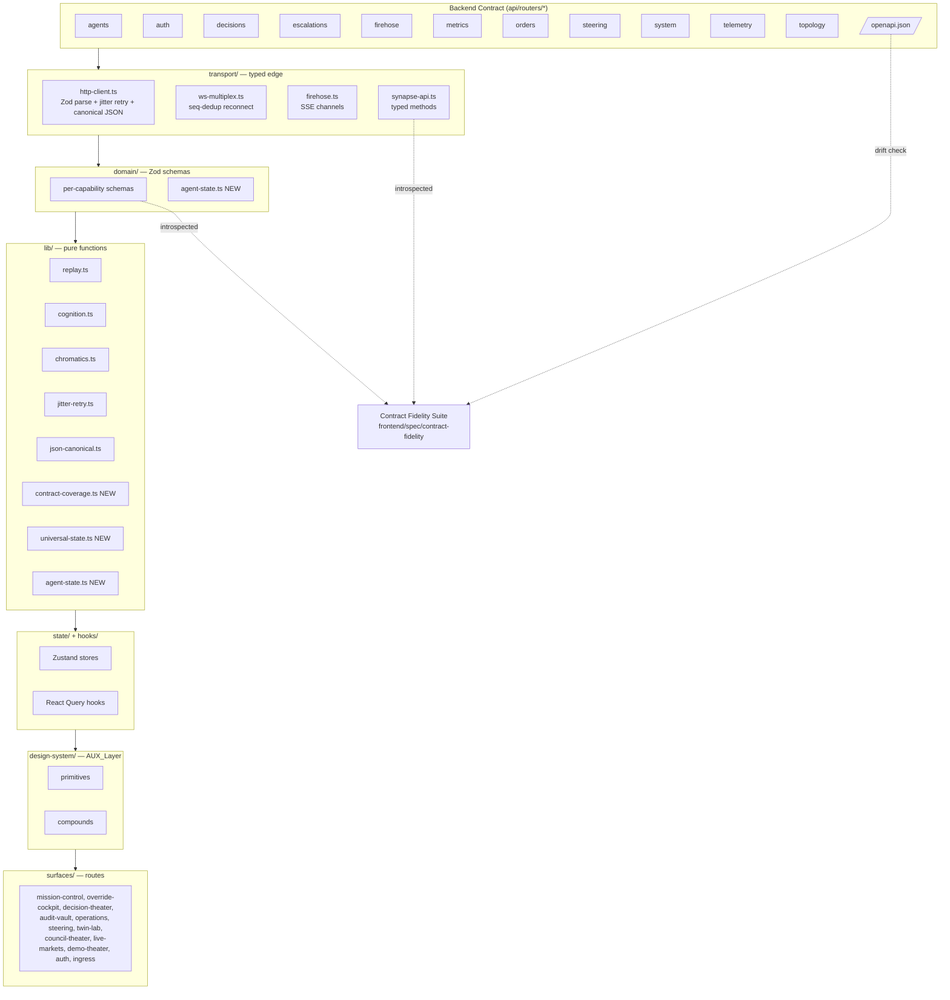
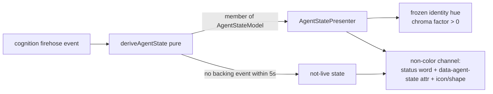

# Design Document — Atlas Console Elevation

## Overview

Atlas Console Elevation raises the SYNAPSE web console (`frontend/`, package `synapse-console`) to the highest achievable standard as a human–AI collaboration interface. It is an **additive, invariant-governed** elevation of an already-mature React 18 + Vite + TypeScript surface set. Nothing here re-architects the app; every capability is expressed within the existing layering (`transport → domain → lib → state → hooks → design-system → surfaces`) and every new guarantee is registered as a `FE-INV-*` (or `INV-CLR-*`) invariant with a test, per Requirement 15.

The feature pursues two goals from the requirements document:

1. **Close frontend/backend drift mechanically.** A new **Contract Fidelity Suite** compares the Console's typed client and Zod domain schemas against the live backend contract (`api/routers/*` + the published OpenAPI document) and emits a machine-checked drift report with a per-capability `Coverage_Status`. Gaps fail CI rather than surviving on inspection (Req 1).
2. **Elevate the Console into an agentically-aware experience.** A canonical **Agent-State Model**, a first-class **Oversight Controls** layer, a **Trust Calibration Layer**, and disciplined chromatic/motion/spatial systems make agency visible, trustworthy, and controllable across every agent state and every universal render condition (Req 2–14).

### Design Principles (inherited, non-negotiable)

- **English-only UI.** Single `en` i18next catalog, `supportedLngs = ["en"]`, no language switcher, no detector (FE-INV-013, Req 8.1, Req 15.6).
- **Chromatic-token-only color.** Every color is a `var(--syn-*)` custom property generated from OKLCH DTCG sources; no raw hex/`rgb()`/`hsl()` in `frontend/src/**` outside generated files (INV-CLR-009, Req 5.1).
- **Frozen orthogonal encoding.** Agent identity → Hue, Decision Tier → Lightness, confidence → diverging OKLab scale; the three axes never cross, and the 8 agent→hue assignments are frozen behind a version bump + ADR supersede (INV-CLR-004/006/007/012, Req 5.4/5.5).
- **$0-cost / open-source-only.** No paid dependency, no GPL-3.0/AGPL-3.0 license, zero paid-SaaS calls (FE-INV-001, Req 15.1).
- **Strict type safety.** `tsc --noEmit` clean under strict settings (Req 15.2).
- **Every invariant has a test.** New invariants register in `frontend/spec/fe_invariants.yaml` (or `design-system/color/color-system.spec.yml`) with an implementation and a test; `check_fe_invariants.py` fails the build on any gap (Req 15.3).

### Scope of Change

| Area | Nature of change |
| --- | --- |
| `frontend/spec/` | New Contract Fidelity Suite (`contract-fidelity/`), new invariant entries |
| `frontend/src/domain/` | New `agent-state.ts` canonical state model; additive schema hardening |
| `frontend/src/lib/` | New `contract-coverage.ts`, `agent-state.ts` derivation, `universal-state.ts`; extend `chromatics.ts`, `cognition.ts`, `replay.ts` |
| `frontend/src/design-system/compounds/` | New `AgentStatePresenter`, `OversightControls`, `ProvenanceChip` (extend), `NonColorChannel` helpers |
| `frontend/src/surfaces/` | Additive: universal-state coverage, oversight affordances, trust-calibration disclosures |
| `design-system/color/` | Additive tokens for any new process-state if needed (frozen hues untouched) |

## Architecture

### Layered Architecture (existing, reaffirmed)



### Contract Fidelity Suite (Req 1, Req 2.3, Req 3.8)

The suite is a Node/TS harness in `frontend/spec/contract-fidelity/` run in CI (extends `.github/workflows/frontend.yml`). It has three inputs and one output:

**Inputs**
1. **Entitlement manifest** (`entitlements.ts`) — the authoritative, hand-curated list of every backend capability the Console *is entitled to consume*: `{ router, method, path | channel | stream, capabilityId, kind: "http" | "ws" | "sse", entitled: boolean }`. Capabilities marked `entitled: false` are `out-of-scope` and never counted as gaps (Req 1.5/1.6).
2. **Console surface** — the typed client method registry introspected from `synapse-api.ts` and the domain Zod schema registry from `domain/index.ts` (each schema is registered with a `schemaId`, already used by `http-client`).
3. **Backend contract** — the published OpenAPI document (`/openapi.json`) when available; otherwise a checked-in snapshot. Channel/stream contracts come from a declared `channels.ts` catalog mirrored against `firehose.py` / `ws-multiplex` channel constants.

**Coverage classification** is a pure function (`classifyCoverage`) so it is unit- and property-testable independent of I/O:

```
covered   = a typed client method exists AND a domain Zod schema validates the capability's response
partial   = a typed client method exists BUT the response schema is incomplete
            OR the channel/stream is only partially modeled
uncovered = no typed client method AND no domain schema exists
```

**Output** — a `drift-report.json` + human-readable summary enumerating every HTTP endpoint, WebSocket channel, and SSE stream with its `Coverage_Status`, plus:
- Fields present in the contract but absent from the Console schema (missing-field drift), and fields the Console requires that the contract lacks (over-strict drift) (Req 1.3).
- Agent-State-Model states with no backing backend event (backend gaps, Req 2.3).
- Interrupt/recovery affordances with no backing backend endpoint (backend gaps, Req 3.8).

**Failure semantics** — the suite exits non-zero and names the specific endpoint/channel iff any *entitled* capability is `uncovered` or `partial`. Out-of-scope capabilities never trigger failure (Req 1.6).

### Runtime Validation Boundary (Req 1.2, Req 1.4)

All backend payloads already flow through `http-client.parseWithSchema`, which throws a typed `SchemaViolationError` on mismatch. The elevation formalizes two rules already latent in the code:

- **Forward compatibility**: response schemas use Zod `.passthrough()` (never `.strict()`) so unknown additive fields pass through without error (Req 1.4). Only *request/auth* schemas that must be exact stay `.strict()`.
- **Fail-closed rendering**: a `SchemaViolationError` routes to the `error` Universal_State and the unvalidated payload is never rendered; the violation is also emitted as a field-whitelisted telemetry event (Req 1.2, Req 14.2).

### AUX Layer and Agent-State Rendering (Req 2)



The AUX layer never fabricates state: `deriveAgentState` returns a member of the closed `AgentStateModel` union or an explicit `unavailable`/`not-live` marker. Identity hue is preserved across every transition (chroma may change, hue never), reusing the frozen `AGENT_STATE_FACTOR` chroma-rationing table where a factor is defined and holding every factor strictly `> 0` (INV-CLR-017, Req 2.5/2.7).

## Components and Interfaces

### 1. Canonical Agent-State Model — `frontend/src/domain/agent-state.ts` (Req 2)

A closed, enumerated union covering every observable lifecycle state, superseding the narrower `AgentProcessState` (which stays as the chroma-rationing sub-grammar).

```typescript
export const AGENT_STATES = [
  "idle", "thinking", "searching", "planning", "acting", "streaming",
  "waiting", "asking", "uncertain", "confident", "delegating",
  "escalating", "interrupting", "recovering", "failing", "succeeding",
  "handing-off", "completing",
] as const;
export type AgentState = (typeof AGENT_STATES)[number];

export const AgentStateSchema = z.enum(AGENT_STATES); // closed; rejects unknown

/** Non-color descriptor every rendered state must carry (Req 2.4). */
export interface AgentStateDescriptor {
  readonly state: AgentState;
  readonly label: string;           // i18n key resolved (en catalog)
  readonly glyph: GlyphId;          // icon/shape token, not color
  readonly chromaFactor: number;    // > 0 always (Req 2.7)
  readonly dataAttr: `agent-state:${AgentState}`;
}

/** Availability wrapper — a state with no backing backend event renders unavailable (Req 2.3). */
export type RenderableAgentState =
  | { kind: "live"; descriptor: AgentStateDescriptor; hue: string /* frozen var */ }
  | { kind: "unavailable"; reason: "no-backend-event" }
  | { kind: "not-live"; sinceMs: number };  // stream stale > 5s (Req 2.6)
```

**`deriveAgentState(events, agent, nowMs, staleMs = 5000): RenderableAgentState`** — pure (extends `deriveLiveCognition`). Maps recorded events to a state member; returns `not-live` when no backing event within `staleMs`; never invents activity.

**Chroma-factor mapping.** Each `AgentState` maps to a chroma-rationing factor. States already in `AGENT_STATE_FACTOR` reuse it verbatim; new states are assigned factors that stay strictly monotone with cognitive activity and strictly `> 0` (interrupted/interrupting floor = 0.25), authored in the color token source, not invented in TS (INV-CLR-017).

### 2. Oversight Controls — `frontend/src/design-system/compounds/OversightControls.tsx` (Req 3)

Renders the operator authority surface: interrupt, override (approve/reject/modify), steer, delegate, recover, escalate-to-next/previous, dismiss. Reuses the existing audit-row-first override mutation (FE-INV-003/021) and `useCockpitShortcuts` (FE-INV-022).

```typescript
export interface OversightCapability {
  readonly id: "interrupt" | "override" | "steer" | "delegate" | "recover"
    | "escalate-next" | "escalate-prev" | "dismiss";
  readonly backingEndpoint: string | null;   // null → backend gap (Req 3.8)
  readonly requiredRoles: readonly OperatorRole[];
  readonly keyboardKey: string;               // every action keyboard-reachable (Req 3.3)
}

export interface OversightControlsProps {
  readonly role: OperatorRole;                // viewer sees disabled, not hidden (Req 3.9)
  readonly decisionConfidence: number;        // < 0.80 demotes Approve focus (Req 3.2)
  readonly violations: readonly GuardrailViolation[];
}
```

- **Audit-row-first commits** for override and steering: the audit endpoint must succeed before local apply; on failure the decision stays un-acted / the steering value reverts and an error surfaces (Req 3.1, Req 3.6).
- **Focus demotion**: `defaultFocusAction(confidence)` returns `"reject"` (or `"modify"`) when `confidence < 0.80`, else `"approve"` — a pure function so it is property-testable (Req 3.2, FE-INV-007).
- **Role gating**: `viewer` sees controls in a disabled, visibly non-actionable state (never hidden) (Req 3.9); interrupt/recover exposed to `ops`/`engineer`/`admin` where a backing endpoint exists (Req 3.8).
- **Steering clamp**: `clampSteering(x)` — finite out-of-range clamps to `[0,1]`; non-finite (NaN/±∞) collapses to `0` (Req 3.7, FE-INV-033).

### 3. Guardrail Violation Rendering — `EscalationCard` (Req 3.4, Req 3.5)

Extends FE-INV-038. `renderViolations(violations)` emits **every** violation with code, message, and severity; a missing severity defaults to `medium`; an empty list renders an explicit "no violations recorded" region (never omitted). Pure mapping helper `normalizeViolations` is property-testable.

### 4. Trust Calibration Layer — `frontend/src/surfaces/operations/logic.ts` + compounds (Req 4)

Reuses the tested pure helpers `outcomeMix`, `confidenceSamples` (FE-INV-041/044) and extends them:

- **Decision presentation**: every decision renders Tier + confidence formatted to exactly two decimals (`formatConfidence(x) → "0.00".."1.00"`) + a single-activation audit-row link (one click OR one keypress) (Req 4.1, FE-INV-004).
- **Confidence color anchoring**: `confidenceColor` stops sit exactly at `{0.00, 0.70, 0.80, 1.00}` (INV-CLR-007) and the numeric value always renders as text (Req 4.2).
- **Tri-state outcome**: `outcomeMix` yields exactly `confirmed | diverged | unknown`; `unknown` never folds into `confirmed`, and confirmed is clamped to the scored total (Req 4.3).
- **Statistical-power disclosure**: every calibration display shows sample size, window, and "as of" timestamp; `< 30` scored outcomes flags provisional; no scored evidence renders "awaiting scored outcomes"; a null metric renders an explicit no-value marker ("—"), never `0` (Req 4.4/4.5/4.6, FE-INV-043).
- **Provenance**: `ProvenanceChip` renders model version/feature source/confidence basis when present; absent/incomplete provenance renders "provenance unavailable" (Req 4.7, FE-INV-034).
- **Degraded honesty**: `degraded=true` renders an explicit text label, never suppressed (Req 4.8, FE-INV-034).
- **Synthetic segmentation**: synthetic decisions excluded from trust aggregates by default with a labelled include toggle (Req 4.9, FE-INV-044).
- **Chain integrity tri-state**: `verified | altered | pre-chain/legacy`; a legacy (null) chain never renders as verified (Req 4.10, FE-INV-039).

### 5. Chromatic System (Req 5)

Governed entirely by `design-system/color/color-system.spec.yml` + `dist/` tokens. The elevation adds no new encoding axis and freezes existing hues. New surfaces consume `chromatics.ts` helpers (`confidenceColor`, `processStateColor`, `rationedAgentColor`, `degradedStateColor`, `syntheticStateColor`). Conformance is enforced by the existing INV-CLR suite (resolution in all three themes, WCAG AA, APCA per tier, 28-pair CVD distinctness, degraded chroma floor, non-color redundancy, preference fallbacks).

### 6. Motion System (Req 6)

All timing/easing via `--syn-motion-*` / `--syn-ease-*` tokens; no inline durations in component source (FE-INV-040). Reduced-motion zeroes duration tokens and every animated state keeps a static representation (status word + `data-*` attr). Urgency encoded as frequency (urgent cadence = half ambient). A declared exclusion set (text being read, focus targets during keyboard nav) must not animate.

### 7. Spatial Visualization (Req 7)

deck.gl / MapLibre / sigma / graphology / visx load as async chunks only, never in the entry bundle (FE-INV-025). Map renders self-hosted PMTiles only (FE-INV-020/024). Every spatial surface uses the same chromatic tokens, provides a keyboard/SR-reachable non-spatial equivalent (table/list/summary), renders loading + error-with-retry states, and rejects a hung Twin Lab run with a typed timeout within the ≤120s SLA (FE-INV-026).

### 8. Universal State Coverage — `frontend/src/lib/universal-state.ts` (Req 10)

A pure state resolver every data-bearing surface consumes:

```typescript
export type UniversalState =
  | "loading" | "empty" | "error" | "degraded" | "offline" | "populated";

export interface UniversalStateInput {
  readonly isLoading: boolean;
  readonly isError: boolean;
  readonly isOffline: boolean;
  readonly isDegraded: boolean;      // posture brownout / open breaker
  readonly itemCount: number;
}
export function resolveUniversalState(i: UniversalStateInput): UniversalState;
```

Priority order (offline > error > degraded > loading > empty > populated) is a total function over all inputs — every input maps to exactly one state (verified by formal completeness + a property test). The `DegradedBanner` (FE-INV-035) mounts above every route and renders "posture unknown" if the posture fetch fails. The SLO burn board (FE-INV-042) renders fast+slow windows with a severity word or "burn unknown". Reconnect dedup by sequence (FE-INV-008/037) guarantees at-most-once application.

### 9. Security / Identity / Privacy (Req 12) and Self-Observability (Req 14)

Operator identity renders only as a Vault token reference while authenticated (FE-INV-019); audit export carries decision-safe fields only (FE-INV-027). Single-flight 401 refresh (FE-INV-023), canonical JSON outbound (FE-INV-012), strict CSP + no `dangerouslySetInnerHTML` (FE-INV-015). Web Vitals + schema-violation + render-error boundary telemetry are field-whitelisted (FE-INV-030); build SHA visible in the Shell and via `/version` (Req 8.6, Req 14.4).

## Data Models

### Contract Fidelity Models

```typescript
type CapabilityKind = "http" | "ws" | "sse";
type CoverageStatus = "covered" | "partial" | "uncovered" | "out-of-scope";

interface CapabilityEntitlement {
  readonly capabilityId: string;      // e.g. "decisions.GET./api/v1/decisions/{id}"
  readonly router: string;            // "decisions"
  readonly kind: CapabilityKind;
  readonly ref: string;               // path | channel | stream name
  readonly entitled: boolean;         // false → out-of-scope
}

interface ConsoleCapability {
  readonly capabilityId: string;
  readonly hasClientMethod: boolean;
  readonly hasDomainSchema: boolean;
  readonly schemaComplete: boolean;   // no required contract field missing
}

interface CoverageRow {
  readonly capabilityId: string;
  readonly status: CoverageStatus;
  readonly missingFields: readonly string[];   // in contract, absent from schema
  readonly overStrictFields: readonly string[];// required by schema, absent from contract
}

interface DriftReport {
  readonly generatedAt: string;
  readonly rows: readonly CoverageRow[];
  readonly backendGaps: readonly { kind: "agent-state" | "oversight"; name: string }[];
  readonly failed: boolean;           // any entitled row uncovered/partial
}
```

### Agent-State & Cognition Models

`AgentState` union + `AgentStateSchema` (closed enum) as above. `CognitionEvent` (existing `domain/cognition-event.ts`) remains the sole backing source; the cognition schema rejects unknown phases (no fabricated state).

### Trust & Decision Models (existing, reaffirmed)

`DecisionDetailResponse` (additive/`.passthrough()`), `ConsensusDecision`, `CalibrationResponse`, `SloResponse`, `EscalationAnalytics`, `SystemPosture` — all already Zod-validated. Outcome tri-state and chain tri-state are derived by pure helpers.

### Steering Model

`{ action: "set_pareto_weight" | "set_tier_threshold" | "reset"; target?: string | null; value?: number | null; idempotency_key?: string }` — value clamped `[0,1]`, non-finite → `0`, committed audit-row-first.

## Correctness Properties

*A property is a characteristic or behavior that should hold true across all valid executions of a system — essentially, a formal statement about what the system should do. Properties serve as the bridge between human-readable specifications and machine-verifiable correctness guarantees.*

The properties below were derived from the acceptance-criteria prework and consolidated to remove redundancy (e.g. the runtime schema-validation criteria collapse to one boundary property; the three `decideRetry` facets collapse to one retry-policy property; the universal-state criteria collapse to one totality property; agent hue-distinctness is subsumed by the stronger CVD-distinctness property). Each property is universally quantified and implemented by a single property-based test running ≥ 100 iterations.

### Property 1: Coverage classification soundness

*For any* set of capability entitlements and console-capability introspections, `classifyCoverage` assigns exactly one `CoverageStatus` to every capability, and a capability lacking both a typed client method and a domain schema is classified `uncovered`, one lacking only a complete schema `partial`, and one with both `covered`.

**Validates: Requirements 1.1**

### Property 2: Drift failure is exactly the entitled-gap predicate

*For any* set of coverage rows, the drift report's `failed` flag is true if and only if some *entitled* row has status `uncovered` or `partial`, and no `out-of-scope` row ever changes the `failed` result.

**Validates: Requirements 1.5, 1.6**

### Property 3: Contract field diff is a set difference

*For any* contract field set and console schema field set, the reported `missingFields` equals (contract − schema) and `overStrictFields` equals (schema-required − contract).

**Validates: Requirements 1.3**

### Property 4: Schema boundary is fail-closed and forward-compatible

*For any* payload that satisfies a domain schema, parsing succeeds even when arbitrary additional (disjoint) keys are present, and all known fields are preserved; *for any* payload missing a required field or presenting a type-mismatched field, parsing raises a typed `SchemaViolationError` and yields no rendered value.

**Validates: Requirements 1.2, 1.4**

### Property 5: Agent-state enumeration is closed

*For any* string, `AgentStateSchema` parses successfully if and only if the string is a member of `AGENT_STATES`, and any state produced by the AUX layer is a member of that set.

**Validates: Requirements 2.1**

### Property 6: Agent-state derivation is honest

*For any* cognition event stream and evaluation time, `deriveAgentState` returns a `live` state only when a backing event for that state exists in the stream; returns `not-live` when the newest backing event is older than the staleness window; and never returns a fabricated active state for an agent with no backing event.

**Validates: Requirements 2.2, 2.3, 2.6**

### Property 7: Every rendered agent state carries a non-color channel and non-zero identity chroma

*For any* `AgentState`, its descriptor exposes at least one non-color channel (a non-empty text label plus a glyph and a `data-agent-state` attribute) and a chroma factor strictly greater than zero.

**Validates: Requirements 2.4, 2.7**

### Property 8: State transitions preserve frozen identity hue

*For any* agent and *any* pair of process states, the rendered identity colors share the same frozen hue coordinate (|Δhue| < 2°) and differ only in chroma — an agent's state never masquerades as a different agent.

**Validates: Requirements 2.5**

### Property 9: Sub-threshold confidence demotes Approve from default focus

*For any* confidence value in [0, 1], `defaultFocusAction` returns `reject` or `modify` when the value is below the 0.80 autonomy gate, and `approve` only when the value is at or above 0.80.

**Validates: Requirements 3.2**

### Property 10: Authorization and visibility predicate

*For any* operator role and *any* oversight capability: a capability with no backing backend endpoint is recorded as a backend gap and is never actionable; a capability with a backing endpoint is actionable if and only if the role is within its required-role set; and an out-of-scope action for the role is rendered present-but-disabled with a communicated restriction, never hidden and never silently allowed.

**Validates: Requirements 3.8, 3.9, 12.5**

### Property 11: Steering values are clamped and sanitized

*For any* number `x`, `clampSteering(x)` returns a value in [0, 1]: a finite in-range value is preserved, a finite out-of-range value is clamped to the nearest bound, and a non-finite value (NaN, +∞, −∞) collapses to 0.

**Validates: Requirements 3.7**

### Property 12: Guardrail violations render completely with severity

*For any* list of guardrail violations, `normalizeViolations` preserves the count, gives every row a code, message, and severity, and defaults a missing severity to `medium` — never dropping or collapsing a violation.

**Validates: Requirements 3.4**

### Property 13: Decisions carry two-decimal confidence, a gate-anchored color, and numeric text

*For any* decision, the rendered output contains the Decision Tier, the confidence formatted with exactly two decimals matching `^[01]\.\d{2}$`, and a numeric confidence rendered as text; and the confidence color scale's stops sit exactly at {0.00, 0.70, 0.80, 1.00}.

**Validates: Requirements 4.1, 4.2**

### Property 14: Decision outcomes partition into a tri-state

*For any* set of outcome counts, `outcomeMix` yields exactly three non-overlapping buckets — confirmed, diverged, unknown — where confirmed is clamped to the scored total and `unknown` is counted distinctly and never folded into confirmed.

**Validates: Requirements 4.3**

### Property 15: Calibration discloses statistical power and never renders null as zero

*For any* scored-outcome count `n`, a calibration display is flagged provisional if and only if `n < 30` and always discloses sample size, window, and "as of" timestamp; and *for any* metric value, a null renders an explicit no-value marker while a numeric 0 renders as "0".

**Validates: Requirements 4.4, 4.6**

### Property 16: Provenance is rendered when present, marked unavailable otherwise

*For any* decision, complete structured provenance (model version, feature source, confidence basis) is rendered in full, and absent or incomplete provenance renders an explicit "provenance unavailable" marker rather than being omitted.

**Validates: Requirements 4.7**

### Property 17: Degraded honesty marker is never suppressed

*For any* decision reporting `degraded=true`, the rendered output contains an explicit degraded text label.

**Validates: Requirements 4.8**

### Property 18: Synthetic decisions are excluded from trust aggregates by default

*For any* set of decisions, the default trust aggregate excludes every `is_synthetic` record, and including them requires an explicit (labelled) toggle whose activation adds exactly those records.

**Validates: Requirements 4.9**

### Property 19: Audit-chain integrity is an exhaustive tri-state

*For any* `chain_verified` value, the mapping yields exactly one of `verified` (true), `altered` (false), or `pre-chain/legacy` (null), and a null value never maps to `verified`.

**Validates: Requirements 4.10**

### Property 20: Every semantic token resolves in every theme

*For any* semantic token and *any* Theme_Mode (light, dark, hc), the token resolves to a concrete non-empty value, and an unresolved token causes the conformance check to fail naming the specific token and theme rather than substituting a raw color literal.

**Validates: Requirements 5.2, 5.3**

### Property 21: Tier lightness and confidence hue are monotonic

*For any* two decision tiers, OKLCH lightness is strictly monotonic in tier order (L(tier1) > L(tier2) > L(tier3) > L(tier4)); and *for any* two confidence values, increasing confidence yields a non-decreasing OKLCH hue coordinate along the diverging scale.

**Validates: Requirements 5.4**

### Property 22: WCAG AA contrast holds for every pair in every theme

*For any* text-on-surface or component-on-surface pair in *any* Theme_Mode, the WCAG 2.1 contrast ratio meets its threshold (≥ 4.5:1 body text, ≥ 3.0:1 large text and UI components).

**Validates: Requirements 5.6**

### Property 23: APCA Lc target holds for every text pair in every theme

*For any* text-on-surface pair in *any* Theme_Mode, the absolute APCA Lc meets its emphasis-tier target (primary ≥ 75, secondary ≥ 60, tertiary ≥ 45).

**Validates: Requirements 5.7**

### Property 24: Agent identities stay distinguishable under color-vision deficiency

*For any* of the 28 unordered agent-color pairs, under deuteranopia, protanopia, and tritanopia simulation, in each Theme_Mode, the perceptual distance (ΔE-OK) is at least the defined minimum.

**Validates: Requirements 5.8**

### Property 25: Degraded chroma is below every full-saturation state

*For any* Theme_Mode, the degraded state's OKLCH chroma is at most `degraded_max_chroma` and is at least `degraded_min_chroma_gap` below the minimum chroma of every full-saturation semantic state.

**Validates: Requirements 5.9**

### Property 26: Color is never the sole information channel

*For any* color-coded affordance (agent identity, decision tier, confidence, or status), a non-color signal (text, icon, or shape) is also present.

**Validates: Requirements 5.10**

### Property 27: Motion is never the sole information channel

*For any* animated state (acting pulse, synthetic pulse, escalation beacon, decision arrival), a static representation carries the same information, and under `prefers-reduced-motion` (duration tokens zeroed) that static representation still conveys the full state.

**Validates: Requirements 6.2, 6.3**

### Property 28: The command palette reaches every primary Surface

*For any* primary Surface in the route registry, the command palette exposes a keyboard-activatable entry that navigates to it without a pointer.

**Validates: Requirements 8.2**

### Property 29: Invalid form input is programmatically associated with its error

*For any* invalid input value, the field is marked invalid and programmatically associated (via `aria-describedby` / `aria-invalid`) with a text error message that assistive technology can convey.

**Validates: Requirements 9.7**

### Property 30: Universal-state resolution is total and distinct

*For any* `UniversalStateInput`, `resolveUniversalState` returns exactly one of the six states (loading, empty, error, degraded, offline, populated) under a fixed priority order, and the `empty`, `error`, and `offline` outcomes are mutually distinct so a blank screen or false-healthy state is impossible.

**Validates: Requirements 10.1**

### Property 31: Retry policy is correct across failure classes

*For any* attempt count and failure class, `decideRetry` retries transient (5xx / network) failures with a Full-Jitter delay bounded by the exponential cap; honors a `Retry-After` on 429 such that the delay is at least the indicated interval; and short-circuits (no retry) on any non-429 4xx.

**Validates: Requirements 10.2, 10.3, 10.4**

### Property 32: Degraded posture is honest and never false-healthy

*For any* posture input, the derived banner state names what is degraded when brownout shedding or an open breaker is present, and a posture-fetch failure derives "posture unknown" — never a healthy state.

**Validates: Requirements 10.5**

### Property 33: Replayed real-time messages apply at most once

*For any* sequence of real-time messages containing duplicates and post-reconnect replays, each sequence number is applied at most once and an entry already marked acted is never reset to pending.

**Validates: Requirements 10.6**

### Property 34: SLO burn is honest and never false-healthy

*For any* fast and slow burn inputs (including null windows or an unreachable source), the SLO view renders both windows with an explicit severity word, and an unknown source or null window maps to "burn unknown" — never a healthy bar or a fabricated 0.

**Validates: Requirements 10.9**

### Property 35: Decision replay is referentially transparent

*For any* decision and *any* phase index, two invocations of `replayDecision` produce deeply-equal slices (replay is pure — no `Date.now`, no `Math.random`, no I/O), so a decision loaded by id renders identically on every load.

**Validates: Requirements 11.1**

### Property 36: Replay phase parameter is validated, clamped, and falls back

*For any* raw URL phase parameter (arbitrary string, number, or absent), the parsed phase is within [1, 5]; a valid value is preserved, and an absent or invalid value falls back to the decision's terminal phase.

**Validates: Requirements 11.2**

### Property 37: Tool visibility is gated by tier consistent with the recorded phase

*For any* tier and phase, the set of visible tools contains only `rl_*` tools when the tier is 1 or 2, and may include the full toolset for tier ≥ 3, always consistent with the recorded phase.

**Validates: Requirements 11.3**

### Property 38: Council reconstruction never fabricates deliberation

*For any* decision, the phases reconstructed by the Council Theater are a subset of the phases the decision actually recorded — a zero-debate decision shows "no debate — fast path" and a null Pareto front shows the empty-front state, never a fabricated transcript.

**Validates: Requirements 11.4**

### Property 39: Audit export contains decision-safe fields only

*For any* audit record, the exported row's keys are exactly the decision-safe set (audit id, decision id, tier, confidence, city, created-at, escalated) and contain no operator personally-identifying data.

**Validates: Requirements 11.5**

### Property 40: Operator identity is never a raw username

*For any* session, the rendered operator identity is a Vault token reference (never the raw username) and is empty when unauthenticated.

**Validates: Requirements 12.1**

### Property 41: Outbound payloads are canonical JSON

*For any* JSON-serializable value, `canonicalJson` produces output with lexicographically sorted keys, no insignificant whitespace, and dropped `undefined` fields, and the transformation is idempotent (re-canonicalizing a canonical string is stable).

**Validates: Requirements 12.4**

### Property 42: Every metric query key carries the active city

*For any* metric query descriptor and *any* active city, the constructed query key includes that city discriminator so switching cities invalidates stale data cleanly.

**Validates: Requirements 13.4**

### Property 43: Telemetry payloads are field-whitelisted

*For any* telemetry event, the payload forwarded to the endpoint contains only whitelisted fields.

**Validates: Requirements 14.1**

## Error Handling

### Transport-layer errors

| Condition | Handling | Requirement |
| --- | --- | --- |
| 5xx / network | Full-Jitter retry (bounded) via `decideRetry`; then `NetworkError`/`HttpError` | 10.2 |
| 429 + `Retry-After` | Honor the indicated delay before retry | 10.3 |
| Non-429 4xx | Short-circuit, no retry | 10.4 |
| 401 | Single-flight token refresh + replay in-flight; on failure or second 401, clear session + route to `/login` (no full reload) | 12.2 |
| Schema mismatch | Throw `SchemaViolationError`, route to `error` Universal_State, emit field-whitelisted telemetry event; never render unvalidated payload | 1.2, 14.2 |

### Surface-level errors (Universal States)

Every data-bearing surface resolves through `resolveUniversalState` and renders a distinct view for each of loading / empty / error / degraded / offline / populated. Errors distinguish "failed to load" from "no data yet" (Req 10.8). Spatial surfaces render a loading state and, on load failure, an error state with a retry affordance rather than a blank canvas (Req 7.5). A long-running Twin Lab run shows progress and is rejected with a typed timeout within the ≤ 120s SLA (Req 7.6).

### System-posture and SLO honesty

`DegradedBanner` mounts above every route and renders "posture unknown" if the posture fetch fails, never a healthy state (Req 10.5). The SLO burn board renders "burn unknown" with a drained track when Prometheus is unreachable or a window is null, never a healthy bar or a fabricated 0 (Req 10.9).

### Render-boundary errors

An unhandled render error is caught at an error boundary that renders a recovery affordance, never leaving a blank screen; the error is reported via field-whitelisted telemetry (Req 14.3).

### Real-time stream errors

The WS multiplex reconnects with bounded Full-Jitter and deduplicates replayed messages by sequence so no message is applied twice and no acted item is reset to pending (Req 10.6). A stale cognition stream (no event within 5s) renders the council as not-live through a non-color channel (Req 2.6).

### Mutation-commit ordering

Overrides and steering changes commit the audit row **before** local apply. If the audit commit fails, the decision stays un-acted / the steering value reverts to its pre-adjustment value, and an explicit error is surfaced (Req 3.1, 3.6). The WebSocket acknowledgement is treated as operational confirmation, never as the commit.

## Testing Strategy

### Dual approach

- **Property-based tests** verify the 43 universal properties above, each with ≥ 100 generated iterations. They cover the pure logic layer: contract coverage classification, schema boundary, agent-state derivation, chroma/hue invariants, confidence/outcome/calibration helpers, universal-state resolution, retry policy, replay, canonical JSON, authorization predicates, and query-key construction.
- **Example-based unit tests** cover concrete flows and edge cases that do not vary meaningfully with input: audit-row-first ordering (3.1, 3.6), keyboard operability (3.3, 9.2), empty-case copy (3.5, 4.5), 401 refresh flow (12.2), live-region announcements (9.3), error boundary (14.3), and build-SHA presence (8.6, 14.4).
- **Integration / smoke tests** cover infrastructure and conformance that is on/off rather than input-varying: axe-core zero-violations across the route matrix and Storybook (9.1), bundle-size budgets (13.1, 13.3), no-raw-color-literal (5.1), no inline motion (6.1), self-hosted-PMTiles-only (7.2), CSP + no `dangerouslySetInnerHTML` (12.3), license/egress audit (15.1), `tsc --noEmit` (15.2), invariant-coverage (15.3), deterministic token build (15.4), Stryker mutation gate (15.5), and English-only conformance (8.1, 15.6).

### Property-based testing framework and configuration

- **Library**: `fast-check` with Vitest (already the project's frontend test stack) — do not hand-roll property testing.
- **Iterations**: each property test runs a minimum of 100 iterations (`fc.assert(..., { numRuns: 100 })`, higher for cheap pure functions).
- **Tag format**: each property test carries a comment tag `Feature: atlas-console-elevation, Property {number}: {property_text}` mapping it to the design property above.
- **Generators**: reuse/extend existing domain arbitraries; add arbitraries for `AgentState` streams, coverage rows/entitlements, guardrail-violation lists, posture/SLO inputs, and confidence values. Contrast/CVD properties (22–25) reuse the color-system's OKLCH generators and independently-computed WCAG/APCA oracles already established under `design-system/color` (testing layer 6-Oracle).
- **Placement**: color properties (20–26) live in the `design-system/color` suite as `INV-CLR-*` tests (per the existing spec-coverage gate); frontend logic properties live under `frontend/src/**/__tests__`.

### Invariant registration (Req 15.3)

Each new capability registers a `FE-INV-*` entry (or `INV-CLR-*` for chromatic ones) in `frontend/spec/fe_invariants.yaml` / `design-system/color/color-system.spec.yml`, binding an implementation file and a test file. `check_fe_invariants.py` fails CI if any invariant lacks a test. Proposed new entries include: Contract Fidelity Suite + coverage classifier, canonical Agent-State Model, universal-state resolver, oversight authorization predicate, and command-palette route coverage.

### Coverage focus

Mutation testing (Stryker) extends its critical-module set to include the new pure modules (`contract-coverage.ts`, `agent-state.ts`, `universal-state.ts`) alongside the existing `json-canonical`, `jitter-retry`, `replay`, `escalation.store`, and `firehose.store`, keeping mutation survival below the defined threshold (Req 15.5).
