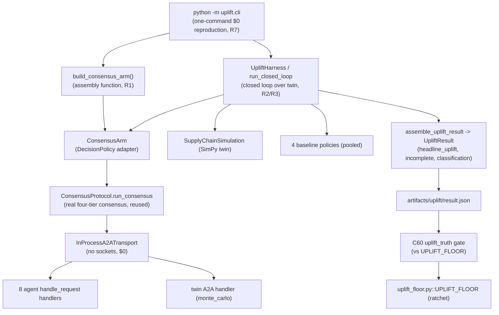

# Design Document

## Overview

SYNAPSE already contains a rigorous measurement apparatus (`uplift/`) and strong component engineering (623 tests, a real four-tier `ConsensusProtocol`, tier routing, an audit hash-chain, honesty gates). What is missing is the *connection*: nothing ever assembles the real consensus stack into the harness, no real model is published, and the C60 value gate passes as a `0.0 >= 0.0` tautology. This feature closes that gap **without rewriting decision logic**. It is deliberately a *wiring, measurement, and truth-pinning* feature, not a new-subsystem feature.

The design has one load-bearing new seam and a set of small, surgical reuses:

1. **A single assembly function** (`uplift/consensus_arm.py::build_consensus_arm`) that constructs a real `ConsensusProtocol` and an `InProcessA2ATransport` wired to the eight agent `handle_request` handlers plus the twin handler, returning a ready `ConsensusArm`. This is the crux of Requirement 1 — every other requirement is measurement, ratchet, publication, or truth-pinning built on top of a consensus arm that actually runs.
2. **CLI integration** (`uplift/cli.py::_build_consensus_arm`) that calls the assembly function instead of `ConsensusArm(transport=None)`, degrading to the existing honest-failure stub only when assembly genuinely fails in the current environment.
3. **A ratchet obligation** on `UPLIFT_FLOOR` gated by a co-located, fully-powered proof artifact.
4. **One real `demand_prophet` checkpoint** trained and published through the existing $0 runbook and recorded in `published_checkpoints.json`.
5. **A new C56 `doc_truth` claim** that pins the README headline counts to the live `verify_claims` summary.

The existing modules — `harness.py`, `contract.py`, `fidelity.py`, `interfaces.py`, `scenarios.py`, `uplift_floor.py`, `ConsensusProtocol`, `TierRouter`, `InProcessA2ATransport`, the agent/twin A2A handlers, the audit hash-chain, and the honesty gates — are reused as-is. The design's job is to compose them correctly and prove the composition works, honestly and reproducibly, at $0.

Success is defined non-circularly (Requirement 10.5): a `Powered_Run` (n ≥ `MIN_SCENARIOS` = 1000 per arm) that measures a `Headline_Uplift` strictly greater than 0.0 pp on `fill_rate`, within the committed `Fidelity_Bound`, reproducible via one command within a 1.0 pp noise tolerance. Adding code or tests alone never satisfies it.

### Grounding: what already exists vs. what this feature adds

| Concern | Already exists (reuse) | This feature adds |
|---|---|---|
| Closed loop over the twin | `harness.py::run_closed_loop`, `UpliftHarness` | (no change) |
| Consensus adapter | `consensus_arm.py::ConsensusArm`, `InProcessA2ATransport` | `build_consensus_arm()` assembly function |
| Result assembly / classification | `assemble_uplift_result`, `MetricContract.classify` | (no change) |
| Headline + fidelity report | `_headline_uplift`, `build_uplift_report`, `FidelityReport` | (no change) |
| One-command reproduction | `cli.py::main` | wire real arm into `_build_consensus_arm` |
| Value gate | `scripts/audit/uplift_truth.py`, `uplift_floor.py::ratchet` | ratchet `UPLIFT_FLOOR` on verified gain |
| Published model gate | `scripts/audit/published_checkpoint_truth.py`, runbook | publish 1 real checkpoint + registry entry |
| Doc truth | `scripts/audit/doc_truth.py`, `verify_claims.py` | new headline-count-pinning claim |

## Architecture

### System context



### Key architectural decisions

**AD-1 — In-process transport, not HTTP.** The consensus arm must exercise the *real* `ConsensusProtocol.run_consensus`, which in production dials agents/twin over A2A HTTP. To stay network-free and $0, `build_consensus_arm` wires `InProcessA2ATransport` (already implemented) mapping each canonical agent URL (`AGENT_ENDPOINTS`) and `TWIN_ENDPOINT` to the corresponding in-process `handle_request` callable. `ConsensusArm._run_consensus` temporarily rebinds the module-level `protocol.send_a2a_request` to the injected transport for the duration of each run, then restores it. No socket is opened. This preserves tier routing, debate, Pareto arbitration, and Tier-4 twin-verify unchanged (R1.2, R1.6, R6.3).

**AD-2 — Dependency injection + fail-loud.** `ConsensusArm` already requires an injected protocol and transport and raises `ConsensusArmUnavailable` when either is missing or a factory raises. The assembly function follows the same contract: if the eight-agent + twin network cannot be stood up in the current environment, assembly raises `ConsensusArmUnavailable`, the CLI catches it, and the affected runs are recorded as *failed runs* (never fabricated decisions), marking the result incomplete (R1.5, R7.5, R2.7).

**AD-3 — Attribution by construction is preserved, not re-implemented.** Replicate seeds are derived by the existing `replicate_seed(scenario.seed, index)` — a function of `(scenario.seed, index)` only, never the arm. The assembly function changes *which policy* produces decisions, never how seeds are derived, so replicate `i` of the consensus arm and every baseline arm still sees the identical seeded twin realization (R6.1, R6.2, R6.3).

**AD-4 — The floor is data-gated, not code-gated.** `UPLIFT_FLOOR` may only be raised above 0.0 when a co-located, fully-powered proof artifact records a `headline_uplift ≥` the proposed floor. The `ratchet()` helper enforces monotonicity (never lower); the *obligation* (raise + commit atomically, and only against a real artifact) is a process/design rule enforced by the C60 gate reading the artifact. A zero/negative/unavailable/incomplete honest measurement is a valid non-success and must not ratchet (R4.2, R4.7, R10.6).

**AD-5 — Truth is pinned mechanically.** The README headline counts are pinned to the live `verify_claims` summary via a new C56 claim that *executes the suite at evaluation time* and derives counts from its output — never from a hardcoded gate value. Any drift fails C56 naming each drifted category (R8.2, R8.3).

**AD-6 — One flagship model, honest degradation elsewhere.** Only `demand_prophet` must serve a real published checkpoint for the proof (R10.4). All other agents keep honest `Degraded_Serving` (I-7). The proof's validity does not require every agent to serve a real model.

### Closed-loop cadence (unchanged, arm-symmetric)

At each step, before advancing: observe twin state → `policy.decide(obs)` → apply `PolicyAction` levers → `advance(step)`. The consensus arm and every baseline arm run the identical `LoopConfig` cadence, unit-cost derivation (`_derive_unit_costs`), and twin construction (`_build_twin`) — no arm-asymmetry (R6.3), and both observe only the same `Observation` fields (R6.8, no leakage).

## Components and Interfaces

### C1. `build_consensus_arm` (NEW) — the assembly function (R1)

Location: `uplift/consensus_arm.py`. This is the single new function that closes the core gap.

```python
def build_consensus_arm(
    *,
    name: str = DEFAULT_CONSENSUS_ARM,
    agent_handlers: Mapping[str, A2AHandler] | None = None,
    twin_handler: A2AHandler | None = None,
    protocol: "ConsensusProtocol | None" = None,
) -> ConsensusArm:
    """Assemble a real in-process consensus arm (R1.1, R1.2, R1.6).

    Builds (or accepts injected) eight agent `handle_request` handlers and the twin
    `handle_request` handler, wraps them in an `InProcessA2ATransport.from_agents`,
    constructs a real `ConsensusProtocol` (reusing tier router + collaborators
    unchanged), and returns a `ConsensusArm(protocol=..., transport=...)`.

    Raises `ConsensusArmUnavailable` if the network cannot be assembled in this
    environment (R1.5) — the caller records failed runs, never a fabricated decision.
    """
```

Responsibilities:
- Build the eight agent handlers keyed by canonical agent name (matching `AGENT_ENDPOINTS` keys) — reusing each agent's existing `*A2AHandler` class and its `handle_request` bound method.
- Build the twin handler wrapping the twin's in-process `monte_carlo`/`simulate` handling (the same logic `digital_twin/inference/serve.py::a2a_handler` wraps), so Tier-4 twin-verify engages in-process.
- Construct a real `ConsensusProtocol` with its real `TierRouter`, guardrails, audit logger, HITL escalation, context builder, meta-RL, and semantic cache (reused, not rewritten — R1.6, R9.8). Collaborators that require paid/external services degrade honestly (I-1, I-7).
- Return `ConsensusArm(protocol=protocol, transport=InProcessA2ATransport.from_agents(agent_handlers, twin_handler=twin_handler), name=name)`.

Interface contract: the returned object satisfies `DecisionPolicy` (`name` + `decide`). On assembly failure it raises `ConsensusArmUnavailable` (loud, honest) rather than returning a stub.

### C2. `cli._build_consensus_arm` (MODIFIED) — wire the real arm (R1, R7)

Replace the body that returns `ConsensusArm(transport=None)` with a call to `build_consensus_arm()`. Preserve the existing `try/except` that falls back to `_UnavailableConsensusArm(reason)` so a plain environment that cannot stand up the network still degrades to honest failed runs (R1.5, R7.5). No signature change; `build_arms` continues to place the consensus arm first under `DEFAULT_CONSENSUS_ARM`.

### C3. `ConsensusArm` / `InProcessA2ATransport` (REUSED) — `consensus_arm.py`

Unchanged. `ConsensusArm.decide` maps `Observation → decision_request` (`observation_to_decision_request`), runs `run_consensus` on a fresh per-scenario event loop with the transport installed, and translates the binding `ConsensusDecision → PolicyAction` (`consensus_decision_to_policy_action`). Zero-proposal completion → `ConsensusArmUnavailable` (honest failure). `InProcessA2ATransport` returns a JSON-RPC error (not an exception) for unregistered URLs so per-agent fan-out degrades exactly as against a down HTTP peer (I-7).

### C4. `UpliftHarness` / `run_closed_loop` (REUSED) — `harness.py`

Unchanged. Provides `run_scenario`, `run_arm` (INV-TW-002 guard: `n < MIN_SCENARIOS` → `ValueError`), and `run` (full matrix, identical per-scenario replicate seeds across arms, persistence). `run_closed_loop` records a failed `ScenarioRun` on any policy exception (R2.7). `completed + failed == attempts` always (R9).

### C5. Result assembly (REUSED) — `harness.py`

`assemble_uplift_result` applies `MetricContract.classify` exactly as declared (R2.7), pools all non-consensus arms into the baseline per `(scenario, KPI)` when no baseline is named (R2.6), computes `incomplete` via `_run_is_incomplete`, resolves incomplete/partial pairs to `TIE_INCONCLUSIVE` (never `SYNAPSE_WINS`, R2.4/R2.5), computes the direction-oriented `headline_uplift` on the first primary KPI (R2.2), and emits `all_wins_warning` iff every pair is `SYNAPSE_WINS` (R6.7). `build_uplift_report` co-locates the KL value, threshold, confidence, and fidelity-bound statement with the number (R3.5, R6.5).

### C6. `MetricContract` (REUSED) — `contract.py`

Pre-registered `uplift/metric_contract.yaml`: `primary_kpis: {fill_rate: higher}`, `effect_size: cohens_d+rel_pct`, `significance_test: mann_whitney_u`, `alpha: 0.05`, `mde: {fill_rate: 0.2}`, `decision_rule: significant_and_favorable_and_meets_mde`. `classify` is total and deterministic; `SYNAPSE_WINS` requires significance at alpha AND `|d| ≥ mde` AND directional favorability (R6.4). Missing/malformed contract → `MetricContractError` (R7.3).

### C7. `FidelityReport` (REUSED) — `fidelity.py`

Reads the worst-case (max) C34 `synapse_digital_twin_kl_divergence` across agents, compares to `TwinConfig.kl_divergence_threshold` (default 0.1). Confidence: `unknown` (unavailable), `low_confidence_divergent` (> threshold), `within_fidelity_bound` (≤ threshold) (R6.5, R6.6).

### C8. `uplift_truth` C60 gate (MODIFIED behavior via floor) — `scripts/audit/uplift_truth.py`

Unchanged logic; drives three distinct exits from `read_measured_uplift` vs `UPLIFT_FLOOR`: available & `≥ floor` → PASS (exit 0, R4.4); available & `< floor` → REGRESSION (exit 1, R4.5); unavailable → UNAVAILABLE (exit 2, R4.6). The behavior change comes from ratcheting `UPLIFT_FLOOR` (C9) after a verified gain.

### C9. `uplift_floor` ratchet (MODIFIED value) — `uplift/uplift_floor.py`

`UPLIFT_FLOOR` starts at `0.0`. The `ratchet(previous, proposed)` helper raises `FloorRatchetError` if `proposed < previous` (R4.3). The obligation (R4.2, R4.7): raise the floor to `0 < v ≤ measured` and commit atomically, only when a co-located fully-powered proof artifact records `headline_uplift ≥ v`.

### C10. Published checkpoint (NEW artifact + registry entry) — `infrastructure/ml/published_checkpoints.json`, runbook (R5)

Operator runs `docs/runbooks/train-and-publish-checkpoint.md` (existing) on free GPU, publishes a non-smoke `demand_prophet_hgt_tft` checkpoint to HF Hub, and replaces `__placeholder__` with a real entry (`repo`, `sha`, `coverage`, training metadata). The C43 `published_checkpoint_truth` gate (existing) then verifies: non-smoke, `last_coverage_p90 ≥ 0.85`, recorded sha present in published version (R5.3–R5.6). The flagship agent then serves non-degraded output (R5.7).

### C11. C56 headline-count claim (NEW claim) — `scripts/audit/doc_truth.py`

Add a claim `_claim_readme_headline_counts` to `_CLAIMS` that: executes the `verify_claims` suite, parses its emitted summary into `{PASS, FAIL, PARTIAL, SKIP, TOTAL}`, extracts the README headline counts, and FAILs naming each drifted category with (claimed, actual) when any differ (R8.2, R8.3). If a source file is missing → SKIP naming it (R8.5); if the suite cannot run or its summary cannot be parsed → SKIP naming the failure (R8.6). Counts are derived at evaluation time, never hardcoded.

### C12. `verify_claims` category totality (REUSED, assert) — `scripts/audit/verify_claims.py`

Each registered check returns exactly one status in `{PASS, FAIL, PARTIAL, SKIP}`; the four counts sum to TOTAL with no check omitted (R8.7). The README literal `16 PASS / 3 FAIL / 0 SKIP` is replaced by the live counts (currently 53 registered checks) (R8.1).

## Data Models

All data models already exist in `uplift/interfaces.py` and are reused unchanged. The design adds no new persisted schema beyond the fields the CLI already writes to `artifacts/uplift/result.json`.

### Reused models (`uplift/interfaces.py`)

- **`Observation`** — immutable twin snapshot fed to `decide`: `inventory`, `sim_time`, `delivery_count`, `spoilage_count`, `stockout_count`, `unit_costs`, `active_shock`, `pending_order`, `eligible_stores`. Both arms see only these fields (R6.8).
- **`PolicyAction`** — possibly-partial decision: `reorder_quantities`, `price`, `routing_assignment`, `disruption_actions`.
- **`DecisionPolicy`** (Protocol) — `name: str` + `decide(obs) -> PolicyAction`. Implemented by baselines and `ConsensusArm`.
- **`Direction`** — `HIGHER_IS_BETTER | LOWER_IS_BETTER`.
- **`Outcome`** — `SYNAPSE_WINS | BASELINE_WINS | TIE_INCONCLUSIVE`.
- **`KpiVector`** — `fill_rate`, `spoilage_rate`, `stockout_rate`, `avg_delivery_time_min`, `margin`, `co2_estimate`.
- **`Scenario`** — `name`, `seed`, `shock: ShockParams`, `cold_start`.
- **`ScenarioRun`** — `arm`, `seed`, `kpis: KpiVector | None`, `failed`, `error`.
- **`ArmResult`** — `arm`, `completed`, `failed`, `kpi_mean`, `kpi_std`.
- **`UpliftResult`** — `per_kpi`, `per_scenario`, `secondary_kpis`, `headline_uplift`, `fidelity`, `all_wins_warning`, `incomplete`.

### Result artifact schema (`artifacts/uplift/result.json`, reused, written by `cli._write_result_artifact`)

```json
{
  "headline_uplift": 0.0,
  "primary_kpi": "fill_rate",
  "noise_tolerance_pp": 1.0,
  "incomplete": true,
  "all_wins_warning": false,
  "fidelity": {
    "kl_divergence": null,
    "threshold": 0.1,
    "confidence": "unknown",
    "within_fidelity_bound": null,
    "fidelity_bound_statement": "The validity of this uplift number is bounded by twin fidelity."
  }
}
```

The C60 gate reads `headline_uplift` (finite number or unavailable). A fully-powered proof artifact additionally implies `incomplete: false` and a `Powered_Run` provenance (n ≥ 1000 per arm).

### Registry entry schema (`infrastructure/ml/published_checkpoints.json`, R5.2)

```json
{
  "demand_prophet_hgt_tft": {
    "repo": "Praneshrajan15/synapse-demand-prophet",
    "sha": "<checkpoint_sha7>",
    "coverage_p90": 0.9,
    "final_crps": 0.0,
    "trained_at": "2026-...",
    "rows": 1125000
  }
}
```

### AdversarialSuite (`uplift/scenarios.py`, reused)

Four seeded scenarios: `demand-spike` (4001), `supplier-default` (4002), `monsoon-disruption` (4003), `cold-start-city` (4004). Distinct fixed seeds → replayable, arm-symmetric realizations.

<!-- PBT assessment: This feature is dominated by pure, deterministic functions and
     universal invariants — headline_uplift orientation, incomplete semantics, baseline
     pooling, classify totality, replicate-seed determinism, ratchet monotonicity, the
     C60 three-way exit mapping, and the doc-count pinning arithmetic. Property-based
     testing IS strongly applicable. Running prework before writing properties. -->

## Correctness Properties

*A property is a characteristic or behavior that should hold true across all valid executions of a system — essentially, a formal statement about what the system should do. Properties serve as the bridge between human-readable specifications and machine-verifiable correctness guarantees.*

The properties below were derived from the prework analysis and consolidated to remove redundancy (e.g. the three-way C60 exit mapping is one property; the C43 gate decision is one property with edge cases folded into its generator; the fidelity confidence mapping is one property). Structural wiring, infra/$0, and governance criteria are covered by example/integration/smoke tests in the Testing Strategy rather than by properties.

### Property 1: Consensus arm decides only through the in-process transport (network-free)

*For any* reachable `Observation` fed to an assembled `ConsensusArm`, `decide` produces its result by invoking only the injected in-process transport (recorded transport calls > 0) and never opens a network socket.

**Validates: Requirements 1.2**

### Property 2: A reachable observation yields a translated PolicyAction, not unavailability

*For any* reachable `Observation` with an in-process agent network that returns at least one proposal, `ConsensusArm.decide` returns a `PolicyAction` instance and does not raise `ConsensusArmUnavailable`.

**Validates: Requirements 1.3**

### Property 3: Unavailable consensus is an honest failed run, never a fabricated decision

*For any* arm whose `decide` raises (e.g. `ConsensusArmUnavailable`), `run_closed_loop` returns a `ScenarioRun` with `failed=True`, `kpis=None`, and a non-empty `error`, and never a completed run — so the command degrades to honest failure rather than crashing or fabricating a decision.

**Validates: Requirements 1.5, 7.5, 9.6**

### Property 4: `incomplete` flag exactly tracks run completeness

*For any* synthetic `HarnessResult`, the assembled `UpliftResult.incomplete` is `false` if and only if every compared `(scenario, arm)` pair (consensus and every baseline) has at least one completed run and zero failed runs.

**Validates: Requirements 2.1**

### Property 5: Incomplete or partial pairs are never credited to SYNAPSE

*For any* scenario that has zero completed consensus runs, or any consensus pair with at least one failed replicate, the run is marked `incomplete` and the affected pair's `Outcome` is `TIE_INCONCLUSIVE` (never `SYNAPSE_WINS`).

**Validates: Requirements 2.4, 2.5**

### Property 6: Headline uplift is direction-oriented so positive always means improvement

*For any* consensus and baseline sample arrays and either `Direction`, the headline uplift equals the relative percentage change for a higher-is-better KPI and its negation for a lower-is-better KPI; consequently any arrangement where consensus is genuinely better on the primary KPI yields a non-negative headline.

**Validates: Requirements 2.2**

### Property 7: Headline uplift round-trips through the result artifact

*For any* assembled non-incomplete `UpliftResult`, writing the result artifact and reading it back yields a finite numeric `headline_uplift` and `incomplete = false`.

**Validates: Requirements 2.3**

### Property 8: Unnamed baseline pools all non-consensus arms

*For any* arm set with no explicitly designated baseline, the baseline sample set for each `(scenario, KPI)` equals the concatenation of the completed samples of every non-consensus arm for that pair.

**Validates: Requirements 2.6**

### Property 9: Assembly classifies pairs by the contract rule verbatim

*For any* complete `(scenario, primary KPI)` pair, the assembled `per_scenario` outcome equals `MetricContract.classify(consensus_samples, baseline_samples, kpi)` computed directly — the assembly substitutes no alternative rule.

**Validates: Requirements 2.7**

### Property 10: The under-power guard is total over n

*For any* `n` in `[0, MIN_SCENARIOS)`, `run_arm`/`_check_power` raises the INV-TW-002 under-power `ValueError`; *for any* `n ≥ MIN_SCENARIOS` it does not raise.

**Validates: Requirements 3.2**

### Property 11: Identical seeds reproduce within the committed noise tolerance

*For any* seed configuration, two runs of the harness on the identical seeds produce `headline_uplift` values that differ by no more than 1.0 percentage point (and, being seed-deterministic, by 0.0 under identical stubs).

**Validates: Requirements 3.3**

### Property 12: Reproduction output carries required disclosures and labels

*For any* run mode, the CLI output contains the synthetic-only data-provenance disclosure, the no-external-paid-service disclosure, and the "≤ 1.0 percentage point" noise-tolerance statement; and *for any* reduced-cost run it additionally contains the "NOT a fully-powered proof" label.

**Validates: Requirements 3.4, 7.2, 7.6**

### Property 13: Every headline number is co-located with its fidelity context

*For any* `UpliftResult`, the rendered uplift report contains the headline number together with the twin KL value, its comparison to the threshold, the confidence annotation, and the fidelity-bound statement in one place.

**Validates: Requirements 3.5**

### Property 14: The uplift floor is a monotonic ratchet

*For any* previously committed floor `previous` and proposed value `proposed`, `ratchet(previous, proposed)` returns `proposed` when `proposed ≥ previous` and raises `FloorRatchetError` when `proposed < previous`; and a proposed floor raised on a verified positive measurement is accepted only when `0 < proposed ≤ measured`.

**Validates: Requirements 4.2, 4.3**

### Property 15: The C60 gate exit is a total three-way mapping

*For any* result artifact, the C60 gate exits pass (0) iff the measured headline is available and `≥ UPLIFT_FLOOR`, regression (1) iff available and `< UPLIFT_FLOOR`, and the distinct unavailable code (2) iff the measurement is unavailable (missing, unreadable, invalid, or non-finite) — the unavailable case never maps to pass.

**Validates: Requirements 4.4, 4.5, 4.6**

### Property 16: The C43 published-checkpoint gate decision is correct over sidecar/registry inputs

*For any* combination of published sidecar `smoke` flag, `last_coverage_p90`, recorded registry sha, and published version string (with the registry populated and remote reachable), the C43 `evaluate()` returns `ok` if and only if the sidecar is non-smoke AND coverage `≥ 0.85` AND the recorded sha appears in the published version; otherwise it returns a failure (smoke artifact, uncalibrated coverage, or sha drift).

**Validates: Requirements 5.3, 5.4, 5.5, 5.6**

### Property 17: Replicate seeds are arm-independent and deterministic (attribution)

*For any* `(base_seed, index)`, `replicate_seed` is deterministic and depends only on those two values, so replicate `i` of the consensus arm and of every baseline arm is driven by the identical derived seed — the harness derives one seed sequence per scenario and reuses it across all arms.

**Validates: Requirements 6.1, 6.2**

### Property 18: Arms run under identical cadence, costs, and twin construction (no asymmetry, no leakage)

*For any* scenario, seed, and arm, `run_closed_loop` applies the identical `LoopConfig` cadence, the identical `_derive_unit_costs` unit costs, and the identical seeded twin construction, and presents the consensus and baseline arms an `Observation` exposing the identical field set — so no arm-asymmetry favors one arm and no arm receives privileged information.

**Validates: Requirements 6.3, 6.8**

### Property 19: SYNAPSE_WINS requires significance and MDE

*For any* consensus and baseline samples, if `MetricContract.classify` returns `SYNAPSE_WINS` then the significance test is significant at the contract `alpha` AND `|d| ≥ mde[kpi]` AND the effect favors consensus in the KPI's improvement direction.

**Validates: Requirements 6.4**

### Property 20: Fidelity confidence maps KL divergence deterministically

*For any* KL value and threshold, `FidelityReport.confidence` is `unknown` when the value is unavailable, `low_confidence_divergent` when strictly above the threshold, and `within_fidelity_bound` when at or below the threshold; `within_fidelity_bound` is reported as outside the bound whenever the value exceeds the threshold.

**Validates: Requirements 6.5, 6.6**

### Property 21: The all-wins guard fires exactly when every pair is a SYNAPSE win

*For any* non-empty classified `per_scenario` grid, `all_wins_warning` is `true` if and only if every classified pair is `SYNAPSE_WINS`; an empty grid never warns.

**Validates: Requirements 6.7**

### Property 22: Missing/malformed contract fails first, printing and writing no headline

*For any* missing or malformed metric contract, `cli.main` returns `EXIT_MISSING_INPUT`, prints no headline number to stdout, and writes no headline number to the artifact — and this contract failure takes priority over the no-completed-run failure.

**Validates: Requirements 7.3, 7.4**

### Property 23: The headline-count pin passes iff every count matches, else fails naming each drift

*For any* README headline counts and `verify_claims` suite summary, the C56 headline-count claim passes iff all five counts (PASS, FAIL, PARTIAL, SKIP, TOTAL) match the suite-derived counts, and otherwise fails with a detail that names each drifted category together with its README-claimed value and the suite-reported value; the "actual" values are derived from the suite output at evaluation time, not from any constant.

**Validates: Requirements 8.1, 8.2, 8.3**

### Property 24: Unavailable pinned source or suite yields skip, never a pass

*For any* pinned C56 claim whose source file is missing/unreadable, or whose `verify_claims` execution or summary parse fails, the claim reports `skip` naming the absent source or the failure, and never reports a pass.

**Validates: Requirements 8.5, 8.6**

### Property 25: The verify_claims status partition is exhaustive and disjoint

*For any* execution of the `verify_claims` suite, every registered check is assigned exactly one status in `{PASS, FAIL, PARTIAL, SKIP}`, and the four category counts sum to the reported TOTAL, which equals the number of registered checks — no check is silently omitted.

**Validates: Requirements 8.7**

### Property 26: Uplift is "proven" only for a within-bound, powered, floor-clearing positive measurement

*For any* candidate outcome described by (artifact powered? , headline value, `UPLIFT_FLOOR`, within-fidelity-bound?), the doc/success predicate resolves to "proven"/"success" if and only if the run is a `Powered_Run`, the measured headline is `≥ UPLIFT_FLOOR` and strictly positive, and the result is within the fidelity bound; any zero, negative, unavailable, incomplete, or out-of-bound outcome resolves to "unproven"/non-success and does not make the floor eligible to ratchet above 0.0.

**Validates: Requirements 8.4, 10.6, 10.7**

## Error Handling

The design's error philosophy is **honest failure over fabrication**, matching the existing modules.

| Failure | Detection | Behavior | Requirement |
|---|---|---|---|
| In-process network cannot be assembled | `build_consensus_arm` / `ConsensusArm.__init__` | Raise `ConsensusArmUnavailable`; CLI catches → `_UnavailableConsensusArm`; runs recorded failed | R1.5, R7.5 |
| `run_consensus` raises for a scenario | `run_closed_loop` try/except | `ScenarioRun(failed=True, kpis=None, error=...)`, excluded from aggregation | R2.7 |
| Consensus completes with zero proposals | `ConsensusArm.decide` | Raise `ConsensusArmUnavailable` (unreachable network), honest failed run | R1.5 |
| Any scenario/pair incomplete | `_run_is_incomplete` | Mark `incomplete`, pair → `TIE_INCONCLUSIVE`, never SYNAPSE_WINS | R2.4, R2.5 |
| Under-powered n < 1000 | `UpliftHarness._check_power` | `ValueError` INV-TW-002, no proof-grade aggregation | R3.2 |
| Missing/malformed metric contract | `load_contract` → `MetricContractError` | Exit `EXIT_MISSING_INPUT`, name the input, no headline printed/written; overrides no-completed-run | R7.3, R7.4 |
| No scenario completes for any arm | `uplift_exit_code` | Exit `EXIT_NO_COMPLETED_RUN` (contract error takes priority) | R7.4 |
| Measured uplift unavailable/non-finite | `read_measured_uplift` → `None` | C60 exit `EXIT_UNAVAILABLE` (2), never pass | R4.6 |
| Proposed floor below committed | `ratchet` | `FloorRatchetError` | R4.3 |
| Published sidecar smoke / low coverage / sha drift | C43 `evaluate` | `fail` status with diagnostic | R5.4, R5.5, R5.6 |
| Registry placeholder / remote unreachable / no HF | C43 `evaluate` | `skip` (never a fabricated pass) | R5 |
| Pinned source missing / suite unrunnable | C56 claim | `skip` naming the cause, never pass | R8.5, R8.6 |
| KL divergence unavailable | `FidelityReport.confidence` | `unknown` — not fidelity-validated | R6.5 |
| Parallel worker cannot spawn/pickle | `_run_arm_runs` | Honest degrade to sequential in-process execution | (reliability) |

All fabrication paths are excluded by construction: a `PolicyAction` is only ever *translated* from a real `ConsensusDecision`; a KPI vector is only produced from a completed twin run; a headline is only written for a non-incomplete result; and `UPLIFT_FLOOR > 0` is only committed against a co-located proof artifact.

## Testing Strategy

### Dual approach

- **Property tests** verify the universal invariants above across generated inputs (pure functions and harness logic, run with mocks/stubs to stay $0 and fast).
- **Unit/example tests** verify specific structural wiring and concrete command outcomes.
- **Integration tests** verify external-service behavior (HF Hub publication, real checkpoint serving) with 1–3 representative examples.
- **Smoke tests** verify one-time configuration, infra/$0 invariants, and the 623-test regression floor.

### Property-based testing

PBT **is** applicable here: the feature is dominated by pure, deterministic functions and universal invariants (headline orientation, incomplete semantics, baseline pooling, classify totality, replicate-seed determinism, ratchet monotonicity, the C60 three-way exit mapping, fidelity confidence mapping, and the doc-count pin arithmetic).

- Library: **Hypothesis** (Python), matching the repo's existing property tests under `tests/uplift/`.
- Each property test runs a **minimum of 100 iterations**.
- Each property test is tagged with a comment referencing its design property, format: **`Feature: core-purpose-uplift, Property {number}: {property_text}`**.
- Each correctness property (Properties 1–26) is implemented by a **single** property-based test.
- Generators produce: synthetic `HarnessResult`/`ScenarioRun` grids (varying completed/failed counts), consensus/baseline float sample arrays (including degenerate/empty/NaN/zero-variance edge cases), `(base_seed, index)` pairs, `(previous, proposed)` floor pairs, `(measured, floor, availability)` triples for the C60 mapping, `(smoke, coverage, sha, version)` tuples for C43, KL/threshold pairs for fidelity, and `(README counts, suite summary)` pairs for the C56 pin.
- Consensus-arm properties (1, 2, 3, 18) use **stub agent/twin handlers** injected through `build_consensus_arm`'s parameters so `run_consensus` executes in-process with no real models and no sockets — keeping iterations cheap while exercising the real protocol wiring.

### Example / unit tests

- **1.1** assembly builds a transport with exactly the 8 agent URLs + `TWIN_ENDPOINT` and returns a `DecisionPolicy`.
- **1.4 / 7.1** the `--smoke` / one-command path records ≥ 1 completed consensus run and writes the artifact at the C60 path.
- **5.2** the populated registry entry parses with required keys (schema validation).
- **3.1** a stubbed powered run reports ≥ `MIN_SCENARIOS` completed per arm.

### Integration tests (1–3 examples, not PBT)

- **5.1 / 5.7** with the registry populated and the remote reachable, the published sidecar is non-smoke and the flagship serves non-degraded output.

### Smoke / regression tests

- **9.1** the full existing suite reports ≥ 623 passing tests.
- **1.6 / 9.8** `build_consensus_arm` imports the real `ConsensusProtocol`/`AGENT_ENDPOINTS` (no forked decision logic).
- **3.6 / 3.7 / 9.2 / 10.1 / 10.3** the reproduction/verification paths read only synthetic seeds and complete in-process with sockets/paid clients monkeypatched to fail.
- **4.1** `UPLIFT_FLOOR` is a single importable numeric constant.
- **4.7** guard test: if `UPLIFT_FLOOR > 0`, a committed proof artifact records `headline_uplift ≥ UPLIFT_FLOOR`.
- **I-2 / I-3 / I-5 / I-7 / I-14** the existing invariant test suites continue to pass (reuse, not rewrite).

### Test configuration summary

- Property tests: Hypothesis, ≥ 100 iterations each, tagged per design property.
- No property test performs network I/O or paid-service calls (I-1); consensus-arm property tests use injected stub handlers.
- Reproduction/one-command tests assert exit codes and artifact contents rather than a real 1000-scenario twin run (the powered proof is a separate, operator-run step).
