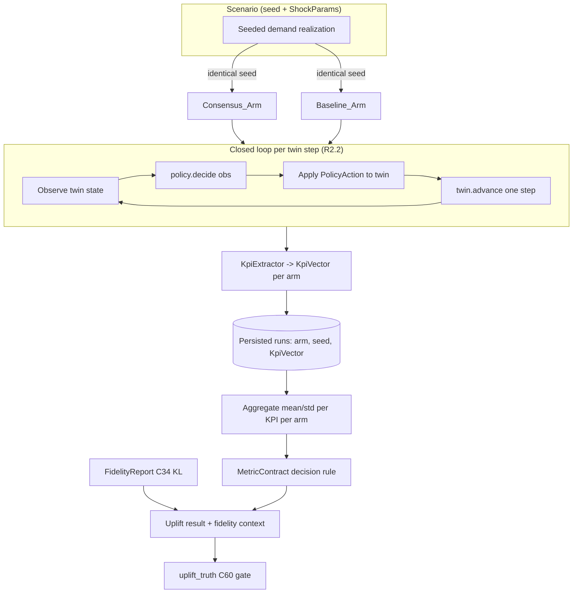

# Design Document

## Overview

The **Decision-Integrity Uplift Proof** is a closed-loop counterfactual harness that measures — and
either proves or honestly refutes — whether SYNAPSE's four-tier consensus decisions beat a transparent
baseline policy on business KPIs, using the existing SimPy digital twin as the shared world.

It follows SYNAPSE's established honesty-culture pattern already visible in `scripts/audit/`:

- Every prose claim is backed by an executable gate (`verify_claims.py`, `training_truth.py`).
- Verified gains are locked in with a ratcheted BASELINE constant (`training_truth.BASELINE`, the
  coverage/stryker ratchets `C15`/`C16`).
- Fidelity is disclosed with every number (the `synapse_digital_twin_kl_divergence` metric, C34).
- Honest negative/mixed findings are valid outcomes, not failures.

The feature adds seven cooperating pieces:

1. A **baseline policy suite** (`Par_Level_Reorder`, `Static_Pricing`, `Greedy_Routing`,
   `No_Op_Disruption`) implemented as first-class, tested, pure control code behind the same decision
   interface the consensus arm uses.
2. A **closed-loop counterfactual harness** that drives the twin step-by-step, feeding twin state into
   the active decision policy and applying the returned decisions back into the twin, on identical
   seeded scenarios across arms.
3. A **pre-registered metric contract** — a version-controlled artifact declaring primary KPI(s),
   effect-size measure, significance test, minimum detectable effect, and a deterministic decision rule.
4. An **adversarial scenario suite** (demand-spike, supplier-default, monsoon-disruption,
   cold-start-city) with mandatory honest-loss reporting.
5. **Mandatory twin-fidelity disclosure** — the C34 KL-divergence value co-located with every uplift
   number, annotated against the C34 re-sync threshold.
6. An **`uplift_truth` honesty gate** (`scripts/audit/uplift_truth.py`, check `C60` in
   `verify_claims.py`) with a ratcheted uplift floor in the `training_truth.py` BASELINE style.
7. A **one-command reproduction** (`make prove-uplift`) plus repair of the latent oracle honesty gap in
   `tests/oracle/` (a new `scripts/audit/oracle_truth.py` docstring-body auditor).

### Design Principles

- **Reuse the existing twin, don't rebuild it.** The harness drives
  `digital_twin.simulation.engine.SupplyChainSimulation` through its already-present actuation levers
  (`start`, `advance`, `set_policy`, `inject_shock`, `inject_orders`, `add_stock`) — the same levers
  ADR-052 added for the live agentic loop. No new simulation physics.
- **$0 / synthetic-only / in-process.** All demand is seeded RNG. No live customer data, no external
  paid service, no live network. The consensus arm runs in-process (see Architecture) so
  `make prove-uplift` is self-contained on a clean clone.
- **Attribution by construction.** Identical seed ⇒ identical demand realization across arms, so KPI
  differences are attributable to the decision policy, not to differing demand.
- **Honesty over marketing.** Every scenario is reported regardless of outcome; an all-wins result
  emits a self-scrutiny warning; fidelity bounds every claim.

## Architecture

### Component Placement

New code lives in a top-level `uplift/` package (harness + baselines + contract) plus two audit gates
under `scripts/audit/` (mirroring the existing gate convention), and one Makefile target:

```
uplift/
  __init__.py
  interfaces.py          # DecisionPolicy protocol, Observation, PolicyAction, KpiVector
  baselines/
    __init__.py
    par_level_reorder.py # (s, S) reorder policy
    static_pricing.py    # cost-plus pricing policy
    greedy_routing.py    # nearest-store routing policy
    no_op_disruption.py  # empty-action disruption policy
    README.md            # plain-language rule + "control without SYNAPSE" statement per policy
  consensus_arm.py       # ConsensusArm adapter (wraps ConsensusProtocol in-process)
  scenarios.py           # Scenario + the 4-entry Adversarial_Scenario_Suite
  kpi.py                 # KpiExtractor: twin metrics + decisions -> KpiVector
  harness.py             # UpliftHarness: closed-loop runner, aggregation, persistence
  contract.py            # MetricContract loader + deterministic decision rule
  fidelity.py            # FidelityReport: reads synapse_digital_twin_kl_divergence (C34)
  metric_contract.yaml   # the pre-registered, version-controlled Metric_Contract artifact
  uplift_floor.py        # the ratcheted UPLIFT_FLOOR BASELINE constant (imported by the gate)
  cli.py                 # `python -m uplift.cli` entrypoint used by `make prove-uplift`
scripts/audit/
  uplift_truth.py        # C60 honesty gate (--check / --json), ratchet style
  oracle_truth.py        # Oracle_Test_Auditor (--check), docstring-vs-assertion AST auditor
```

`verify_claims.py` gains a `C60` (uplift_truth) row and a row for the oracle auditor; `docs/state/CURRENT.md`
gains the mirrored rows; `Makefile` gains `prove-uplift`.

### Closed-Loop Data Flow



### Consensus Arm Integration (key decision)

The Consensus_Arm must exercise SYNAPSE's *real* four-tier consensus
(`orchestrator.consensus.protocol.ConsensusProtocol.run_consensus`), which in production reaches the
eight agents and the twin over A2A HTTP. A $0, self-contained, one-command harness cannot stand up the
live network stack. The design resolves this with an **in-process A2A transport**: the `ConsensusArm`
adapter constructs a `ConsensusProtocol` whose proposal/debate/twin calls are dispatched directly to
the agents' and twin's in-process A2A handler functions (the same handlers the HTTP servers wrap),
rather than over the wire. This keeps the real tier routing, debate, Pareto arbitration, and Tier-4
twin verification logic intact while remaining network-free and free of external services.

The adapter maps each `Observation` (twin state) to a `decision_request` dict, invokes
`run_consensus` on a per-scenario event loop, and translates the resulting `ConsensusDecision`'s binding
action into a `PolicyAction` (reorder quantities, price, routing, disruption actions) applied to the
twin. If the consensus arm cannot be constructed or `run_consensus` raises for a scenario, that
(arm, seed) run is recorded as a **failed run**, excluded from aggregation, and the harness continues
(R2.7) — the harness never fabricates a consensus decision.

### Arm Symmetry (attribution guarantee)

Both arms share:
- The identical `Scenario` seed → identical `SupplyChainSimulation` RNG stream and identical
  `ShockParams` (R2.1, R2.5).
- The identical closed-loop cadence (same number of steps, same `advance` duration per step).
- The identical `KpiExtractor` and `KpiVector` schema.

The only difference between arms is which `DecisionPolicy` produces the per-step decisions. This is the
attribution guarantee: any KPI delta is caused by the decision policy alone.

## Components and Interfaces

### DecisionPolicy interface (R1.6, R2.2)

A single protocol is implemented by every baseline policy and by the `ConsensusArm`, so the harness
loop is arm-agnostic:

```python
class DecisionPolicy(Protocol):
    name: str
    def decide(self, obs: Observation) -> PolicyAction: ...
```

- `Observation` — an immutable snapshot of the twin state fed at each step: current inventory levels
  per SKU, current sim time, recent delivery/spoilage/stockout counters, unit costs, active shock
  descriptor, and (for routing) the pending order + eligible store set.
- `PolicyAction` — the decisions applied back into the twin, expressed in the twin's actuation
  vocabulary: reorder quantities per SKU (→ `add_stock` / `set_policy(order_qty_mult=…)`), a price (→
  margin bookkeeping and `set_policy(demand_mult=…)` price-elasticity coupling), a routing assignment,
  and a disruption action set. A `PolicyAction` may be partial (a pricing-only policy sets only price).

### Baseline policies (R1.1–R1.12)

Each baseline is a pure, deterministic, seed-stable function object implementing `DecisionPolicy`. The
policy rule is documented in `uplift/baselines/README.md` in plain language and labelled as the control
representing operation *without* SYNAPSE (R1.8).

| Policy | Config | Rule | Edge / error behavior |
| --- | --- | --- | --- |
| `Par_Level_Reorder` | `s`, `S` with `0 ≤ s < S` | if `level ≤ s`: reorder `S − projected_level`; else `0` | level strictly above `s` ⇒ qty `0` (R1.10) |
| `Static_Pricing` | `markup ≥ 1.0` | `price = unit_cost × markup` for `unit_cost ≥ 0` | negative cost ⇒ reject with error, no price (R1.12) |
| `Greedy_Routing` | — | assign order to nearest eligible store; tie → lowest store id (R1.4) | empty eligible set ⇒ unroutable error, routing state unchanged (R1.11) |
| `No_Op_Disruption` | — | return an empty action set on any disruption event (R1.5) | — |

Determinism (R1.9): each policy is constructed with (or derives from) a seed and produces identical
decisions for identical inputs across runs; the baselines contain no hidden global state.

### UpliftHarness (R2)

```python
class UpliftHarness:
    def run_scenario(self, scenario: Scenario, policy: DecisionPolicy) -> ScenarioRun: ...
    def run_arm(self, scenario: Scenario, policy: DecisionPolicy, n: int) -> ArmResult: ...
    def run(self, scenarios, arms, n_per_arm=1000) -> HarnessResult: ...
```

Responsibilities:
- Drive the closed loop per scenario (R2.2): `start` the twin with the scenario seed + shock, then
  repeatedly observe → `policy.decide` → apply → `advance(step)` until the scenario horizon is reached.
- Guarantee ≥ 1000 completed scenarios per arm contribute to aggregation (R2.4, INV-TW-002); use a
  `ProcessPoolExecutor` for parallelism, mirroring `MonteCarloRunner`.
- Record one `KpiVector` per completed (arm, seed) run and persist it with arm id + seed (R2.3, R2.6).
- On a policy error, record the (arm, seed) as a failed run, exclude it from aggregation, and continue
  (R2.7).
- Compute per-arm mean and std for each KPI (R2.8) and report per-arm completed/failed counts (R2.9).

### MetricContract (R3)

`contract.py` loads `uplift/metric_contract.yaml` (version-controlled, R3.6/R3.9) into an immutable
`MetricContract` object and exposes the deterministic decision rule:

```python
class MetricContract:
    primary_kpis: dict[str, Direction]   # KPI -> HIGHER_IS_BETTER | LOWER_IS_BETTER (R3.1)
    effect_size: Literal["cohens_d+rel_pct"]  # (R3.2)
    significance_test: str                # e.g. "mann_whitney_u" (R3.3)
    alpha: float                          # in (0, 1) (R3.3)
    mde: dict[str, float]                 # per-primary-KPI effect-size floor (R3.4)

    def classify(self, consensus: np.ndarray, baseline: np.ndarray, kpi: str) -> Outcome: ...
```

`classify` is a **total, deterministic** function of `(consensus samples, baseline samples, kpi)`
returning exactly one `Outcome ∈ {SYNAPSE_WINS, BASELINE_WINS, TIE_INCONCLUSIVE}` (R3.5): compute
Cohen's d + relative % change (R3.2), run the declared significance test at `alpha` (R3.3), and apply
the rule — SYNAPSE wins iff the result is significant **and** the effect favors the consensus arm in the
KPI's improvement direction **and** `|d| ≥ mde[kpi]`; baseline wins iff significant **and** the effect
favors baseline **and** `|d| ≥ mde[kpi]`; otherwise tie/inconclusive. The harness applies this rule
exactly as declared (R3.7); a missing/malformed contract makes the harness exit with a failure status
and no uplift outcome (R3.10); non-declared KPIs are labelled secondary in the output (R3.8).

### AdversarialSuite (R4)

`scenarios.py` defines exactly four seeded, replayable `Scenario`s (R4.1) via `ShockParams`:

| Scenario | Realization |
| --- | --- |
| demand-spike | `ShockParams(demand_multiplier=2.0)` |
| supplier-default | `ShockParams(lead_time_multiplier=2.0, failure_rate_multiplier=3.0)` |
| monsoon-disruption | `ShockParams(spoilage_rate_multiplier>1, lead_time_multiplier>1)` |
| cold-start-city | empty initial inventory / freshness (no warm history) |

The harness runs every scenario through the consensus arm and each baseline arm on the same seed
(R4.2), classifies each `(scenario, primary KPI)` pair via the contract rule (R4.3), reports every
executed scenario without omission or outcome-based filtering (R4.4), emits a self-scrutiny warning when
*every* pair is "SYNAPSE wins" (R4.5), exits success for any completed adversarial run regardless of
winner (R4.6), and on an incomplete scenario records a failed run, marks the result incomplete, and
never defaults the affected pair to "SYNAPSE wins" (R4.7).

### FidelityReport (R5)

`fidelity.py` reads the current `synapse_digital_twin_kl_divergence` gauge value
(`synapse_common.metrics.DIGITAL_TWIN_KL_DIVERGENCE`, C34) and compares it to the C34 re-sync
threshold (`TwinConfig.kl_divergence_threshold`, default `0.1`):

```python
@dataclass(frozen=True)
class FidelityReport:
    kl_divergence: float | None       # None => "unknown" (R5.3)
    threshold: float                  # C34 re-sync threshold
    @property
    def confidence(self) -> str:      # "unknown" | "low_confidence_divergent" | "within_fidelity_bound"
```

Mapping: value unavailable ⇒ `unknown`, not fidelity-validated (R5.3); value `> threshold` ⇒
`low_confidence_divergent` (R5.4); value `≤ threshold` ⇒ `within_fidelity_bound` (R5.5). Every reported
uplift number is emitted co-located with its KL value, its threshold comparison, the confidence
annotation, and the fixed statement that the uplift number's validity is bounded by twin fidelity
(R5.1, R5.2, R5.6).

### UpliftTruthGate — C60 (R6)

`scripts/audit/uplift_truth.py` mirrors `training_truth.py` exactly:

- A single declared numeric `UPLIFT_FLOOR` BASELINE constant (imported from `uplift/uplift_floor.py`)
  in the ratchet style (R6.2).
- `--check` mode: exit `0` when measured uplift `≥ UPLIFT_FLOOR` (R6.3); exit `1` (the regression code)
  with the measured value, the floor, and a regression indication when measured uplift `< UPLIFT_FLOOR`
  (R6.4); a **distinct** non-zero exit code (e.g. `2`) when measured uplift is unavailable, never
  reporting a pass (R6.5).
- `--json` mode: `{ "measured_uplift", "uplift_floor", "regression": bool }` (R6.7).
- Surfaced as a `C60` check row in `verify_claims.py` with a mirrored `docs/state/CURRENT.md` row (R6.6).
- Ratchet monotonicity: raising the floor after a verified gain records the new value in version
  control and never records a value below the previously committed floor (R6.8) — enforced the way
  `training_truth.BASELINE` ratchets down and `REAL_LOOP_AGENTS` grows.

### ReproductionCommand — `make prove-uplift` (R7)

A `.PHONY` Makefile target invoking `python -m uplift.cli` (R7.1), mirroring `verify-claims` /
`verify-intelligence`. It runs the harness on the declared seeds and prints the headline uplift number
together with its `FidelityReport` (R7.2, R7.7), states the applied version-controlled noise tolerance
(≤ 1.0 percentage point) in its output (R7.3, R7.4), uses synthetic seed-generated data only (R7.5),
requires no external paid service (R7.6), and on a missing required input exits with a failure status
naming the missing input and prints no headline number (R7.8).

### OracleTestAuditor + pricing-oracle repair (R8)

`scripts/audit/oracle_truth.py` AST-walks each `tests/oracle/` test (the same technique as
`training_truth.py`'s `ast.walk`): for a test whose docstring is non-empty and describes a measurable
outcome, it checks whether the test body contains an assertion referencing that outcome. It flags a
candidate mismatch (R8.2), reports the fully qualified test name + the specific unasserted claim (R8.3),
provides a `--check` mode exiting non-zero on any unresolved mismatch and zero otherwise (R8.4), does
**not** flag tests with no docstring or no measurable-outcome docstring (R8.7), and is surfaced through
`verify_claims.py` + a `docs/state/CURRENT.md` row so a reintroduced mismatch fails CI (R8.6).

`test_pricing_impact_oracle` is repaired (R8.1): its body will run a price-changed arm and a baseline
arm through the twin and assert the observed revenue impact is within 20% of the predicted delta stated
in its docstring, failing when the bound is not met — replacing today's `n_scenarios == 1000` /
`orders_delivered >= 0` stand-ins.

## Data Models

```python
class Direction(Enum):
    HIGHER_IS_BETTER = "higher"
    LOWER_IS_BETTER = "lower"

class Outcome(Enum):
    SYNAPSE_WINS = "synapse_wins"
    BASELINE_WINS = "baseline_wins"
    TIE_INCONCLUSIVE = "tie_inconclusive"

@dataclass(frozen=True)
class KpiVector:
    fill_rate: float            # [0.0, 1.0]  (R2.3)
    spoilage_rate: float        # [0.0, 1.0]
    stockout_rate: float        # [0.0, 1.0]
    avg_delivery_time_min: float  # >= 0.0
    margin: float               # numeric
    co2_estimate: float         # numeric

@dataclass(frozen=True)
class Scenario:
    name: str
    seed: int
    shock: ShockParams          # reuses digital_twin.simulation.monte_carlo.ShockParams
    cold_start: bool = False    # cold-start-city empties initial inventory/freshness

@dataclass(frozen=True)
class ScenarioRun:
    arm: str
    seed: int
    kpis: KpiVector | None      # None when failed
    failed: bool
    error: str | None

@dataclass
class ArmResult:
    arm: str
    completed: int              # (R2.9)
    failed: int                 # (R2.9)
    kpi_mean: dict[str, float]  # (R2.8)
    kpi_std: dict[str, float]   # (R2.8)

@dataclass
class UpliftResult:
    per_kpi: dict[str, Outcome]         # consensus vs baseline, per primary KPI
    per_scenario: dict[tuple[str, str], Outcome]  # (scenario, kpi) -> outcome (R4.3)
    secondary_kpis: list[str]           # (R3.8)
    headline_uplift: float
    fidelity: FidelityReport            # (R5)
    all_wins_warning: bool              # (R4.5)
    incomplete: bool                    # (R4.7)
```

### KpiVector derivation (KpiExtractor)

The twin's `SimulationMetrics` exposes `orders_created`, `orders_delivered`, `orders_spoiled`,
`restocks_triggered`, `avg_delivery_time_min`, and `spoilage_rate`. The `KpiExtractor` derives the full
`KpiVector` from twin metrics plus the arm's applied decisions:

- `fill_rate = orders_delivered / max(1, orders_created)`
- `spoilage_rate` = twin `spoilage_rate`
- `stockout_rate` = unmet-demand fraction tracked by a harness-side counter incremented when a delivery
  draws a SKU already at zero inventory (a small, arm-symmetric observation added in the loop, not new
  physics)
- `avg_delivery_time_min` = twin `avg_delivery_time_min`
- `margin` = Σ over delivered orders of `(applied_price − unit_cost)` using the arm's pricing decisions
- `co2_estimate` = delivered volume × per-delivery emission factor (the same estimator basis as
  `tests/oracle/test_carbon_estimate_oracle.py`)

The extractor is shared identically by both arms, so derivation choices cannot bias attribution.

### Metric contract artifact (illustrative)

```yaml
# uplift/metric_contract.yaml  (pre-registered, version-controlled)
version: 1
primary_kpis:
  fill_rate: higher
significance_test: mann_whitney_u
alpha: 0.05
effect_size: cohens_d+rel_pct
mde:
  fill_rate: 0.2          # Cohen's d
decision_rule: significant_and_favorable_and_meets_mde
```

## Correctness Properties

*A property is a characteristic or behavior that should hold true across all valid executions of a
system — essentially, a formal statement about what the system should do. Properties serve as the
bridge between human-readable specifications and machine-verifiable correctness guarantees.*

The following properties are derived from the prework analysis, with redundant criteria consolidated
(seed-identity criteria 2.1/2.5/4.2 unified; the two reorder branches 1.2/1.10 unified; the routing/
pricing error edges folded into their generators; aggregation criteria 2.7/2.9 unified; the three
fidelity branches 5.3/5.4/5.5 unified; the three gate exit branches 6.3/6.4/6.5 unified; the auditor
criteria 8.2/8.4/8.7 unified).

### Property 1: Par_Level_Reorder honors the (s, S) rule

*For any* reorder points and level with `0 ≤ s < S`, `Par_Level_Reorder` emits a reorder quantity of
`S − projected_level` when the inventory level is at or below `s`, and a reorder quantity of exactly `0`
when the level is strictly above `s`.

**Validates: Requirements 1.2, 1.10**

### Property 2: Static_Pricing is cost-plus and never prices below cost

*For any* non-negative unit cost and markup factor `≥ 1.0`, `Static_Pricing` returns a price equal to
`unit_cost × markup`, which is always greater than or equal to the unit cost; and *for any* negative
unit cost it rejects the input with an error and produces no price.

**Validates: Requirements 1.3, 1.12**

### Property 3: Greedy_Routing selects the nearest store with deterministic tie-breaking

*For any* order and non-empty set of eligible stores, `Greedy_Routing` assigns the order to a store of
minimum distance to the destination and, among equidistant stores, the one with the lowest store
identifier; and *for any* order with an empty eligible set it returns no assignment, an unroutable
error, and leaves the order's routing state unchanged.

**Validates: Requirements 1.4, 1.11**

### Property 4: No_Op_Disruption always returns an empty action set

*For any* disruption event, `No_Op_Disruption` returns an empty action set.

**Validates: Requirements 1.5**

### Property 5: Seeded baseline decisions are deterministic

*For any* seed and input observation, a seeded baseline policy produces identical decisions across two
consecutive runs.

**Validates: Requirements 1.9**

### Property 6: Arms receive identical seeded demand

*For any* scenario seed, the consensus arm and every baseline arm are supplied the identical seeded
demand realization and shock parameters for that seed, so any KPI difference is attributable to the
decision policy rather than to differing demand.

**Validates: Requirements 2.1, 2.5, 4.2**

### Property 7: Every recorded KPI_Vector satisfies its range invariants

*For any* completed scenario run, the recorded `KpiVector` has `fill_rate`, `spoilage_rate`, and
`stockout_rate` in the closed interval `[0.0, 1.0]`, `avg_delivery_time_min` a non-negative finite
number, and `margin` and `co2_estimate` finite numeric values.

**Validates: Requirements 2.3**

### Property 8: KPI_Vector persistence round-trips

*For any* set of recorded `KpiVector`s, persisting them and reloading them yields the identical set with
each vector's arm identifier and scenario seed preserved.

**Validates: Requirements 2.6**

### Property 9: Aggregation integrity under failures

*For any* set of scenario attempts with an arbitrary subset failing, the harness excludes every failed
run from KPI aggregation, aggregates exactly the completed runs, continues executing the remaining
scenarios, and reports per-arm completed and failed counts whose sum equals the number of attempts.

**Validates: Requirements 2.7, 2.9**

### Property 10: Per-arm aggregates match the reference statistics

*For any* set of completed `KpiVector`s for an arm, the harness's per-arm mean and standard deviation of
each KPI equal the reference mean and standard deviation computed over exactly the completed set.

**Validates: Requirements 2.8**

### Property 11: Effect-size computation matches the reference formula

*For any* two per-scenario KPI sample arrays, the harness's computed Cohen's d and relative percentage
change equal the values produced by the reference effect-size formulas.

**Validates: Requirements 3.2**

### Property 12: The decision rule is a total deterministic mapping

*For any* consensus and baseline sample arrays and primary KPI, the metric contract's decision rule
returns exactly one outcome from `{SYNAPSE_WINS, BASELINE_WINS, TIE_INCONCLUSIVE}`, and identical inputs
always yield the same outcome.

**Validates: Requirements 3.5**

### Property 13: The harness applies the contract rule exactly as declared

*For any* aggregated per-arm inputs, the outcome reported by the harness equals the outcome returned by
the metric contract's declared decision rule for those same inputs.

**Validates: Requirements 3.7**

### Property 14: Reported KPIs partition into primary and secondary

*For any* metric contract and reported KPI set, every reported KPI that is not declared a primary KPI is
labelled secondary, and no KPI is labelled both.

**Validates: Requirements 3.8**

### Property 15: Every (scenario, primary KPI) pair is classified exactly once

*For any* adversarial run, each `(scenario, primary KPI)` pair is classified into exactly one outcome
determined by the contract's decision rule.

**Validates: Requirements 4.3**

### Property 16: Every executed scenario is reported without filtering

*For any* distribution of scenario outcomes, the set of scenarios reported in the adversarial result
equals the set of scenarios executed; no scenario is omitted or filtered on the basis of its outcome.

**Validates: Requirements 4.4**

### Property 17: All-wins triggers the self-scrutiny warning

*For any* adversarial outcome grid, the harness emits the self-scrutiny warning if and only if every
`(scenario, primary KPI)` pair is classified `SYNAPSE_WINS`.

**Validates: Requirements 4.5**

### Property 18: Any completed adversarial run exits success

*For any* distribution of winners across completed adversarial runs, the harness exits with a success
status regardless of which arm wins.

**Validates: Requirements 4.6**

### Property 19: Incomplete pairs are never credited to SYNAPSE

*For any* adversarial scenario that cannot complete for an arm, the harness records a failed run, marks
the adversarial result incomplete, and never classifies the affected `(scenario, primary KPI)` pair as
`SYNAPSE_WINS`.

**Validates: Requirements 4.7**

### Property 20: Fidelity annotation follows the C34 threshold mapping

*For any* fidelity value, the confidence annotation is `unknown` (and not fidelity-validated) when the
KL value is unavailable, `low_confidence_divergent` when the value is strictly greater than the C34
re-sync threshold, and `within_fidelity_bound` when the value is at or below the threshold.

**Validates: Requirements 5.3, 5.4, 5.5**

### Property 21: Uplift_truth gate exit codes follow the floor mapping

*For any* measured uplift and committed floor, the gate exits `0` when the measured uplift is greater
than or equal to the floor; exits with the regression code (`1`), emitting the measured value, the
floor, and a regression indication, when the measured uplift is strictly below the floor; and exits
with a distinct non-zero code (never a pass) when the measured uplift is unavailable.

**Validates: Requirements 6.3, 6.4, 6.5**

### Property 22: The uplift floor ratchet is monotonic

*For any* sequence of floor updates, the committed `UPLIFT_FLOOR` is never recorded below its previously
committed value (the floor is non-decreasing over its history).

**Validates: Requirements 6.8**

### Property 23: Reproduction is stable within the declared tolerance

*For any* two runs of the reproduction command with the same configured seeds, the absolute run-to-run
difference of the headline uplift number does not exceed the declared noise tolerance (≤ 1.0 percentage
point).

**Validates: Requirements 7.3**

### Property 24: The oracle auditor flags exactly the docstring-body mismatches

*For any* `tests/oracle/` test, the auditor flags it as a docstring-body mismatch if and only if the
test has a non-empty docstring describing a measurable outcome for which the body contains no assertion
referencing that outcome; it never flags a test with no docstring or a docstring describing no
measurable outcome; and its `--check` mode exits non-zero if and only if at least one unresolved
mismatch remains.

**Validates: Requirements 8.2, 8.4, 8.7**

## Error Handling

The harness treats errors as first-class, honest states — never silently defaulted in SYNAPSE's favor.

- **Policy failure during a scenario (R2.7):** a raised exception (or an unavailable policy) records the
  affected `(arm, seed)` as a failed `ScenarioRun` with the error string, excludes it from aggregation,
  and continues the remaining scenarios. The consensus arm's in-process transport failures are handled
  the same way — a scenario the orchestrator cannot decide is a failed run, not a fabricated decision.
- **Missing / malformed metric contract (R3.10):** `contract.py` validates the loaded artifact (schema,
  `alpha ∈ (0,1)`, non-empty primary KPIs, numeric MDEs). Any failure raises a typed
  `MetricContractError`; the CLI exits with a failure status reporting the contract as invalid and
  produces no uplift outcome.
- **Incomplete adversarial scenario (R4.7):** marks the result incomplete and the affected pair is never
  classified `SYNAPSE_WINS` (it is reported as failed/undetermined).
- **Fidelity value unavailable (R5.3):** `FidelityReport.kl_divergence is None` ⇒ confidence `unknown`;
  the uplift number is presented but explicitly not fidelity-validated.
- **Measured uplift unavailable at gate time (R6.5):** `uplift_truth --check` exits with a distinct
  non-zero code (`2`) separate from the regression code (`1`); it never reports a pass.
- **Missing required reproduction input (R7.8):** the CLI exits with a failure status, names the missing
  input (e.g. the contract path or the results artifact), and prints no headline number.
- **INV-TW-002 guard (R2.4):** requesting fewer than 1000 scenarios per arm raises `ValueError`, matching
  `MonteCarloRunner`'s existing guard, so an under-powered aggregation cannot be produced.

All error paths follow the repo's I-7 "degrade honestly" convention already visible in the consensus
protocol (best-effort telemetry, honest fallbacks) — degraded/failed states are recorded and surfaced,
never disguised as success.

## Testing Strategy

### Dual approach

- **Property-based tests** verify the 24 universal properties above across generated inputs.
- **Unit/example tests** cover the SMOKE/EXAMPLE/INTEGRATION criteria from the prework: importability
  and interface conformance (1.1, 1.6, 1.7), documentation presence (1.8), contract schema (3.1, 3.3,
  3.4, 3.6), the INV-TW-002 count guard (2.4), the closed-loop cadence spy test (2.2), fidelity/output
  co-location (5.1, 5.2, 5.6, 7.4, 7.7), gate/target structural wiring (6.1, 6.2, 6.6, 6.7, 7.1, 7.5,
  7.6, 8.3, 8.5, 8.6), and the error-condition edges (3.10, 7.8).
- **Integration tests** cover the end-to-end reproduction run (7.2) and the repaired pricing-oracle twin
  comparison (8.1) with a small number of representative executions rather than PBT (they exercise the
  full twin + consensus path, which is costly and not meaningfully input-varying at that layer).

### Property-based testing library and configuration

- Library: **Hypothesis** (the Python PBT standard; the repo is Python-first). Do not hand-roll
  generators from scratch — use Hypothesis strategies.
- Each property test runs a **minimum of 100 iterations** (`@settings(max_examples=100)` or higher).
- Each property test is tagged with a comment referencing its design property in the format:
  **Feature: decision-integrity-uplift-proof, Property {number}: {property_text}**.
- Each correctness property is implemented by a **single** property-based test.
- Cost management: the baseline-policy, contract-rule, effect-size, aggregation, persistence, fidelity,
  gate, auditor, and seed-identity properties (1–22, 24) are pure/in-memory and run 100+ iterations
  cheaply. Property 23 (reproduction stability) runs the twin and is executed with a reduced-cost seeded
  configuration and a modest iteration count, since each iteration drives real simulation.

### Where PBT is deliberately NOT used

- The one-command reproduction on a clean clone (7.2) and the repaired oracle twin comparison (8.1) are
  integration tests — they verify the full stack is wired and reproducible, not an input-varying
  property.
- Structural gate/target/wiring checks and documentation presence are smoke/example tests — running them
  100 times adds no value.

### Honesty gates as tests

Consistent with the repo's culture, the two new audit gates are themselves exercised: `uplift_truth.py`
and `oracle_truth.py` each have unit + property coverage (Properties 21, 22, 24) and are wired into
`verify_claims.py` (C60 + the oracle-auditor row) so a regression — a rotted uplift or a reintroduced
docstring-body mismatch — fails CI exactly as `training_truth` (C37) and `substance_truth` (C33) do
today.
