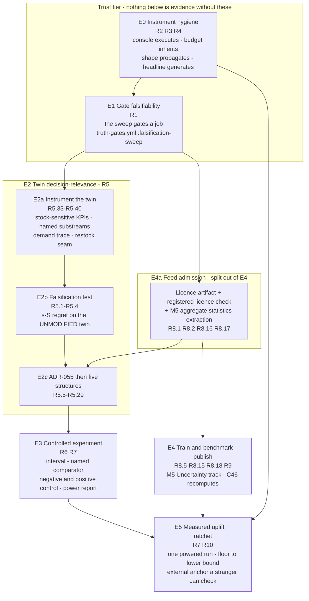

# Design Document

> **Decision Quality Proof — the architecture that makes the central claim measurable.**
> The requirements document is an evidence-grounded finding set with five open questions.
> This design is the mechanism that turns those findings into consequence. It adds almost
> no decision logic: its work is to make the instruments falsifiable, make the measured
> world one in which coordination can pay, prove the measuring device can see an effect,
> and only then take the measurement — on non-synthetic data, against a published
> external benchmark, with an externally verifiable audit trail.
>
> Design decisions continue the predecessor's numbering from **AD-15** (`purpose-achievement-audit/design.md`
> ends at AD-14). Correctness properties continue from **Property 38** (that design ends at
> Property 37). Conflicts continue from **CF-7** (that design records CF-1..CF-6).

## Overview

The requirements document's thesis is a sequence, and the sequence is the design:

> Make the instruments provably able to fail, make the simulated world one where
> intelligence can pay, prove the measuring device can detect an effect, and only then
> measure.

Five elements carry it. Each is named by what it makes *true*, not by what it builds.

| Element | Requirements | What it establishes | Primary locus |
|---|---|---|---|
| **E0** Instrument hygiene | R2, R3, R4 | the console's newest verification actually compiles and runs; the TypeScript example budget inherits a profile instead of mandating an I-0 violation; every workflow step either propagates or is honestly labelled; every published count is generated | `frontend.yml::quality`, `frontend.yml::spec-typecheck`, `truth-gates.yml::truth-gates` |
| **E1** Gate falsifiability | R1 | at least one declared mutation operator is probed against a real gate process in a step whose exit status gates a job, and every unprobed declaration is reported unproven | `truth-gates.yml::falsification-sweep` (NEW) |
| **E2** Twin decision-relevance | R5 | the measured KPI vector can see an inventory decision at all; the world contains structure a coordinating system can exploit; and the `(s, S)`-regret test that could falsify Finding 4 runs **before** any of that | `ci.yml::uplift-verify` (properties), `uplift.yml::uplift-proof` (measurements) |
| **E3** Controlled experiment | R6, R7 | the harness reports an interval, compares two named policies rather than one against a pool of four, and is shown able to see a known effect of known size before any null is interpreted | `uplift.yml::uplift-proof` |
| **E4** M5 ingest / train / publish | R8, R9 | a licence-gated non-synthetic feed, a trained checkpoint scored against a published leaderboard, and a registered check that recomputes rather than reads | `ci.yml::training-smoke`, external zero-cost GPU, `truth-gates.yml::truth-gates` |
| **E5** Measured uplift, ratchet, external anchor | R7, R10 | one powered, complete, in-bound measurement with its interval; a floor ratcheted to that interval's lower bound; and an audit chain a stranger can verify with no credential to this project | `uplift.yml::uplift-proof`, `publish-audit-anchor.yml` |

### What already exists versus what this design adds

The requirements document's most useful correction is that this project's apparatus is
larger than its subject. The design honours that by reusing rather than rebuilding.

| Concern | Already exists (reuse unchanged) | This design adds |
|---|---|---|
| Falsification harness | `scripts/audit/gate_fault_injection.py` — four-value `Outcome`, `--sweep`, `--gate`, `--operator`, `--timeout`, `--no-baseline`, `FaultInjectionReport` | one gating job, a committed cost budget, a shard aggregator, a baseline-suppression refusal |
| Mutation declaration | `infrastructure/quality/gate-mutations.yaml` — 14 gates, 16 operators, `reporting_tools`, `completeness` | one `is_proven_uplift` operator for C60 (R7.8) |
| Hypothesis budget | root `conftest.py` profiles (`dev`=10, `heavy`=100, `ci`/`default`=500, `nightly`=5000), selected by `HYPOTHESIS_PROFILE` | the fast-check analogue in `frontend/src/test/setup.ts`, resolved from the same variable |
| Console run record | `frontend/vitest.config.ts` `reporters: ["default","json"]` -> `artifacts/test-reports/vitest.json`, uploaded by `frontend.yml::quality` | a per-file executed-assertion reader with an `unavailable` state |
| Workflow shape | `scripts/audit/workflow_shape_truth.py` — four rules, `ADVISORY_MARKERS`, AD-12 bundle assertion | `terminal_discarding_construct`'s continuation-joined reading corrected; six unrecorded findings resolved |
| Generated documents | `scripts/audit/ledger_gen.py`, `scripts/audit/gate_surface.py`, markers owned by `gate_surface.py::GENERATED_BEGIN`/`GENERATED_END` | a `README.md` generated region projecting the **nested** execution (AD-21) |
| Twin engine | `digital_twin/simulation/engine.py::SupplyChainSimulation` — persistent env, `set_policy`, `inject_shock`, `inject_orders`, `add_stock` | stock-sensitive metrics, named substreams, a demand-path trace, five exploitable structures |
| Uplift harness | `uplift/harness.py` — `HarnessResult`, `ArmAggregate`, `canonical_arm_aggregates`, `arm_aggregates_digest`, `UpliftArtifact`, `UpliftProvenance`, `_pair_is_incomplete` | a versioned interval block, an explicit comparator, an Oracle_Arm, a Power_Report |
| Uplift floor | `uplift/uplift_floor.py` — `UPLIFT_FLOOR = 0.0`, `MIN_POWERED_REPLICATES = 1000`, `PoweredProof`, `is_proven_uplift`, `ratchet_to_measured` | the ratchet consumes the interval's lower bound, not the point estimate |
| Checkpoint truth | `scripts/audit/published_checkpoint_truth.py` — `assess` (four-valued `Outcome`, `Finding` list), `recompute_final_crps`, `compare_coverage`, `validate_entry`, `refused_local_candidates` | C46 re-pointed at `assess`; a held-out sidecar block; a coverage **recompute** |
| Audit chain | `packages/synapse_common/audit_chain.py::make_canonical_row` (untouched, byte-pinned), `orchestrator/audit/chain_walk.py::walk` (pure over `Sequence[ChainRow]`), `anchorer.select_head`/`scope_to_anchor`/`detect_rewrite` | an exported chain presentation, an offline verifier subcommand, a log coordinate on the anchor record |

### Binding constraints this design is written under

| Constraint | Where it bites |
|---|---|
| **I-0** local compute budget | Every measurement in this design is placed in a named workflow job. The falsification sweep copies the tree and spawns gate subprocesses (category 2/3); the twin sweeps and the powered harness are category 4; training is category 4. Nothing here is runnable on the dev box, and the design says so per component rather than in a blanket disclaimer. Property budgets inherit `conftest.py` profiles for Hypothesis and `fc.configureGlobal` for fast-check — **never** a hardcoded `max_examples` or `numRuns`. |
| **I-1** zero paid dependencies | No new paid API, SDK or host. The external transparency log must be free at one anchor per UTC day (R10.6); the M5 ingestion is a file read; training runs on free Colab/Kaggle GPU or CI (R8.15, and the runbook already records `$0`). Sigstore/Rekor adds no new dependency class — `cd.yml` and `cd-gcp.yml` already depend on public Sigstore for image signing. |
| **I-4** append-only audit | `make_canonical_row` is **not** touched. The anchor commits to `head_hash` only and is a file, not a row. The exported presentation is a read-path projection. The Rekor coordinate lands on `AnchorRecord`, never on a chain row. |
| **I-7** honest degradation | Every new gate has a distinct `unavailable` outcome that maps to SKIP and never to PASS (`verify_claims.py::GATE_STATUS`, `"unavailable": "SKIP"`). `indeterminate` and `not-applied` stay non-passing. An insensitive instrument reporting a null is reported inconclusive, not negative. |
| **Claims are mechanical** | Every threshold this design introduces — the `(s, S)` materiality margin, the utilisation ladder and its near-saturation band, the substitution fraction, the oracle tolerance, the negative-control repetition count and rate tolerance, the sweep's per-subprocess and per-job budgets, the CRPS/coverage allowances, the M5 minimum row count — is committed to a machine-read file and pinned by AD-3's `doc-number-pins.yaml` table. **AD-13 continues to bind, with one addition: an extractor is verified by running it** (see Cross-cutting concerns). |
| **Conventions** | `mypy --strict`, Pydantic v2 models with `ConfigDict(frozen=True)` for recorded facts, `structlog` never `print()` in library code (CLI entry points keep `verify_claims.py`'s print reporting), canonical `json.dumps(obj, sort_keys=True, separators=(',',':'))`, jittered retries from `synapse_common.retry`, `encoding='utf-8'` on every `read_text` (E-S13-07), ASCII-only console output. |

### Non-goals, carried unchanged

The requirements document's non-goals are binding on this design and are not restated in
full. Three bear directly on architecture and are repeated because a reader could
otherwise mistake them for gaps:

- **The 49 undeclared falsification operators stay undeclared.** E1 makes the gap
  mechanical and visible (R1.9, R1.10); it does not close it by invention.
- **No transparency log is built or operated, and no key material is introduced.** E5
  publishes to an existing log with keyless workflow identity.
- **The guarantee does not extend past the anchored head.** `anchorer.scope_to_anchor`'s
  exclusion of later appends is preserved; the anchor is not the walk.

---

## Architecture

### The five elements and their dependency order



### Why this order is evidential, edge by edge

Each edge below is an edge because the *evidence* upstream is a precondition of the
*meaning* downstream. None of them is a convenience or a build-order preference, and
each is stated so a reader can reject it on its own terms.

**E0 -> E1.** The sweep is a new gating job, so it is new workflow surface, and C64's
verdict is the disjunction of four rules (`workflow_shape_truth.py::_RULES`) over the
whole of `.github/workflows/`. C64 is a live `FAIL` at `unlabelled-advisory=10`. Adding
a gating job to an already-red shape gate makes the new job's own shape unattributable:
you cannot tell a finding the sweep introduced from one of the nine already there. The
same holds for the declaration — `required_checks_truth` resolves declared job names
against the workflow tree, so R1.14's entry and the job must land together (see
*same-commit declaration coupling*), and that mechanism has to be green before it is
extended. E0 before E1 is not "tidy up first"; it is "make the next finding legible".

**E1 -> everything.** This is the requirements document's own first dependency item and
it is the cheapest correctable cause in the repository. A number reported by a gate never
shown able to fail is not evidence about the number; it is evidence that a process ran.
E1's completion condition is **not** an all-green sweep — the requirements state the
honest expectation before the run: at most 8 of the 14 declared checks are probeable on
this tree, and C28's `zero-a-floor` is disclosed as a survivor, so **the first gating run
is expected red**. E1 is complete when the sweep's exit status gates a job and every
non-`falsified` outcome is attributed to a check and an operator. A survivor is then a
defect against that check, which is a finding the project can act on rather than a
condition it cannot see.

**E1 -> E4a, and E4a -> E2c. This is a conflict with the requirements' stated dependency
order, recorded as CF-7 rather than resolved silently.** R5.11 requires the
demand-intensity shape to be "calibrated from statistics derived from the Real_Data_Feed
rather than from invented literals", and R5.12 commits those parameters to a policy file.
But Dependency-order item 4 reads "R8 precedes R9" and places R8 *after* R5, and the
traceability table places blueprint task 6 (non-stationary demand) before task 13 (ingest
M5). Structure 1 therefore cannot be built in the order the document states. The design
splits R8's first four criteria out as **E4a** — the licence artifact, the registered
licence check, the first-ingestion reporting rule and the ingestion record — and makes
E4a a predecessor of E2c only. The training and benchmarking half (R8.5-R8.15, R8.18)
stays in E4 and keeps its stated position. No criterion is deferred and none is
re-ordered against its own text; what changes is that R8 is recognised as two
independently sequenced obligations rather than one.

**E2a -> E2b, and this is the edge the requirements document argues hardest for.** R5.1
is the falsification test for Finding 4, and Finding 4 is *analytical, not measured*. The
temptation is to run R5.1 immediately, on the unmodified twin, with no new instrument —
that is what "unmodified" appears to license. It would produce approximately zero, and
the zero would be an instrumentation artefact rather than a measurement: `_delivery`
increments `orders_delivered` unconditionally before clamping inventory at zero
(`digital_twin/simulation/engine.py::SupplyChainSimulation._delivery`), so no KPI in the
six-field vector sees a stockout; there is no scalar objective to compute regret against
(`uplift/metric_contract.yaml` declares per-KPI hypothesis tests and
`MetricContract.classify` returns a three-valued `Outcome`, not a cost); there is no
demand path to foresee (`_delivery` picks the depleting SKU by `self._rng.choice(...)`
*after* delivery, so demand never names a SKU); and there is no on-hand-inventory
integral (`SimulationMetrics` carries six counters and no inventory-time term). Running
R5.1 before E2a would confirm Finding 4 with a null produced by an instrument that cannot
see its subject, which is the precise failure mode R5.35 exists to forbid. E2a is
therefore *not* scope creep: it is the difference between a measurement and an artefact.
E2b still runs on the **unmodified** world — E2a changes the instrument, not the physics
(see AD-17 and AD-18 for how that separation is kept honest and mechanically checkable).

**E2b -> E2c.** If regret is already materially positive on the unmodified twin, Finding
4 is falsified and R5's remaining scope shrinks substantially (R5.3, R5.4). Building the
five structures first would spend the project's largest single block of work on a premise
it had declined to test. This edge is what makes R5 falsifiable rather than aesthetic.

**E2c -> E3.** An instrument validated on a world with no exploitable structure has been
validated against nothing. Concretely: E3's positive control (R6.2) requires "a
known-exploitable structure present in the World_Twin" for an Oracle_Arm to play the
analytically optimal policy *for*. Under stationary Poisson demand with independent
identical items and i.i.d. lead times, the analytically optimal policy **is**
`Par_Level_Reorder` — so the oracle and the baseline would be the same policy and the
positive control would degenerate into the negative control. E2c is what gives the
positive control a subject.

**E3 -> E5.** R6.7: while no Power_Report exists describing the harness revision under
measurement, no headline uplift may be published. This is the one edge the requirements
document says the spec was written to enforce. An unpowered null is not evidence of
absence, and a Power_Report describing a superseded revision does not license
publication — which makes the edge a *revision* dependency, not merely a task ordering.

**E4a -> E4 -> E5.** A checkpoint published before it is trained on non-synthetic data
and scored against an external benchmark has no demonstrable value; the same artifact
published afterwards is measurable. And E4's publication is what removes
`FALLBACK_CONFIDENCE` from the consensus arm's forecast path
(`agents/demand_prophet/inference/pipeline.py` sets `confidence = FALLBACK_CONFIDENCE`
when no calibrated model resolves), so an uplift number measured before publication is a
measurement of the degraded path.

**E0 -> E5 (the anchor half).** R10 is independent of the measurement chain, with the
third qualification the requirements record: `publish-audit-anchor.yml` is declared in
neither `blocking-steps.yaml` nor `required-checks.yaml`, so adding steps under R10
widens C64's blind spot unless the declaration moves in the same commit (R10.11). The
anchor work therefore inherits E0's shape discipline even though it inherits nothing else.

### Element -> requirement -> execution locus

| Element | Requirements | New/changed CI jobs | Existing jobs extended |
|---|---|---|---|
| **E0** | R2, R3, R4 | none | `frontend.yml::quality`, `frontend.yml::spec-typecheck`, `frontend.yml::fe-invariants`, `truth-gates.yml::truth-gates`, `ci.yml::uplift-verify` |
| **E1** | R1 | `truth-gates.yml::falsification-sweep` | `truth-gates.yml::truth-gates` (C72 row projection) |
| **E2** | R5 | `uplift.yml::twin-regret` (measurement), `uplift.yml::twin-ladder` (utilisation ladder) | `ci.yml::uplift-verify` slow step (property loci), `digital_twin/tests` already on that step's path list |
| **E3** | R6, R7 | `uplift.yml::uplift-controls` (negative + positive control, power sweep) | `uplift.yml::uplift-proof` |
| **E4** | R8, R9 | `ci.yml::m5-ingest` (licence + statistics), external GPU run recorded | `ci.yml::training-smoke`, `truth-gates.yml::truth-gates` |
| **E5** | R7, R10 | `publish-audit-anchor.yml::anchor` gains publication; `integration.yml::chain-export` (has Postgres) | `uplift.yml::uplift-proof` |

Every job named above is added to `infrastructure/quality/required-checks.yaml` and, where
it carries a step whose exit status is load-bearing, to
`infrastructure/quality/blocking-steps.yaml`, **in the commit that creates it**. See
*same-commit declaration coupling*.

---

## The eight resolutions

Each resolution states the verified fact with a `file:symbol` citation, the decision, and
the cost the decision accepts. Where a fact could not be established by static reading,
the resolution says so.

### AD-15 — The interval is a versioned, digest-neutral addition to `UpliftArtifact`

**Verified.** No interval exists anywhere in `uplift/`. `UpliftArtifact`
(`uplift/harness.py::UpliftArtifact`) carries `headline_uplift: float` and
`model_config = ConfigDict(frozen=True, extra="forbid")`. Its canonical form is
`to_canonical_json()` -> `canonical_json(self.to_payload())`, and
`tests/uplift/test_uplift_artifact_canonical_roundtrip_property.py` asserts byte identity
across two independent constructions, re-derives the canonical form with a plain
`json.dumps(obj, sort_keys=True, separators=(',',':'))` rather than calling
`uplift.harness.canonical_json`, recomputes the digest with `hashlib` independently, and
enumerates rejection cases that include "an unknown fidelity field", "an unknown
provenance field" and "a restated `arm_aggregates_digest`". The digest itself is
`arm_aggregates_digest(aggregates)` = SHA-256 over `canonical_arm_aggregates`, which
serialises **only** the `ArmAggregate` sequence.

**Decision.** Add a frozen `ArtifactInterval` sub-model and a top-level
`schema_version: int` to `UpliftArtifact`, in one commit with the round-trip test's
expected-key set:

```python
class ArtifactInterval(BaseModel):
    """The two-sided interval on the headline uplift at ``1 - alpha`` (R6.13, R7.14)."""
    model_config = ConfigDict(frozen=True, extra="forbid")

    method: Literal["bca_bootstrap", "percentile_bootstrap"]
    alpha: float                 # read from the Metric_Contract, never inlined
    resamples: int = Field(ge=1)
    seed: int                    # the resampling seed, so the interval replays
    low: float
    high: float
    point: float                 # equals UpliftArtifact.headline_uplift; pinned, not duplicated logic
```

Three properties of the decision make it affordable:

1. **The digest does not move.** `arm_aggregates_digest` covers `canonical_arm_aggregates`
   only, so an interval block leaves it byte-identical. The cross-process determinism
   property (predecessor Property 15) compares that digest and therefore does not need to
   change. This is the single reason the interval is a tractable schema change rather than
   a chain-rewrite-shaped one.
2. **`schema_version` is what makes the change versioned rather than silent.** Absent, a
   reader of two artifacts cannot tell an interval-less run from a run whose interval
   estimation failed. `UpliftArtifact.from_canonical_json` accepts `schema_version: 1`
   payloads with `interval: null` and refuses to report them proof-grade for the interval
   clause; `schema_version: 2` requires the block for a completed powered run.
   `unavailable_reasons` gains one entry naming the absence, so an artifact can still
   state honestly that its interval could not be estimated (I-7).
3. **`extra="forbid"` is preserved, and that is the point.** The rejection cases in the
   round-trip property become *more* discriminating, not less: an unknown key inside
   `interval` is a rejection.

**The cost, stated.** `PoweredProof.from_payload` (`uplift/uplift_floor.py`) reads
`headline_uplift`, `incomplete`, a top-level `replicates_per_arm` and
`fidelity.within_fidelity_bound`. Extending it to read the interval's lower bound (AD-16's
sibling concern, and R7.12's ratchet) means the floor's admission predicate changes shape,
so `tests/uplift/test_uplift_floor_data_gate.py` and
`tests/uplift/test_uplift_floor_monotonic_ratchet_property.py` move in the same commit.
And every committed artifact fixture in `tests/uplift/` gains a `schema_version`. That is
a wide but shallow edit, and it is the honest price of putting an interval inside a
byte-pinned model rather than beside it in a second file — which was the alternative, and
was rejected because a second file is a second thing to keep in sync and the requirements
document's own PRESERVE section records that lesson about the ledger.

### AD-16 — The comparator is explicit; pooling is opt-in, not default

**Verified.** `uplift/harness.py::_resolve_baseline_arms` returns `[baseline_arm]` when one
is named and otherwise `[arm for arm in harness_result.arm_names if arm != consensus_arm]`
— **every** non-consensus arm, pooled into one baseline distribution per
`(scenario, KPI)` by `_pooled_samples`. Its docstring defends the pooling as "a defensible
aggregation representing 'the transparent operator without SYNAPSE' as a whole". `uplift/cli.py::main`
never passes `baseline_arm=`, and `cli.py::build_arms` returns five arms.
`_pair_is_incomplete` marks a pair incomplete when any replicate failed, and
`_run_is_incomplete` lifts that to the run.

**The consequence for E3.** An Oracle_Arm added to the arm list is silently absorbed into
the baseline pool, so the positive control would compare consensus against a pool
containing the oracle. Worse, one failed oracle replicate marks the run incomplete and
drives C60 to `EXIT_UNAVAILABLE` — the oracle would be able to break the *consensus*
verdict without being the subject of it. The negative control has the mirror defect: a
`Par_Level_Reorder` copy of the consensus arm still compares one policy against a pool of
four, so R6.1's premise fails before the run starts.

**Decision.** Do not change `_resolve_baseline_arms`' behaviour. Change its *reachability*:

- `assemble_uplift_result(..., consensus_arm=..., baseline_arm=...)` already supports the
  two-policy contrast. Add a `ControlSpec` to the CLI that names both arms explicitly, and
  make `uplift.cli` require one of `--pooled-baseline` or `--baseline-arm NAME` for any
  run whose arm set is not exactly the five `build_arms` returns. A run with an
  unrecognised arm and no explicit comparator is a `ValueError`, not a pooled default.
- Add `arm_role: Literal["consensus", "baseline", "oracle", "excluded"]` to the arm
  registration, and make `_resolve_baseline_arms` refuse to pool an arm whose role is
  `oracle` or `excluded`. The pooled default then means "every arm declared a baseline",
  which is what the docstring already claims it means.
- Scope incompleteness by contrast. `_run_is_incomplete` becomes
  `_contrast_is_incomplete(harness_result, consensus_arm, baseline_arms)`, so a failed
  oracle replicate marks the *oracle* contrast incomplete and leaves the consensus
  contrast's verdict alone. The existing whole-run predicate is retained and reported, but
  the C60 verdict reads the consensus contrast.

**The cost, stated.** `MetricContract.classify` is strictly two-sample and
`decision_rule` is validated by string equality against
`significant_and_favorable_and_meets_mde`, so running a second contrast in one job means
**two independent classifications, which is a multiplicity problem**. Any multiplicity
correction is a `metric_contract.yaml` version bump, and R3.9's analogue for that file
requires the new contract to be committed before results generated under it are reported.
This design does **not** apply a correction: it keeps the oracle contrast in a separate
job (`uplift.yml::uplift-controls`) with its own artifact, so the two contrasts are never
classified under one contract instance. That is the cheaper honest option, and the
tradeoff it accepts is that the oracle contrast's artifact is not admissible to C60 —
which is correct, because C60's subject is consensus.

### AD-17 — A stockout costs something, and the KPI change is separated from the physics change

**Verified.** `digital_twin/simulation/engine.py::SupplyChainSimulation._delivery`
executes `self._metrics.orders_delivered += 1` and
`self._metrics.total_delivery_time_min += travel_time` **unconditionally**, then
`if self._inventory: sku = self._rng.choice(list(self._inventory.keys()));
self._inventory[sku] = max(0.0, self._inventory[sku] - 1.0)`.
`uplift/kpi.py::KpiExtractor.extract` derives
`fill_rate = _clamp_fraction(orders_delivered / max(1, orders_created))` and
`co2_estimate = delivered_volume * emission_factor` with `delivered_volume` defaulting to
`orders_delivered`. `SimulationMetrics.spoilage_rate` is `orders_spoiled / orders_created`,
and `_spoilage` increments `orders_spoiled` once per SKU per 10-minute tick against a
fixed decay, reading neither inventory nor order size. `avg_delivery_time_min` divides by
`orders_delivered`. So **all six KPI fields are blind to stock availability**, and
`stockout_rate`'s numerator is supplied by the harness, not the twin: `uplift/kpi.py`
documents `unmet_demand_events` as "incremented whenever a delivery draws a SKU already at
zero inventory", while `uplift/harness.py` increments
`sum(1 for level in sim.inventory.values() if level <= 0.0)` **once per step** — a
per-step count of SKUs at zero whose numerator scales with `n_steps * |SKU|` before
`_clamp_fraction` saturates it.

**Decision.** Three changes, deliberately minimal and deliberately separable:

1. **`_delivery` becomes stock-conditional** (R5.38). The SKU is drawn first; if its level
   is zero the event increments a new `SimulationMetrics.unmet_demand_events` and returns
   without touching `orders_delivered` or `total_delivery_time_min`. This resolves the
   documented-versus-implemented contradiction in favour of `uplift/kpi.py`'s docstring and
   in favour of `digital_twin/world/runtime.py`'s claim that with auto-restock disabled
   "stock genuinely runs out and `fill_rate` falls" (R5.38's stated decision).
2. **The stockout numerator moves into the twin.** `uplift/harness.py`'s per-step
   `sum(...)` is deleted and `AppliedDecisions.unmet_demand_events` is populated from
   `SimulationMetrics.unmet_demand_events`. `stockout_rate` then measures unmet demand
   events over demand events, which is what `uplift/kpi.py` already documents.
   `spoilage_rate`'s change of meaning under R5.25/R5.26 is stated in ADR-055 rather than
   absorbed, per the requirements' explicit note.
3. **A time-weighted on-hand integral** (R5.40).
   `SimulationMetrics.inventory_minutes: float` accumulates
   `sum(levels) * dt` on each `advance` boundary and each mutation, exposed as
   `avg_on_hand_units = inventory_minutes / max(1.0, sim_time_min)`. This is the third
   single-objective policy's KPI in R5.28 and the holding term in R5.33's objective.

**The separation that makes E2b honest.** Change 1 alters what the world *records*, not
what it *does* — no timeout changes, no draw is added or removed on the delivered path,
and the RNG consumption order is unchanged because the SKU draw already happened at that
point in `_delivery`. Change 3 is pure accounting. So the twin's *dynamics* are
untouched, and "the unmodified twin" in R5.1 means "the twin with E2a's instrumentation
and none of E2c's structures". That claim is made mechanically checkable rather than
asserted: a property asserts that for any seed, the sequence of
`(sim_time_min, inventory, orders_created)` triples produced by the instrumented engine
equals the sequence produced by the pre-change engine on the same seed, with
`orders_delivered` differing only on events whose drawn SKU was at zero. **This is the
load-bearing check of AD-17 and it is Property 49's second clause.**

**The cost, stated.** `fill_rate` falls on the unmodified twin the moment change 1 lands,
so every committed expectation that reads `orders_delivered` or `fill_rate` moves.
`digital_twin/tests/test_world_runtime.py::test_demand_depletes_inventory_and_auto_restock_is_disabled`
is the test whose intent this *repairs*; `test_good_action_beats_bad_over_seeds` and
`test_run_produces_valid_metrics` carry numeric expectations that move. R5.31 requires
each to be updated in the same change with its new expectation stated, and this design
does not pretend the list is short. What it does refuse is the alternative — leaving
`_delivery` unconditional and deriving stockouts harness-side — because that is the
current state, and the current state is a KPI vector that cannot see its subject.

### AD-18 — Foresight is a recorded trace, not a re-derivation, and the comparator disables the twin's own `(s, S)`

**Verified, two facts.** First, `uplift/harness.py::_build_twin` calls `sim.start()` with
no arguments. `start()` therefore installs `{f"sku_{i}": 100.0 for i in range(10)}` and
`env.process(self._restock(env))`, and `_restock` runs with `self._restock_threshold`
at its constructor default `50.0`, restocking `200.0 * self._order_qty_mult` after a
`self._rng.uniform(30.0, 120.0) * self._lead_time_mult` lead time.
`digital_twin/world/runtime.py` sets `set_policy(restock_threshold=0.0)` precisely to
disable that loop, and `set_policy` clamps with `max(0.0, ...)` so `0.0` is reachable and
`if level < safety_stock` is then false for every clamped-non-negative level. So through
the harness, a compared `(s, S)` policy is measured **stacked on top of the twin's own
`(s, S)`**, biasing regret toward zero independently of whether the world is easy.

Second, and more consequential: **the engine has exactly one RNG.** `self._rng =
np.random.default_rng(seed)` is consumed by `_order_arrival`, `_pick_pack_dispatch`,
`_delivery` (three draws: `uniform`, `normal`, and `random()` under shock), `_restock`
and the SKU `choice`. The realised demand path is therefore a function of the *global
draw order across all five processes*, and `DecisionPolicy.decide(obs)` sees only present
state while `_order_arrival` exposes no arrival trace. The only exogenous-demand seam,
`start(external_demand=True)` + `inject_orders(n)`, takes a bare count and **replaces**
the demand process, so using it is not the unmodified twin.

**Decision, three parts.**

1. **`_build_twin` disables the endogenous restock and records the configuration**
   (R5.36). One line after `sim.start()`:
   `sim.set_policy(restock_threshold=_comparator_restock_threshold())`, where the value is
   read from the R5.12 policy file, and the resolved value is written into
   `UpliftProvenance` so the artifact records the configuration the regret was measured
   under. A run whose recorded threshold differs from the committed one is inadmissible.
2. **Named RNG substreams** (`np.random.SeedSequence(seed).spawn(n)`), one per process:
   `demand`, `pick_pack`, `travel`, `restock`, `spoilage`, `sku_choice`. This is the
   change that makes E2c *possible*: without it, adding a queue in structure 2 perturbs
   the demand stream, and every seeded expectation in the PRESERVE list breaks for a
   reason unrelated to the structure being added. With it,
   `tests/uplift/test_seeded_demand_identity_property.py::test_arms_receive_identical_seeded_demand`
   becomes *stronger* — the demand substream is provably independent of any arm's actions
   — which is the clearest argument that this is the right seam.
3. **The demand path is a recorded trace, not a replay of the generator** (R5.37).
   `DemandTrace` accumulates `(t_min, sku, units)` events as they are generated and is
   emitted per scenario. A perfect-foresight policy is constructed *from a completed
   trace*, and the comparator run is a two-pass protocol: pass one runs the twin with a
   no-op policy at seed `s` and records the trace; pass two replays the same seed with the
   foresight policy reading the pass-one trace. Substreams are what make pass two's demand
   identical to pass one's despite a different policy consuming different draws elsewhere.

**The cost, stated.** Substreams change every realised number on the seeded path, so
`digital_twin/tests/test_simulation.py::TestSimPyEngine::test_run_deterministic_with_seed`
still passes (it asserts two runs at one seed agree, which substreams preserve) while
`test_longer_run_more_orders` and `TestMonteCarlo::test_shock_params_affect_output`
survive only if their assertions are genuinely comparative — which static reading suggests
but **did not confirm**; the assertion bodies were not read. R5.31 covers the repair, and
the honest statement is that the substream change is the single largest expected-value
churn in this design. The two-pass protocol also doubles the twin cost of every
comparator replicate, which is why R5.32 places the run in CI and why the regret
measurement gets its own job rather than sharing `uplift-proof`'s 350-minute budget.

### AD-19 — C46 is re-pointed at `assess`, and the four-value outcome is what closes the hole

**Verified.** `scripts/audit/verify_claims.py::check_published_checkpoint` (registered at
`@register("C46", ...)`) imports
`from scripts.audit.published_checkpoint_truth import evaluate as _eval_pub`, calls
`probe = _eval_pub()` and maps `GATE_STATUS[probe.status]`. `published_checkpoint_truth.evaluate`
ends:

```python
crps = recompute_final_crps(sidecar, active.tolerances.final_crps,
                            recorded=_finite(entry.get(...)))
if crps.outcome is Outcome.FAIL:
    return PublishProbe(status="fail", detail=crps.detail)
return PublishProbe(status="ok", detail=...)
```

`Outcome.UNAVAILABLE` therefore falls through to `ok`. `evaluate` also never calls
`validate_entry`, so an entry with no `final_crps` yields `recorded=None` ->
`UNAVAILABLE` -> PASS. And `compare_coverage(sidecar, floor)` **reads**
`calibrator.last_coverage_p90` through `_read_dotted` at the path
`checkpoint-truth.yaml::floors.coverage_p90.sidecar_path` — the only recompute in the
module is `recompute_final_crps`. `evaluate`'s own docstring records the deferral:
"Re-pointing C46 at :func:`assess` is task 12.1's call."

**Decision.** Re-point C46 at `assess`, which already returns a `CheckpointTruthReport`
whose `outcome` is a four-valued `Outcome` and whose `findings` name their clause and
requirement. The status map becomes
`{PASS: "pass", FAIL: "fail", SKIP: "skip", UNAVAILABLE: "unavailable"}` into
`GATE_STATUS`, where `"unavailable"` maps to `SKIP` — a non-passing status that is
excluded from the published PASS count and is never a pass (I-7). Then add the coverage
recompute (R8.9, R9.13): `recompute_coverage_p90(sidecar, floor)` computes empirical
coverage from the published sidecar's held-out actuals against the published
conformal-adjusted `lower_90`/`upper_90` bounds over at least the committed minimum row
count, returning `UNAVAILABLE` when the `heldout` block is absent or shorter than that
minimum.

**Why the fourth state is the whole fix.** `PublishProbe.status` is
`"ok" | "fail" | "skip"`. A three-valued vocabulary cannot distinguish "the sidecar
carries no held-out block, so nothing was recomputed" from "the subject is absent" — and
`evaluate` resolves the ambiguity in the direction I-7 forbids. `assess`'s
`Outcome.UNAVAILABLE` is the state that already exists for exactly this, and
`verify_claims.py::GATE_STATUS` already carries the key. The hole is not a missing
mechanism; it is a registered surface that does not reach the mechanism.

**The cost, stated.** `assess` is strictly stricter than `evaluate`: it refuses an
`indeterminate` artifact, folds a smoke *version prefix* into the smoke rule where
`evaluate` uses the sidecar flag alone, and adds the two policy-pin clauses
(`source.zero_cost` true, `source.allow_local_substitution` false). `evaluate`'s docstring
records that folding the version-prefix rule into `evaluate` "would change this probe's
long-pinned verdict". So `tests/verify/test_published_checkpoint_gate_property.py`, which
pins `evaluate`, must be re-pointed in the same commit, and C46's row will read differently
from its long-pinned form. That is the intended consequence: the current row is
`DP_HF_REPO unset - no published model claimed (operator step)` and is a SKIP, so
re-pointing cannot lose a real PASS today. **`evaluate` is retained**, not deleted — it is
the legacy triad's surface and other callers may exist that static reading did not
enumerate.

**One correction to carry out of this spec, not into it.**
`docs/runbooks/train-and-publish-checkpoint.md` calls this gate **C43** in five places;
C43 is "All 8 agents expose POST /a2a for consensus". Correct the runbook.

### AD-20 — The anchor publishes in the run that produced it, and a third party is handed an export

**Verified, two independent defects in `.github/workflows/publish-audit-anchor.yml`.**

*The unreachable publication path.* The `anchor` job is
`if: github.event_name == 'schedule' || github.event_name == 'workflow_dispatch'`; the
`publish` job is `if: github.event_name == 'push' || github.event_name == 'workflow_dispatch'`;
and **there is no `needs:` anywhere in the file**. On `workflow_dispatch` both run
concurrently, and `publish`'s `git diff --name-only HEAD~1 HEAD --
'infrastructure/audit_anchors/*.json'` cannot see an anchor `anchor` has not committed
yet, so `files=` is emitted empty and every signing step is skipped on a job that reports
green. The file discloses the other half itself: the `anchor` job pushes with
`GITHUB_TOKEN` "and GitHub does not trigger workflows from such a push", so a scheduled
anchor is signed only on the next push to `main` touching that directory. Only a human
hand-commit reaches the signing steps.

*No exported chain presentation exists.* `orchestrator/audit/cli.py::build_parser`'s
`verify` subcommand accepts exactly `--dsn`, `--since`, `--max-rows`, `--timeout` and
`--head`. There is no way to hand it a row set, so a third party would need live
credentials to this project's Postgres — worse than the trust assumption R10 exists to
remove. The pieces for an offline verifier are all present and pure:
`orchestrator/audit/chain_walk.py::walk(rows, *, boundary, recorded_head, max_rows,
max_wall_clock_seconds, clock)` is a pure function over `Sequence[ChainRow]`, `ChainRow`
carries `row_id`, `created_at`, `prev_hash`, `current_hash` and `canonical`, and
`anchorer.select_head` / `scope_to_anchor` / `detect_rewrite` are pure over the same
sequence.

**Decision, three parts.**

1. **`publish` gains `needs: anchor` and an `if:` that admits the dispatch and schedule
   paths** (R10.9). The anchor is signed and its log coordinate recorded in the run that
   produced it. `publish` no longer diffs `HEAD~1 HEAD`: `anchor` emits the written
   anchor's path as a job output, and `publish` signs exactly that. The `push` trigger is
   retained for anchors that landed by hand, and on that event `anchor` is skipped and the
   diff path is used — so the two modes are explicit rather than accidental.
2. **A `ChainPresentation` export and an offline `verify-export` subcommand** (R10.3). A
   new `integration.yml::chain-export` job (that workflow has Postgres) reads the ordered
   snapshot, scopes it to the anchored head with `scope_to_anchor`, and writes a canonical
   presentation. `orchestrator/audit/cli.py` gains `verify-export --presentation PATH
   --anchor PATH --log-proof PATH --bounds PATH`, which constructs `ChainRow` values from
   the export and calls the **same** `chain_walk.walk` the DSN path calls — one walker, as
   `cli.py`'s own docstring insists ("never reimplemented and never modified"). Its
   verdict vocabulary is the committed three values: `chain-intact`, `chain-rewritten`,
   `chain-unverifiable`.
3. **The log coordinate lands on `AnchorRecord`** (R10.8): `log_entry_id: str | None` and
   `log_inclusion_proof: str | None`, both nullable so `AnchorRecord.from_payload` keeps
   reading anchors published before the fields existed. Refusing to read an older anchor
   would destroy evidence, which is why the nullability is a requirement and not a
   convenience. E-S9-03's compact canonical bytes are preserved: `to_json` still emits
   compact canonical JSON with no trailing newline, and `anchor_truth.py`'s
   `non-canonical-anchor` rule still fails bytes that are not.

**The cost, and one disclosure decision that is the operator's.** `ChainRow.canonical` is
the output of `make_canonical_row`, whose fields are `decision_id`, `tier`,
`selected_action`, `pareto_weights`, `confidence`, `proposals` and `audit_trace`. A
presentation carrying those fields verbatim is what makes a `PAYLOAD` break independently
detectable — a presentation carrying only `prev_hash`/`current_hash` lets a verifier check
`LINKAGE` and `HEAD_UNREACHABLE` and **not** whether a row's content was altered, which is
most of what R10 is for. R10.3 has already decided the shape ("the linkage hashes **and**
the hashed content fields"), so the design exports the canonical rows. **The consequence
is that publishing the presentation publishes operational decision content.** This design
does not resolve that: the export is produced as a workflow artifact with a retention
period, and whether it is attached to a public release is recorded as an operator
decision alongside OQ-4. Whether these rows contain anything a policy would classify as
restricted could not be established statically and must not be assumed either way.

`walk`'s bounds also carry into the offline path: `max_rows: 5000000` and
`max_wall_clock_seconds: 900` are read from `audit-chain-bounds.yaml`, and a presentation
larger than the bound is `not_verified` naming the bound rather than a truncated walk.
`chain_walk.py` convention 5 — `HEAD_UNREACHABLE` is reachability, not final position — is
preserved verbatim, because redefining the recorded head as "final position" would make
`scope_to_anchor` report `reachable=True` on a truncated presentation and void R10.3
silently.

**Unverified.** Whether `cosign sign-blob` as invoked (`--yes --output-signature
--output-certificate`, cosign v2.4.0) already uploads to Rekor and whether a
`--bundle` output is required to capture the inclusion proof are properties of an external
tool, not of this tree, and were **not** verified. The design states the obligation
(record an entry identifier and an inclusion proof) and leaves the exact flag to the
implementing task, which must confirm it against the pinned cosign release.

### AD-21 — The README region projects the nested execution, through the same function the gate compares against

**Verified.** `scripts/audit/doc_truth.py::_claim_readme_headline_counts` selects the
README line via `_readme_headline_line` (a candidate must match
`_VERIFY_CLAIMS_MENTION = re.compile(r"verify[-_]claims", re.IGNORECASE)` and carry at
least one extractable count; the richest line wins), then calls `_suite_counts()`, which
runs `[sys.executable, "-m", "scripts.audit.verify_claims", "--json"]` with
`env[_NESTED_ENV] = "1"` where `_NESTED_ENV = "SYNAPSE_DOC_TRUTH_NESTED"`, bounded by
`_SUITE_TIMEOUT_S = 900.0`. Under that flag the nested `_claim_readme_headline_counts`
returns `skip`, and because the claim is `required=True` the nested `doc_truth` aggregate
is `unavailable` -> `GATE_STATUS["unavailable"] = "SKIP"` -> nested **C56 is SKIP**.
Meanwhile `scripts/audit/ledger_gen.py::render_region` renders
`f"`README.md` headline counts, from this same execution (R10.9): **{headline}**"` from
`verdict.counts`, the **top-level** verdict, in which C56 is PASS. Hence
`README.md:24`'s 51/3/0/10/64 and `docs/state/CURRENT.md:119`'s 52/3/0/9/64 are two
different executions, and `README.md:26` discloses the asymmetry in prose.

**Decision.** Promote `_suite_counts` to a public `nested_suite_counts() ->
tuple[NestedVerdict | None, str]` returning the parsed `--json` payload — which carries
both `summary` and `checks` (`verify_claims.run`'s payload is
`{"summary": {...}, "checks": [r.__dict__ for r in results]}`) — and have a new
`scripts/audit/readme_gen.py` render the README's generated region from **that** value.
One execution semantics, one implementation, no second model of the guard.

The rejected alternative is worth naming because it is the tempting one: derive the nested
counts from the top-level verdict by applying the guard's known one-check delta. It is
**unsound**, not merely inelegant. The delta is not a fixed `+1 PASS / -1 SKIP`: it is
`+1 <top-level C56 status> / -1 SKIP`, and at the moment `--write` runs, the README has
not yet been updated, so top-level C56 is FAIL. The compensation would be computed from a
status the write is about to change. That is a model of a mechanism compared against
itself, which is the exact class of defect the predecessor spec's RC-3 removed.

**Two constraints the generated text must satisfy, both mechanically checked.**

- The counts line must keep matching `verify[-_]claims`, or `_readme_headline_line`
  returns `None` and C56 **skips** — a generated headline that dropped the phrase would
  silently disable the gate it exists to serve. `readme_gen` asserts the rendered line
  matches `doc_truth._VERIFY_CLAIMS_MENTION`, importing the pattern rather than restating
  it.
- R4.8's compensation sentence must not out-rank the counts line. `_readme_headline_line`
  picks the candidate with the most extractable counts, and `_extract_count` requires a
  digit adjacent to the category word (`(\d+)\s*PASS` or `PASS\s*[=:]\s*(\d+)`). The
  compensation is therefore rendered in words ("one more PASS and one fewer SKIP"), never
  with digits, and `readme_gen` asserts that the counts line is the unique richest
  candidate in the document it just wrote.

**Marker discipline, reused not reinvented.** `readme_gen` imports `GENERATED_BEGIN` /
`GENERATED_END` from `scripts/audit/gate_surface.py` and reuses `ledger_gen`'s
`_standalone_marker_offsets` -> `generated_region_bounds`: a marker delimits only when it
owns its line; there must be exactly one of each with begin before end or
`LedgerMarkersError` -> `unavailable` -> exit 2 with the document left byte-identical
(R4.11); `--check` is the default and diffs at exit 1; `--write` never creates the
document; every byte outside the region survives, including prose that quotes the markers
(R4.5).

**The cost, stated.** `readme_gen --check` now spawns a 900s-bounded `verify_claims`
subprocess, so `truth-gates.yml::truth-gates` runs the full registry suite **twice** — once
in `doc_truth --check` and once here. The job's `timeout-minutes: 25` was set for a
single pass. Two mitigations are available and the design takes the first: `readme_gen`
accepts `--counts-json PATH` and the workflow passes the payload `doc_truth` already
produced, so one nested execution serves both steps. That makes the two steps ordered
(`doc_truth` before `readme_gen`) and the ordering load-bearing, which is recorded in
`blocking-steps.yaml` alongside the step names.

**Already discharged, retained as regression pins.** R4.6 and R4.7 are satisfied today:
every `doc_truth` claim carries `required`, and a required claim that cannot be evaluated
forces the aggregate to `unavailable` with exit 2 regardless of how many siblings report
`ok`. The owning obligation is `purpose-achievement-audit` R1.4/R1.6. Nothing in E0
re-implements them.

### AD-22 — The sweep is one job in `truth-gates.yml`, with a committed cost budget

**Verified.** `scripts/audit/gate_fault_injection.py` exposes `--sweep`, `--gate CID`,
`--operator ID`, `--timeout` (default `DEFAULT_TIMEOUT_S: Final[float] = 900.0`) and
`--no-baseline`. `infrastructure/quality/gate-mutations.yaml` declares
`completeness.declared_gates: 14` over a `gates:` mapping keyed by check id, with 16
operators (C44 and C56 declare two each). A complete sweep therefore spawns
14 baseline + 16 operator = **30 gate subprocesses**. `ci.yml::uplift-verify` — the host
the sweep's own docstring names ("belongs to `ci.yml::uplift-verify`") — carries
`timeout-minutes: 60` and already runs two pytest steps. `30 * 900s = 7.5h` exceeds that
bound by an order of magnitude. No duration was measured; the arithmetic is over committed
bounds only.

**The trigger problem OQ-5 records, and the candidate it misses.** `ci.yml`'s `on.push`
carries `paths-ignore` for `**.md`, `docs/**`, `plans/**`, `notebooks/**`, so a
Markdown-only push to `main` runs no job in that workflow and R1.1 is literally
unsatisfiable there. A brand-new push-only workflow satisfies R1.1 but is excluded from
`required:` by `required-checks.yaml`'s ELIGIBILITY RULE. OQ-5 presents these as the two
horns. **There is a third option already in the tree.**
`.github/workflows/truth-gates.yml` carries
`on: push: branches: [main, develop, "sprint-*"]` with a comment recording that it has
"Deliberately NO paths-ignore / paths", **and** `pull_request: branches: [main]` with no
path filter, and its `truth-gates` job is already declared in `required:`. A job in that
file satisfies R1.1 and R1.14 **jointly**, at their strongest reading, with no new trade.

**Decision.** A new job `falsification-sweep` in `.github/workflows/truth-gates.yml`,
separate from `truth-gates` (whose 25-minute budget is sized for stdlib gates), with:

- the same dependency closure as `truth-gates`, and for the same recorded reason — several
  registered checks import an optional dependency inside a `try/except` and report SKIP
  when it is absent, and a thinner environment turns a probeable baseline into an
  indeterminate one;
- `concurrency: {group: falsification-sweep-${{ github.ref }}, cancel-in-progress: false}`,
  following `uplift.yml`'s recorded reasoning that "an abandoned run reports nothing, which
  is not a pass either";
- one step, `python -m scripts.audit.gate_fault_injection --sweep --check`, with no
  `continue-on-error` and no discarding construct (R1.2), declared in
  `blocking-steps.yaml` in the same commit;
- `runs-on: ubuntu-latest` only (R1.13, precedent E-S13-05).

**The cost budget is a committed, pinned arithmetic claim, not a hope.** A new
`sweep_budget` block in `gate-mutations.yaml`:

```yaml
sweep_budget:
  per_subprocess_timeout_s: 90        # passed as --timeout; NOT the 900 default
  install_budget_s: 420
  job_timeout_minutes: 60
  # Invariant, asserted by a gate: the worst case the committed bounds admit fits.
  #   (baselines + operators) * per_subprocess_timeout_s + install_budget_s
  #     <= job_timeout_minutes * 60
  # 30 * 90 + 420 = 3120s <= 3600s.
```

`gate_fault_injection` reads `per_subprocess_timeout_s` from the declaration instead of
taking the 900 default when `--sweep` is set, and a registered check asserts the
inequality over the declaration's own `declared_gates` and operator count — so the budget
cannot silently stop fitting when a fifteenth gate declares a mutation. This is AD-13
applied to a schedule: the number is committed, read rather than inlined, and pinned.

**What lowering the per-subprocess bound to 90s costs, stated honestly.** It is a
reduction from a bound nobody measured to a bound nobody measured. A gate that cannot
answer inside it reports `indeterminate` naming the timeout as the cause (R1.5), which is
non-passing and therefore surfaces rather than hides. The first gating run is the
measurement, and if a real gate needs more, the repair is to raise
`per_subprocess_timeout_s` and re-derive the inequality — which may then fail, at which
point the escalation is explicit:

**Escalation, recorded so it is not re-derived later.** If the inequality cannot be
satisfied, `gate_fault_injection` gains `--shard K/N` (a deterministic partition over the
sorted declared-operator list) and an aggregator that merges shard `FaultInjectionReport`
JSON into one verdict — `results`, `falsified_ids` and `findings` are unions and the
declaration-level fields are shard-invariant, so the merge is well-defined. The cost is
that matrix jobs produce dynamic status-check names, so the required entry would have to
name an aggregator job, and `required-checks.yaml` already records an objection to exactly
that shape: `policy-summary` is `ineligible` partly because `if: always()` makes "its
conclusion derived from its needs rather than produced independently". An aggregator that
omits `if: always()` does not run when a shard fails, and **a skipped job reports its
required status check as satisfied** — a hazard `truth-gates.yml`'s own header names. So
the sharded route trades a fitting budget for a weaker requiredness guarantee. That is an
operator decision, and this design's position is: take the unsharded job first, because
its measurement is what tells you whether the trade is needed at all.

**Two related obligations settled here.** R1.16's baseline-suppression refusal:
`--no-baseline` remains available for diagnosis, but `FaultInjectionReport` gains
`baseline_suppressed: bool`, and a report carrying it true has verdict `unavailable`
naming baseline suppression as the reason — because without a baseline an already-red gate
reads as falsified. R7.9's obligation is **not** satisfiable by this job:
`gate-mutations.yaml` records that C60's falsification "moves to the generating job", so
the `is_proven_uplift` operator (R7.8, currently undeclared — C60 declares exactly one
operator, `untrack-the-evidence-path`) is probed by a `--gate C60` invocation inside
`uplift.yml::uplift-proof`, not by the sweep in `truth-gates.yml`. The sweep reports C60
as `indeterminate` there, naming the non-passing baseline, which is the honest outcome.

---

## Conflicts surfaced, not silently resolved

The rules authority requires conflicts between acceptance criteria and higher-precedence
repository law to be raised. Six were recorded by the predecessor design (CF-1..CF-6);
these continue the numbering.

| # | Conflict | Higher authority | Design position |
|---|---|---|---|
| **CF-7** | R5.11 calibrates the demand shape from Real_Data_Feed statistics, but Dependency-order item 4 and the traceability table place R8 after R5. | The requirements document's own criteria text outranks its summary ordering. | R8 is two obligations. **E4a** (R8.1, R8.2, R8.16, R8.17 — licence artifact, registered check, first-ingestion reporting, ingestion record) precedes E2c. R8.5-R8.15 and R8.18 keep their stated position. Nothing is deferred. |
| **CF-8** | R1.1 wants the sweep on every push to `main`; R1.14 wants it in `required:`; OQ-5 records these as incompatible. | `required-checks.yaml`'s ELIGIBILITY RULE, and `ci.yml`'s deliberate `paths-ignore`. | Both are satisfiable in `truth-gates.yml`, which carries an unfiltered `push` and an unfiltered `pull_request` and is already required (AD-22). **OQ-5's trade does not have to be taken.** The residual cost is CI minutes, not a weakened obligation. |
| **CF-9** | R6.13's interval must live in `UpliftArtifact`, which is `extra="forbid"` with byte-pinned canonical bytes and an independently recomputed digest. | I-13 canonical serialisation; the round-trip property's independent-oracle discipline. | Versioned addition (AD-15). The digest is unaffected because it covers `canonical_arm_aggregates` only. `schema_version` is what makes the change legible; the round-trip property's key set moves in the same commit. |
| **CF-10** | R6.14 needs two contrasts (consensus-vs-baseline and oracle-vs-baseline), but `MetricContract.classify` is strictly two-sample and `decision_rule` is validated by string equality. | R3.9's analogue: a contract change must be committed before results under it are reported. | Two contrasts, two jobs, two artifacts, one contract instance each. No multiplicity correction is applied and none is needed. The oracle artifact is deliberately **not** admissible to C60. |
| **CF-11** | R9.14 states recompute clauses against the registered surface, while C46 calls `evaluate`, whose three-valued `PublishProbe` cannot express `unavailable`. | I-7, and `verify_claims.py::GATE_STATUS`, which already carries `"unavailable": "SKIP"`. | Re-point C46 at `assess` (AD-19). `evaluate` is retained for its existing callers; its pinning test is re-pointed in the same commit. |
| **CF-12** | R10.3 requires an exported presentation carrying the hashed content fields; those fields are the full decision payload. | I-4 forbids changing the canonical row, and says nothing about disclosure. | Export the canonical rows (the requirement decided the shape). Produce the export as a retained workflow artifact; whether it is published publicly is recorded as an operator decision beside OQ-4. Whether the payload contains restricted content **could not be established statically**. |
| **CF-13** | The I-0 steering file records "three pre-existing violations" of the hardcoded-`max_examples` rule; the tree has four under `tests/verify/` and at least twenty under `tests/uplift/`. | I-0 is invariant I-0; the tree is the fact. | Recorded as a conflict, not resolved in either direction. R3.6 makes the gate produce the count, which is the only number that will not go stale. This design asserts no total. |

### Open questions — dispositions, not resolutions

- **OQ-1 (the sequence).** This design is written for **Answer A**, the full sequence,
  because the element graph above only closes under it. If the operator chooses **Answer
  B**, three edges change and one does not: E4's training half is deferred (with R8.3-R8.6
  recorded **deferred, not skipped**), E3's controls still gate any publication (R6.7
  becomes the binding constraint and the short path must carry an explicit commitment to
  publish no headline number), C46's detail must distinguish "a published model" from "a
  published model scored against a published leaderboard" — and **E2b still runs first**.
  Deferring R5 wholesale would defer the falsification test for the finding R5 exists to
  fix, and no compression of the plan changes that. CF-7 also survives Answer B in a
  sharper form: under B, E4a is deferred, so R5.11's calibration input does not exist and
  structure 1 cannot be built at all. **Unresolved; the design does not choose.**
- **OQ-2 (M5 as "real data").** Not a design decision. R8.12, R8.13 and R8.18 make the
  domain gap mechanical wherever a derived score is reported, which is the most a design
  can do about a question the operator owns. **Unresolved.**
- **OQ-3 (AD-12 and `window.__atlasHarness`).** E0 does not depend on it. The
  `addInitScript` route the blueprint recommends would dissolve the tension without
  amending AD-12, and `integration.yml` already records what the alternative costs. Out of
  this design's scope. **Unresolved.**
- **OQ-4 (which external log; ADR-033).** AD-20 is written mechanism-agnostically:
  "an external log that is readable by a party holding no credential issued by this
  project, appends entries without permitting their removal or modification, and returns
  an entry timestamp the log itself asserts". All three candidates — GitHub Releases (what
  ADR-033 decided), Rekor (what the workflow is built for), OpenTimestamps (what C25
  records as a candidate) — are judged against that one criterion. The design adds one
  observation the requirements document does not: **GitHub Releases fails R10.1's third
  clause**, because a release asset's timestamp is asserted by the same platform that
  hosts the repository whose integrity is in question, and R10.1 requires a timestamp the
  log itself asserts *independently*. That narrows the field to Rekor and OpenTimestamps
  and does not choose between them. Either choice requires **ADR-056** superseding
  ADR-033 before the first publication. **Unresolved.**
- **OQ-5 (sweep host).** Resolved as CF-8, in the sense that the trade the question
  records does not have to be taken. What remains open is the CI-minute cost of a
  ~50-minute job on every pull request and every push to `main`, `develop` and
  `sprint-*`. That is a budget decision, and the escalation if it is refused is AD-22's
  recorded sharding route with its weaker requiredness. **Cost open; trigger resolved.**

---

## Components and Interfaces

### E0 — Instrument hygiene (R2, R3, R4)

#### E0.1 `frontend/src/test/setup.ts` (MODIFIED) — the fast-check budget profile (R3.1, R3.2, R3.5, R3.9)

`setup.ts` is already wired as `setupFiles: ["./src/test/setup.ts"]` in
`frontend/vitest.config.ts`, so every collected console test loads it. It contains no
`fast-check` import and no `configureGlobal` today, so this is a net addition.

```ts
import fc from "fast-check";

/** The fast-check analogue of the root conftest.py Hypothesis profiles (R3.1).
 *  Names and counts are the SAME set, read from the SAME environment variable, so the
 *  two language halves of one example budget cannot drift. */
const FC_PROFILES: Readonly<Record<string, number>> = {
  dev: 10, heavy: 100, ci: 500, default: 500, nightly: 5000,
} as const;

/** R3.2: unset or unregistered resolves to `dev`. The asymmetry with Python's
 *  `default`=500 is deliberate and is in service of I-0 -- an unset variable is the
 *  local case, and the local case must be the cheap one. CI sets the variable
 *  explicitly and R3.5 bounds it from below at 100. */
const requested = process.env.HYPOTHESIS_PROFILE ?? "";
export const FC_NUM_RUNS: number = FC_PROFILES[requested] ?? FC_PROFILES.dev;

fc.configureGlobal({ numRuns: FC_NUM_RUNS });

/** R3.9: a global that failed to load is otherwise indistinguishable from one that
 *  applied, because fast-check's own fallback is reportedly 100 -- a CI-legal count
 *  that would cost a local laptop ten times the intended budget with no signal. The
 *  fallback figure was NOT confirmed against the installed library. */
console.log(`[fc] effective numRuns=${FC_NUM_RUNS} (HYPOTHESIS_PROFILE=${requested || "<unset>"})`);
```

The `console.log` is the run record R3.9 asks for. It lands in the vitest JSON report's
captured output and in the job log, and `check_fe_invariants.py` reads it as a required
field: a run record with no `[fc] effective numRuns=` line reports `unavailable`, never a
pass.

The five declared property files lose their per-call `{ numRuns: 100 }` options (R3.3) in
the same commit as E0.2's gate change, because the two rules are contradictory and a
half-move leaves the gate failing on the files R3.3 has just corrected (R3.8).

**Residual, recorded not legislated.** Four pre-existing effectiveness property tests
(`fixture-factory`, `harness-determinism`, `schema-less`, `unhandled-path`) carry their own
`numRuns` and sit outside R3's declared scope. After E0.1 lands they still override the
global locally. Widening the gate to cover them would contradict its own recorded
reasoning: "A check born red for another feature's debt gets disabled, and a disabled check
is worse than no check."

#### E0.2 `tests/verify/test_property_inventory_consistency.py` (MODIFIED) — the budget clause inverts (R3.4, R3.6, R3.7, R3.8)

Three edits, one commit:

- `_NUM_RUNS_RE` becomes `re.compile(r"numRuns[ \t]*:")` — no digit group. The current
  pattern `numRuns[ \t]*:[ \t]*(?P<runs>\d+)` matches only literals, so a computed
  `numRuns: profileRuns()` would evade R3.4's "whether literal or computed".
- `test_every_typescript_property_test_states_a_run_budget_of_at_least_100` (the clause
  that actually enforces the old rule; there is no
  `test_every_fast_check_property_declares_numRuns`) is **replaced** by
  `test_no_typescript_property_test_in_this_feature_states_a_run_budget`, mirroring the
  Python rule at `test_no_python_property_test_in_this_feature_hardcodes_max_examples`.
  `MIN_NUM_RUNS` is deleted with it.
- A new reporting clause counts `max_examples` assignments under `tests/uplift/` and
  `tests/verify/` (R3.6) **excluding docstrings and comments**, by parsing each file with
  `ast` and walking only `ast.Assign`/`ast.keyword` nodes rather than regex-matching source
  text. The regex `_HARDCODED_MAX_EXAMPLES_RE` currently matches a docstring line at
  `tests/uplift/test_baseline_determinism_conformance.py:22`, so without a counting rule
  two testers get two totals. Each offending file and the line of each assignment is named
  (R3.7). **No total is asserted** — CF-13.

#### E0.3 `frontend/spec/check_fe_invariants.py` (MODIFIED) — per-file executed assertions (R2.6-R2.9, R2.14, R2.16)

Reads `frontend/artifacts/test-reports/vitest.json`, the record
`frontend/vitest.config.ts` already declares and `frontend.yml::quality` already uploads.

```python
class DeclaredFileRun(BaseModel):
    """One declared property file's executed-assertion evidence (R2.7)."""
    model_config = ConfigDict(frozen=True)

    path: str
    present_in_record: bool
    executed: int          # assertions with a terminal pass/fail status
    skipped: int           # `pending` / `todo`
    failures: tuple[ShrunkCounterexample, ...]
    verdict: Literal["pass", "fail", "unavailable"]
```

Verdict rules, first match wins:

1. record absent or unparseable -> `unavailable` **for all five files** (R2.16).
2. `not present_in_record` -> `fail`, naming the file, "matched no include pattern"
   (R2.8 — a file that matches no pattern produces no entry at all rather than a zero
   count, which is why presence and count are separate clauses).
3. `executed == 0` -> `fail` naming the file (R2.8).
4. `skipped > 0` -> `fail` naming each skipped test (R2.14).
5. `failures` non-empty -> `fail` naming the file, the property title and the minimal
   failing input (R2.9).
6. otherwise `pass`.

`unavailable` is non-passing and is never a pass. The five declared paths are read from
the Property_Inventory_Gate's declaration rather than restated, so the two cannot drift.

**Unverified.** The exact shape of the installed vitest version's JSON reporter output
(`testResults[].assertionResults[].status`, Jest-compatible) was **not** confirmed against
the installed package; the reader is written against that shape and its parse failure path
is rule 1, which is non-passing.

#### E0.4 `scripts/audit/workflow_shape_truth.py` (MODIFIED) — every rule, and a corrected reading (R4.1, R4.2, R4.10, R4.12, R4.13)

- **R4.1 widens the verdict to the disjunction of all four rules**
  (`blocking-discards`, `blocking-unresolved`, `chain-verifier-discards`,
  `unlabelled-advisory`) plus the AD-12 bundle assertion. This subsumes the anti-evasion
  case by construction: a declared-blocking step that discards is reported
  `blocking-discards` whatever its name carries, so renaming a declared step to add a
  marker word buys nothing.
- **R4.2's scope rule is stated as the code already behaves**: matching against
  `ADVISORY_MARKERS: Final[tuple[str, ...]] = ("ADVISORY", "informational")` is
  case-insensitive substring; a job-scoped `continue-on-error` is excused by the **job's**
  display name, not the step's (precedent: `ci.yml`'s `v4-compliance`, whose steps carry no
  marker while its display name ends `(informational)`), and such a job is reported once as
  `(all steps)`. `tests/verify/strategies.py`'s mirror of the marker tuple stays, so a
  drift in either is visible.
- **`terminal_discarding_construct` gains a logical-line-aware reading** (R4.12).
  `effective_command_lines` joins continuations into one logical line and the current
  unanchored `re.search` over that join misclassifies a step whose *final* command does
  decide its exit status. `cd-gcp.yml`'s `deploy-to-vm`::"Pull + restart stack" is that
  case: the discards sit mid-continuation. The fix classifies a discard as terminal only
  when it governs the last effective command of the logical line, which also explains and
  removes the mirror error — `frontend.yml`'s `e2e-visual`::"Generate + commit Linux
  baselines if none are committed yet", whose `|| true` is intermediate and whose last
  effective line is `fi`, a block terminator. A step in this class is reported as a shape
  defect to be made readable, never one to be labelled: an advisory marker on a step whose
  final command decides its exit status is a false label (I-7).
- **The nine reproducible findings are resolved individually**, not by relabelling. Three
  are already recorded in `blocking-steps.yaml` (`ci.yml` `quality-gates`::"Contract
  tests"; `ci.yml` `training-smoke`::"Measure per-package coverage under full ML stack";
  `frontend.yml` `build`::"Size budget") and six are recorded nowhere
  (`security.yml`::"Secret detection via gitleaks"; `terraform-validate.yml`::"tflint
  (optional, won't block)"; `sprint6-e2e-oracle.yml`::"Preflight — VM resources",
  ::"Capture evidence artifacts", ::"Teardown (preserve volumes)"; `cd-gcp.yml`
  `deploy-to-vm`::"Pull + restart stack"). Each is either made propagating, declared in
  `blocking-steps.yaml`, or given an honest advisory marker — chosen per step, and the
  `cd-gcp.yml` one is expected to disappear as a gate-reading fix rather than a workflow
  edit. **The residual tenth is not reproducible by reading**; the design surfaces that gap
  rather than closing it, and the first CI run of the widened gate is what names it.

#### E0.5 `scripts/audit/readme_gen.py` (NEW) — the README generated region (R4.4, R4.5, R4.8, R4.11)

```python
DOCUMENT: Final[Path] = ROOT / "README.md"

class HeadlineProjection(BaseModel):
    """The README region's body, projected from ONE nested Check_Registry execution."""
    model_config = ConfigDict(frozen=True)

    counts: Mapping[str, int]          # PASS/FAIL/PARTIAL/SKIP/TOTAL, nested run
    guard_check: str                   # "C56"
    guard_status_nested: str           # "SKIP"
    guard_status_top_level: str        # the status a top-level run would report

def project(counts_json: Path | None = None) -> HeadlineProjection: ...
def render_region(projection: HeadlineProjection) -> str: ...
def run(*, write: bool = False, check: bool = True, counts_json: Path | None = None) -> int: ...
```

`project` calls `doc_truth.nested_suite_counts()` unless `--counts-json` supplies the
payload the preceding `doc_truth --check` step already produced. `render_region` emits
exactly two content lines: the headline (matching `doc_truth._VERIFY_CLAIMS_MENTION`, with
all five counts) and R4.8's compensation sentence in words only — "a top-level
`make verify-claims` self-excludes the recursion guard, reporting one more PASS and one
fewer SKIP" — with no digit adjacent to any category word, so
`_readme_headline_line`'s richest-candidate rule cannot select it. Markers, region bounds,
byte preservation, idempotence and the never-create rule are `ledger_gen`'s, imported.

Exit codes: `0` in agreement, `1` drift with a printed diff, `2` unavailable (markers
absent, duplicated or out of order, or the nested execution could not be read) with the
document left byte-identical.

#### E0.6 `scripts/audit/doc_truth.py` (MODIFIED) — the guard is provable without the suite (R4.9)

`_suite_counts` is promoted to `nested_suite_counts()` and returns the parsed payload
(`{"summary": ..., "checks": [...]}`) rather than counts alone, so `readme_gen` can read
the nested C56 status. The guard branch is factored into
`headline_claim_under_guard(env: Mapping[str, str]) -> ClaimResult`, a pure function of the
environment, and a unit test asserts that with `SYNAPSE_DOC_TRUTH_NESTED=1` it returns
`status="skip"`, `required=True`, and a detail naming the guard — **without executing the
Check_Registry suite**. A grep over `tests/**/*.py` for `SYNAPSE_DOC_TRUTH_NESTED`,
"recursion" and "nested" returns no reference to the guard today, so R4.9's obligation is
genuinely unmet and this is the whole of the fix.

### E1 — Gate falsifiability (R1)

#### E1.1 `scripts/audit/gate_fault_injection.py` (MODIFIED) — the budget, the suppression refusal, the operator unit

```python
class SweepBudget(BaseModel):
    """The committed cost budget for a complete sweep (AD-13, AD-22)."""
    model_config = ConfigDict(frozen=True)

    per_subprocess_timeout_s: float = Field(gt=0.0)
    install_budget_s: float = Field(ge=0.0)
    job_timeout_minutes: int = Field(gt=0)

    def worst_case_s(self, *, baselines: int, operators: int) -> float:
        return (baselines + operators) * self.per_subprocess_timeout_s + self.install_budget_s

    def fits(self, *, baselines: int, operators: int) -> bool:
        return self.worst_case_s(baselines=baselines, operators=operators) <= self.job_timeout_minutes * 60
```

`FaultInjectionReport` gains three fields:

```python
    baseline_suppressed: bool          # R1.16
    probed_operators: int              # R1.7, in operator units
    declared_operators: int            # R1.7, the same unit
```

Verdict rules gain two entries ahead of the existing chain:

1. `baseline_suppressed` -> `unavailable`, reason names baseline suppression, "without a
   baseline an already-red gate reads as falsified" (R1.16).
2. `probed` and `probed_operators != declared_operators` -> `fail`, naming each unprobed
   operator as **unproven** (R1.7, R1.8, R1.15) — absence of proof is never a pass.

`falsified_ids` continues to hold *check* ids, and a check enters it only when **every**
operator declared for it reported `falsified` (R1.6). `pass_eligible_ids` continues to
exclude undeclared checks and `reporting_tools` entries (R1.9, R1.10) — those vocabularies
are preserved, not converted into declarations, per the non-goal.

`--timeout` keeps its CLI presence but, under `--sweep`, defaults to the declaration's
`sweep_budget.per_subprocess_timeout_s` rather than `DEFAULT_TIMEOUT_S`. `DEFAULT_TIMEOUT_S`
is unchanged, so R1.11's citation of it stays valid for the non-sweep paths.

#### E1.2 `truth-gates.yml::falsification-sweep` (NEW job) — the gating call site (R1.1, R1.2, R1.13, R1.14)

```yaml
  falsification-sweep:
    name: Falsification Sweep (declared gate mutations)
    runs-on: ubuntu-latest                 # R1.13 -- Linux only (E-S13-05)
    timeout-minutes: 60                    # == sweep_budget.job_timeout_minutes, pinned
    concurrency:
      group: falsification-sweep-${{ github.ref }}
      cancel-in-progress: false            # uplift.yml's precedent: an abandoned run reports nothing
    steps:
      # ... checkout, python 3.11, the same dependency closure as `truth-gates`
      - name: Probe every declared mutation operator (R1.1-R1.16 - BLOCKING)
        run: python -m scripts.audit.gate_fault_injection --sweep --check
```

No `continue-on-error`, no `|| true`, no `|| echo`, no `; exit 0`, no trailing pipe
(R1.2) — and `workflow_shape_truth` re-derives that from this file on every run. The step
is declared in `blocking-steps.yaml` and the job in `required-checks.yaml`, both in the
same commit as the job (see *same-commit declaration coupling*).

#### E1.3 `verify_claims.py::C72` (MODIFIED) — the row projects the run that produced it (R1.12)

C72 today reports a fixed detail — `no falsification was probed` — because the sweep never
runs in its process. It gains a read of the sweep report written by the same job:
`gate_fault_injection --sweep --json` writes `artifacts/audit/fault-injection.json`, and
C72 reads it when present and reports `probed_operators`, the falsified-check count and the
unproven count from **that** run. When absent it keeps the current detail and stays SKIP —
the honest state for a job in which no sweep ran.

### E2 — Twin decision-relevance (R5)

#### E2a.1 `digital_twin/simulation/engine.py` (MODIFIED) — the instrument (R5.36-R5.40)

```python
@dataclasses.dataclass
class SimulationMetrics:
    # ... existing six counters unchanged ...
    unmet_demand_events: int = 0        # R5.38 -- a stockout now costs something
    inventory_minutes: float = 0.0      # R5.40 -- the time-weighted on-hand integral

    @property
    def avg_on_hand_units(self) -> float:
        """Time-weighted mean on-hand stock. `0.0` for a zero-length run (R5.40)."""
```

```python
class SupplyChainSimulation:
    #: R5.37/AD-18: one named substream per process, so a structural change to one
    #: process cannot perturb another's realised path. `demand` is the substream a
    #: DemandTrace replays.
    _SUBSTREAMS: Final[tuple[str, ...]] = (
        "demand", "pick_pack", "travel", "restock", "spoilage", "sku_choice",
    )

    def demand_trace(self) -> DemandTrace: ...     # R5.37
```

`_order_arrival` draws from the `demand` substream and now **names the SKU it demands**
(R5.39), appending to the trace; `_delivery` consumes the named SKU instead of drawing one
after the fact, and increments `unmet_demand_events` and returns without crediting a
delivery when that SKU is at zero (R5.38). `_restock`, `_spoilage`, `_pick_pack_dispatch`
and the travel draw each move to their own substream.

`_restock`'s existing shape is flagged rather than changed here: `yield env.timeout(lead_time)`
sits **inside** the per-SKU loop, so one SKU's lead time blocks the others' restock checks.
That is a modelling artefact independent of this spec, and structure 3 (R5.21-R5.24) will
interact with it; ADR-055 records it so a later reader does not mistake it for an intended
correlation.

#### E2a.2 `uplift/harness.py::_build_twin` (MODIFIED) — the comparator configuration (R5.36)

One line after `sim.start()`:

```python
    sim.set_policy(restock_threshold=comparator_restock_threshold())  # R5.36
```

read from the R5.12 policy file and recorded in `UpliftProvenance.twin_restock_threshold`,
so measured regret is attributable to the compared reorder policy rather than to the twin's
own `(s, S)` rule at its `50.0` default. `_apply_cold_start`'s documented single seam into
`sim._inventory` / `sim._freshness` is left exactly as it is.

The harness-side per-step stockout counter (`sum(1 for level in sim.inventory.values() if
level <= 0.0)`) is deleted and `AppliedDecisions.unmet_demand_events` is populated from
`SimulationMetrics.unmet_demand_events`, which is what `uplift/kpi.py` already documents.

#### E2a.3 `uplift/regret.py` (NEW) — the scalar objective and the sensitivity record (R5.1, R5.33-R5.35)

```python
class ObjectiveTerm(BaseModel):
    """One KPI term of the declared scalar objective (R5.33)."""
    model_config = ConfigDict(frozen=True)

    kpi: str                                  # a KpiVector field name
    sign: Literal[1, -1]                      # +1 higher-is-better, -1 lower-is-better
    weight: float                             # committed in ADR-055's policy file
    sensitive_on_unmodified_twin: bool        # R5.34, recorded per KPI

class ScalarObjective(BaseModel):
    """The objective regret is measured against. Declared BEFORE the R5.1 run."""
    model_config = ConfigDict(frozen=True)

    terms: tuple[ObjectiveTerm, ...]
    aggregation: Literal["mean_over_replicates", "median_over_replicates"]

class RegretResult(BaseModel):
    model_config = ConfigDict(frozen=True)

    objective: ScalarObjective
    foresight_value: float
    policy_value: float
    regret: float                             # foresight_value - policy_value, sign-normalised
    interval_low: float
    interval_high: float
    margin: float                             # the R5.2 materiality margin, read not inlined
    verdict: Literal["finding-4-falsified", "finding-4-consistent", "inconclusive"]
    inconclusive_reason: str
```

`verdict` rules, first match wins:

1. any term with `sensitive_on_unmodified_twin is False` **and** `regret < margin` ->
   `inconclusive`, naming that KPI (R5.35). A null produced by an insensitive instrument is
   not evidence of absence (I-7).
2. `interval_low >= margin` -> `finding-4-falsified` (R5.3), and R5.4's re-cut obligation
   fires.
3. otherwise `finding-4-consistent`.

Note rule 1 precedes rule 2 deliberately: an insensitive instrument can produce a *large*
regret as easily as a small one, but R5.35 only makes the null inconclusive, so the guard
is scoped to `regret < margin` exactly as the criterion states.

#### E2b `uplift.yml::twin-regret` (NEW job) — the falsification measurement (R5.1, R5.2, R5.32)

Runs the two-pass foresight protocol at the committed replicate count on the **unmodified**
twin (E2a's instrumentation, none of E2c's structures), writes `RegretResult`, and gates on
`verdict != "inconclusive"`. R5.2's materiality margin is committed only **after** it has
been measured, so the first run of this job writes a report and the margin lands in a
follow-up commit; until then the job's verdict clause reads the margin as absent and reports
`unavailable`. That is the same deferral pattern as R5.19's band boundaries and R6.3's
oracle tolerance, and it is what "this spec states no measured number that does not already
exist" means operationally.

#### E2c.1 `docs/adr/ADR-055-twin-decision-relevance.md` (NEW) — the record before the code (R5.5-R5.7)

ADR-054 is the highest committed ADR, so 055 is the next free identifier. It states the
inventory-theory argument, the five structures and the agent decision each unlocks, the
falsifiable claim that a base-stock `(s, S)` policy is measurably sub-optimal after the
phase, the R5.33 objective with its terms, signs, weights and aggregation, the R5.34
per-KPI sensitivity record, the reference policy set R5.28 compares against, the negative
control's repetition count and rate tolerance (R6.15), and the change of meaning
`spoilage_rate` undergoes under R5.25/R5.26 — stated, not absorbed. It is committed
**before** any change to `engine.py` made under R5 (R5.7), which is why E2a's
instrumentation is scoped to what R5.33-R5.40 name and nothing else.

#### E2c.2 `digital_twin/simulation/policy.yaml` (NEW) — every calibrated parameter (R5.12)

The single committed policy file R5.12, R5.18, R5.19, R5.27, R5.28 and R5.36 all read from,
so no literal lands in `engine.py`: the hour-of-day and day-of-week demand-intensity shape
(calibrated from E4a's M5 aggregate statistics, R5.11), promotion uplift and duration, the
rider-pool and pick-station capacities, the utilisation ladder and its near-saturation band
boundaries, the lead-time demand-correlation and day-autocorrelation coefficients, the
supplier roster, the age-at-arrival and order-size spoilage coefficients, the substitution
fraction and per-SKU substitute sets, and the comparator restock threshold. Every value is
pinned by `doc-number-pins.yaml` and each is committed **before** the run judged against it.

#### E2c.3 The five structures, as engine changes

| Structure | Criteria | Engine change | Agent decision unlocked |
|---|---|---|---|
| 1 non-stationary demand | R5.8-R5.14 | `_order_arrival`'s rate becomes `base * intensity(t)` from the policy file; a promotion window multiplies it | `demand_prophet` — forecasting has zero value under stationary demand |
| 2 capacity and queueing | R5.15-R5.20 | `simpy.Resource` rider pool and pick stations; `_delivery`'s wait becomes a function of queue state rather than `self._rng.uniform(10.0, 45.0)`; the **OSRM claim is removed from both docstrings** (R5.20) because `_delivery` makes no OSRM call and binding the twin to `docker/docker-compose.mumbai.yml::osrm-mumbai` would make every twin run a category-1 workload under I-0 | `routing_navigator`, dispatch prioritisation — with infinite capacity, dispatch policy is a no-op |
| 3 correlated lead times | R5.21-R5.24 | `_restock` draws lead time from an AR(1) process on the `restock` substream, coupled to concurrent demand; each restock is attributed to a named supplier and that supplier's realised lead-time history enters the `Observation` | `supplier_trust`, `inventory_sentinel` — under i.i.d. lead times a static safety stock is optimal |
| 4 perishability coupling | R5.25, R5.26 | `_spoilage` reads age-at-arrival and order size instead of a fixed clock | `freshness_guardian` |
| 5 substitution | R5.27 | a zero-stock demand event diverts the declared fraction to the SKU's declared substitutes | `pricing_oracle` cross-SKU pricing, `freshness_guardian` markdowns |

Structures 4 and 5 together create the multi-objective tension R5.28 tests. R5.28 as
previously written was unsatisfiable — the Pareto frontier of a finite non-empty set is
non-empty — so the evaluated set is the four single-objective policies **plus** ADR-055's
reference policy set, and the claim is that the Pareto-optimal subset of the combined set
excludes all four, with dominance requiring no-worse on every objective KPI and strictly
better on at least one **with the two reported intervals disjoint**. R5.29's stop rule
stands: a Pareto-optimal single-objective policy is a proof that consensus is unnecessary,
and the consensus experiment is then reported as having no room to win and is not run.

#### E2c.4 `uplift.yml::twin-ladder` (NEW job) — the utilisation ladder (R5.18, R5.19, R5.32)

Measures mean wait at each declared ladder level over the committed replicate count.
`digital_twin/simulation/monte_carlo.py` declares `MIN_SCENARIOS = 1000` and also drives a
`ProcessPoolExecutor`, which the I-0 taxonomy names explicitly as category 4 — so this is a
CI job, unconditionally, and R5.32 is strengthened rather than qualified by that.

### E3 — Controlled experiment (R6, R7)

#### E3.1 `uplift/interval.py` (NEW) — the interval at `1 - alpha` (R6.13, R7.14)

```python
def headline_interval(
    consensus: Sequence[float],
    baseline: Sequence[float],
    *,
    alpha: float,          # read from MetricContract; the 95% figure is 1 - alpha, never a literal
    resamples: int,        # committed
    seed: int,             # committed, so the interval replays byte-identically
) -> ArtifactInterval: ...
```

A paired bootstrap over replicate-aligned samples, stdlib `random.Random(seed)` only (I-1),
sorting the resample statistics so the result is invariant to input order for a fixed seed.
`alpha` comes from `uplift/metric_contract.yaml`'s committed `0.05`; "95%" is `1 - alpha`
and appears nowhere as a literal.

#### E3.2 `uplift/oracle_arm.py` (NEW) — the positive control's arm (R6.2-R6.4)

A `DecisionPolicy` (the existing `name` + `decide` Protocol) playing the analytically
optimal policy for the structure ADR-055 declares exploitable. Registered with
`arm_role="oracle"`, so AD-16's pooling refusal keeps it out of the baseline and its
replicate failures out of the consensus contrast's completeness verdict.

R6.4's asymmetry is implemented as a verdict, not a comment: a measured effect outside the
committed tolerance of the analytic optimum reports the **harness** as mis-measuring and
explicitly does not report the oracle as under-performing. The tolerance does not exist yet
and is committed as a pinned value before the run judged against it (R6.3).

#### E3.3 `uplift/power.py` (NEW) — the Power_Report (R6.5-R6.9, R6.16)

```python
class PowerReport(BaseModel):
    """Effect size vs detection probability at a committed replicate count (R6.5)."""
    model_config = ConfigDict(frozen=True)

    kind: Literal["power-report"]      # R6.6 -- declared DISTINCT from an uplift result
    harness_revision: str              # R6.7 -- a report describing a superseded revision licenses nothing
    source_run_id: str                 # the run whose observed variance this is derived from
    replicates_per_arm: int
    observed_variance: float
    detection_probability: float       # the pre-registered target, 0.80
    minimum_detectable_effect: float
    derived_replicate_requirement: int
    inv_tw_002_binding: bool           # R6.16
```

`kind` is what makes R6.6 satisfiable: `uplift_truth.artifact_is_version_controlled` refuses
a *result* artifact read from version control, so committing the Power_Report requires it to
be a declared-distinct artifact class rather than a differently named result. R6.16: a
derived requirement below `digital_twin/simulation/monte_carlo.py::MIN_SCENARIOS` records
the INV-TW-002 floor as binding rather than proposing a lower constant, because a lower
value breaks the hard guards at `uplift/harness.py`'s `if n < MIN_SCENARIOS: raise
ValueError("INV-TW-002 violated...")` and `monte_carlo.py`'s equivalent. R6.9's converse: a
requirement **greater** than `MIN_POWERED_REPLICATES` replaces that constant, and R6.10
converts `tests/uplift/test_uplift_floor_data_gate.py::test_powered_replicate_floor_matches_inv_tw_002`
from `==` to `>=` in the same change, so INV-TW-002 stays a floor rather than a fixed point.

#### E3.4 `uplift.yml::uplift-controls` (NEW job) — negative and positive control, and the power sweep (R6.1, R6.2, R6.11, R6.12, R6.15)

Runs, in one job with three artifacts: the negative control (consensus arm replaced by a
`Par_Level_Reorder` copy, `--baseline-arm Par_Level_Reorder`, repeated over the number of
independent seed sets ADR-055 declares, asserting the proportion reporting a proven gain
falls within the declared tolerance for `alpha = 0.05` — R6.15 exists because a single run
classifies only four pairs, `primary_kpis: fill_rate` across four scenarios, and four pairs
cannot estimate a rate); the positive control (`--baseline-arm` named, oracle as the
consensus-position arm); and the power sweep that writes the `PowerReport`.
`uplift/cli.py::build_arms` returns five arms and `uplift.yml` already records
"4 adversarial scenarios x 5 arms x 1000 replicates per arm" at `timeout-minutes: 350`
against a ~360-minute ceiling, so this job is a category-4 workload and is CI-only (R6.12).

#### E3.5 `scripts/audit/uplift_truth.py` and `uplift/uplift_floor.py` (MODIFIED) — the ratchet reads the lower bound (R7.12, R7.16)

`PoweredProof` gains the interval, and `ratchet_to_measured` admits a raise against
`interval.low` rather than `headline_uplift`. That is the substantive change R7.12 implies
and the requirements do not spell out: ratcheting a floor to a point estimate locks in half
the sampling noise. `ratchet()`'s existing refusal to lower before a proof is consulted
(`FloorRatchetError`, pinned by `test_uplift_floor_is_a_monotonic_data_gated_ratchet` and
`test_declared_floor_holds_under_the_data_gate`) is unchanged — R7.13 is a regression pin.

R7.16's staleness report is a new registered check reading the most recent recorded powered
run's provenance revision and reporting, on any pull request touching `uplift/`,
`scripts/audit/uplift_truth.py` or `.github/workflows/uplift.yml`, whether that revision is
an ancestor of the change. It reports; it does not block, because a stale proof is a fact
about the past and blocking on it would prevent the change that refreshes it.

**Already discharged, retained as regression pins.** R7.3-R7.6 are covered comprehensively
by the `_inadmissible` strategy in `tests/uplift/test_uplift_admissibility_property.py`
(incomplete absent/non-boolean, under-powered in both integer forms, fidelity absent or
out-of-bound across gain/zero/regression headlines, all five provenance flaws, and
version-controlled with a proof-grade payload), which runs inside `ci.yml::uplift-verify`.
R7.7 is covered by `test_substituting_the_proven_uplift_predicate_changes_the_exit_code`.
R7.18 is covered by `tests/uplift/test_headline_fidelity_colocation_property.py`. None is
re-implemented; the interval addition must leave all of them passing, which is Property 60's
subject.

#### E3.6 `infrastructure/quality/gate-mutations.yaml::C60` (MODIFIED) — the `is_proven_uplift` operator (R7.8, R7.9)

C60 declares exactly one operator today, `untrack-the-evidence-path`. A second,
`stub-the-proof-predicate`, uses the existing `replace_function_body` operator kind against
`uplift/uplift_floor.py::is_proven_uplift` with a body returning `False`, and
`expect_names` naming the C60 exit-code change. Per `gate-mutations.yaml`'s own record that
C60's falsification "moves to the generating job", it is probed by
`gate_fault_injection --sweep --gate C60` inside `uplift.yml::uplift-proof` — the only
context in which C60 can pass and therefore the only one in which it can be falsified. The
`truth-gates.yml` sweep reports C60 `indeterminate` naming its non-passing baseline, which
is honest and is not a survivor.

### E4 — M5 ingest, train, publish (R8, R9)

#### E4a.1 `infrastructure/data/dataset-licences.yaml` + schema (NEW) — the licence artifact (R8.1)

One entry per external dataset: `dataset_id`, `licence_id`, `licence_text_uri`,
`read_date`, `permitted_use`, `dataset_revision`. Validated against a committed draft-07
schema, the same pattern `gate-mutations.yaml` and `required-checks.yaml` already use.

#### E4a.2 `scripts/audit/dataset_licence_truth.py` (NEW) + a `@register` entry (R8.2, R8.16)

Reads the artifact, validates it, and reports a non-passing result naming any absent or
schema-invalid field. There is no dataset-licence gate anywhere in the tree today, so this
is the whole of the mechanism. R8.16's "before the first ingestion" is enforceable only on
the change that performs it, so the check is registered in the Check_Registry — which
`truth-gates.yml::truth-gates` runs on every push and every pull request, including
Markdown-only ones.

#### E4a.3 `data_fabric/ingest/m5.py` (NEW) — ingestion, provenance and statistics (R8.3, R8.17, R5.11)

Records `dataset_id`, `dataset_revision` and `rows` (already a required registry key), and
emits the aggregate hour-of-day / day-of-week intensity statistics E2c.2's policy file
consumes. **`Provenance.feature_source` is not touched**: it is a closed `StrEnum` of
`FEAST`, `FALLBACK`, `DIRECT` about where *features* were fetched, and a fourth value
breaks `scripts/audit/runtime_substance.py`, which fails the demand_prophet probe unless
`feature_source == FeatureSource.FEAST`. The field carrying the real-versus-seeded
distinction is `WorldState.source_class`, typed `SourceProvenance`, declared by
`WorldSource.provenance()` (`SimWorldSource -> SEEDED`, `ExternalFeedSource -> EXTERNAL`,
overridden to `STUB` by `feed_provenance.py` when `poll_arrivals` is unconditionally
empty), with `WorldState.is_synthetic` derived from it (AD-11). **Do not add a fourth
class** — the three are pinned by `orchestrator.audit.models.SOURCE_CLASSES` and by a
`CHECK` constraint in `0007_decision_data_provenance.sql`. R8.3 is satisfied by the world
seam reporting `EXTERNAL`; R8.17 by the training-row ingestion record. The Glossary's
straddle is real and this design keeps the two paths separate rather than conflating them.

#### E4.1 `agents/demand_prophet/training/train.py` (MODIFIED) — the held-out sidecar block (R9.13)

`train.py` writes a sidecar of exactly `version`, `smoke`, `arch`, `calibrator` — no
`heldout` block — so neither `recompute_final_crps` nor a coverage recompute has an input.
It gains a `heldout` block in the shape the committed policy declares: per-horizon
predictions, actuals, and the **conformal-adjusted** `lower_90` / `upper_90` bounds. The
declared `quantile_levels: [0.1, 0.5, 0.9]` describe an **80%** raw-quantile band, not the
conformal-adjusted 90% band INV-DP-002 is about, so the sidecar must carry the adjusted
bounds explicitly rather than letting a reader infer them from the quantile levels.
`docs/runbooks/train-and-publish-checkpoint.md` step 5 currently reads only "Upload both
files to HF Hub (checkpoint + serving sidecar)" and gains the held-out block as an explicit
sub-step; `checkpoint-truth.yaml`'s assertion that "publishing the block is a runbook step"
becomes true rather than aspirational.

#### E4.2 `scripts/audit/published_checkpoint_truth.py` (MODIFIED) — recompute coverage, and re-point C46 (R8.9, R8.10, R9.8, R9.14)

`recompute_coverage_p90(sidecar, floor) -> CoverageComparison` computes empirical coverage
from the held-out actuals against the published conformal-adjusted bounds over at least the
committed minimum row count, returning `Outcome.UNAVAILABLE` when the block is absent or
short. `compare_coverage`'s read of `calibrator.last_coverage_p90` is retained as a
*cross-check* against the recompute, not as the verdict: a recorded value that disagrees
with the recompute beyond the committed allowance is a `FAIL` naming both. `assess` gains
the coverage clause beside its existing CRPS clause, and C46 calls `assess` (AD-19).

#### E4.3 The record obligations (R8.5-R8.8, R8.11-R8.15, R8.18)

A committed `docs/benchmarks/m5-uncertainty.md` with a generated region, written by a
generator rather than by hand, carrying: the recorded score with the metric identifier and
the identifier of the published document defining that metric (R8.5 — "the
Uncertainty-track metric" names no single computable quantity on its own, and that track
scores quantiles, which is what maps it onto this agent's pinball/CRPS objective and its
conformal intervals); the published baseline either as a confirmed value with source and
read date **or** as an explicitly unconfirmed entry, and never a bare number (R8.6, R8.7,
R8.8); the documented domain gap between daily retail demand and 10-minute quick-commerce
demand wherever a derived score appears (R8.12, R8.13); the execution environment naming
CI or external GPU capacity requiring no billable account, no billing-linked trial and no
purchased or granted credits (R8.15, I-1); and a not-leaderboard-comparable verdict rather
than a rank whenever the split, aggregation level or metric definition differs from the
published competition's (R8.18). R8.14's expected-outcome record — that a sophisticated
model is expected to be *competitive rather than dominant* on point accuracy — is committed
at a revision that is an ancestor of the scoring run's revision, which is what stops the
criterion from being satisfiable by never recording a prediction.

#### E4.4 `frontend/src/surfaces/` (MODIFIED) — degradation is rendered (R9.16)

Every surface displaying `demand_prophet` output renders `degraded` when it is true. The
rendering half was split out of R9.9 deliberately: what the Atlas_Console draws is a
different subject from what the Demand_Forecaster reports, and the two are separately
testable. Property 74's locus is `frontend.yml::quality`, under E0.1's inherited budget.

### E5 — Measured uplift, ratchet, external anchor (R7, R10)

#### E5.1 `uplift.yml::uplift-proof` (MODIFIED) — the interval and the C60 falsification (R7.1, R7.2, R7.14, R7.15, R7.18)

The job already runs the harness (`python -m uplift.cli --full --output
artifacts/uplift/result.json`) and the gate (`python -m scripts.audit.uplift_truth --check
--require-fresh-run`) in one job, which is R7.1's requirement and is why C60 evaluated by
`verify_claims` with `generating_job=False` must **not** run the harness — obliging that
path would make every pull request a category-4 workload, contradicting I-0 and AD-9. Three
additions:

- the harness writes the interval (E3.1) and the gate reports it beside the headline;
- `gate_fault_injection --sweep --gate C60` runs after the gate, probing the
  `stub-the-proof-predicate` operator against the evidence this run produced (R7.9);
- the job is declared in `blocking-steps.yaml` (R7.15), because the workflow's header
  promises "No `|| true`, no `|| echo`, no `; exit 0`, no `continue-on-error`" as prose no
  gate reads, and `blocking-steps.yaml`'s own note records that the advisory-name rule "is
  evadable by renaming the step to carry `informational`" while a declaration is not — so
  C64 does not currently police the one job in which C60 can pass.

R7.10's declaration: `uplift-proof` enters `required-checks.yaml` under `ineligible` with
`reason: post-merge`. The reason enum is closed and six-valued and `post-merge` already has
the `deploy-to-vm` precedent, so no schema change is needed. The declaration is the point:
`required_checks_truth.RULES` has no completeness rule, so nothing fails for an unmentioned
workflow, and `uplift.yml` carries only `schedule` and `workflow_dispatch` — making
`uplift-proof` structurally **ineligible** rather than merely undeclared, and making R7.10's
stated purpose unreachable via branch protection. The entry is what turns an invisible
omission into a declared fact.

R7.11 needs no new mechanism: `verify_claims.py::GATE_STATUS` maps every non-`ok` verdict to
`FAIL` or `SKIP`, and SKIP is already excluded from the published PASS count.

#### E5.2 `orchestrator/audit/anchorer.py` (MODIFIED) — the log coordinate (R10.2, R10.8)

```python
class AnchorRecord(BaseModel):
    # ... existing fields unchanged; head_hash remains the sole commitment,
    #     row_id remains provenance only (the module already records this) ...
    log_entry_id: str | None = None          # R10.8
    log_inclusion_proof: str | None = None   # R10.8
```

Both nullable, so `from_payload` keeps reading anchors published before the fields existed
— refusing to read one would destroy evidence. `to_json` still emits compact canonical JSON
with no trailing newline (E-S9-03), which is what makes two anchors of the same head
byte-identical and what makes a signature cover a deterministic blob;
`anchor_truth.py`'s `non-canonical-anchor` rule still fails bytes that are not.
`select_head` keeps the one head definition it shares with
`packages/tests/strategies_audit.py::head_hash` — the newest non-null `current_hash` in
canonical walk order — so a trailing run of legacy null-hash rows (E-S9-01) does not move
it.

#### E5.3 `orchestrator/audit/presentation.py` (NEW) and `cli.py verify-export` (R10.3)

```python
class ChainPresentation(BaseModel):
    """An exported chain snapshot a third party can verify offline (R10.3)."""
    model_config = ConfigDict(frozen=True)

    schema_version: int
    exported_at: datetime
    migration_boundary: datetime           # from audit-chain-bounds.yaml, not a literal
    max_rows: int
    max_wall_clock_seconds: int
    hash_construction: str                 # canonical-JSON settings + genesis convention
    rows: tuple[ChainRow, ...]             # canonical walk order, scoped by scope_to_anchor
```

`cli.py` gains `verify-export --presentation --anchor --log-proof --bounds`, which builds
`ChainRow` values from the export and calls the **same** `chain_walk.walk` the DSN path
calls. One walker: `cli.py`'s docstring already insists `make_canonical_row` is "never
reimplemented and never modified", and the same discipline applies to the walk.
`verify-export` reads no database, no environment DSN and no git history, and its verdict is
the committed three-valued vocabulary `chain-intact` / `chain-rewritten` /
`chain-unverifiable` — never a fourth value and never `verified`, which
`anchor_truth.py` states outright about its own two-valued `chain_status`
(`Literal["anchored", "unverifiable"]`) and which C67's docstring restates from the gate
side: a PASS there means a fresh commitment exists to walk against, never that the chain is
intact.

#### E5.4 `integration.yml::chain-export` (NEW job) — where the export is produced (R10.3)

`integration.yml` has Postgres. The export needs a reachable audit database holding at least
one hashed consensus row — the deploy precondition the requirements record as R10's second
qualification, and the reason R10 cannot be validated by landing it in CI the way R1-R4 can.
`anchorer.anchor_today` returns `EXIT_UNAVAILABLE` when the chain holds no row with a
non-null `current_hash`, and `publish-audit-anchor.yml` skips the anchor step entirely when
`SYNAPSE_AUDIT_DSN` is unset — both honest states, both non-passing, neither a defect.

#### E5.5 `publish-audit-anchor.yml` (MODIFIED) — same-run publication and the falsifying probe (R10.9, R10.10, R10.11)

`publish` gains `needs: anchor` and consumes the anchor path as a job output rather than
diffing `HEAD~1 HEAD` on the dispatch and schedule paths; the `push` path retains the diff
for hand-landed anchors. A new step publishes a **back-dated** anchor beyond the committed
freshness bound into a scratch directory and asserts the freshness check reports
non-passing (R10.10) — the falsifying half, deliberately, because `gate-mutations.yaml`
classifies C67 `reporting_tools`, excludes it from `declared_gates: 14`, and records that
the real proof of C67 "is empirical and belongs to the publishing workflow", and because a
probe that only confirms green proves nothing (I-7). The anchor-producing job is declared in
`blocking-steps.yaml` (R10.11), which is what stops R10's new steps from widening C64's
blind spot.

R10.4 and R10.5 are scoped to the **external** entry and preserve `anchor_truth.py`'s
deliberate split: `no-anchor` and `stale-anchor` map to exit 2 (`unavailable`);
`unreadable-anchor`, `non-canonical-anchor` and `anchor-dir-drift` map to exit 1 (`fail`).
Telling "we are not anchored" apart from "the anchor we have is broken" separates two
different repairs, which is why the criteria say `unavailable` rather than "exit non-zero".
The freshness bound is **read** from
`infrastructure/quality/audit-chain-bounds.yaml::anchor_freshness.max_age_hours` (a
committed `48`), never inlined — `load_anchor_settings` raises `SettingsUnavailableError`
rather than defaulting, which is AD-13's shape.

**Stale docstring to correct in passing.** `anchor_truth.py` still says the daily anchor
"had no scheduled caller". That caller landed in `publish-audit-anchor.yml`.

---

## Data Models

Every new persisted or exchanged payload is a Pydantic v2 model with
`model_config = ConfigDict(frozen=True)` where it represents a recorded fact, full type
hints (`mypy --strict`), and canonical serialisation
`json.dumps(obj, sort_keys=True, separators=(',',':'))`. TypeScript payloads are
`readonly` interfaces.

| Model | Module | Purpose | Notes |
|---|---|---|---|
| `SweepBudget` | `scripts/audit/gate_fault_injection.py` | committed sweep cost budget | `fits()` is a pinned arithmetic invariant (AD-22) |
| `FaultInjectionReport` (extended) | same | adds `baseline_suppressed`, `probed_operators`, `declared_operators` | operator units, not check units (R1.7) |
| `DeclaredFileRun` / `ShrunkCounterexample` | `frontend/spec/check_fe_invariants.py` | one declared property file's executed-assertion evidence | `unavailable` is a first-class verdict (R2.16) |
| `HeadlineProjection` | `scripts/audit/readme_gen.py` | the README region's body | projected from the **nested** execution (AD-21) |
| `NestedVerdict` | `scripts/audit/doc_truth.py` | the parsed nested `--json` payload | `{summary, checks}`; one execution serves two steps |
| `SimulationMetrics` (extended) | `digital_twin/simulation/engine.py` | adds `unmet_demand_events`, `inventory_minutes`, `avg_on_hand_units` | a stockout now costs something (R5.38, R5.40) |
| `DemandEvent` / `DemandTrace` | `digital_twin/simulation/engine.py` | `(t_min, sku, units)` in generation order | the replayable record a foresight policy cannot exist without (R5.37) |
| `TwinPolicy` | `digital_twin/simulation/policy.py` | the parsed `policy.yaml` | every calibrated parameter; no literal in `engine.py` (R5.12) |
| `SupplierState` | `digital_twin/simulation/engine.py` | named supplier + realised lead-time history | enters the `Observation` so `supplier_trust` has an observable subject (R5.23) |
| `ObjectiveTerm` / `ScalarObjective` | `uplift/regret.py` | the declared scalar objective | terms, signs, weights, aggregation, per-KPI sensitivity (R5.33, R5.34) |
| `RegretResult` | `uplift/regret.py` | one `(s, S)`-regret measurement | `inconclusive` outranks `finding-4-consistent` (R5.35) |
| `ParetoPoint` / `ParetoFrontier` | `uplift/pareto.py` | interval-aware dominance over the combined policy set | dominance requires disjoint intervals (R5.28) |
| `ArtifactInterval` | `uplift/harness.py` | the two-sided interval at `1 - alpha` | `extra="forbid"`; digest-neutral (AD-15) |
| `UpliftArtifact` (extended) | `uplift/harness.py` | adds `schema_version`, `interval` | `arm_aggregates_digest` unchanged by construction |
| `UpliftProvenance` (extended) | `uplift/harness.py` | adds `twin_restock_threshold`, `arm_roles` | the comparator configuration is recorded (R5.36, AD-16) |
| `ControlSpec` | `uplift/cli.py` | the named-comparator contract | pooling becomes opt-in (R6.14, AD-16) |
| `PowerReport` | `uplift/power.py` | detectable effect at a replicate count | `kind` declares it distinct from a result artifact (R6.6) |
| `PoweredProof` (extended) | `uplift/uplift_floor.py` | carries the interval | the ratchet reads `interval.low` (R7.12) |
| `DatasetLicence` | `data_fabric/licence.py` | one external dataset's licence record | schema-validated; no such gate exists today (R8.1) |
| `M5IngestRecord` | `data_fabric/ingest/m5.py` | dataset identity, revision, rows consumed | `rows` is already a required registry key (R8.17) |
| `HeldoutBlock` | `agents/demand_prophet/training/train.py` | per-horizon predictions, actuals, conformal-adjusted 90% bounds | the recompute's only possible input (R9.13) |
| `CoverageComparison` (reused, extended) | `scripts/audit/published_checkpoint_truth.py` | recomputed vs recorded `coverage_p90` | recompute is the verdict; the read is a cross-check (R8.9) |
| `BenchmarkRecord` | `scripts/audit/benchmark_truth.py` | score, metric id, defining-document id, baseline-or-unconfirmed | a bare number is a violation (R8.6) |
| `AnchorRecord` (extended) | `orchestrator/audit/anchorer.py` | adds `log_entry_id`, `log_inclusion_proof` | both nullable; compact canonical bytes preserved (E-S9-03) |
| `ChainPresentation` | `orchestrator/audit/presentation.py` | exported snapshot in canonical walk order | carries bounds, boundary and the hash-construction rule (R10.3) |
| `ExternalLogEntry` | `orchestrator/audit/presentation.py` | the log's own entry id, timestamp and inclusion proof | the timestamp the log asserts, not the publisher's (R10.1) |

**New committed configuration files**, each machine-read and each pinned by AD-3's
`doc-number-pins.yaml`: `digital_twin/simulation/policy.yaml`,
`infrastructure/data/dataset-licences.yaml` (+ its schema),
`infrastructure/quality/gate-mutations.yaml::sweep_budget` (an extension, not a new file).

**New generated documents**, never hand-edited inside their markers: `README.md`'s
generated region (E0.5), `docs/benchmarks/m5-uncertainty.md`'s generated region (E4.3).

**Deliberately not a new model.** `Provenance.feature_source` gains no fourth value and
`SourceProvenance` gains no fourth class — both are pinned, one by
`scripts/audit/runtime_substance.py`'s FEAST assertion and the other by
`orchestrator.audit.models.SOURCE_CLASSES` plus a SQL `CHECK` constraint.

---

## Cross-cutting concerns

### I-0 execution locus — every workload named

Nothing in this design runs on the dev box. The locus of each workload is a design output,
not an implementation detail, because a property whose job does not select it executes
nowhere.

| Workload | I-0 category | Locus | Note |
|---|---|---|---|
| Falsification sweep (30 gate subprocesses in a tree copy) | 2 + 3 | `truth-gates.yml::falsification-sweep` | Linux only (R1.13, E-S13-05) |
| `pnpm typecheck`, `pnpm typecheck:spec`, vitest | 2 | `frontend.yml::quality`, `frontend.yml::spec-typecheck` | the first CI run is the first signal (R2's verdict is *not verifiable locally*) |
| Fast Hypothesis properties (`-m "not slow"`, `HYPOTHESIS_PROFILE=ci`) | 5 at one file, 3 repo-wide | `ci.yml::uplift-verify` step 1 | `pytest tests/uplift tests/verify -m "not slow"` |
| Slow Hypothesis properties (`-m "slow"`, `HYPOTHESIS_PROFILE=heavy`) | 3 | `ci.yml::uplift-verify` step 2 | `pytest tests/uplift tests/verify orchestrator/tests/consensus digital_twin/tests -m "slow"` |
| `(s, S)`-regret comparator (two-pass, per replicate) | 4 | `uplift.yml::twin-regret` | doubles twin cost per replicate (AD-18) |
| Utilisation ladder at `MIN_SCENARIOS` | 4 | `uplift.yml::twin-ladder` | `monte_carlo.py` also drives a `ProcessPoolExecutor` |
| Negative + positive control, power sweep | 4 | `uplift.yml::uplift-controls` | 4 scenarios x 5 arms x 1000 replicates precedent |
| Powered uplift + C60 + C60 mutation probe | 4 | `uplift.yml::uplift-proof` | `timeout-minutes: 350` against a ~360-minute ceiling |
| M5 ingestion + statistics | 2 | `ci.yml::m5-ingest` | file read plus aggregation |
| Model training | 4 | `ci.yml::training-smoke` or external zero-cost GPU | R8.15's exclusions: no billable account, no billing-linked trial, no purchased or granted credits |
| Chain export + offline verify | 2 | `integration.yml::chain-export` | needs Postgres and at least one hashed row |
| Anchor + sign + publish + back-dated probe | 2 | `publish-audit-anchor.yml` | needs `SYNAPSE_AUDIT_DSN` |

**The slow-marker trap, stated because it has already bitten this repository once.**
`-m "slow"` is a *selector*, not a path filter. `ci.yml::uplift-verify`'s slow step
collects `tests/uplift tests/verify orchestrator/tests/consensus digital_twin/tests`, and
`ci.yml::quality-gates` runs `-m "not slow"`. A slow-marked test placed anywhere else is
selected by **no job** — which is exactly what happened to Properties 22 and 26 before
`orchestrator/tests/consensus` was added to that path list, and what the `digital_twin/tests`
entry exists to prevent for INV-TW-002's 1000-scenario run. Every slow-marked property in
this design therefore either lives under one of those four paths or extends the path list
**in the same commit**, and the property table's *execution locus* column is where that is
recorded per property.

### AD-13 threshold ratchets, with an extractor verified by running it

AD-13 continues to bind: every threshold this design introduces is a committed constant in
a machine-read file, read rather than inlined, and pinned by AD-3's
`doc-number-pins.yaml`. The new numbers are the `(s, S)` materiality margin (R5.2), the
utilisation ladder and near-saturation band boundaries (R5.18, R5.19), the substitution
fraction (R5.27), the objective weights (R5.33), the oracle tolerance (R6.3), the negative
control's repetition count and rate tolerance (R6.15), the interval's `resamples` and
`seed`, the sweep budget's three values (AD-22), the M5 minimum row count for the coverage
recompute (R8.9), and the comparator restock threshold (R5.36). Every one of them is
committed **before** the run judged against it, and several are deliberately committed
*after* a first measuring run writes a report — R5.2 says so in its own text, and R5.19,
R6.3 and R6.15 inherit that pattern.

**The addition this design makes to AD-13 is one word: extractors are verified by running
them.** A pin is a triple (document anchor, mechanical source, extractor). The predecessor
design's Property 5 asserts that the extracted values agree and that extraction is
idempotent. It does **not** assert that the extractor *resolves* — a `yaml_path:` naming a
key that does not exist, or a `json_path:` into a restructured file, yields `None` on both
sides, and `None == None`. Two absent values agree, and a pin that compares nothing reports
green. This design therefore requires, for every pin it adds:

- `doc_truth`'s pin evaluation reports `unavailable` (never `ok`) when **either** side's
  extractor resolves to nothing, naming which side and which extractor;
- a registered check runs every declared extractor against its declared source at gate
  time and fails on any that resolves to nothing — the extractor is exercised, not merely
  declared;
- a pin whose document side is inside a generated region is redundant by construction and
  is declared `kind: generated` and skipped, because comparing a generated projection
  against its own source is comparing a mechanism to itself (the defect AD-21 rejects).

This is Property 47's second clause and it is the difference between a pin table and a pin
table that works.

### Determinism

Three separate determinism obligations exist and this design keeps them separate, because
conflating them is how one gets weakened to satisfy another.

1. **Cross-process byte identity of arm aggregates** (R6.11, predecessor Property 15).
   Preserved unchanged: `canonical_arm_aggregates` excludes `run_id` and `written_at`, and
   `arm_aggregates_digest` covers only that string. AD-15's interval is outside the digest,
   so the interval cannot break this — and AD-15 is *shaped* that way for this reason.
2. **Replayability of the interval itself.** `ArtifactInterval` carries its `seed` and
   `resamples`, and `headline_interval` sorts its resample statistics, so the interval is a
   pure function of `(samples, alpha, resamples, seed)` and is invariant to input order for
   a fixed seed. Without the recorded seed an interval could not be re-derived from a
   committed artifact, and R7.17's round trip would be checking a number nobody could
   reproduce.
3. **Substream independence in the twin** (AD-18). This is the new one and it is the
   enabling condition for E2c. Today one `np.random.default_rng(seed)` feeds all five
   processes plus the SKU choice, so the realised demand path is a function of the global
   draw order — and adding a queue perturbs demand. Named substreams from
   `np.random.SeedSequence(seed).spawn(...)` make each process's realised path independent
   of the others' consumption. The property that pins it is stated as an independence claim,
   not a reproducibility claim: perturbing one process's draw count leaves the other
   substreams' realised sequences unchanged. `_init_env`'s `random.seed(self._seed)` stays
   (SimPy's own scheduling does not draw from it, and removing it would be an unrelated
   change), and the design records that its necessity was **not** verified.

### ADR-055 and ADR-056

Two ADRs, and both are gates on work rather than documentation of it.

**ADR-055 — twin decision relevance.** Authored and committed **before any change to
`digital_twin/simulation/engine.py` made under R5** (R5.7). ADR-054 is the highest
committed ADR. It carries the inventory-theory argument, the five structures with the agent
decision each unlocks, the falsifiable claim, the R5.33 objective and its per-KPI
sensitivity record, the reference policy set, the negative control's repetition parameters,
and the `spoilage_rate` meaning change. It supersedes nothing and amends nothing; it is the
first record of a decision this project has not previously made.

**ADR-056 — the external transparency log.** Required **before the first publication**
(OQ-4), and it **supersedes ADR-033**, which decided on a public GitHub Releases artifact
and was never superseded. The design's one contribution to the choice is negative and is
stated in the OQ-4 disposition: GitHub Releases fails R10.1's independent-timestamp clause,
which narrows the field to Rekor and OpenTimestamps without choosing between them. ADR-033's
rejection of a notary timestamping service on I-1 grounds does not reach a *free*
transparency log, and this repository already depends on public Sigstore for image signing
(`cd.yml`, `cd-gcp.yml`), so the unresolved point is the un-superseded ADR and not I-1
compliance. **A publication that lands before ADR-056 is a violation of the rules
authority's ADR precedence, not a shortcut.**

**A third ADR may be owed and this design does not assume it is not.** AD-16 changes the
comparator semantics of the uplift harness and AD-18 changes the twin's RNG structure. Both
alter numbers that a previously measured baseline would be compared against — the same
reasoning CF-5 recorded for ADR-054. Since no powered run has ever been recorded, there is
no baseline to invalidate today, so no ADR is required *yet*. The moment one is recorded,
any later change of this class needs one. Recorded so the sequencing is deliberate.

### Same-commit declaration coupling for new CI jobs

Every new job in this design lands with its declarations in the **same commit**. This is
not tidiness; it is the only ordering in which the gates that police declarations can be
green at every commit.

The mechanism, and why each direction fails on its own:

- **`required-checks.yaml` first, job second.** `required_checks_truth` resolves every
  declared `job` to a job defined in the declared `workflow` and FAILs naming the job when
  it does not resolve. `pending: []` exists for jobs that will join `required:` once they
  exist and is explicitly not read as a pass — but a `required:` entry for a job that does
  not exist is a hard failure. So the declaration cannot lead.
- **Job first, declaration second.** For a *blocking* step, `workflow_shape_truth` reports
  the new step under whichever rule applies, and a step that is neither declared nor
  advisory-labelled is a finding. For a *required* job, nothing fails — `required_checks_truth.RULES`
  has no completeness rule, so an unmentioned job is invisible, which is exactly the defect
  R7.10 and R10.11 exist to close. So the job cannot lead either, because the failure mode
  is silence rather than red.
- **`blocking-steps.yaml` and step renames.** A declaration is matched by step-name string,
  and an `exact`-match entry breaks on punctuation alone. `blocking-steps.yaml`'s own note
  records why no rename has happened: "`steps:` above declares step names by string, and a
  rename makes those declarations resolve to no step — which this same gate fails on. The
  fix is an operator decision, not a drive-by edit." R4.3 is that rule, and it applies to
  every step this design renames or adds.

The concrete couplings:

| Commit lands | Also lands | Enforced by |
|---|---|---|
| `truth-gates.yml::falsification-sweep` | `required-checks.yaml` `required:` entry + `blocking-steps.yaml` step entry | `required_checks_truth`, `workflow_shape_truth` |
| `uplift.yml::uplift-proof` step additions | `blocking-steps.yaml` entry (R7.15) + `required-checks.yaml` `ineligible: post-merge` (R7.10) | `workflow_shape_truth`, C64 |
| `publish-audit-anchor.yml` anchor/publish changes | `blocking-steps.yaml` entry (R10.11) | `workflow_shape_truth`, C64 |
| `uplift.yml::twin-regret`, `::twin-ladder`, `::uplift-controls` | `required-checks.yaml` `ineligible: post-merge` each | `required_checks_truth` |
| `ci.yml::m5-ingest` | `required-checks.yaml` (`required:` if unfiltered on PR, else `ineligible` with its reason) | `required_checks_truth` |
| Any slow-marked property outside the four collected paths | the `ci.yml::uplift-verify` slow-step path list | the property's own execution-locus entry; nothing else would catch it |
| Any renamed declared step | the matching `blocking-steps.yaml` `step_names` entry | `workflow_shape_truth` `blocking-unresolved` (R4.3) |
| E0.2's inverted budget clause | E0.1's global + the five files' `numRuns` removal | the gate itself (R3.8 — the two rules are contradictory and a half-move leaves the gate red on files R3.3 just corrected) |
| C46 re-pointed at `assess` | `tests/verify/test_published_checkpoint_gate_property.py` re-pointed | the test itself (AD-19) |
| AD-15's `schema_version` + `interval` | the round-trip property's expected key set, and every `tests/uplift/` artifact fixture | `extra="forbid"` (AD-15) |

---

## Correctness Properties

*A property is a characteristic or behavior that should hold true across all valid
executions of a system — essentially, a formal statement about what the system should do.
Properties serve as the bridge between human-readable specifications and
machine-verifiable correctness guarantees.*

Numbering continues from the predecessor design, which ends at Property 37. Derived from
the acceptance-criteria prework and consolidated so that no property is implied by another
— the reflection removed roughly sixty single-criterion candidates in favour of the
forty-two below, and it removed thirteen more that the predecessor design already owns.

**Budgets are inherited, never hardcoded.** Every Python property inherits `max_examples`
from the root `conftest.py` profiles (`dev`=10, `heavy`=100, `ci`/`default`=500,
`nightly`=5000) selected by `HYPOTHESIS_PROFILE`. Every TypeScript property inherits
`numRuns` from `fc.configureGlobal` in `frontend/src/test/setup.ts` (E0.1), resolved from
the same variable and the same profile names. A hardcoded `max_examples` or a per-call
`numRuns` overrides the profile in **both** directions, which is what amplified the
original I-0 incident.

**Slow-marked properties name the job that selects on the marker.** `-m "slow"` is a
selector, not a path filter, so a slow-marked test outside a collected path is selected by
no job at all. Every property below marked **(slow)** carries `@pytest.mark.slow`, is
placed under one of the four paths `ci.yml::uplift-verify`'s second step collects
(`tests/uplift`, `tests/verify`, `orchestrator/tests/consensus`, `digital_twin/tests`), and
runs there at `HYPOTHESIS_PROFILE=heavy`. The locus column states the file's directory for
exactly that reason.

**Deliberately not restated.** The predecessor design owns these and this spec does not
re-implement them: Property 4 (a declared-blocking step propagates — R1.2, R2.3, R2.5),
Property 11 (the gate-surface record renders an unexecuted job as NOT EXECUTED — R2.11),
Property 2 (no claim masks an unavailable required claim — R4.6, R4.7), Property 15
(cross-process byte identity of arm aggregates — R6.11), Property 13 (the uplift gate
rejects inadmissible evidence — R7.3-R7.6, R7.11), Property 6 (ratchets are monotone and
data-gated — R7.13), Property 9 (the ledger round-trips against its registry execution —
R9.12), plus the existing pins `test_substituting_the_proven_uplift_predicate_changes_the_exit_code`
(R7.7) and `test_headline_fidelity_colocation_property.py` (R7.18). Every one of them must
still pass after this design lands; several properties below exist to make sure of it.

### Index

| # | Title | Validates | Execution locus |
|---|---|---|---|
| 38 | Sweep outcome classification is total, four-valued and per-operator | R1.3, R1.4, R1.5 | `tests/verify/` -> `ci.yml::uplift-verify` fast step |
| 39 | The falsified-check count and PASS-eligibility are derived, never asserted | R1.6, R1.7, R1.8, R1.9, R1.10, R1.15 | `tests/verify/` -> `ci.yml::uplift-verify` fast step |
| 40 | A sweep that could not observe is non-passing | R1.11, R1.16 | `tests/verify/` -> `ci.yml::uplift-verify` fast step |
| 41 | The C72 row projects the counts of the run that produced it | R1.12 | `tests/verify/` -> `ci.yml::uplift-verify` fast step |
| 42 | The fast-check budget is a total function of the profile name | R3.1, R3.2, R3.5, R3.9 | `frontend/spec/effectiveness/__tests__/` -> `frontend.yml::quality` |
| 43 | The inventory gate rejects any in-place budget and counts only executable assignments | R3.4, R3.6, R3.7 | `tests/verify/` -> `ci.yml::uplift-verify` fast step |
| 44 | The console run record decides five per-file verdicts, and absence is non-passing | R2.6, R2.7, R2.8, R2.9, R2.14, R2.16 | `tests/verify/` -> `ci.yml::uplift-verify` fast step |
| 45 | The shape verdict is the disjunction of every rule, and a label attaches by construct scope | R4.1, R4.2, R4.10, R4.12, R4.13 | `tests/verify/` -> `ci.yml::uplift-verify` fast step |
| 46 | A declared step's rename resolves in the tree that renamed it | R4.3 | `tests/verify/` -> `ci.yml::uplift-verify` fast step |
| 47 | The README region is a projection of the comparing execution | R4.4, R4.5, R4.8, R4.11 | `tests/verify/` -> `ci.yml::uplift-verify` fast step |
| 48 | Every declared pin's extractor resolves on both sides | R5.2, R5.11, R5.12, R6.3 | `tests/verify/` -> `ci.yml::uplift-verify` fast step |
| 49 | A stockout costs something, and the instrumentation changed only what is recorded **(slow)** | R5.38, R5.39 | `digital_twin/tests/` -> `ci.yml::uplift-verify` slow step |
| 50 | The time-weighted on-hand measure is a correct integral | R5.40 | `digital_twin/tests/` -> `ci.yml::quality-gates` (`-m "not slow"`, `default` budget) |
| 51 | The demand path replays exactly **(slow)** | R5.37 | `digital_twin/tests/` -> `ci.yml::uplift-verify` slow step |
| 52 | Named RNG substreams are independent **(slow)** | R5.30, R5.37 | `digital_twin/tests/` -> `ci.yml::uplift-verify` slow step |
| 53 | The comparator runs with the twin's own restock disabled and recorded **(slow)** | R5.36 | `tests/uplift/` -> `ci.yml::uplift-verify` slow step |
| 54 | Regret is total against the declared objective, and an insensitive KPI outranks a null | R5.1, R5.3, R5.14, R5.33, R5.34, R5.35 | `tests/uplift/` -> `ci.yml::uplift-verify` fast step |
| 55 | Demand intensity varies by hour, by weekday and under promotion, from the committed policy **(slow)** | R5.8, R5.9, R5.10, R5.11 | `digital_twin/tests/` -> `ci.yml::uplift-verify` slow step |
| 56 | Wait time is non-decreasing in utilisation and its increments rise in the declared band **(slow)** | R5.15, R5.16, R5.17, R5.18, R5.19 | `digital_twin/tests/` -> `ci.yml::uplift-verify` slow step |
| 57 | Lead time is demand-correlated, day-autocorrelated and supplier-attributed **(slow)** | R5.21, R5.22, R5.23 | `digital_twin/tests/` -> `ci.yml::uplift-verify` slow step |
| 58 | Spoilage rises with age and order size, and a stockout diverts the declared substitution fraction **(slow)** | R5.25, R5.26, R5.27 | `digital_twin/tests/` -> `ci.yml::uplift-verify` slow step |
| 59 | Interval-aware Pareto dominance is correct and excludes the single-objective set | R5.28, R5.29 | `tests/uplift/` -> `ci.yml::uplift-verify` fast step |
| 60 | The interval is estimated at `1 - alpha`, brackets the point estimate and is order-invariant | R6.13, R7.14 | `tests/uplift/` -> `ci.yml::uplift-verify` fast step |
| 61 | An interval-carrying artifact round-trips canonically and leaves the aggregate digest unchanged | R7.17 | `tests/uplift/` -> `ci.yml::uplift-verify` fast step |
| 62 | A named comparator is never pooled, and an oracle-role arm is never absorbed | R6.14 | `tests/uplift/` -> `ci.yml::uplift-verify` fast step |
| 63 | Controls classify by interval position, and the repetition rate matches the committed alpha **(slow)** | R6.1, R6.2, R6.15 | `tests/uplift/` -> `ci.yml::uplift-verify` slow step |
| 64 | An out-of-tolerance oracle effect is a mis-measurement, never under-performance | R6.3, R6.4 | `tests/uplift/` -> `ci.yml::uplift-verify` fast step |
| 65 | The Power_Report is monotone, distinct in kind, revision-bound and floor-respecting | R6.5, R6.6, R6.7, R6.8, R6.9, R6.16 | `tests/uplift/` -> `ci.yml::uplift-verify` fast step |
| 66 | The floor ratchets to the interval's lower bound, never the point estimate | R7.12 | `tests/uplift/` -> `ci.yml::uplift-verify` fast step |
| 67 | A recorded proof older than the code it measured is reported stale | R7.16 | `tests/verify/` -> `ci.yml::uplift-verify` fast step |
| 68 | The licence artifact is schema-total and every absent field is named | R8.1, R8.2 | `tests/verify/` -> `ci.yml::uplift-verify` fast step |
| 69 | Real-feed ingestion is provenanced and records what it consumed **(slow)** | R8.3, R8.17 | `tests/verify/` -> `ci.yml::uplift-verify` slow step |
| 70 | Degradation is exactly the three-term disjunction, and confidence moves across SKUs | R8.4, R9.3, R9.4, R9.9 | `tests/verify/` -> `ci.yml::uplift-verify` fast step |
| 71 | A recorded number is recomputed or reported unavailable, never `ok` | R8.9, R8.10, R9.8, R9.13, R9.14 | `tests/verify/` -> `ci.yml::uplift-verify` fast step |
| 72 | A smoke artifact is distinguished from an absent one and never substituted locally | R9.2, R9.5, R9.7, R9.11 | `tests/verify/` -> `ci.yml::uplift-verify` fast step |
| 73 | An unconfirmed external value is never rendered as fact, and a differing definition is not comparable | R8.5, R8.6, R8.7, R8.8, R8.12, R8.13, R8.15, R8.18 | `tests/verify/` -> `ci.yml::uplift-verify` fast step |
| 74 | A task record asserting a landed registry entry fails when the registry holds none | R9.10 | `tests/verify/` -> `ci.yml::uplift-verify` fast step |
| 75 | The console renders degradation on every surface displaying the agent's output | R9.16 | `frontend/src/surfaces/__tests__/` -> `frontend.yml::quality` |
| 76 | The anchor commits to the head, and the export round-trips with truncation detectable | R10.2, R10.8 | `tests/verify/` -> `ci.yml::uplift-verify` fast step |
| 77 | Offline verification is a total three-valued function of the public inputs alone | R10.3 | `tests/verify/` -> `ci.yml::uplift-verify` fast step |
| 78 | External anchor freshness is unavailable on absence and on staleness, and a back-dated anchor is non-passing | R10.4, R10.5, R10.10 | `tests/verify/` -> `ci.yml::uplift-verify` fast step |
| 79 | The anchor is published in the run that produced it | R10.9 | `tests/verify/` -> `ci.yml::uplift-verify` fast step |

### E1 — Gate falsifiability

### Property 38: Sweep outcome classification is total, four-valued and per-operator

*For any* declared mutation operator and *any* observation of a probe — an unmutated
baseline exit status, a mutated exit status or its absence, the set of declared subject
names present in the mutated run's output, and whether the mutation could be applied —
the sweep reports exactly one outcome from `falsified`, `survived`, `indeterminate`,
`not-applied`, together with the check identifier and the operator identifier; a
`survived` or `not-applied` outcome yields a non-zero exit naming both identifiers; and an
`indeterminate` outcome names which condition produced it — a non-passing unmutated
baseline together with that baseline's exit status, a timeout, or a gate subprocess that
could not be started — with no observation mapping to two outcomes and none mapping to
none.

**Validates: Requirements 1.3, 1.4, 1.5**

### Property 39: The falsified-check count and PASS-eligibility are derived, never asserted

*For any* mutation declaration and *any* assignment of outcomes to the operators it
declares, a check appears in the falsified-check count if and only if every operator
declared for it reported `falsified`; the probed-operator count and the declared-operator
count are reported in the same unit, so a check declaring two operators contributes two to
each; every declared operator that was not probed is reported as unproven and makes the
verdict non-passing; every registered check declaring no falsification is reported as
undeclared and excluded from PASS-eligibility; and the union of per-shard reports over any
partition of the declared operators yields the same verdict, counts and finding set as one
unpartitioned run.

**Validates: Requirements 1.6, 1.7, 1.8, 1.9, 1.10, 1.15**

### Property 40: A sweep that could not observe is non-passing

*For any* sweep invocation whose baseline run was suppressed, and *for any* sweep
execution that could not start, exceeded its committed per-gate subprocess wall-clock
bound, was terminated by a signal, or emitted an unparseable report, the reported verdict
is non-passing and names the condition — and this holds even when every probed operator in
that report reads `falsified`, because without a baseline an already-red gate reads as
falsified.

**Validates: Requirements 1.11, 1.16**

### Property 41: The C72 row projects the counts of the run that produced it

*For any* fault-injection report, the C72 row emitted by the same job states that report's
probed-operator count, falsified-check count and unproven count; and when no report exists
for that job, the row reports SKIP naming the absence rather than any count.

**Validates: Requirements 1.12**

### E0 — Instrument hygiene

### Property 42: The fast-check budget is a total function of the profile name

*For any* string value of the profile environment variable, the resolved fast-check example
count equals the count the root `conftest.py` registers for that name when the name is
registered and equals the `dev` count of 10 otherwise, including when the variable is
unset; the resolved count is applied once globally rather than per call; the emitted run
record states the resolved count; and for every profile name a CI job may set, the resolved
count is at least 100.

**Validates: Requirements 3.1, 3.2, 3.5, 3.9**

### Property 43: The inventory gate rejects any in-place budget and counts only executable assignments

*For any* declared TypeScript property file source, the gate reports a violation if and only
if the source states a `numRuns` option, whether its value is a literal or a computed
expression; and *for any* Python source, the reported count of hardcoded budget assignments
counts assignments in executable code and excludes every occurrence inside a docstring or a
comment, naming each offending file and the line of each assignment.

**Validates: Requirements 3.4, 3.6, 3.7**

### Property 44: The console run record decides five per-file verdicts, and absence is non-passing

*For any* console test run record and *any* declared property-file set, the verdict for
every declared file is non-passing when the record is absent or unparseable; non-passing
naming the file when the record holds no entry for it, which is a distinct state from an
entry reporting zero executed assertions; non-passing naming the file when it reports zero
executed assertions; non-passing naming each skipped or todo test; non-passing naming the
file, the property title and the minimal failing input for each shrunk counterexample; and
passing only when the record holds an entry reporting at least one executed, non-skipped
assertion and no failure.

**Validates: Requirements 2.6, 2.7, 2.8, 2.9, 2.14, 2.16**

### Property 45: The shape verdict is the disjunction of every rule, and a label attaches by construct scope

*For any* set of workflow documents, the shape gate's verdict is non-passing when any rule
it applies reports a finding, so a fix under one rule that creates a finding under another
does not produce a pass; a step carrying a discarding construct and absent from the declared
blocking set is treated as honestly labelled only when the name owning that construct's
scope contains an advisory marker matched as a case-insensitive substring — the step name
for a step-scoped construct and the job's display name for a job-scoped one, the latter
reported once for the whole job; a step whose only discarding constructs are non-terminal
within a single continuation-joined command is reported as a shape defect rather than as
one to be labelled; every non-propagating step that is neither declared nor recorded with a
remediation yields a non-zero exit naming its workflow, job and step; and the invoking job's
result is non-passing whenever any finding remains.

**Validates: Requirements 4.1, 4.2, 4.10, 4.12, 4.13**

### Property 46: A declared step's rename resolves in the tree that renamed it

*For any* blocking-step declaration and *any* rename of a step it names, the shape gate
reports zero unresolved-declaration findings on a tree in which both the workflow and the
declaration carry the new name, and at least one such finding naming the step on a tree in
which only one of them does.

**Validates: Requirements 4.3**

### Property 47: The README region is a projection of the comparing execution

*For any* Check_Registry execution, the counts rendered into the README's generated region
equal the counts of the same execution the headline-counts claim compares against — the
nested execution, in which the recursion guard makes the comparing check self-exclude —
rather than the top-level execution's; the rendered region states both those counts and the
one-check compensation a top-level run applies, with the compensation carrying no digit
adjacent to a status category so the counts line remains the uniquely richest headline
candidate in the document; every byte outside the two markers survives the write unchanged,
including prose that quotes those markers, and re-rendering from the same execution is
byte-identical; and when the document holds no generated region, more than one, or its two
markers out of order, the result is non-passing naming the cause with the document left
byte-identical.

**Validates: Requirements 4.4, 4.5, 4.8, 4.11**

### Property 48: Every declared pin's extractor resolves on both sides

*For any* row of the numeric-pin table, the pin reports `unavailable` — never `ok` — when
either the document-side or the source-side extractor resolves to nothing, naming which side
and which extractor; and every threshold this design commits is reached by at least one pin
whose two extractors both resolve, so a committed threshold cannot be pinned by a comparison
between two absent values.

**Validates: Requirements 5.2, 5.11, 5.12, 6.3**

### E2 — Twin decision-relevance

### Property 49: A stockout costs something, and the instrumentation changed only what is recorded **(slow)**

*For any* seed and *any* run length, every demand event the twin generates names the SKU it
demands; a delivery whose named SKU is at zero stock increments the unmet-demand count and
does not increment the delivered-order count or the delivery-time total; the delivered-order
count never exceeds the demand-event count; and the sequence of simulation-clock,
inventory-map and demand-count triples the instrumented engine produces at that seed equals
the sequence the pre-instrumentation engine produces at the same seed, differing only on
events whose named SKU was at zero.

**Validates: Requirements 5.38, 5.39**

**Locus.** `digital_twin/tests/` — collected by `ci.yml::uplift-verify`'s slow step
(`pytest tests/uplift tests/verify orchestrator/tests/consensus digital_twin/tests -m "slow"`,
`HYPOTHESIS_PROFILE=heavy`). The final clause is the load-bearing check of AD-17: it is what
makes "the unmodified twin" in R5.1 a mechanical claim rather than an assertion.

### Property 50: The time-weighted on-hand measure is a correct integral

*For any* sequence of per-SKU stock levels and *any* sequence of durations between them, the
recorded time-weighted on-hand measure equals the duration-weighted mean of the summed
levels, is zero for a zero-length run, is monotone non-decreasing in every level, and is
invariant to subdividing any interval into consecutive sub-intervals at the same levels.

**Validates: Requirements 5.40**

**Locus.** `digital_twin/tests/`, **not** slow-marked — it tests the accumulator, not the
engine. A non-slow test under `digital_twin/tests/` is selected by `ci.yml::quality-gates`
(`pytest packages/tests agents orchestrator digital_twin api -m "not slow"`), not by
`uplift-verify`'s fast step, whose scope is deliberately `tests/` only. The per-scenario
recording of the measure inside a real run is Property 49's subject.

### Property 51: The demand path replays exactly **(slow)**

*For any* seed, replaying the recorded demand trace against the twin reproduces the same
sequence of demand events — same times, same SKUs, same units — as the run that recorded it;
and the trace round-trips through its canonical serialisation, so a trace read back from disk
drives an identical replay.

**Validates: Requirements 5.37**

**Locus.** `digital_twin/tests/` — `ci.yml::uplift-verify` slow step.

### Property 52: Named RNG substreams are independent **(slow)**

*For any* seed and *any* pair of distinct engine processes, changing the number of draws one
process consumes leaves the realised sequence drawn by the other unchanged; and for a fixed
seed the realised sequence of each named substream is identical across two runs regardless of
which policy levers were set.

**Validates: Requirements 5.30, 5.37**

**Locus.** `digital_twin/tests/` — `ci.yml::uplift-verify` slow step. This is the property
that makes E2c possible at all: without substream independence, adding a contended resource
in structure 2 perturbs the demand stream and every seeded expectation in the PRESERVE list
breaks for a reason unrelated to the structure being added.

### Property 53: The comparator runs with the twin's own restock disabled and recorded **(slow)**

*For any* scenario and *any* seed, a comparator run of the twin triggers no endogenous
restock event, and the restock threshold recorded in the run's provenance equals the value
committed in the twin policy file; a run whose recorded threshold differs from the committed
one is inadmissible.

**Validates: Requirements 5.36**

**Locus.** `tests/uplift/` — `ci.yml::uplift-verify` slow step.

### Property 54: Regret is total against the declared objective, and an insensitive KPI outranks a null

*For any* declared scalar objective — every term naming a real KPI field, every sign in
`{+1, -1}`, a declared aggregation — and *any* pair of foresight and policy objective values
with an interval and a committed materiality margin, the regret verdict is exactly one of
`inconclusive`, `finding-4-falsified`, `finding-4-consistent`; it is `inconclusive` whenever
the regret is below the margin and any KPI the objective names is recorded as not observably
sensitive to the inventory policy, naming that KPI, and that rule outranks every other; it
is `finding-4-falsified` when the interval's lower bound is at or above the margin; and an
objective naming a field that is not a KPI, or a sign outside `{+1, -1}`, is rejected before
any regret is computed rather than producing a verdict.

**Validates: Requirements 5.1, 5.3, 5.14, 5.33, 5.34, 5.35**

### Property 55: Demand intensity varies by hour, by weekday and under promotion, from the committed policy **(slow)**

*For any* seed and *any* committed intensity policy, the realised demand rate differs across
hours of the simulated day and across days of the simulated week by at least the margin the
policy declares; the realised rate during a configured promotion window exceeds the rate
outside it for that window's duration; and every intensity parameter the run applied is read
from the committed policy file, so no intensity literal appears in the engine.

**Validates: Requirements 5.8, 5.9, 5.10, 5.11**

**Locus.** `digital_twin/tests/` — `ci.yml::uplift-verify` slow step.

### Property 56: Wait time is non-decreasing in utilisation and its increments rise in the declared band **(slow)**

*For any* pair of adjacent levels of the committed utilisation ladder and *any* replicate seed
set at the committed count, the mean delivery wait at the higher level is not lower than at
the lower level to within the reported interval; the successive wait-time increments across the
committed near-saturation band are strictly increasing; and the realised wait is a function of
the contended-resource queue state rather than an independent draw, so two runs at the same
seed with different queue occupancy produce different waits.

**Validates: Requirements 5.15, 5.16, 5.17, 5.18, 5.19**

**Locus.** `digital_twin/tests/` — `ci.yml::uplift-verify` slow step. The full ladder at the
committed replicate count is a category-4 measurement and runs in `uplift.yml::twin-ladder`;
the property runs the ladder at the `heavy` budget, which is why the band boundaries are read
from the policy file rather than assumed.

### Property 57: Lead time is demand-correlated, day-autocorrelated and supplier-attributed **(slow)**

*For any* seed and *any* committed supplier policy, the realised sample correlation between
supplier lead time and concurrent demand has the declared sign and at least the declared
magnitude; the realised lag-one autocorrelation across consecutive simulated days likewise;
every restock event names a supplier from the committed roster; and every supplier appearing
in an `Observation` presented to an arm carries that supplier's realised lead-time history.

**Validates: Requirements 5.21, 5.22, 5.23**

**Locus.** `digital_twin/tests/` — `ci.yml::uplift-verify` slow step.

### Property 58: Spoilage rises with age and order size, and a stockout diverts the declared substitution fraction **(slow)**

*For any* pair of arriving batches differing only in age-at-arrival, the older batch's spoilage
is not lower; *for any* pair differing only in order size, the larger order's spoilage is not
lower; and *for any* demand event naming a SKU at zero stock, the diverted demand equals the
substitution fraction the committed policy declares, lands only on that SKU's declared
substitutes, and the undiverted remainder is recorded as unmet demand.

**Validates: Requirements 5.25, 5.26, 5.27**

**Locus.** `digital_twin/tests/` — `ci.yml::uplift-verify` slow step.

### Property 59: Interval-aware Pareto dominance is correct and excludes the single-objective set

*For any* set of policies each carrying a KPI vector with per-KPI intervals, one policy dominates
another if and only if it is no worse on every KPI the declared objective names and strictly
better on at least one with the two intervals disjoint; the dominance relation is irreflexive and
transitive; the Pareto-optimal subset of a finite non-empty set is non-empty; and *for any* evaluated
set consisting of the four single-objective policies together with the reference policy set the
Decision_Relevance_Record declares, a Pareto-optimal subset containing any of the four yields the
verdict that the consensus experiment has no room to win and is not run.

**Validates: Requirements 5.28, 5.29**

### E3 — Controlled experiment

### Property 60: The interval is estimated at `1 - alpha`, brackets the point estimate and is order-invariant

*For any* pair of replicate-aligned consensus and baseline sample sequences, *any* committed
resample count and *any* seed, the estimated interval's confidence level equals `1 - alpha` for the
`alpha` the Metric_Contract commits; the interval's lower bound is not above and its upper bound not
below the reported headline point estimate; permuting the input sample order leaves the interval
byte-identical for a fixed seed; and the interval is reported in the same output as the headline it
describes.

**Validates: Requirements 6.13, 7.14**

### Property 61: An interval-carrying artifact round-trips canonically and leaves the aggregate digest unchanged

*For any* completed run summary carrying an interval, serialising the artifact and parsing it back
yields an equal artifact and an equal recovered powered proof; the canonical bytes are canonical
(`sort_keys=True`, compact separators) and re-serialising the parsed value reproduces them exactly;
an unknown key anywhere in the payload, including inside the interval block, is rejected rather than
discarded; and the aggregate digest of the artifact equals the digest of the same arm aggregates
carried by an artifact with no interval, so adding the interval cannot change the byte-comparable
surface two processes compare.

**Validates: Requirements 7.17**

### Property 62: A named comparator is never pooled, and an oracle-role arm is never absorbed

*For any* arm set with declared roles, *any* consensus arm name and *any* optional baseline arm name,
the resolved baseline is exactly the named arm when one is named and exactly the arms whose declared
role is baseline when none is named; an arm whose role is oracle or excluded never appears in the
resolved baseline under either branch; the resolved contrast's completeness verdict depends only on
the pairs belonging to that contrast, so a failed replicate on an arm outside it cannot mark it
incomplete; and a run whose arm set contains an unrecognised arm and names no comparator is rejected
rather than pooled.

**Validates: Requirements 6.14**

### Property 63: Controls classify by interval position, and the repetition rate matches the committed alpha **(slow)**

*For any* control run at the committed replicate count against exactly one named baseline comparator,
the reported verdict is derived from the interval's position relative to zero: an interval containing
zero is a null, an interval lying entirely above zero is a proven gain, and an interval lying entirely
below zero is a regression rather than a gain; when the two arms are identical the verdict is a null;
when the arm in the consensus position plays the analytically optimal policy for the injected
structure the interval lies entirely above zero; and over the number of independent seed sets the
Decision_Relevance_Record declares, the proportion of identical-arm repetitions reporting a proven gain
falls within the tolerance that record declares for the Metric_Contract's committed `alpha`.

**Validates: Requirements 6.1, 6.2, 6.15**

**Locus.** `tests/uplift/` — `ci.yml::uplift-verify` slow step, at a reduced replicate count with the
`MIN_POWERED_REPLICATES` guard injected. The controls at the committed count are a category-4
measurement and run in `uplift.yml::uplift-controls`; this property is what makes their classification
rule trustworthy before they cost 350 minutes.

### Property 64: An out-of-tolerance oracle effect is a mis-measurement, never under-performance

*For any* measured oracle effect, *any* analytic optimum and *any* committed tolerance, the reported
verdict is that the harness mis-measured whenever the absolute difference exceeds the tolerance —
in both directions, above and below the optimum — and no such difference ever yields a verdict that
the oracle under-performed.

**Validates: Requirements 6.3, 6.4**

### Property 65: The Power_Report is monotone, distinct in kind, revision-bound and floor-respecting

*For any* observed variance, *any* replicate count and *any* declared detection probability, the
derived minimum detectable effect is non-increasing in the replicate count and non-decreasing in the
variance; the report states the detectable effect at the committed replicate floor; a derived
replicate requirement above that floor is reported as replacing it and one below the
`MIN_SCENARIOS` guard is reported as making that floor binding rather than proposing a lower
constant; the report's declared kind is distinct from an uplift result's, so reading it from version
control is admitted where reading a result artifact from version control is refused; and a report
whose recorded harness revision differs from the revision under measurement licenses no publication.

**Validates: Requirements 6.5, 6.6, 6.7, 6.8, 6.9, 6.16**

### Property 66: The floor ratchets to the interval's lower bound, never the point estimate

*For any* previously committed floor, *any* proposed value and *any* powered proof, a raise is
admitted only when the proposed value is at or above the previous floor and at or below the proof's
interval lower bound; a proposal above that lower bound is rejected naming both, even when it is at
or below the proof's point estimate; and a proof that is incomplete, under-powered, out of fidelity
bound or unattributed admits no raise at all.

**Validates: Requirements 7.12**

### Property 67: A recorded proof older than the code it measured is reported stale

*For any* recorded powered-run revision, *any* change set and *any* ancestry relation between them,
the report states stale if and only if the recorded revision is not an ancestor of the change, names
the paths whose change triggered the report, and reports rather than blocks — so the change that
would refresh the proof is never prevented by the staleness of the proof it refreshes.

**Validates: Requirements 7.16**

### E4 — Feed, training and publication

### Property 68: The licence artifact is schema-total and every absent field is named

*For any* dataset licence payload, the check reports passing if and only if the dataset identity, the
licence identifier, the licence-text URI, the read date, the permitted use and the dataset revision
are all present and schema-valid; and every absent or invalid field is named individually in the
non-passing detail rather than reported as a single aggregate failure.

**Validates: Requirements 8.1, 8.2**

### Property 69: Real-feed ingestion is provenanced and records what it consumed **(slow)**

*For any* external feed driving the world, every perceived state reports a source class of `EXTERNAL`
and derives its synthetic flag from that class rather than from a pinned literal; a source whose
arrival poll is unconditionally empty is classified as a stub regardless of its class name; and every
ingestion records the dataset identity, the dataset revision and the number of rows consumed, with
the record round-tripping through its canonical serialisation.

**Validates: Requirements 8.3, 8.17**

**Locus.** `tests/verify/` — `ci.yml::uplift-verify` slow step, beside its sibling
`test_nonsynthetic_ingestion_replay_property.py`, which is already selected there.

### Property 70: Degradation is exactly the three-term disjunction, and confidence moves across SKUs

*For any* assignment of the three guard conditions — whether a checkpoint resolved, whether the
feature source is the fallback path, whether the restored calibrator returns intervals — the reported
degradation flag is true if and only if at least one of "no checkpoint", "fallback source", "no
intervals" holds; the reported confidence basis names a conformal interval only when all three
guards are favourable; and *for any* batch of at least three SKUs carrying distinct feature vectors
served under favourable guards, at least two distinct confidence values are reported at the four
decimal places the pipeline serves.

**Validates: Requirements 8.4, 9.3, 9.4, 9.9**

### Property 71: A recorded number is recomputed or reported unavailable, never `ok`

*For any* published sidecar and *any* recorded value, the registered check reports unavailable — never
`ok` and never a pass — whenever the recorded CRPS or the recorded 90% coverage cannot be recomputed
from the sidecar, including when the held-out block is absent, is shorter than the committed minimum
row count, or omits the conformal-adjusted bounds the coverage recompute reads; reports non-passing
naming both the recorded and the recomputed value whenever their absolute difference exceeds the
committed allowance; reports non-passing naming the measured value and the floor whenever recomputed
coverage falls below the committed floor; and reports passing only when both values were recomputed
and both hold.

**Validates: Requirements 8.9, 8.10, 9.8, 9.13, 9.14**

### Property 72: A smoke artifact is distinguished from an absent one and never substituted locally

*For any* published sidecar and *any* registry entry, an artifact produced by a smoke run yields a
non-passing result whose detail distinguishes a smoke artifact from an absent one; a recorded sha that
does not appear in the published version yields a non-passing result naming both; an unfetchable
recorded sha yields a non-passing result and no locally built candidate is resolved in its place, with
every refused local candidate reported; and the mapping from the check's four-valued outcome to a
published gate status is total, mapping unavailable to a non-passing status and never to a pass.

**Validates: Requirements 9.2, 9.5, 9.7, 9.11**

### Property 73: An unconfirmed external value is never rendered as fact, and a differing definition is not comparable

*For any* benchmark record, the record carries the scored value together with the metric identifier and
the identifier of the published document defining that metric; it carries the external baseline either
as a confirmed value with its source and read date or as an explicitly unconfirmed entry, and never as
a bare number; every generated document rendering that record renders an unconfirmed baseline as
unconfirmed and never as a fact; every generated document reporting a value derived from the feed also
states the documented domain gap and describes the two domains as distinct; the recorded execution
environment is one of the permitted zero-cost environments; and *for any* difference between the
published competition's split, aggregation level or metric definition and the one used, the record
reports the result as not leaderboard-comparable rather than reporting a rank.

**Validates: Requirements 8.5, 8.6, 8.7, 8.8, 8.12, 8.13, 8.15, 8.18**

### Property 74: A task record asserting a landed registry entry fails when the registry holds none

*For any* task record asserting a landed published-checkpoint registry entry and *any* registry state,
the check reads the registry and reports non-passing naming that task record if and only if the
registry holds no validated non-placeholder entry for the asserted serving name — where a placeholder
entry, a missing entry and an invalid entry are each reported as distinct causes.

**Validates: Requirements 9.10**

### Property 75: The console renders degradation on every surface displaying the agent's output

*For any* surface that displays the forecaster's output and *any* provenance whose degradation flag is
true, the rendered output contains a degradation indication; and for any such surface with the flag
false, no degradation indication is rendered — so the indication tracks the flag rather than being
present unconditionally.

**Validates: Requirements 9.16**

**Locus.** `frontend/src/surfaces/__tests__/` — `frontend.yml::quality`, at the `numRuns` E0.1's
global resolves, with no per-call option.

### E5 — External verifiability

### Property 76: The anchor commits to the head, and the export round-trips with truncation detectable

*For any* ordered snapshot of chain rows, the selected head is the current hash of the last row
carrying a non-null current hash in canonical walk order, so a trailing run of legacy null-hash rows
does not move it; the exported presentation round-trips through its canonical serialisation to an equal
row sequence in the same order; an exported presentation truncated at any position before the anchored
head yields a head-unreachable verdict rather than an intact one; and an anchor payload carrying no log
entry identifier and no inclusion proof is still readable, while one carrying them round-trips both.

**Validates: Requirements 10.2, 10.8**

### Property 77: Offline verification is a total three-valued function of the public inputs alone

*For any* exported chain presentation, *any* anchor bytes, *any* external log timestamp and inclusion
proof for those bytes, and *any* committed migration boundary and walk bounds, the verification reports
exactly one of chain-intact, chain-rewritten, chain-unverifiable; the reported value is unchanged when
no audit-database credential and no version-control history are available to the verifier; a
presentation exceeding the committed row or wall-clock bound is chain-unverifiable naming the bound
rather than a truncated walk; and the verdict equals the verdict the credentialed walker produces over
the same rows, so the two paths never disagree.

**Validates: Requirements 10.3**

### Property 78: External anchor freshness is unavailable on absence and on staleness, and a back-dated anchor is non-passing

*For any* publication attempt whose retry budget is exhausted without the log returning an entry
identifier and an inclusion proof, the freshness check reports unavailable naming the log and the
failure reason and never a pass; *for any* newest external entry age and *any* freshness bound read from
the committed bounds file, the check reports unavailable naming the age and the bound if and only if the
age exceeds the bound; a bound that cannot be read yields unavailable rather than a default; and *for
any* anchor back-dated beyond that bound, the check reports a non-passing result — so the passing state
and the falsifying state are both exercised and neither is inferred from the other.

**Validates: Requirements 10.4, 10.5, 10.10**

### Property 79: The anchor is published in the run that produced it

*For any* trigger context of the publishing workflow, the job that publishes an anchor executes only
after the job that produced it within the same run, and never concurrently with it; and for any trigger
context in which no anchor was produced in that run, the publishing job either does not execute or
publishes only anchors already present in its checkout, and in neither case reports a passing result
while having published nothing it was given.

**Validates: Requirements 10.9**

---

## Error Handling

The governing rule is I-7: every component in this design distinguishes *"the thing is
wrong"* from *"I could not tell"*, and the second is never a pass. The repository already
has the vocabulary for this in four places, and the design reuses all four rather than
inventing a fifth.

### The four existing vocabularies, preserved

| Vocabulary | Owner | Values | What this design must not do |
|---|---|---|---|
| Registry status | `verify_claims.py::GATE_STATUS` | `pass`/`ok` -> PASS, `fail` -> FAIL, `skip` -> SKIP, `unavailable` -> SKIP | Never map `unavailable` to PASS. A verdict outside the vocabulary raises `KeyError`, which `_run_check` coerces to FAIL naming the check — an unknown verdict is a defect, not a pass. |
| Falsification outcome | `gate_fault_injection.py::Outcome` | `falsified`, `survived`, `indeterminate`, `not-applied` | Never add a fifth: a fifth would fall through the classifier's precedence chain into `survived`, which the closed set pinned in `tests/verify/test_declared_falsification_property.py` exists to prevent. Never convert `indeterminate` or a `reporting_tools` entry into a declaration. |
| Anchor detection vs reporting | `anchorer.py::AnchorDetection.status` / `anchor_truth.py::AnchorTruthReport.chain_status` | `intact`/`rewritten`/`unverifiable`, and above it `anchored`/`unverifiable` | Neither reporting value is `verified`, and neither may become one. A PASS on the freshness gate means a fresh commitment exists to walk against, never that the chain is intact. |
| Checkpoint outcome | `published_checkpoint_truth.py::Outcome` | `PASS`, `FAIL`, `SKIP`, `UNAVAILABLE` | The fourth value is the whole of AD-19's fix. Never collapse `UNAVAILABLE` into `ok` — that is the live hole. |

### The fail-versus-unavailable split, per component

The distinction is not stylistic. It separates two different repairs, and several criteria
say `unavailable` rather than "exit non-zero" precisely because collapsing them would lose
that information.

| Component | `fail` (exit 1) means | `unavailable` (exit 2) means |
|---|---|---|
| `gate_fault_injection --sweep` | a probed operator `survived` or was `not-applied`, or a declared operator went unprobed | the sweep could not observe: baseline suppressed, an unstartable subprocess, a timeout, an unparseable report |
| `readme_gen` | the document's counts differ from the projection, with a printed diff | markers absent, duplicated or out of order; the nested execution could not be read |
| `check_fe_invariants` | a declared file reports zero executed assertions, a skip, a todo, or a counterexample | the run record is absent or unparseable — and then for **all five** files, not some |
| `uplift/regret.py` | never; regret has no `fail` state | the materiality margin is not committed yet, or the objective failed validation |
| `uplift_truth` (C60) | a powered, complete, in-bound measurement below the floor (`EXIT_REGRESSION`) | everything else, including an incomplete or under-powered run, an absent interval on a `schema_version: 2` artifact, and any fidelity not demonstrably within bound |
| `published_checkpoint_truth` (C46) | a smoke artifact, a sha drift, coverage below the floor, a recompute mismatch beyond allowance, or a flipped policy pin | the registry entry is missing, or a recorded number cannot be recomputed from the published sidecar |
| `anchor_truth` | `unreadable-anchor`, `non-canonical-anchor`, `anchor-dir-drift` — the anchor we have is broken | `no-anchor`, `stale-anchor`, no log entry after the retry budget — we are not anchored |
| `verify-export` | `chain-rewritten` — a break was found | `chain-unverifiable` — zero rows, an all-legacy snapshot, a bound exceeded, or a head carried by no row |

### Failure modes this design introduces, and how each is handled

- **The sweep's per-subprocess budget is too small for a real gate.** The gate reports
  `indeterminate` naming the timeout (R1.5), which is non-passing and attributable. The
  repair is to raise `sweep_budget.per_subprocess_timeout_s` and re-derive AD-22's
  inequality — which may then fail, at which point the escalation is the recorded sharding
  route. **No path here silently truncates the sweep.**
- **The nested `verify_claims` execution exhausts its 900s bound during `readme_gen`.**
  `unavailable`, exit 2, document byte-identical. The `--counts-json` reuse of
  `doc_truth`'s payload means the ordinary case pays for one execution, not two, so this
  failure is a timeout of the whole registry rather than of a duplicated run.
- **The regret verdict is asked for before the materiality margin exists.** `unavailable`,
  naming the absent margin. R5.2 commits the margin only after it has been measured, so
  the first `twin-regret` run legitimately reports `unavailable` and writes a report — that
  is the designed first state, not a defect.
- **An insensitive KPI carries a null.** `inconclusive`, naming the KPI (R5.35), and the
  rule outranks the "consistent with Finding 4" verdict. This is the single most important
  error path in E2, because the failure it prevents is a *believable wrong answer* rather
  than a visible one.
- **An oracle replicate fails.** Under AD-16's contrast-scoped completeness, the oracle
  contrast is marked incomplete and the consensus contrast's verdict is unaffected. Before
  AD-16, the same failure drove C60 to `EXIT_UNAVAILABLE`.
- **The interval cannot be estimated** (degenerate samples, zero variance). `interval: null`
  with an entry in `unavailable_reasons` naming the absence; the artifact is not
  proof-grade; C60 exits `EXIT_UNAVAILABLE`. An artifact must be able to state honestly
  that its interval could not be estimated.
- **The held-out sidecar block is absent.** Both recomputes report `UNAVAILABLE`, C46
  reports `unavailable` -> SKIP. This is the state **every** artifact today's `train.py`
  produces, and it is the state that currently reads as PASS.
- **The external log is unreachable, or returns no inclusion proof.** `unavailable` naming
  the log and the reason (R10.4). The anchor is still committed — its tamper-evidence value
  comes from the head-hash commitment and does not wait on the signature — but the external
  half of the claim is reported unavailable, not passed.
- **The audit database holds no hashed row.** `anchorer.anchor_today` returns
  `EXIT_UNAVAILABLE`, and `publish-audit-anchor.yml` skips the anchor step entirely when
  `SYNAPSE_AUDIT_DSN` is unset. Both are honest states and both are non-passing. R10's
  deploy precondition is that this is *expected* until a reachable database exists, and no
  amount of CI work substitutes for it.
- **A slow-marked property is placed outside the four collected paths.** Nothing fails —
  the test is selected by no job and executes nowhere. There is no runtime guard for this,
  which is why the path list is a same-commit coupling and why every property's locus is
  recorded in the index table.
- **A pin whose extractor resolves to nothing on both sides.** Property 48's subject:
  reported `unavailable`, never `ok`. Without this, a restructured source file silently
  turns a pin into a comparison between two absent values.

### What must never be done in an error path

- Never weaken a generator or an assertion in response to a counterexample (R2.10).
- Never report a SKIP as a PASS, and never let an `ok` sibling supply a verdict for a
  required claim that could not be evaluated.
- Never attach an advisory marker to a step whose final command decides its exit status —
  that is a false label (R4.12, I-7).
- Never report a null from an instrument recorded as insensitive as confirming an absence
  (R5.35).
- Never report the Oracle_Arm as under-performing when the harness is out of tolerance
  (R6.4).
- Never resolve a locally built checkpoint when a recorded sha cannot be fetched (R9.7);
  `allow_local_substitution` "exists to be pinned, not to be flipped".
- Never redefine the recorded chain head as "final position" — truncation would become
  undetectable and **nothing would fail**.
- Never mutate `make_canonical_row` or the literal-digest test that byte-pins it (I-4,
  E-S9-02).

---

## Testing Strategy

Two complementary layers, and a third that is neither.

**Property tests** verify universal claims across generated inputs. The forty-two
properties above are each implemented by a **single** property-based test, tagged
`Feature: decision-quality-proof, Property {number}: {property text}` in the module
docstring, following the convention the existing suite already uses. Python properties use
Hypothesis; TypeScript properties use fast-check. Neither library is reimplemented.

**Unit and example tests** verify the concrete cases the prework classified as `EXAMPLE`,
`SMOKE` or `INTEGRATION` — declaration entries, workflow-structure facts, git-tracking
facts, ancestry assertions, the four harness-failure states, the recursion-guard branch,
and the named determinism tests R5.30 enumerates. These are deliberately few: property
tests handle input coverage, and a large unit suite over the same surface is duplicated
work that drifts.

**Measurements** are the third layer and are not tests. A measurement produces a number the
project did not previously have — the `(s, S)` regret, the utilisation ladder, the control
intervals, the Power_Report, the M5 score, the powered uplift. Its assertion is a *floor or
a verdict rule*, and the rule is what the property tests verify. A measurement that fails
its floor is a finding about the world, not a red test about the code, and the design keeps
the two in different jobs so that reading the CI result tells you which happened.

### Budget configuration

| Layer | Budget source | Local | CI |
|---|---|---|---|
| Python properties | root `conftest.py` profiles, selected by `HYPOTHESIS_PROFILE` | `dev` = 10 | `ci` = 500 (fast step), `heavy` = 100 (slow step) |
| TypeScript properties | `fc.configureGlobal` in `frontend/src/test/setup.ts`, same variable, same names | `dev` = 10 | at least 100 (R3.5) |
| Never | a hardcoded `max_examples`, a per-call `numRuns` | — | — |

The >=100-iteration obligation is met by `heavy` and exceeded by `ci`. A hardcoded value
would override the profile in **both** directions, which is what amplified the original
I-0 incident and is why Property 43 exists to enforce the rule rather than trusting it.

### Where each layer executes

| Suite | Job | Selection | Budget |
|---|---|---|---|
| Fast Python properties (38-48, 54, 59-62, 64-68, 70-74, 76-79) | `ci.yml::uplift-verify` step 1 | `pytest tests/uplift tests/verify -m "not slow"` | `HYPOTHESIS_PROFILE=ci` |
| Slow Python properties (49, 51, 52, 53, 55, 56, 57, 58, 63, 69) | `ci.yml::uplift-verify` step 2 | `pytest tests/uplift tests/verify orchestrator/tests/consensus digital_twin/tests -m "slow"` | `HYPOTHESIS_PROFILE=heavy` |
| Property 50 (accumulator only, not slow, outside `tests/`) | `ci.yml::quality-gates` | `pytest ... digital_twin ... -m "not slow"` | `HYPOTHESIS_PROFILE` default |
| TypeScript properties (42, 75) | `frontend.yml::quality` | `pnpm test:coverage` | `fc.configureGlobal` |
| Gate self-checks (declarations, projections, shape) | `truth-gates.yml::truth-gates` | six blocking steps, unfiltered triggers | n/a |
| The falsification sweep | `truth-gates.yml::falsification-sweep` | `gate_fault_injection --sweep --check` | `sweep_budget` |
| Measurements | `uplift.yml::{twin-regret, twin-ladder, uplift-controls, uplift-proof}`, `ci.yml::{m5-ingest, training-smoke}`, `integration.yml::chain-export`, `publish-audit-anchor.yml` | scheduled / dispatch / branch-push | n/a |

### Test-authoring rules this design binds

1. **One property, one test.** A property implemented by two tests is a property whose
   failure cannot be attributed, and a test implementing two properties is a test whose
   shrink is uninterpretable.
2. **Never stub the thing under test.** The repository's own recorded lesson:
   `gate_fault_injection.py`'s docstring notes that monkeypatching a gate's evaluator and
   then asserting the registry propagates the verdict "proves nothing at all about whether
   a seven-actuator repository produces that verdict". Property 38's classifier may be
   driven with generated observations, because the classifier *is* the subject; Property
   49's twin may not be replaced by a model of itself.
3. **Independent oracles where one exists.** `tests/uplift/test_uplift_artifact_canonical_roundtrip_property.py`
   re-derives the canonical form with plain `json.dumps(..., sort_keys=True,
   separators=(',',':'))` and recomputes the digest with `hashlib` rather than calling back
   into `uplift.harness`. Property 61 extends that file and inherits the discipline;
   Property 77's offline verifier is checked against the credentialed walker's verdict over
   the same rows, which is the same idea.
4. **Slow marks are earned and placed.** A property drives the SimPy twin, the real
   `ConsensusProtocol`, a subprocess harness or a browser -> it carries `@pytest.mark.slow`
   **and** lives under one of the four collected paths, or the path list moves in the same
   commit. Nothing else may carry the mark, because a mark on a cheap test spends the
   `heavy` budget for nothing.
5. **Every read is `encoding='utf-8'`** (E-S13-07), every assertion message is ASCII, and
   every persisted payload is canonical
   `json.dumps(obj, sort_keys=True, separators=(',',':'))`.
6. **A test may not commit an artifact the gate refuses.** `artifact_is_version_controlled`
   refuses a result artifact read from version control; fixtures live in `tmp_path` or are
   built in-memory. The Power_Report is the deliberate exception and is why R6.6 requires it
   to declare a distinct kind.

### What this strategy cannot establish, stated plainly

- **Whether any of this passes.** I-0 forbids the `pnpm install` + full-project `tsc` +
  vitest run, the tree-copying sweep, the twin sweeps and the powered harness that every
  claim above would need. Nothing was executed while authoring. The first CI run is the
  first signal, and R2's verdict — *not verifiable locally* — applies to the whole of E0.
- **Whether the first sweep is green.** It is expected red: at most 8 of 14 declared checks
  are probeable on this tree and C28's `zero-a-floor` is disclosed as a survivor.
- **Whether the substream change breaks a comparative determinism test.** Two tests in R5.30's
  PRESERVE list are named as expected casualties; whether
  `test_longer_run_more_orders` and `test_shock_params_affect_output` survive depends on
  whether their assertions are genuinely comparative, and **their assertion bodies were not
  read**.
- **The installed vitest JSON reporter's exact shape**, fast-check's own fallback `numRuns`,
  and whether `cosign sign-blob` as invoked already uploads to Rekor or needs a `--bundle`
  output for the inclusion proof. All three are properties of installed or external
  software rather than of this tree, and all three were **not verified**. Each has a
  non-passing failure path so that being wrong about them produces a signal rather than a
  silent pass.
- **Whether the exported chain presentation contains anything a policy would classify as
  restricted.** CF-12. Not determinable statically, and not assumed either way.
