# Design Document

> **Purpose Achievement Audit — remediation design.** The requirements document is
> an evidence-grounded finding set. This design is the architecture that turns those
> findings into mechanical consequence. It adds almost no new capability: its job is
> to attach consequence to machinery that already exists, replace lexical gates with
> behavioural oracles, move invariant enforcement to choke points, and produce the
> three measurements the project has never taken.

## Overview

The audit's one-line verdict is that SYNAPSE "has built a credible apparatus for
proving things about itself, has not yet run that apparatus as a gate, and has not
yet used it to prove the one thing its purpose depends on". The design therefore has
exactly three jobs, in this order:

1. **Attach consequence** (RC-1). `scripts/audit/verify_claims.py` already has a
   sound four-way status partition, FAIL-coercion for crashing checks, a
   `NOT VERIFIED -- n SKIP` callout, and a `--json` payload
   (`verify_claims.py:1808-1900`). It has no CI call site. One blocking step plus one
   generator turns 26 unenforced checks and a hand-maintained ledger into gates.
2. **Replace vocabulary with behaviour** (RC-3). Three gates currently assert source
   substrings or compare a mechanism to a model of itself. Each is replaced by a
   probe whose oracle is independent of the thing it judges, using the standard the
   repository already met once in
   `orchestrator/tests/test_real_actuation_e2e.py:70` (read the world back through
   `perceive()`, never the agent's self-report).
3. **Enforce at choke points, then measure** (RC-4, RC-2). I-5 and I-4 are enforced
   on one route and one direction respectively; both move to a single choke point
   that every tier and every read passes through. Only then do the three missing
   measurements (powered uplift, chain tamper detection, console effectiveness) mean
   anything.

### What already exists vs. what this design adds

| Concern | Already exists (reuse unchanged) | This design adds |
|---|---|---|
| Check registry mechanics | `verify_claims.py` `register`/`_run_check`/`status_counts`/`--json` | a blocking CI call site, id-totality assertion, cid coercion |
| Narrative pinning | `doc_truth.py::_claim_readme_headline_counts` (executes the suite, hardcodes nothing) | a declarative numeric-pin table; non-maskable aggregate verdict |
| Module liveness | `module_liveness.py` + `DEAD_BASELINE` | registry enforcement, seam markers, contract-symbol projection |
| Uplift measurement | `uplift/` (harness, contract, fidelity, `consensus_arm.build_consensus_arm`), `is_proven_uplift`, `ratchet_to_measured`, `PoweredProof` | a scheduled powered run; gate derives its verdict from `is_proven_uplift`; provenance |
| Audit write path | `make_canonical_row` byte-pinning, revoked UPDATE/DELETE, `decision_outcomes` precedent | a linkage-checking verifier at the module path both call sites already name |
| Actuation | six agents genuinely mutate the world via `actuation.py:129` | a behavioural classifier that reads the delta, not the source |
| Guardrails / HITL | fail-closed Full_Path validate -> escalate; `escalate` awaits a human future only | one dispatch choke point that both routes traverse |
| Honest degradation | `ExternalFeedSource` returns `[]`; `diverged`; `unknown`; honest empty states | provenance derived from the source instead of pinned |
| Hypothesis budget | root `conftest.py` profiles (`dev`=10, `heavy`=100, `ci`/`default`=500, `nightly`=5000) | property tests that inherit them; never a hardcoded `max_examples` |

### Non-goals

- No new decision logic, no new agent, no new surface. Requirement 13's finding is
  that too much is built and dormant; adding more would deepen it.
- No re-litigation of the items the requirements document files under *unjustified
  perfectionism* (the price-cap clip, the `ExternalFeedSource` stub as a stub,
  `UPLIFT_FLOOR = 0.0` itself, `sustainability_agent`'s honest `diverged`, C61's
  disclosed allowlist, the advisory-and-labelled steps). They are correct as shipped.
- No local execution of any heavy verification. Under I-0 every measurement in this
  design runs in GitHub Actions or on the GCP runner; the sequencing below is written
  so that nothing needs the laptop.

### Binding constraints this design is written under

| Constraint | Where it bites in this design |
|---|---|
| **I-0** local compute budget | Every measurement workload (powered uplift, chain tamper against Postgres, browser harness, mutation, coverage seeding, golden-trace replay) is placed in a named workflow. Property tests inherit `max_examples` from `conftest.py`; anything driving the twin, the real `ConsensusProtocol`, the browser, or a CLI end-to-end carries `@pytest.mark.slow`. |
| **I-1** zero paid dependencies | Every new gate is stdlib-only (`ast`, `json`, `re`, `pathlib`, `subprocess`) plus the already-vendored `pyyaml`/`pydantic`/`structlog`. The uplift run uses the existing in-process A2A transport, no sockets, no hosted model. |
| **I-4** append-only audit | `make_canonical_row` is **not** touched. Data provenance (R4.4) lands in a **new append-only table**, following the `decision_outcomes` precedent (E-S9-02). The verifier is a read-path addition only. |
| **I-7** honest degradation | Every new gate has a distinct *unavailable* outcome that is never a pass. A SKIP is not a PASS; an all-SKIP run is a non-passing run (R1.6). No gate fabricates a measurement it could not take. |
| Claims are mechanical | Every number this design introduces (anchor freshness bound, replay floors, noise tolerance, dead-module baseline, JTBD count) is committed in a machine-read file and pinned by `doc_truth`. |
| Conventions | `mypy --strict`, Pydantic models for every new artifact, `structlog` never `print()` in library code (CLI entry points keep their existing `print` reporting style, matching `verify_claims.py`), `json.dumps(obj, sort_keys=True, separators=(',',':'))` for every persisted payload, `encoding='utf-8'` on every `read_text` (E-S13-07), ASCII-only console output. |

### Conflicts surfaced, not silently resolved

The rules authority requires conflicts to be raised rather than resolved in silence.
Six exist between the acceptance criteria and higher-precedence repository law:

| # | Conflict | Higher authority | Design position |
|---|---|---|---|
| **CF-1** | R4.4 wants a data-provenance value on "the audit record for that decision". | I-4 / E-S9-02: `make_canonical_row` is byte-pinned; adding a field is a chain-rewrite migration, not a field bump. | Provenance goes in a **new append-only** `decision_data_provenance` table keyed by `decision_id`, exactly as `decision_outcomes` did. `make_canonical_row` is untouched, its literal-digest test still passes. **Needs operator confirmation** that "the audit record" is satisfied by a joined append-only row. |
| **CF-2** | R1.5 / R11.4 require the registry and narrative gates to run on doc-only pushes. | `ci.yml:3-11` `paths-ignore` exists deliberately to keep CI minutes down; I-0's escalation path assumes CI is the expensive-work venue but not an unlimited one. | Split the triggers: a new lightweight `truth-gates` job with **no** `paths-ignore` runs the registry gate, `doc_truth`, the ledger/gate-surface generators and the shape checks (all stdlib, ~1-2 min). The heavy `quality-gates` job keeps `paths-ignore`. This satisfies both criteria without paying the full suite on every Markdown edit. |
| **CF-3** | R7.2 requires every gated coverage floor > 0. Nine of twelve are `0.0` today, marked CI-MUST-MEASURE. | Turning the non-vacuity gate on before a measuring run lands would red CI immediately, and I-0 forbids measuring them locally. | Strict ordering: (1) one `ci.yml::quality-gates` run on `main` publishes `coverage.xml`; (2) operator runs `scripts/coverage_ratchet.py --apply`, which now also writes `measured_at` + `source_run`; (3) the non-vacuity gate is registered in the same PR as the seeded floors. Until (3), the check reports **SKIP naming each unmeasured package** - never PASS (I-7). |
| **CF-4** | R2.7 wants the harness regenerated in the job that evaluates the gate; R2.8 forbids evaluating a committed artifact. | A 1000-replicate-per-arm run cannot be on the PR path (time and CI cost). | C60 becomes **trigger-aware**: in the scheduled `uplift.yml` job it runs the harness and returns PASS/FAIL; anywhere else it returns **SKIP** ("no artifact regenerated in this job"), which under R2.9 excludes it from the PASS count and under I-7 is not a pass. `artifacts/uplift/result.json` is removed from version control. |
| **CF-5** | R13.4 makes a Tier-4 twin disagreement withhold dispatch, and R5.x moves I-5/I-6 onto the Fast_Path. Both change what the system decides. | ADR-052/ADR-053 describe the current loop; changing dispatch semantics is an architectural decision. | Requires a **new ADR** (next free number, superseding nothing) covering: the single dispatch choke point, Fast_Path guardrail/HITL application, and the twin veto. Any uplift number measured before and after the ADR lands is not comparable; the powered baseline must be re-measured after it. |
| **CF-6** | R6.13 requires the deploy-time audit-verify step to propagate its exit code. | C47 already demands two blocking verify steps; but a blocking chain verify on a database holding pre-migration NULL rows would fail every deploy. | The verifier takes `--since <migration-boundary>` from a committed constant and partitions legacy rows out of the verified count (R6.7). The step becomes blocking only once the boundary constant is committed and one deploy has produced a green walk. |

### Sequencing

```
E1 enforcement spine  ->  E4 chain verifier   ->  E3 choke point (needs ADR)
        |                       |                        |
        v                       v                        v
E2 behavioural probes  ->  E5 measurements (uplift, model, feed)  ->  E6 console harness
```

E1 first: RC-1's correction makes ten of fourteen findings mechanically detectable at
the commit that introduces them, which is the cheapest possible ordering. E5's powered
uplift run is deliberately allowed to proceed on synthetic data with untrained
policies (the requirements document argues this explicitly) because a floor of `0.0`
stays honest until there is something honest to raise it to.

## Architecture

### Four planes

```mermaid
flowchart TD
    subgraph SPINE["Plane 1 - Enforcement spine (RC-1)"]
        REG["verify_claims registry\n53 checks, 4-way partition"]
        GATE["registry_gate.py\nblocking, id-total, SKIP-aware"]
        LEDGER["ledger_gen.py\n-> docs/state/CURRENT.md"]
        SURFACE["gate_surface.py\n-> docs/state/GATE_SURFACE.md"]
        PINS["doc_truth numeric pins\n+ workflow_shape_truth"]
        REQ["required-checks.yaml\n+ reconciliation job"]
    end

    subgraph PROBE["Plane 2 - Behavioural probes (RC-3)"]
        FAULT["gate_fault_injection.py\nper-gate mutation operators"]
        AGENCY["agency probe\nperceive() delta, not substrings"]
        ORACLE["oracle_truth\nlayer membership by independence"]
        FEINV["fe invariant registry\nexecuted assertions only"]
    end

    subgraph CHOKE["Plane 3 - Production choke points (RC-4)"]
        RATIFY["ConsensusProtocol._ratify_and_dispatch\nI-5 + I-6 + I-4 on every tier"]
        CHAIN["orchestrator/audit/cli.py\n-> chain_walk.walk() linkage verifier"]
        PROV["decision_data_provenance\n(new append-only table)"]
    end

    subgraph MEASURE["Plane 4 - Measurements (RC-2)"]
        UPLIFT["uplift.yml (scheduled)\npowered run + is_proven_uplift"]
        CKPT["published checkpoint\n+ recompute checks"]
        FEED["ExternalFeedSource.poll_arrivals\n+ stream materialization service"]
        HARNESS["window.__atlasHarness\n+ scorecard"]
    end

    GATE --> REG
    LEDGER --> REG
    SURFACE --> PINS
    FAULT --> REG
    AGENCY --> REG
    ORACLE --> REG
    FEINV --> REG
    CHAIN --> REG
    UPLIFT --> REG
    CKPT --> REG
    FEED --> REG
    HARNESS --> REG
    RATIFY --> CHAIN
    RATIFY --> PROV
    REQ --> SURFACE
```



Everything terminates at the registry, and the registry terminates at one blocking
CI step. That single arrow is the design's centre of gravity: it is what makes every
other component in the picture load-bearing rather than documentary.

### Key architectural decisions

**AD-1 - One gating step, one exit code, no count arithmetic.** A new
`scripts/audit/registry_gate.py` imports `verify_claims.collect_results()`
**in-process** (no subprocess, no 900s timeout, no recursion guard interaction) and
exits non-zero when `FAIL > 0`, when the executed id set differs from the registered
id set, when zero checks ran, or when every result is SKIP. `doc_truth`'s
count-comparison claim stays as a *narrative* pin but is no longer the only path by
which a FAIL turns CI red (R1.1, R1.3). Rationale: in-process removes the exact
failure modes R1.4 enumerates for the subprocess path, and it removes the
two-compensating-flips blind spot by construction, because the gate reads statuses
rather than counts.

**AD-2 - Generate every mirror of machine state.** `docs/state/CURRENT.md`'s check
matrix and summary, and the new `docs/state/GATE_SURFACE.md`, are produced by
generators with `--check` diff modes. CLAUDE.md already records the lesson (the
`AGENTS.md` mirror was deleted for exactly this reason); Requirement 10 is that
lesson recurring. Hand-authored prose in `CURRENT.md` survives outside delimited
`<!-- generated:begin -->` / `<!-- generated:end -->` markers.

**AD-3 - Declarative pins instead of bespoke claim functions.** `doc_truth` grows a
data table `infrastructure/quality/doc-number-pins.yaml`: each row names the document
+ anchor regex, the mechanical source + extractor, and the claim kind
(`threshold` | `flag` | `blocking-gate` | `required-job`). Adding a pin becomes a
data edit, which is what makes R7's eight-number sweep affordable and R7.5/R7.10
total rather than per-number.

**AD-4 - Gates declare their own falsification.** Every registered check gains an
entry in `infrastructure/quality/gate-mutations.yaml` naming one or more mutation
operators (a file edit, a value flip, a symbol neutralisation) that must make it FAIL.
`gate_fault_injection.py` applies an operator inside a **temporary copy of the real
tree** and runs the gate as a subprocess. A gate for which no operator can be written
is declared a reporting tool and is excluded from the PASS-eligible set. This is the
generalisation of the audit's P1 and it is what stops
`test_agency_truth_gate.py:313-322`-style evaluator monkeypatching from counting as a
test of a gate.

**AD-5 - Behavioural classification by observed delta.** `agency_truth` keeps its AST
pass as a *fast pre-filter* but its verdict comes from a probe: snapshot
`WorldRuntime.perceive()`, invoke the handler's `execute()`, re-read, and classify
from the difference. Four total classes - `ACTUATING`, `EVENT_ONLY`, `INERT`,
`UNCLASSIFIED` - so no agent can land in neither list (R9.4), and the reported count
is the compared count (R9.8).

**AD-6 - One dispatch choke point.** `_fast_path` and `_full_path` both end by
calling a new `_ratify_and_dispatch(decision)`. That method is the single place that
calls `GuardrailEngine.validate_decision`, `HitlEscalator.escalate`,
`guardrails.rules.execute_consensus` (the `@deal.pre` I-5 / `@deal.post` I-4
contract, thereby moved onto the production path per R13.7), and `_phase_execute`.
Rationale: the audit's RC-4 correction verbatim - one edit closes a whole-class gap,
where duplicating guardrail calls into `_fast_path` would create a second enforcement
site to keep in sync.

**AD-7 - The chain verifier lives at the path both call sites already name.**
`Makefile:592` and `cd-gcp.yml:542` invoke `python -m orchestrator.audit.cli verify`,
a module that does not exist. The design creates it, delegating to a **pure**
`orchestrator/audit/chain_walk.py::walk(rows, boundary) -> WalkReport` that takes an
already-materialised, ordered row sequence. Rationale: purity is what makes the six
tamper classes property-testable without Postgres (and therefore testable at all
under I-0); the DB read is a thin adapter around it.
`scripts/synapse_cli/audit_verify.py` becomes a thin alias so the existing entry
point keeps working.

**AD-8 - Linkage, not self-consistency.** The walk compares `row.prev_hash` against
the `current_hash` of the row that actually precedes it in the ordered walk. The
current implementation's `row.prev_hash or prev_hash` fallback
(`audit_verify.py:71`) is the precise reason deletion, re-linking, and reorder are
invisible; the fallback is removed and the walked value becomes the authority, with
stored `prev_hash` as the compared value.

**AD-9 - Trigger-aware measurement gates.** C60 (uplift) and the chain-tamper check
return PASS/FAIL only in the job that produced their evidence in that run, and SKIP
elsewhere. Combined with AD-1's SKIP-aware summary and R2.9, a headline can never
count a measurement nobody took. Rationale: this is the only way to satisfy R2.7 and
R2.8 simultaneously without putting a 1000-replicate run on the PR path (CF-4).

**AD-10 - Provenance as a new append-only table.** `decision_data_provenance`
(`decision_id`, `source_class`, `is_synthetic`, `feed_revision`, `observed_at`) with
UPDATE/DELETE revoked from `synapse_app`, mirrored under
`infrastructure/postgres/` for Docker init and canonical under
`orchestrator/audit/migrations/` (E-S9-14). `make_canonical_row` unchanged (CF-1).

**AD-11 - `is_synthetic` is derived, never pinned.** `WorldState.is_synthetic`
becomes a computed value from the active `WorldSource`'s declared class rather than a
literal `True` (`world/models.py:91`). `WorldSource` gains a
`provenance() -> SourceProvenance` classmethod-style declaration so
`feed_provenance.py` can classify implementations, and an unconditional empty
`poll_arrivals` is classified `STUB` regardless of what the class is called (R4.8).

**AD-12 - The browser harness is a test-only entry point.** `window.__atlasHarness`
is defined in a module imported only by an e2e-only entry (`import.meta.env` guarded
and excluded from the production bundle by a Rollup input split), so implementing it
cannot enlarge the shipped surface. A production-bundle assertion in the workflow
shape check keeps it out (and keeps the "no fabricated data in any production render
path" result the audit credits).

**AD-13 - Every new threshold is a committed, pinned constant.** Anchor freshness
bound, replay floors (KV-cache `0.70`, tier routing `0.80`), uplift noise tolerance,
JTBD count (5), dead-module baseline, and the chain-migration boundary all live in
machine-read files and are pinned by AD-3's table, so this design cannot itself
introduce an ungated number.

**AD-14 - Reported identity is coerced, not trusted.** `_run_check` gains a final
guard: if `result.cid != cid` (the registered id), the result is coerced to FAIL
naming both. This closes `verify_claims.py:1163` (C46 returning `cid="C43"`) and,
generalised, prevents a check from ever reporting under another check's number
(R10.5).

### Requirement -> workstream map

| Workstream | Requirements | Root cause | Runs where |
|---|---|---|---|
| **E1** Enforcement spine | R1, R7, R10, R11, R14 | RC-1 | `ci.yml::truth-gates` (new, no paths-ignore) + `quality-gates` |
| **E2** Behavioural probes | R9, R12, R8.7 | RC-3 | `ci.yml::uplift-verify` (already runs `tests/verify`) |
| **E3** Choke points | R5, R13 | RC-4 | `ci.yml::quality-gates` + `uplift-verify` (slow properties) |
| **E4** Chain verification | R6 | RC-4 | `integration.yml` (has Postgres) + scheduled + deploy step |
| **E5** Measurements | R2, R3, R4 | RC-2 | new `uplift.yml` (scheduled), `training-smoke`, `sprint6-e2e-oracle.yml` |
| **E6** Console effectiveness | R8 | RC-3 | `frontend.yml` + nightly `integration.yml::real-stack` |

## Components and Interfaces

### E1 - Enforcement spine

#### E1.1 `scripts/audit/registry_gate.py` (NEW) - the blocking call site (R1)

```python
class RegistryVerdict(BaseModel):
    """Outcome of one Check_Registry execution, as a gate sees it."""
    model_config = ConfigDict(frozen=True)

    registered_ids: tuple[str, ...]
    executed_ids: tuple[str, ...]
    counts: Mapping[str, int]              # PASS/FAIL/PARTIAL/SKIP/TOTAL
    failures: tuple[CheckResult, ...]
    unproven: tuple[CheckResult, ...]      # SKIP + PARTIAL
    missing_ids: tuple[str, ...]           # registered but not executed
    verdict: Literal["pass", "fail", "unavailable"]
    reason: str


def evaluate() -> RegistryVerdict: ...
def run(*, as_json: bool = False, check: bool = False) -> int: ...
```

Verdict rules, in order (first match wins):

1. `len(registered_ids) == 0` -> `unavailable` (R1.6).
2. `missing_ids` non-empty -> `fail`, naming every missing id (R1.7).
3. `counts["SKIP"] == counts["TOTAL"]` -> `unavailable` (R1.6).
4. `counts["FAIL"] > 0` -> `fail`, naming each failing id and status (R1.1, R1.2, R1.3).
5. otherwise -> `pass`.

Exit codes: `0` pass, `1` fail, `2` unavailable. `unavailable` is a non-passing
status for the CI step (I-7: absence of proof is not a pass), and the step carries no
`continue-on-error` and no `|| true` (R1.8, enforced by E1.5).

#### E1.2 `verify_claims.py` (MODIFIED) - identity coercion and a `--check` mode (R1, R10.5)

- `_run_check` gains the AD-14 identity guard after the existing status guard: a
  result whose `cid` differs from the registered id is coerced to `FAIL` with a detail
  naming both ids. The existing raise/type/status coercions are unchanged.
- `run()` gains `check: bool`; `python -m scripts.audit.verify_claims --check`
  delegates to `registry_gate.run(check=True)` so there is exactly one verdict
  implementation.
- C46's SKIP branch (`verify_claims.py:1163`) is corrected to return `cid="C46"`; the
  coercion is the guard, the fix is the point.

#### E1.3 `scripts/audit/doc_truth.py` (MODIFIED) - non-maskable aggregate + declarative pins (R1.6, R7.5, R7.10, R11.8, R14.3)

Two changes:

```python
class ClaimResult(BaseModel):
    name: str
    status: Literal["ok", "fail", "skip"]
    required: bool          # NEW - a required claim that skips cannot be masked
    detail: str

def evaluate() -> DocProbe:
    """FAIL on any drift; UNAVAILABLE when any *required* claim could not be
    checked. An `ok` sibling never supplies a passing verdict for a skipped
    required claim (R1.6)."""
```

`_claim_readme_headline_counts` is marked `required=True`, so a 900s timeout or an
unparseable summary can no longer be masked by `_claim_spec_threshold` passing. The
recursion guard stays (it is correct); what changes is that a guarded skip is
reported as unavailable rather than absorbed.

Pins become data-driven:

```yaml
# infrastructure/quality/doc-number-pins.yaml
pins:
  - id: coverage-target
    kind: threshold
    document: CLAUDE.md
    anchor: 'target \*\*(?P<value>[\d.]+)%\*\* line\+branch'
    source: infrastructure/quality/coverage-floors.yaml
    extractor: yaml_path:target
  - id: stryker-break
    kind: threshold
    document: CLAUDE.md
    anchor: 'Frontend Stryker `break: (?P<value>\d+)`'
    source: frontend/stryker.conf.json
    extractor: json_path:$.thresholds.break
  - id: kv-cache-floor
    kind: threshold
    document: CLAUDE.md
    source: infrastructure/quality/replay-floors.yaml
    extractor: yaml_path:kv_cache_hit_rate
  - id: tier-routing-floor   { ... }
  - id: cov-fail-under       { kind: flag, document: docs/state/CURRENT.md, source: .github/workflows/ci.yml }
  - id: spec-threshold       { ... existing CLAIM A, migrated ... }
```

A pin whose document value and source value differ FAILs naming both sides
(R7.5, R7.8, R7.10). A pin of kind `blocking-gate` resolves against
`docs/state/GATE_SURFACE.md` (E1.5) instead of a numeric source (R11.8); kind
`required-job` resolves against `required-checks.yaml` (R14.3). Extraction is
idempotent by construction (pure regex/`yaml`/`json` reads), which is what P5's
round-trip clause asserts.

#### E1.4 `scripts/audit/ledger_gen.py` (NEW) - generate the Truth_Ledger (R10)

```python
def render(verdict: RegistryVerdict, previous: str) -> str:
    """Render the delimited generated region of docs/state/CURRENT.md:
    one row per registered check (id, title, status, detail) plus the summary
    counts, preserving all hand-authored prose outside the markers."""

def run(*, write: bool = False, check: bool = False) -> int: ...
```

`--check` compares the committed file against the rendered output and prints a unified
diff on drift (R10.7). Because every row is projected from the same execution, R10.1
(count agreement), R10.2/R10.3 (row/id bijection), R10.4 (status agreement), R10.6
(new check needs a row), and R10.8 (subject agreement, since the row title is the
registry title verbatim) hold structurally rather than by separate assertions. R10.9
is satisfied by rendering the README headline counts from the same verdict.

#### E1.5 `scripts/audit/workflow_shape_truth.py` (NEW) - exit-status propagation (R1.8, R6.13, R8.9, R11.3)

```python
class StepShape(BaseModel):
    workflow: str
    job: str
    step_name: str
    triggers: tuple[str, ...]           # push:main | pull_request | tag | schedule | dispatch
    propagates_exit_status: bool
    discarding_construct: str | None    # "|| true" | "continue-on-error" | "|| echo" | "; exit 0"
    advisory_in_name: bool
```

Rules: a step in a **declared-blocking set** (`infrastructure/quality/blocking-steps.yaml`)
that does not propagate its status FAILs, naming file and step. A non-propagating step
outside that set must carry `ADVISORY` (or `informational`) in its name (R11.3) - which
`ci.yml:89` and `ci.yml:96` already do, so the existing honest labels satisfy the gate
as-is. A production-bundle assertion lives here too (AD-12).

#### E1.6 `scripts/audit/gate_surface.py` (NEW) - the aggregate blocking surface (R11)

Parses `.github/workflows/*.yml`, evaluates each job's `if:` and `on:` against three
synthetic contexts (`push:main`, `pull_request`, `tag:v*`), walks `needs:` edges, and
renders `docs/state/GATE_SURFACE.md`:

```
| Trigger | Job | Step | Propagates | Note |
|---|---|---|---|---|
| push:main | quality-gates | No paid API imports (I-1 - BLOCKING) | yes | blocking |
| push:main | quality-gates | License audit (I-1 - ADVISORY) | no | advisory (named) |
| push:main | mutation-fast | - | NOT EXECUTED | if: pull_request only |
```

A job whose dependency is not selected is reported `NOT EXECUTED` and cannot be
reported successful (R11.9). `--check` diffs like E1.4 (R11.2, R11.7).

#### E1.7 Required-check declaration and reconciliation (R14)

- `infrastructure/quality/required-checks.yaml` - the committed declaration
  (R14.1), validated against a JSON schema.
- `scripts/audit/required_checks_truth.py` - in-repo consistency: every declared job
  name resolves to a job in a workflow file (R14.2); every gate a governance document
  calls blocking appears in the declaration (R14.3, via AD-3's `required-job` pin).
- `.github/workflows/required-checks-reconcile.yml` - a scheduled job that reads
  `gh api repos/{owner}/{repo}/branches/main/protection`, writes an artifact carrying
  the read timestamp, and fails on any difference or on an unreadable response
  (R14.4-R14.6). It never reports a verified set it could not read.

#### E1.8 Coverage, mutation, and ratchet gates (R7)

- `scripts/coverage_per_package.py` gains `--require-measured-floors`: a gated package
  with `line: 0.0` FAILs naming it (R7.2), unless the floors file marks it
  `measured_at: null` in which case the package is reported **SKIP - unmeasured**
  (never PASS; see CF-3 for the ordering).
- `scripts/coverage_ratchet.py --apply` writes `measured_at` and `source_run`
  alongside each bumped floor, so R7.9's "the first run that measures a package writes
  its floor" is mechanically visible.
- `scripts/audit/ratchet_truth.py` (NEW) maintains
  `infrastructure/quality/ratchets.json` - the highest-ever committed value for every
  ratcheted threshold (coverage floors, Stryker `break`, mutation survival ceilings,
  `UPLIFT_FLOOR`, dead-module baseline, actuating-agent baseline). A committed value
  below its recorded high FAILs naming threshold, previous, and proposed (R7.4). It
  also asserts every ratchet constant equals the value in the shipped configuration it
  claims to guard, which is the Stryker `26`-vs-`50` hole (R7.8).
- `scripts/audit/replay_metrics.py` (NEW) replays the 200 golden traces
  (`tests/eval/generate_traces.py`, seed `0xCAFEBABE`) and emits measured KV-cache hit
  rate and tier-routing accuracy against
  `infrastructure/quality/replay-floors.yaml`. Non-zero below floor (R7.6, R7.7); a
  `SKIP` when traces or the replay harness are unavailable, never a pass.

### E2 - Behavioural probes

#### E2.1 `scripts/audit/gate_fault_injection.py` (NEW) - every gate declares its falsification (R1.2, R9.5, R12.3, R12.7)

```yaml
# infrastructure/quality/gate-mutations.yaml
gates:
  C57:                                   # agency
    - id: neutralise-one-actuator
      operator: replace_function_body
      target: agents/inventory_sentinel/a2a/handler.py::execute
      body: 'return {"status": "executed", "kafka_published": True}'
  C28:                                   # coverage floors
    - id: zero-a-floor
      operator: set_yaml_path
      target: infrastructure/quality/coverage-floors.yaml
      path: packages['packages/synapse_common'].line
      value: 0.0
```

```python
def inject(operator: MutationOperator, tree: Path) -> None: ...
def falsifies(gate_id: str, operator: MutationOperator) -> FaultInjectionResult:
    """Copy the tree to a temp dir, apply `operator`, run the gate as a
    subprocess, and report whether it exited non-zero naming the mutated
    subject. NEVER monkeypatches the evaluator."""
```

A registered check with no declared operator is reported in the
`reporting_tool` set and excluded from PASS-eligibility, which is the honest label the
audit asks for.

#### E2.2 `scripts/audit/agency_truth.py` (MODIFIED) - the delta is the oracle (R9)

```python
class ActuationClass(StrEnum):
    ACTUATING = "actuating"        # perceive() differs across execute()
    EVENT_ONLY = "event_only"      # no world delta, a real publish with a real producer
    INERT = "inert"                # reports work, changes nothing, publishes nothing
    UNCLASSIFIED = "unclassified"  # discovered but not probeable (parse error, import error)

class AgentActuationReport(BaseModel):
    agent: str
    classification: ActuationClass
    world_delta: bool
    reported_status: str
    producer_wired: bool           # from the agent's serve.py construction
    reachable_markers: tuple[str, ...]   # AST, reachable statements only
    detail: str

def probe_actuation(runtime: WorldRuntime) -> tuple[AgentActuationReport, ...]: ...
```

- Classification is total over discovered handlers (R9.4, R9.9: a parse failure is
  `UNCLASSIFIED` **and** a FAIL naming the file, never an omission).
- Markers found only in comments, docstrings, or statements unreachable from the
  invoked `execute()` path do not count (R9.7) - the AST pass walks the reachable
  statement set, not the file text.
- `ok = reported_actuating_count >= baseline and no INERT agent reports "executed"`,
  where `reported_actuating_count` is the same value the report prints (R9.8, R9.3).
- `producer_wired` is read from each `agents/*/inference/serve.py` handler
  construction; an agent reporting `kafka_published=True` without a wired producer
  FAILs (R9.6) - the five-agent wiring gap the audit files under Quality.

The probe drives a real `WorldRuntime`, so it is `@pytest.mark.slow` and runs in
`ci.yml::uplift-verify`, never locally (I-0).

#### E2.3 `scripts/audit/oracle_truth.py` (MODIFIED) - membership by independence (R12)

Oracle-layer membership is derived, not declared by path or title:

```python
class OracleSubject(BaseModel):
    test_module: str
    declared_subject: str            # from @pytest.mark.oracle(subject=...)
    imports_subject: bool
    invokes_subject_on_asserted_path: bool
    reference_independent: bool       # reference not computed by the implementation
    tolerance_constraining: bool | None   # None = not probed
```

A test declaring a subject it does not import or invoke FAILs (R12.1). A test whose
reference is a closed-form restatement of the implementation is rejected from the
Oracle layer and must register in another layer (R12.2, R12.6) - which is exactly
`tests/oracle/test_pricing_impact_oracle.py`: it is re-registered as **Layer 4
Metamorphic** (its docstring already says what it is), and a genuine Layer 6 oracle
test is added that imports `agents.pricing_oracle`, invokes its elasticity path, and
compares against the twin. Tolerance bounds are probed by E2.1's fault injection: if
no perturbation makes the test fail, the tolerance is reported unconstraining (R12.7).
C61's disclosed allowlist keeps its subset-ratchet design and gains the dated-rationale
+ removal-condition schema check (R12.5).

#### E2.4 `frontend/spec/check_fe_invariants.py` (MODIFIED) - executed assertions only (R8.7, R12.4)

Reads the Vitest/Playwright JSON reporter output rather than calling `.exists()` on
listed files. An invariant with `status: enforced` requires at least one executed,
non-skipped assertion attributable to it (by test title tag `FE-INV-###`). File
existence and an all-skipped run are both insufficient; `FE-INV-056` will fail until
E6's harness lands, which is the honest state.

### E3 - Production choke points

#### E3.1 `orchestrator/consensus/protocol.py` (MODIFIED) - one dispatch choke point (R5, R13)

```python
async def _ratify_and_dispatch(
    self,
    decision: ConsensusDecision,
    *,
    tier: DecisionTier,
    twin_verdict: TwinVerdict | None = None,
) -> ConsensusDecision:
    """The single path from a built decision to a dispatched action.

    Every tier traverses this method. It is the only caller of
    GuardrailEngine.validate_decision, HitlEscalator.escalate, and
    _phase_execute, and it invokes guardrails.rules.execute_consensus so the
    @deal.pre (I-5) / @deal.post (I-4) contract is on the production path
    (R13.7).
    """
```

Order of operations:

1. `blocked, violations = self._guardrails.validate_decision(decision)` - applied on
   Tier 1 and Tier 2 as well as Tier 3/4 (R5.1, R5.2, R5.7).
2. If `twin_verdict is not None and twin_verdict.disagreement > bound` -> withhold or
   escalate; the disagreement is no longer recorded in `audit_trace` alone
   (R13.4). `_phase_twin_verify` returns a `TwinVerdict` instead of only stamping the
   trace.
3. If not passed -> `escalate`, which awaits a human future only (unchanged; this is
   the part the audit credits and it stays exactly as it is).
4. Else `execute_consensus(decision)` then `_phase_execute(decision)`.

`_fast_path` keeps `max(proposals, key=utility_score)`; the Pareto path stays a
Full_Path property. What changes on the Fast_Path is only the ratification step.
`_build_decision` records the Pareto front as **the set selection ran over**, and the
ratified action is asserted a member (R13.5). A debate analysis that changed no
payload and no selection is stamped `advisory: true` (R13.8).

**This changes decision behaviour and requires the ADR in CF-5.**

#### E3.2 `orchestrator/guardrails/rules.py` (MODIFIED) - configuration totality and BLOCK semantics (R5.2, R5.3)

```python
class GuardrailEngine:
    def __init__(self, threshold: ConfidenceThresholdProvider) -> None:
        self._validate_configuration()   # raises GuardrailConfigurationError

    def _validate_configuration(self) -> None:
        """Every HARD_GUARDRAILS entry must resolve to a check function.
        A declared enforcement of BLOCK/REJECT/ESCALATE with no implementation
        is a startup failure naming the rule (R5.3)."""
```

`privacy_boundary` is declared `BLOCK` with no check function
(`rules.py:41-44`). Two admissible resolutions; the design picks the first and flags
the choice: **implement** `_check_privacy_boundary` (assert no cross-store raw demand
payload in the selected action, consistent with I-11) so the declaration becomes true.
The alternative - downgrading the declaration - would weaken a stated guarantee and is
not taken without operator direction.

A `BLOCK` violation withholds dispatch on every tier and leaves
`execution_confirmations` empty (R5.2). The essential-price **CLIP** stays a clip
(the requirements document files a rejection here under unjustified perfectionism).

#### E3.3 `ConfidenceThresholdProvider` (NEW) - reloadable threshold (R5.4)

```python
class ConfidenceThresholdProvider(Protocol):
    def current(self) -> float: ...
    def reload(self) -> None: ...
```

Backed by `orchestrator/config.py` settings; the engine reads `current()` per
validation instead of capturing a float at construction. No frozen model is mutated
(a new settings instance is built on reload), and no dynamic value enters an LLM
system prompt (I-13 unaffected).

#### E3.4 `orchestrator/hitl/escalation.py` (MODIFIED) - honest timeout records (R5.5, R5.8, R5.9)

`HitlTimeoutAction.EXECUTE_TIER1` / `EXECUTE_LAST_KNOWN_GOOD` currently write
`human_override = {"action": "timeout_<name>"}` and execute nothing
(`escalation.py:129-137`). Safe, but the record names an action never taken. The record
becomes:

```python
{"action": "timeout_no_action", "requested": "execute_tier1", "dispatched": False}
```

with the invariant that `human_override["dispatched"]` is `True` only when a matching
entry exists in `execution_confirmations` (R5.5). A timed-out escalation is resolved
and its pending entry removed (R5.8); two outstanding escalations resolve
independently (R5.9).

#### E3.5 `scripts/audit/module_liveness.py` (MODIFIED) + registry enforcement (R13)

- A seam marker `# synapse: seam(reason="...", adr="ADR-0NN")` is the only exemption
  from the dead set (R13.2).
- `DEAD_BASELINE` becomes a **named** baseline (`infrastructure/quality/dead-modules.yaml`)
  so removing a name while the module is still dormant FAILs (R13.9).
- Two new projections: property tests whose target is imported by no non-test module
  are reported as validating a model, not the shipped implementation (R13.3) - this
  labels `frontend/src/lib/reconcile.ts` and `virtual-window.ts` honestly; and a symbol
  encoding an invariant pre/postcondition that only tests invoke FAILs naming symbol
  and invariant (R13.7) - which `execute_consensus` satisfies once E3.1 lands.
- The check is registered and therefore enforced (it exists today and cannot bite).

### E4 - Audit chain verification

#### E4.1 `orchestrator/audit/chain_walk.py` (NEW) - the pure verifier (R6)

```python
class ChainRow(BaseModel):
    model_config = ConfigDict(frozen=True)
    row_id: int
    created_at: datetime
    prev_hash: str | None
    current_hash: str | None
    canonical: Mapping[str, Any]      # make_canonical_row output, unmodified

class BreakKind(StrEnum):
    PAYLOAD = "payload"          # recompute != stored current_hash
    LINKAGE = "linkage"          # stored prev_hash != walked predecessor's current_hash
    NULL_AFTER_BOUNDARY = "null_after_boundary"
    HEAD_UNREACHABLE = "head_unreachable"

class WalkReport(BaseModel):
    verified: int
    legacy: int                       # pre-boundary rows with null hashes
    breaks: tuple[ChainBreak, ...]
    snapshot_upper_bound: int         # highest row id in the walked snapshot
    head_hash: str | None
    status: Literal["verified", "broken", "not_verified"]

def walk(
    rows: Sequence[ChainRow],
    *,
    boundary: datetime,
    recorded_head: str | None,
    max_rows: int,
) -> WalkReport: ...
```

Semantics, each mapping to one criterion:

- Per row: recompute `hash_payload_for_row(prev_walked, row.canonical)` and compare to
  `row.current_hash` -> `PAYLOAD` break (R6.1).
- Independently compare `row.prev_hash` to the predecessor's `current_hash` -> `LINKAGE`
  break. This single comparison is what makes deletion (R6.2), re-linking (R6.3), and
  adjacent reorder (R6.4) detectable; the `row.prev_hash or prev_hash` fallback is gone
  (AD-8).
- `recorded_head` not reached by the walk -> `HEAD_UNREACHABLE` (R6.5).
- Intact -> `verified` with the walked count (R6.6).
- Rows before `boundary` with null hashes -> `legacy`, counted separately and excluded
  from `verified` (R6.7); after `boundary` a null is `NULL_AFTER_BOUNDARY` (R6.8).
- Zero rows -> `not_verified` (R6.9), never `verified`.
- `snapshot_upper_bound` is reported so concurrent appends are visibly out of scope
  (R6.10).
- `len(rows) > max_rows` or a wall-clock bound exceeded -> non-zero (R6.13).

#### E4.2 `orchestrator/audit/cli.py` (NEW) - the module both call sites already name (R6.13, R6.14)

```
python -m orchestrator.audit.cli verify [--dsn ...] [--since ...] [--max-rows N] [--timeout S]
```

Reads an ordered snapshot in one transaction, builds `ChainRow`s via the untouched
`make_canonical_row`, calls `walk`, prints an ASCII report, and returns
`0` verified / `1` broken / `2` unavailable-or-not-verified.
`scripts/synapse_cli/audit_verify.py` keeps its argv contract and delegates here, so
the existing entry point does not break. `Makefile:592` and `cd-gcp.yml:542` drop
their `|| echo` swallowing (R6.13, subject to CF-6's ordering).

#### E4.3 Anchoring (R6.11, R6.12)

`orchestrator/audit/anchorer.py::anchor_today` gains a scheduled caller
(`publish-audit-anchor.yml`, which today only signs files) and the anchor payload
commits to the chain **head hash**, so a party holding only the anchor detects any
rewrite at or before the anchored head (R6.12). A new
`scripts/audit/anchor_truth.py` reports the chain unverifiable when no anchor exists
or the newest is older than the committed freshness bound (R6.11) - unverifiable,
not verified.

#### E4.4 `scripts/audit/command_path_truth.py` (NEW) - named commands must resolve (R6.14)

Scans workflow files and the Makefile for audit-verification steps, resolves every
`python -m <module>` path and console-script name against the tree and
`pyproject.toml` entry points, and FAILs naming each unresolvable path and each step
whose exit status is discarded. This is the gate that would have caught
`orchestrator.audit.cli` being invoked for two sprints while absent.

#### E4.5 Console scope labelling (R6.15)

`api/routers/decisions.py:321`'s per-row recompute keeps its tri-state, and both the
API field documentation and the Atlas copy state it is **row-level integrity only**,
making no deletion or re-link claim. The chain-level verdict is surfaced separately
from the scheduled verifier's report.

### E5 - Measurements

#### E5.1 `.github/workflows/uplift.yml` (NEW) + `uplift_truth.py` (MODIFIED) (R2)

The scheduled job, in one job so evidence and verdict share a run (R2.7):

```
1. python -m uplift.cli --full --replicates 1000 --out artifacts/uplift/result.json
2. python -m scripts.audit.uplift_truth --check --require-fresh-run
```

`uplift_truth` changes:

```python
def admit(artifact: Path, run: RunContext) -> Admission:
    """Reject an artifact that is incomplete, unpowered, provenance-mismatched,
    or read from version control. Returns the reason on rejection (R2.1, R2.2,
    R2.8)."""

def verdict(proof: PoweredProof | None) -> int:
    """EXIT_PASS iff is_proven_uplift(proof, UPLIFT_FLOOR); EXIT_REGRESSION on a
    powered, in-bound measurement below the floor; EXIT_UNAVAILABLE otherwise
    (R2.4)."""
```

- The verdict is derived from the already-written, currently-uncalled
  `uplift.uplift_floor.is_proven_uplift`, so `within_fidelity_bound in (None, False)`
  is non-zero irrespective of magnitude (R2.4). `read_measured_uplift`'s
  headline-only read is replaced by `PoweredProof.from_artifact`.
- `artifacts/uplift/result.json` is **removed from version control** and git-ignored;
  an artifact present without a matching run provenance is `EXIT_UNAVAILABLE` (R2.8).
- Outside the generating job the check reports SKIP (AD-9, CF-4), which R2.9 requires
  to be excluded from the PASS count.
- A floor raise is admitted only through `ratchet_to_measured` against a
  `PoweredProof` from the same run (R2.10) - the function exists; this design gives it
  its first non-test caller.

The artifact gains a provenance block:

```json
{"provenance":{"arms":["consensus","par_level"],"replicates_per_arm":1000,
 "revision":"<sha>","run_id":"<ci-run-id>","seeds":[...],"written_at":"..."}}
```

serialised with `json.dumps(obj, sort_keys=True, separators=(',',':'))` so two runs of
the same seed set are byte-comparable (R2.5).

#### E5.2 Published checkpoint (R3)

- `scripts/audit/published_checkpoint_truth.py` gains: a three-way
  absent/smoke/real classification with distinct details (R3.4); a `coverage_p90`
  floor comparison reporting measured and floor (R3.3); a `final_crps` recompute from
  the sidecar's held-out predictions within a declared tolerance (R3.9); and a refusal
  to substitute a locally built checkpoint when the recorded sha cannot be fetched
  from the declared zero-cost source (R3.7).
- `scripts/audit/task_claim_truth.py` (NEW): a task record asserting a landed
  registry entry FAILs when the registry holds no validated non-placeholder entry,
  naming the task record (R3.6). This is the check that would have caught
  `core-purpose-uplift` task 9.1 being marked `[x]` against an unchanged placeholder.
- The tmp-dir serving proof keeps its value and is reported as **transport and adapter
  validation only** (R3.8).
- While nothing is published, the flagship pipeline reports `degraded=true` in every
  response's provenance and every surface displaying that output renders the
  degradation (R3.5).

#### E5.3 Non-synthetic world (R4)

- `packages/synapse_common/world/source.py::ExternalFeedSource.poll_arrivals` is
  implemented against `synapse.orders.demand` via `synapse_common.kafka_client`, with
  retries from `synapse_common.retry` (ADR-016). A configured-but-unreachable feed
  returns a **degraded** state with zero arrivals and does **not** fall back to the
  seeded generator (R4.5).
- `WorldSource.provenance()` declares `SEEDED | EXTERNAL | STUB`;
  `WorldState.is_synthetic` is computed from it (AD-11, R4.2).
  `scripts/audit/feed_provenance.py` classifies every implementation and treats an
  unconditionally empty `poll_arrivals` as `STUB` (R4.8).
- Initial inventory is read from a non-seeded source; absent inventory degrades rather
  than substituting the literal default at `engine.py:334` (R4.9).
- `decision_data_provenance` (AD-10, CF-1) records the provenance of each decision's
  input state (R4.4).
- `data_fabric/feast/stream_materialization.py` gets a service in
  `docker/docker-compose.gcp.yml` with a healthcheck (C50), and
  `topic_consumer_truth.py` - reachable today only from `Makefile:22` - is registered
  in the Check_Registry (R4.7).
- Console aggregates derived from a synthetic-flagged state are labelled
  synthetic-sourced on the surface that displays them (R4.3).

### E6 - Console effectiveness (R8)

- `frontend/spec/effectiveness/harness.ts` (NEW) defines `window.__atlasHarness` with
  `runTaskCompletion`, `driveResilience`, `driveFault`, `seedScenario`, `failWebGL`,
  imported only by an e2e-only entry (AD-12). The six e2e specs that currently
  `test.skip(true, ...)` execute their bodies.
- Scorecard emission requires a bijection between emitted rows and declared
  Jobs-To-Be-Done (5); an unreachable harness or a missing job is a **failed result**,
  not a shorter scorecard (R8.1, R8.2, R8.3, R8.8).
- Any skipped job, resilience scenario, or real-stack fidelity comparison is recorded
  as a **divergence**; `real-stack-fidelity.ts:376`'s "a real-stack SKIP is
  informational" rule is removed (R8.6) - this is the audit's clearest I-7 breach and
  the removal is the fix.
- `frontend/src/lib/interruption-precision.ts` computes precision from the run's
  collected interruptions instead of four hand-authored objects; a literal-only
  computation FAILs (R8.5).
- `frontend.yml:163` and `:288` drop `|| true` (R8.9, enforced by E1.5).
- The baseline schema gains `harnessVersion`, `seed`, `capturedAt` per row, keeps
  `proxyCeiling` verbatim (the audit credits that disclosure), and a baseline whose
  rows all carry identical `steps` and `latencyMs` is rejected as an authored ceiling
  (R8.10).
- A mutated variant adding one navigation step per job must make the ratchet fail,
  naming each affected job (R8.4).

## Data Models

All new persisted or exchanged payloads are Pydantic v2 models with
`model_config = ConfigDict(frozen=True)` where they represent a recorded fact, type
hints throughout (`mypy --strict`), and canonical serialisation
(`json.dumps(obj, sort_keys=True, separators=(',',':'))`).

| Model | Module | Purpose | Notes |
|---|---|---|---|
| `RegistryVerdict` | `scripts/audit/registry_gate.py` | gate view of one registry execution | frozen; `verdict` in {pass, fail, unavailable} |
| `ClaimResult` (extended) | `scripts/audit/doc_truth.py` | adds `required: bool` | non-maskable aggregate (R1.6) |
| `NumericPin` | `scripts/audit/doc_truth.py` | one row of `doc-number-pins.yaml` | `kind` in {threshold, flag, blocking-gate, required-job} |
| `RatchetRecord` | `scripts/audit/ratchet_truth.py` | highest-ever committed threshold value | monotone by construction |
| `StepShape` | `scripts/audit/workflow_shape_truth.py` | one workflow step's propagation shape | |
| `GateSurfaceRow` / `GateSurfaceRecord` | `scripts/audit/gate_surface.py` | generated blocking-surface record | `NOT EXECUTED` is a first-class value |
| `RequiredCheckDeclaration` | `scripts/audit/required_checks_truth.py` | committed required-job set | JSON-schema validated |
| `MutationOperator` / `FaultInjectionResult` | `scripts/audit/gate_fault_injection.py` | declared falsification per gate | applied to a temp tree copy only |
| `ActuationClass` / `AgentActuationReport` | `scripts/audit/agency_truth.py` | behavioural classification | total over discovered agents |
| `OracleSubject` | `scripts/audit/oracle_truth.py` | oracle-layer membership evidence | membership derived, not declared |
| `ChainRow` / `ChainBreak` / `BreakKind` / `WalkReport` | `orchestrator/audit/chain_walk.py` | pure chain verification | `make_canonical_row` untouched |
| `AnchorRecord` | `orchestrator/audit/anchorer.py` | anchor committing to the head hash | compact JSON (E-S9-03) |
| `DecisionDataProvenance` | `orchestrator/audit/models.py` | new **append-only** table row | UPDATE/DELETE revoked from `synapse_app` |
| `TwinVerdict` | `orchestrator/consensus/protocol.py` | Tier-4 twin agreement with a consequence | disagreement beyond bound withholds dispatch |
| `SourceProvenance` (enum) | `packages/synapse_common/world/source.py` | SEEDED / EXTERNAL / STUB | drives `is_synthetic` |
| `UpliftProvenance` | `uplift/harness.py` | run id, revision, seeds, arms, replicates | rejects committed artifacts |
| `ScorecardRow` / `EffectivenessScorecard` | `frontend/spec/effectiveness/` | measured per-job row + counts | TS interfaces; `harnessVersion`, `seed`, `capturedAt` |

New committed configuration files (each a machine-read source, each pinned by AD-3):
`infrastructure/quality/doc-number-pins.yaml`,
`infrastructure/quality/gate-mutations.yaml`,
`infrastructure/quality/blocking-steps.yaml`,
`infrastructure/quality/replay-floors.yaml`,
`infrastructure/quality/ratchets.json`,
`infrastructure/quality/dead-modules.yaml`,
`infrastructure/quality/required-checks.yaml`.

New generated documents (never hand-edited inside their markers):
`docs/state/CURRENT.md` (check matrix + summary region),
`docs/state/GATE_SURFACE.md`.

## Correctness Properties

*A property is a characteristic or behavior that should hold true across all valid
executions of a system - essentially, a formal statement about what the system should
do. Properties serve as the bridge between human-readable specifications and
machine-verifiable correctness guarantees.*

Derived from the acceptance-criteria prework and consolidated so that no property is
implied by another. Every property inherits `max_examples` from the root
`conftest.py` profiles (`dev`=10, `heavy`=100, `ci`/`default`=500, `nightly`=5000) -
**never hardcode `max_examples`**. Properties marked **(slow)** drive the SimPy twin,
the real `ConsensusProtocol`, a browser, or a CLI end-to-end; they carry
`@pytest.mark.slow`, run under `HYPOTHESIS_PROFILE=heavy` in CI, and are excluded
locally by `-m "not slow"`.

### Gate integrity (Requirements 1, 7, 9, 10, 11, 12, 14)

### Property 1: Registry verdict is a total function of the result set

*For any* multiset of check results and *any* pair of (registered ids, executed ids)
sets, the registry gate exits `1` iff at least one result is `FAIL` or the two id sets
differ, exits `2` iff zero checks ran or every result is `SKIP`, and exits `0`
otherwise - independently of the PASS/FAIL/PARTIAL/SKIP/TOTAL counts being equal to
any previously observed counts, and naming every failing and every missing identifier.

**Validates: Requirements 1.1, 1.3, 1.7, 1.8, 2.9**

### Property 2: No claim can mask an unavailable required claim

*For any* set of narrative-truth claim results, the aggregate verdict is non-passing
whenever any claim marked required is `fail` or `skip`, and no number of `ok` sibling
claims changes that verdict.

**Validates: Requirements 1.4, 1.6**

### Property 3: Every gate is falsified by its declared mutation

*For any* registered check and *any* mutation operator declared for it, applying that
operator inside a temporary copy of the real repository tree and running the gate as a
subprocess yields a non-zero exit naming the mutated subject; applying no operator
yields the gate's unmutated verdict. No test in this property may replace, stub, or
monkeypatch the gate's evaluator.

**Validates: Requirements 1.2, 9.5, 12.3, 12.7**

### Property 4: A declared-blocking step propagates its exit status

*For any* workflow file and *any* step within it, the shape checker reports the step as
propagating iff the step contains no exit-status-discarding construct
(`|| true`, `|| echo`, `; exit 0`, `continue-on-error: true`), fails naming file and
step for every non-propagating step in the declared-blocking set, and requires every
other non-propagating step to carry an advisory marker in its name.

**Validates: Requirements 1.8, 6.13, 8.9, 11.3**

### Property 5: A documented value equals its mechanical source

*For any* pin in the pin table, the value extracted from the named document equals the
value extracted from the named mechanical source, extraction is idempotent (re-running
it on the same inputs yields the same value), and any difference fails naming the
document line, the source, and both values.

**Validates: Requirements 7.5, 7.10, 11.8, 14.3**

### Property 6: Ratchets are monotone, config-agreeing, and data-gated

*For any* sequence of committed threshold values, a value below the highest previously
committed value is rejected naming threshold, previous, and proposed; *for any*
(ratchet constant, shipped configuration value) pair, a difference fails naming both
files and both values; and *for any* (previous, proposed, proof) triple, a raise is
admitted only when it is monotone **and** the proof is powered, complete,
within-fidelity-bound, and measures at least the proposed value.

**Validates: Requirements 2.10, 7.4, 7.8**

### Property 7: Coverage floors are non-vacuous and named on failure

*For any* (coverage report, floors file) pair, the gate exits non-zero naming the
package, its measured value, and its floor whenever a measured value is below its
floor; a gated package whose floor is zero and whose `measured_at` is recorded also
fails naming it; and a gated package whose floor is zero with no `measured_at` is
reported `SKIP - unmeasured`, never `PASS`.

**Validates: Requirements 7.1, 7.2, 7.9**

### Property 8: A measured threshold gate reflects the measurement

*For any* measured value of the KV-cache hit rate, the tier-routing accuracy, or the
frontend mutation score, the gate exits non-zero iff the value is below the floor read
from its committed configuration file, and reports the measured value and the floor;
when the measurement cannot be taken the gate reports unavailable and never `PASS`.

**Validates: Requirements 7.3, 7.6, 7.7**

### Property 9: The generated ledger round-trips against its registry execution

*For any* registry execution, rendering the Truth_Ledger's generated region and then
re-rendering from that region's inputs is byte-identical; every registered identifier
has exactly one row whose status, title, and detail equal that execution's values;
every row cites a registered identifier; the rendered summary counts and the rendered
README headline counts equal that execution's counts; and any edit to the generated
region is detected with a printed difference.

**Validates: Requirements 10.1, 10.2, 10.3, 10.4, 10.6, 10.7, 10.8, 10.9**

### Property 10: A check reports the identifier it is registered under

*For any* check function and *any* return path it takes - normal return, import
failure, raised exception, wrong return type - the emitted identifier equals the
registered identifier, and any mismatch is coerced to `FAIL` naming both identifiers.

**Validates: Requirements 10.5**

### Property 11: The generated gate-surface record round-trips and respects dependencies

*For any* set of workflow files and *any* trigger context, the record enumerates
exactly the jobs and steps the trigger conditions select, marks each step's exit-status
propagation, reports a job whose dependency was not selected as not executed, and a
committed record differing from the parse fails with a printed difference.

**Validates: Requirements 11.1, 11.2, 11.7, 11.9**

### Property 12: The required-check declaration resolves to real jobs

*For any* (declaration, workflow set) pair, every declared job name resolves to a job
defined in a workflow file, and any renamed or removed job fails the consistency check
naming that job.

**Validates: Requirements 14.2**

### Uplift and measurement (Requirements 2, 3)

### Property 13: The uplift gate rejects inadmissible evidence

*For any* result artifact payload and *any* run context, the gate returns the
unavailable code - never a pass - when `incomplete` is anything other than boolean
`false`, when no integral replicates-per-arm value at or above
`MIN_POWERED_REPLICATES` is recorded, when `within_fidelity_bound` is null or false,
when `headline_uplift` is absent or non-finite, or when the artifact's provenance
revision, seed set, or arm identifiers differ from the evaluating run; and its verdict
otherwise equals `is_proven_uplift` applied to the artifact's proof.

**Validates: Requirements 2.1, 2.2, 2.4, 2.8**

### Property 14: The uplift artifact round-trips losslessly and canonically

*For any* completed run summary, serialising it to the result artifact and parsing it
back yields an equivalent `PoweredProof` and provenance record, the serialised bytes
are canonical (`sort_keys=True`, compact separators), and re-serialising the parsed
value reproduces the same bytes.

**Validates: Requirements 2.3**

### Property 15: The harness is deterministic across processes (slow)

*For any* seed set, running the harness twice in two separate operating-system
processes produces byte-identical arm KPI aggregates.

**Validates: Requirements 2.5**

### Property 16: Identical arms measure no uplift (slow)

*For any* seed set, when the Consensus_Arm is replaced by a copy of the Baseline_Arm so
the two arms are identical, the measured headline uplift lies within the declared noise
tolerance of zero and `is_proven_uplift` is false.

**Validates: Requirements 2.6**

### Property 17: Checkpoint claims are classified honestly

*For any* published-checkpoint registry payload and sidecar, the check reports exactly
one of absent, smoke, or real with a distinguishing detail; reports `SKIP` under its
registered identifier while no validated non-placeholder entry exists; exits non-zero
when held-out `coverage_p90` is below the declared floor or a recorded `final_crps`
deviates from its recompute beyond tolerance, reporting measured and expected values;
and fails naming any task record that asserts a landed entry the registry does not hold.

**Validates: Requirements 3.1, 3.3, 3.4, 3.6, 3.9**

### Audit chain (Requirement 6)

### Property 18: Chain verification detects every single-row perturbation

*For any* chain of length n >= 2, *any* index i, and *any* perturbation operator drawn
from {none, alter payload, delete row, delete-and-re-link successor, swap adjacent
rows, truncate trailing rows}, the walk exits zero with `verified == n` for the null
operator and exits non-zero for every other operator, naming a break at or before i
whose kind is `PAYLOAD` for an alteration, `LINKAGE` for a deletion, re-link, or swap,
and `HEAD_UNREACHABLE` for a truncation; rows before the migration boundary carrying
null hashes are counted as legacy and excluded from the verified count, a null hash
after the boundary is a break, and the report names the snapshot upper bound it walked.

**Validates: Requirements 6.1, 6.2, 6.3, 6.4, 6.5, 6.6, 6.7, 6.8, 6.10**

### Property 19: An anchor commits to the head it claims

*For any* chain and *any* rewrite of any row at or before an anchored head, a party
holding only the anchor detects the rewrite; and *for any* anchor age, the anchor check
reports the chain unverifiable - never verified - when no anchor exists or the newest
anchor is older than the committed freshness bound.

**Validates: Requirements 6.11, 6.12**

### Property 20: Every named command resolves

*For any* workflow or Makefile text containing an audit-verification step, the
command-path check resolves each named module path and console-script name against the
tree and the declared entry points, and fails naming every path that does not resolve
and every such step whose exit status is discarded.

**Validates: Requirements 6.14**

### Property 21: Canonical rows round-trip and audit history is append-only

*For any* decision, `make_canonical_row` followed by canonical JSON serialisation
followed by parsing yields an equivalent row whose key set is exactly the frozen field
set; and *for any* sequence of audit operations expressible by the application role,
the row count is non-decreasing, no previously written row changes bytes, and recording
data provenance adds a row to the provenance table without altering any canonical audit
row.

**Validates: Requirements 4.4** (and invariant I-4)

### Decision path (Requirements 5, 13)

### Property 22: The confidence gate applies on every tier (slow)

*For any* generated decision request and *any* tier the router assigns, if the
resulting decision's confidence is below the configured threshold then the decision is
escalated, its audit row records `escalated = true`, the guardrail engine was consulted
before any dispatch attempt, and the dispatched-action count for that decision
identifier is zero; and *for any* action violating a guardrail declared `BLOCK`, no
dispatch occurs on any tier and `execution_confirmations` is absent or empty.

**Validates: Requirements 5.1, 5.2, 5.6, 5.7**

### Property 23: Guardrail configuration is total

*For any* guardrail configuration map, engine construction succeeds iff every declared
rule resolves to a check function, and a declared rule with no implementation fails
construction naming that rule.

**Validates: Requirements 5.3**

### Property 24: Escalation tracks the configured threshold

*For any* sequence of configured confidence thresholds, after each reload the
escalation boundary equals the newly configured value on every tier, no process restart
or source-file change is required, and raising the threshold never decreases the
escalation count over a fixed request corpus.

**Validates: Requirements 5.4**

### Property 25: Timeout records match dispatch reality

*For any* timeout action and *any* resolution ordering of concurrently outstanding
escalations, `human_override` records a dispatched action only when a matching entry
exists in `execution_confirmations`, a timed-out escalation is resolved with no pending
entry retained for its decision identifier, a response addressed to either outstanding
identifier is accepted, and resolving one escalation dispatches nothing for the other.

**Validates: Requirements 5.5, 5.8, 5.9**

### Property 26: Selection and twin verdicts are consequential (slow)

*For any* proposal set and weight vector, the recorded Pareto front is exactly the set
selection ran over and contains the ratified action; *for any* Tier-4 twin verdict whose
disagreement exceeds the declared bound, dispatch is withheld or the decision is
escalated rather than the disagreement being recorded in `audit_trace` alone; and *for
any* debate round that changed no payload value and no selection, the recorded analysis
is marked advisory.

**Validates: Requirements 13.4, 13.5, 13.8**

### Property 27: Liveness classification is total and baseline-consistent

*For any* first-party module graph, every module is classified alive, tooling, test,
seam-exempt, or dead; only modules carrying a machine-readable seam marker are exempt;
a dead set exceeding the named baseline fails naming each module added over it;
removing a name from the baseline while the module remains imported by no non-test
module fails naming it; a property test whose target no non-test module imports is
reported as validating a model; and a symbol encoding an invariant precondition or
postcondition that only tests invoke fails naming the symbol and the invariant.

**Validates: Requirements 13.1, 13.2, 13.3, 13.7, 13.9**

### World provenance and actuation (Requirements 3, 4, 9, 13)

### Property 28: World provenance is derived, never asserted

*For any* world source, the perceived state reports `is_synthetic` true iff arrivals
originate from a seeded generator; the source classifier assigns exactly one of seeded,
external, or stub to every implementation and classifies an unconditionally empty
arrival list as a stub; a configured-but-unreachable external feed yields a degraded
state with zero substituted arrivals and does not advance demand from a seeded
generator; and a non-seeded source with no inventory yields a degraded state rather
than a literal default.

**Validates: Requirements 4.2, 4.5, 4.8, 4.9**

### Property 29: Non-synthetic input is ingested faithfully and replays deterministically (slow)

*For any* demand record that did not originate from a seeded generator, the perceived
state incorporates the published quantity unchanged within one clock step; and *for any*
non-synthetic input trace, replaying it convenes the same set of decision identifiers in
the same order.

**Validates: Requirements 4.1, 4.6**

### Property 30: Actuation classification is behavioural and total (slow)

*For any* discovered agent handler, the classification is derived from whether the state
read back through `perceive()` differs across the invoked `execute()` - not from source
text; an agent whose state is unchanged while it reports `executed` is classified inert
and named; markers appearing only in comments, docstrings, or statements unreachable
from the invoked path never yield an actuating classification; an agent reporting a
published event is only credited when its deployed server supplies a producer; every
discovered agent receives exactly one reported classification; and the count reported is
the count compared against the baseline.

**Validates: Requirements 9.1, 9.2, 9.4, 9.6, 9.7, 9.8**

### Property 31: Degradation is rendered wherever degraded data is shown

*For any* pipeline response whose provenance records degradation, and *for any* console
surface that displays a value derived from it, the surface renders the declared degraded
or synthetic-sourced state; and *for any* component with no data endpoint, the component
renders its declared empty state and the surface states that no data path exists.

**Validates: Requirements 3.5, 4.3, 13.6**

### Console effectiveness (Requirements 8, 12)

### Property 32: The scorecard is complete or the job fails

*For any* harness run outcome, the emitted scorecard contains exactly one row per
declared Job_To_Be_Done, every row's metrics carry the capture metadata of the run that
emitted it, the executed and skipped scenario counts partition the scenario set, and the
job records a failed result - never a shorter scorecard and never a pass - when the
harness is unreachable, when a declared job emits no row, when the executed count is
zero, or when any job, resilience scenario, or fidelity comparison was skipped.

**Validates: Requirements 8.1, 8.2, 8.3, 8.6, 8.8**

### Property 33: The ratchet is sensitive to any degradation

*For any* non-empty set of per-job metric degradations of any positive magnitude, the
ratchet fails naming exactly the degraded jobs, and the number of per-job comparisons it
performed equals the number of declared jobs.

**Validates: Requirements 8.4**

### Property 34: Interruption precision responds to its inputs

*For any* set of raised interruptions, the computed precision equals warranted divided by
total, and flipping any single `warranted` flag changes the computed value.

**Validates: Requirements 8.5**

### Property 35: An enforced invariant has an executed assertion

*For any* (invariant registry, test report) pair, an invariant registered `enforced` is
accepted only when the report contains at least one executed, non-skipped assertion
attributable to it; the existence of a named test file and an all-skipped run of that
file are both rejected, naming the invariant.

**Validates: Requirements 8.7, 12.4**

### Property 36: A baseline is a measurement, not a ceiling

*For any* committed effectiveness baseline, the baseline is rejected when any row lacks
`harnessVersion`, `seed`, or a capture timestamp, when the proxy-ceiling statement is
absent, or when every row carries an identical `steps` value and an identical
`latencyMs` value.

**Validates: Requirements 8.10**

### Property 37: Oracle-layer membership is earned, not declared

*For any* test declaring an oracle subject, membership in the Oracle layer holds iff the
test imports that subject and invokes it on the path producing the asserted value **and**
the reference value is computed without executing the implementation under test; a
closed-form restatement of the implementation is rejected from the layer regardless of
the test's file path or title; and an allowlisted docstring/assertion mismatch is
accepted only with both a dated rationale and a stated removal condition.

**Validates: Requirements 12.1, 12.2, 12.5, 12.6**

## Error Handling

The governing rule is I-7: every failure mode has a named, non-passing outcome, and no
component fabricates a result it could not obtain.

| Failure | Handling | Never |
|---|---|---|
| A registered check raises, returns the wrong type, reports an unknown status, or reports a foreign identifier | Coerced to `FAIL` naming the defect and both identifiers (`_run_check`, AD-14) | Aborting the run; vanishing from the counts |
| Zero checks executed, or every result `SKIP` | `registry_gate` exit `2`, step non-passing (R1.6) | Reporting a pass because nothing failed |
| A required narrative claim cannot be evaluated (timeout, unparseable summary, recursion guard) | Aggregate verdict `unavailable`, naming the claim (R1.4, R1.6) | Masking with a passing sibling claim |
| Uplift artifact missing, incomplete, unpowered, provenance-mismatched, or committed | `EXIT_UNAVAILABLE` (`2`) with the reason printed; the check reports `SKIP` and is excluded from the PASS count | `EXIT_PASS`; reading a committed artifact |
| Uplift harness cannot assemble the consensus arm | `ConsensusArmUnavailable`; runs recorded as failed; result marked incomplete | Fabricated decisions; a completed-looking artifact |
| Postgres unreachable for the chain walk | Exit `2` unavailable, structured log, `WalkReport.status == "not_verified"` | Exit `0`; reporting `verified` |
| Chain walk exceeds its row-count or wall-clock bound | Exit non-zero naming the bound (R6.13) | Silent truncation of the walk |
| Zero rows, or only legacy rows, in the walked snapshot | `not_verified` with the legacy count reported separately | `verified` with `breaks=0` |
| No anchor, or a stale anchor | Chain reported unverifiable (R6.11) | Reported verified |
| A guardrail declared with no implementation | `GuardrailConfigurationError` at startup naming the rule | Silently skipping the rule at validation time |
| HITL escalation times out | Escalation resolved, pending entry removed, `human_override` records `dispatched: False` with the requested action | Recording an action name as if performed |
| External feed configured but unreachable | Degraded state, zero arrivals, structured `external_feed_unreachable` log, jittered retries from `synapse_common.retry` | Falling back to the seeded generator; fabricated arrivals |
| Browser harness unreachable within its timeout | Effectiveness job records a failed result | Emitting a scorecard with fewer rows; `|| true` |
| A skipped JTBD, resilience scenario, or real-stack comparison | Recorded as a divergence (R8.6) | Recorded as informational or as a pass |
| A handler file that cannot be parsed by the agency probe | `UNCLASSIFIED` **and** a `FAIL` naming the file (R9.9) | Omitting the agent from every list |
| A gate with no declared mutation operator | Reported in the `reporting_tool` set, excluded from PASS-eligibility | Counted as a verified gate |
| `read_text` on a non-UTF-8 or non-ASCII file | Always `encoding='utf-8'` (E-S13-07); console output ASCII-only (`->`, `-`, `*`) | Default codepage reads; `->` arrows or box characters in printed output |
| Any exception in a gate's own I/O | Caught specifically (`OSError`, `UnicodeDecodeError`, `json.JSONDecodeError`, `yaml.YAMLError`) and reported as unavailable | Bare `except:`; swallowing to a pass |

## Testing Strategy

### Layer mapping (ADR-015 seven layers)

| Layer | What this feature adds |
|---|---|
| 1 SDD | No new agent `spec.yaml` invariants (this feature touches orchestrator, scripts, and frontend, not agent contracts). Frontend invariants gain a real enforcement rule (E2.4), so `FE-INV-056` correctly fails until E6 lands. |
| 2 API fuzz | Unchanged. |
| 3 Contracts | New Pydantic artifact models (`WalkReport`, `RegistryVerdict`, `UpliftProvenance`, `DecisionDataProvenance`) are contract-tested for canonical serialisation. |
| 4 Metamorphic | Properties 3, 18, 24, 33 - perturbation-and-consequence relations. `test_pricing_impact_oracle.py` is re-registered here (E2.3). |
| 5 DbC | `guardrails.rules.execute_consensus` moves onto the production path (E3.1), so the `@deal.pre` I-5 / `@deal.post` I-4 contract executes in production rather than only in tests. |
| 6 Oracle | Membership becomes derived (E2.3); a genuine pricing oracle is added; the agency probe's `perceive()` read-back is the oracle pattern this feature generalises. |
| 7 Mutation | `mutmut` targets extend to `orchestrator/audit/chain_walk.py` (a new audit-path pure function, subject to the <10% audit survival ceiling). Windows-local runs are out (E-S13-05); the `mutation-fast` job gains `push: branches: [main]` so a merge commit is gated (R11.5). |

### Property-based testing

- Library: **Hypothesis** (already a dev dependency; I-1 satisfied). No PBT framework
  is written from scratch.
- **Exactly one property-based test per property** above, 37 in total.
- `max_examples` is **never** hardcoded. It comes from the root `conftest.py` profile:
  `dev`=10 locally, `heavy`=100 for `@pytest.mark.slow` properties in CI (the minimum
  the >=100-iteration obligation requires), `ci`/`default`=500 for the cheap ones,
  `nightly`=5000 for the exhaustive sweep.
- Every test carries the tag comment:
  `# Feature: purpose-achievement-audit, Property {N}: {property text}`.
- Slow-marked properties (15, 16, 22, 26, 29, 30, and the browser-driven 32-34): they
  drive the twin, the real `ConsensusProtocol`, subprocess harness runs, or a browser,
  so `-m "not slow"` genuinely excludes them locally per I-0.
- Generators live in `tests/verify/strategies.py` (gate/registry/workflow/document
  shapes), `packages/tests/strategies_audit.py` (chain rows, canonical decisions), and
  `frontend/spec/effectiveness/arbitraries.ts` (fast-check, for the TypeScript-side
  properties 32-36).
- Fault-injection properties (3) operate on a **temporary copy of the real tree** and
  run the gate as a subprocess. A test that monkeypatches a gate's evaluator does not
  satisfy them - that pattern
  (`packages/tests/test_agency_truth_gate.py:313-322`) is exactly what Requirement 9
  reports and it is replaced, not extended.

### Unit and integration tests (complementary, deliberately few)

Unit tests cover the specific examples and labelling facts the prework classified as
EXAMPLE: trigger selection for a Markdown-only change set (R1.5, R11.4), the
required-check declaration's existence and schema (R14.1), the topics-to-compose
service comparison (R4.7), the transport-only labelling of the tmp-dir serving proof
(R3.8), and the row-level scope statement on `chain_verified` (R6.15).

Integration tests cover what the prework classified as INTEGRATION or SMOKE, with one
to three examples each and never 100 iterations: the live branch-protection read
(R14.4-R14.6), one published-checkpoint resolution against the zero-cost source (R3.2),
one Postgres append-during-walk isolation test (R6.10), and one powered uplift run
(R2.3, R2.7).

### Where each workload runs (I-0 routing)

| Workload | Workflow / job | Why not local |
|---|---|---|
| Registry gate, ledger + gate-surface generators, doc pins, shape checks, command-path, required-check consistency | `ci.yml::truth-gates` (NEW, no `paths-ignore`) | Cheap; runs everywhere including doc-only pushes (CF-2) |
| Cheap properties (1-14, 17-21, 23-25, 27, 28, 31, 35-37) | `ci.yml::uplift-verify` (already runs `tests/verify` and owns the property budget) | 500 examples per property is a CI budget |
| Slow properties (15, 16, 22, 26, 29, 30) | `ci.yml::uplift-verify` with `HYPOTHESIS_PROFILE=heavy -m slow` | Each example runs the twin or the real protocol |
| Powered uplift run (1000 replicates/arm) + C60 verdict | `uplift.yml` (NEW, scheduled) | I-0 forbids `MIN_SCENARIOS`-scale runs locally |
| Chain tamper detection against Postgres | `integration.yml` (has Postgres) + a scheduled verifier against the live chain | Needs a database |
| Golden-trace replay metrics (KV-cache, tier routing) | `ci.yml::quality-gates` | Replays 200 traces |
| Coverage floor seeding | one `ci.yml::quality-gates` run on `main`, then the operator ratchet step | The nine zero-floor packages have no local signal (CF-3) |
| Mutation on `chain_walk.py` and the existing targets | `mutation.yml::mutation-fast` (gains `push: main`) | E-S13-05: `mutmut` is flaky on Windows |
| Browser harness, scorecard, ratchet | `frontend.yml` (with `|| true` removed) | Playwright + a built bundle |
| Real-stack fidelity | nightly `integration.yml::real-stack`, SKIP now a divergence | Needs the stack |
| Agency behavioural probe | `ci.yml::uplift-verify` (slow-marked) | Drives a real `WorldRuntime` |

**Nothing in this design was executed while producing it.** Under I-0 no test suite,
build, or container was run; every claim about current behaviour above is a file read
with a `file:line` citation, and every claim about future behaviour is an obligation
routed to the workflow named beside it.

### Definition of done, stated non-circularly

Adding code or tests never satisfies this feature. It is done when, in an observed CI
run on `main`:

1. A step whose exit status gates the job executed the Check_Registry, and a
   deliberately mutated check on a scratch branch turned that run red (R1).
2. `docs/state/CURRENT.md` and `docs/state/GATE_SURFACE.md` were regenerated by their
   generators and match the committed files (R10, R11).
3. The chain verifier detected a seeded row deletion in a throwaway Postgres and exited
   non-zero (R6).
4. A powered uplift run at 1000 replicates per arm wrote an artifact with
   `incomplete: false` and a measured `kl_divergence`, and C60's verdict came from
   `is_proven_uplift` (R2) - whatever sign the headline carries. An honest zero is a
   pass of this criterion; a `0.0 >= 0.0` tautology is not.
5. The agency classification came from a `perceive()` delta, and neutralising one
   actuating handler in a temporary tree copy turned the gate red (R9).
6. The effectiveness scorecard carried five measured rows with capture provenance, and a
   one-extra-navigation-step variant failed the ratchet (R8).
