# SYNAPSE Dependency DAG

This diagram captures the runtime call/data dependencies across the four
SYNAPSE layers. Solid edges are **synchronous** (A2A JSON-RPC 2.0 or HTTP),
dashed edges are **asynchronous** (Kafka topics from `infrastructure/kafka/topics.json`).

## System DAG

```mermaid
flowchart TB
  subgraph UI["UI Layer"]
    React["React + deck.gl<br/>(5 pages)"]
    APIGW["FastAPI Gateway<br/>+ Celery"]
  end

  subgraph Orch["Orchestration Layer"]
    Orchestrator["LangGraph<br/>5-phase Consensus"]
    TierRouter["Tier Router<br/>(I-9, ADR-022)"]
    HITL["HITL Escalation<br/>(I-5)"]
    Audit["Audit Logger<br/>(I-4)"]
    LLM["Ollama Client<br/>(I-13)"]
  end

  subgraph Agents["Agent Layer (8 agents, I-2)"]
    DP["Demand Prophet<br/>HGT-TFT"]
    RN["Routing Navigator<br/>Transformer + REINFORCE"]
    IS["Inventory Sentinel<br/>3-level MARL + Flower"]
    PO["Pricing Oracle<br/>EconML Double-ML"]
    DS["Disruption Shield<br/>Bayesian"]
    ST["Supplier Trust<br/>Graph + RL"]
    SA["Sustainability Agent"]
    FG["Freshness Guardian"]
  end

  subgraph Twin["Digital Twin"]
    Graph["Neo4j Graph<br/>(I-3)"]
    Sim["SimPy + Mesa<br/>Monte Carlo"]
    Gym["Gymnasium Env"]
  end

  subgraph Data["Data Fabric"]
    Feast["Feast<br/>(9 feature groups)"]
    Kafka["Kafka<br/>(16 topics)"]
    Postgres["Postgres<br/>(audit, MLflow)"]
    Redis["Redis<br/>(online store + cache)"]
    OSRM["OSRM<br/>(routing engine)"]
    MLflow["MLflow Registry"]
  end

  subgraph Obs["Observability"]
    Prom["Prometheus"]
    Graf["Grafana"]
    Jaeger["Jaeger / OTel"]
    LangSmith["LangSmith"]
    Evidently["Evidently AI<br/>(drift)"]
  end

  React --> APIGW
  APIGW --> Orchestrator
  Orchestrator --> TierRouter
  TierRouter --> DP
  TierRouter --> RN
  TierRouter --> IS
  TierRouter --> PO
  TierRouter --> DS
  TierRouter --> ST
  TierRouter --> SA
  TierRouter --> FG
  Orchestrator --> HITL
  Orchestrator --> LLM
  Orchestrator --> Audit
  LLM --> LangSmith

  DP --> Feast
  RN --> Feast
  IS --> Feast
  PO --> Feast
  DS --> Feast
  ST --> Feast
  SA --> Feast
  FG --> Feast
  Feast --> Redis

  RN --> OSRM
  RN --> Graph
  IS --> Graph
  ST --> Graph

  DP --> Sim
  IS --> Sim
  Sim --> Gym
  Gym --> Graph

  Audit --> Postgres
  Orchestrator --> MLflow
  DP --> MLflow
  RN --> MLflow
  IS --> MLflow

  APIGW -. "synapse.orders.placed" .-> Kafka
  Kafka -. "synapse.demand.signals" .-> DP
  Kafka -. "synapse.inventory.events" .-> IS
  Kafka -. "synapse.routing.decisions" .-> RN
  Kafka -. "synapse.pricing.changes" .-> PO
  Kafka -. "synapse.disruption.alerts" .-> DS
  Kafka -. "synapse.supplier.scores" .-> ST
  Kafka -. "synapse.sustainability.metrics" .-> SA
  Kafka -. "synapse.freshness.events" .-> FG
  Kafka -. "synapse.consensus.outcomes" .-> Audit
  Kafka -. "synapse.drift.alerts" .-> Evidently

  DP --> Prom
  RN --> Prom
  IS --> Prom
  PO --> Prom
  Orchestrator --> Prom
  APIGW --> Prom
  Prom --> Graf
  Orchestrator --> Jaeger
  APIGW --> Jaeger
```

## Build / startup ordering

The Makefile encodes the same DAG as a build sequence. Targets must run in
this order on first boot:

```mermaid
flowchart LR
  A[make up] --> B[verify-infra]
  B --> C[generate-bengaluru]
  C --> D[seed]
  D --> E[generate-mumbai]
  E --> F[convert-parquet-mumbai]
  F --> G[seed-mumbai]
  G --> H[transfer-train]
  H --> I[cold-start-baseline]
  I --> J[ab-test]
  J --> K[mumbai-up]
  K --> L[verify-multi-city]
  L --> M[verify-v4-compliance]
```

`make sprint6-full` chains C → L; `make verify-v4-compliance` adds the
final compliance gate documented in `docs/quality_gates/`.

## Layer responsibility table

| Layer            | Owns                                            | Talks to                                  | Forbidden from                              |
|------------------|-------------------------------------------------|-------------------------------------------|---------------------------------------------|
| UI               | React pages, FastAPI gateway, Celery workers    | Orchestrator (sync), Kafka (async)         | Direct agent or DB access                    |
| Orchestration    | Consensus FSM, tier routing, HITL, audit, LLM   | Agents (A2A), MLflow, Postgres            | Inventing rewards (I-2), mutating context (I-14) |
| Agent            | RL inference, model serving, MCP tool registry  | Feast, Neo4j, OSRM, Sim env, Kafka        | Calling other agents (I-9), shared rewards (I-2) |
| Digital Twin     | Neo4j schema, SimPy + Mesa world, Gym env       | Read-only consumers of Kafka events       | Writing back to production state             |
| Data Fabric      | Kafka topics (16), Feast (9), Postgres, Redis   | All layers (read); ETL writes (Kafka→Parquet) | Cross-tenant data mixing (DPDPA, I-11)       |

## Critical invariants enforced by edges in this DAG

- **I-1** ($0 cost): No edge crosses to a paid SaaS. All observability is OSS (Prometheus, Grafana, Jaeger, LangSmith self-host, Evidently).
- **I-2** (independent rewards): Agents have no edges between each other.
- **I-3** (deterministic schema): Every agent → Feast/Neo4j/Kafka edge serializes via `synapse_common.contracts`.
- **I-4** (audit immutability): All Audit → Postgres edges write to `audit_decisions` with row-level INSERT only.
- **I-9** (A2A vs MCP): Agent → Tool edges (Feast, Neo4j, OSRM) use MCP; Orchestrator ↔ Agent edges use A2A JSON-RPC 2.0.
- **I-13** (KV-cache stability): Orchestrator → LLM edge sends append-only `ContextMessage` lists; no f-strings allowed (enforced by `kv-cache-check` pre-commit hook).
- **I-14** (context append-only): Audit edge is the only writer; Orchestrator never mutates context, only appends `status` rows.
