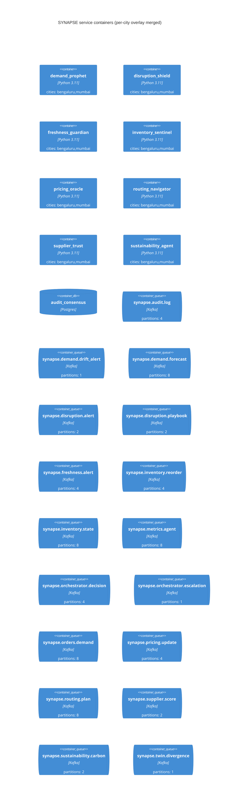

# SYNAPSE C4 — Container View (Sprint 9 §M-dx-2, auto-generated)

```mermaid
C4Container
    title SYNAPSE service containers (per-city overlay merged)
    Container(demand_prophet, "demand_prophet", "Python 3.11", "cities: bengaluru,mumbai")
    Container(disruption_shield, "disruption_shield", "Python 3.11", "cities: bengaluru,mumbai")
    Container(freshness_guardian, "freshness_guardian", "Python 3.11", "cities: bengaluru,mumbai")
    Container(inventory_sentinel, "inventory_sentinel", "Python 3.11", "cities: bengaluru,mumbai")
    Container(pricing_oracle, "pricing_oracle", "Python 3.11", "cities: bengaluru,mumbai")
    Container(routing_navigator, "routing_navigator", "Python 3.11", "cities: bengaluru,mumbai")
    Container(supplier_trust, "supplier_trust", "Python 3.11", "cities: bengaluru,mumbai")
    Container(sustainability_agent, "sustainability_agent", "Python 3.11", "cities: bengaluru,mumbai")
    ContainerDb(audit_db, "audit_consensus", "Postgres")
    ContainerQueue(synapse_audit_log, "synapse.audit.log", "Kafka", "partitions: 4")
    ContainerQueue(synapse_demand_drift_alert, "synapse.demand.drift_alert", "Kafka", "partitions: 1")
    ContainerQueue(synapse_demand_forecast, "synapse.demand.forecast", "Kafka", "partitions: 8")
    ContainerQueue(synapse_disruption_alert, "synapse.disruption.alert", "Kafka", "partitions: 2")
    ContainerQueue(synapse_disruption_playbook, "synapse.disruption.playbook", "Kafka", "partitions: 2")
    ContainerQueue(synapse_freshness_alert, "synapse.freshness.alert", "Kafka", "partitions: 4")
    ContainerQueue(synapse_inventory_reorder, "synapse.inventory.reorder", "Kafka", "partitions: 4")
    ContainerQueue(synapse_inventory_state, "synapse.inventory.state", "Kafka", "partitions: 8")
    ContainerQueue(synapse_metrics_agent, "synapse.metrics.agent", "Kafka", "partitions: 8")
    ContainerQueue(synapse_orchestrator_decision, "synapse.orchestrator.decision", "Kafka", "partitions: 4")
    ContainerQueue(synapse_orchestrator_escalation, "synapse.orchestrator.escalation", "Kafka", "partitions: 1")
    ContainerQueue(synapse_orders_demand, "synapse.orders.demand", "Kafka", "partitions: 8")
    ContainerQueue(synapse_pricing_update, "synapse.pricing.update", "Kafka", "partitions: 4")
    ContainerQueue(synapse_routing_plan, "synapse.routing.plan", "Kafka", "partitions: 8")
    ContainerQueue(synapse_supplier_score, "synapse.supplier.score", "Kafka", "partitions: 2")
    ContainerQueue(synapse_sustainability_carbon, "synapse.sustainability.carbon", "Kafka", "partitions: 2")
    ContainerQueue(synapse_twin_divergence, "synapse.twin.divergence", "Kafka", "partitions: 1")
```
