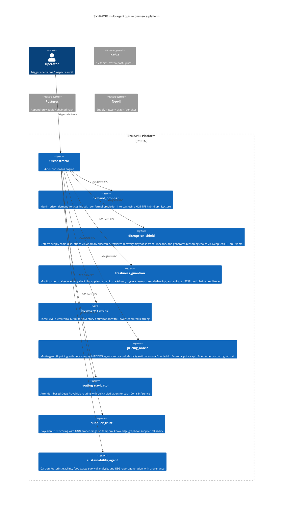

# SYNAPSE C4 — System Context (Sprint 9 §M-dx-2, auto-generated)

```mermaid
C4Context
    title SYNAPSE multi-agent quick-commerce platform
    Person(operator, "Operator", "Triggers decisions / inspects audit")
    System_Boundary(synapse, "SYNAPSE Platform") {
        System(orchestrator, "Orchestrator", "4-tier consensus engine")
        System(demand_prophet, "demand_prophet", "Multi-horizon demand forecasting with conformal prediction intervals using HGT-TFT hybrid architecture")
        System(disruption_shield, "disruption_shield", "Detects supply chain disruptions via anomaly ensemble, retrieves recovery playbooks from Pinecone, and generates reasoning chains via DeepSeek-R1 on Ollama")
        System(freshness_guardian, "freshness_guardian", "Monitors perishable inventory shelf life, applies dynamic markdown, triggers cross-store rebalancing, and enforces FSSAI cold chain compliance")
        System(inventory_sentinel, "inventory_sentinel", "Three-level hierarchical MARL for inventory optimization with Flower federated learning")
        System(pricing_oracle, "pricing_oracle", "Multi-agent RL pricing with per-category MADDPG agents and causal elasticity estimation via Double ML. Essential price cap 1.3x enforced as hard guardrail.")
        System(routing_navigator, "routing_navigator", "Attention-based Deep RL vehicle routing with policy distillation for sub-100ms inference")
        System(supplier_trust, "supplier_trust", "Bayesian trust scoring with GNN embeddings on temporal knowledge graph for supplier reliability")
        System(sustainability_agent, "sustainability_agent", "Carbon footprint tracking, food waste survival analysis, and ESG report generation with provenance")
    }
    System_Ext(kafka, "Kafka", "17 topics, frozen post-Sprint 7")
    System_Ext(postgres, "Postgres", "Append-only audit + chained hash")
    System_Ext(neo4j, "Neo4j", "Supply network graph (per-city)")
    Rel(operator, orchestrator, "Triggers decisions")
    Rel(orchestrator, demand_prophet, "A2A JSON-RPC")
    Rel(orchestrator, disruption_shield, "A2A JSON-RPC")
    Rel(orchestrator, freshness_guardian, "A2A JSON-RPC")
    Rel(orchestrator, inventory_sentinel, "A2A JSON-RPC")
    Rel(orchestrator, pricing_oracle, "A2A JSON-RPC")
    Rel(orchestrator, routing_navigator, "A2A JSON-RPC")
    Rel(orchestrator, supplier_trust, "A2A JSON-RPC")
    Rel(orchestrator, sustainability_agent, "A2A JSON-RPC")
```
